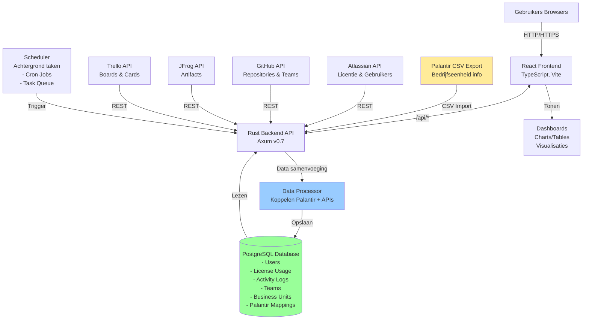

# ADR-002: Project Structure – API Backend + React Frontend

## Context

The Equans Operational Insights project consists of:
- A **Rust-based backend API** responsible for data collection, aggregation, and exposure
- A **React frontend** responsible for visualization and user interaction

An earlier architectural decision (ADR-001) described a project structure that resembled a traditional MVC pattern. During implementation, it became clear that this pattern does **not accurately reflect the nature of the system** and causes confusion, particularly regarding the concept of “Views”.

This ADR clarifies the intended architecture and updates the project structure accordingly.

## Decision

The project will **not use a classical MVC (Model–View–Controller) architecture**.

Instead, it follows a **layered API + frontend architecture**:

- **Backend**: Headless REST API (Rust + Axum)
- **Frontend**: React single-page application
- **Views** exist only in the frontend
- The backend exposes **JSON APIs only**

### Backend structure principles

The backend is organized by responsibility:

- **Routes**: HTTP endpoint definitions
- **Services**: Business logic and external API integrations
- **Models**: Domain and data structures
- **Config & Error**: Cross-cutting concerns


### System Diagram




## 📁 Project Structure

Here's what each folder contains:

```
Equans-operational-insights/
│
├── backend/src/
│   │        ├── main.rs
│   │        ├── atlassian.rs  (combines routes, services, models)
│   │        ├── github.rs     (combines routes, services, models)
│   │        └──  health.rs     (health check handlers)
│   │
│   ├── tests/
│   │    ├── test_atlassian_endpoints.ps1 # Atlassian endpoint automated tests (PowerShell 5.1)
│   │    ├── test_github_endpoints.ps1    # GitHub endpoint automated tests (PowerShell 5.1)
│   │    ├── run_all_tests.ps1            # Orchestrates all tests with health check
│   │    ├── MANUAL_TESTING.md            # Copy-paste manual commands for all endpoints
│   │    └── README.md                    # Test documentation and usage
│   ├── README.md                    # Backend API endpoints guide and examples
│   └── Cargo.toml                   # Rust dependencies and project config
│
├── frontend/                        # React frontend application (Vite + TypeScript)
│   ├── src/
│   │   ├── main.tsx                 # Frontend entry point
│   │   ├── App.tsx                  # Main application component
│   │   ├── assets/                  # Static assets
│   │   └── styles/components        # Reusable UI components and styles
│   ├── public/                      # Static public files
│   ├── package.json                 # Frontend dependencies
│   ├── tsconfig*.json               # TypeScript configuration
│   └── vite.config.ts               # Frontend build configuration + dev proxy
│
├── tests/
│  └── README.md                    # Unit tests documentation
├── docs/                            # Documentation
│   ├── ADRs/                        # Architecture Decision Records
│   │   ├── ADR-000-template.md
│   │   ├──  ADR-001-project-setup.md
│   │   ├──  ADR-002-project-structure.md
│   │   └── copilot-instructions.md      # Guidelines for using GitHub Copilot
│   ├── api/                         # API documentation
│   │   ├── atlassian/               # Atlassian API docs
│   │   │   ├── endpoints.md        # Atlassian API endpoints
│   │   │   └── data-flow.md        # Atlassian data flow explanation
│   │   └── github/                  # GitHub API docs
│   │       ├── endpoints.md        # GitHub API endpoints
│   │       └── data-flow.md        # GitHub data flow explanation
│   │
│   ├── requirements/                # Functional and non-functional requirements
│   │    └── functional-nonfunctional.md
│   ├── testing/                    # Testing strategies and plans
│   │    └── testing-strategy.md
│   └── references.md                 # Reference materials
│
│
├── infra/                           # Infrastructure and deployment
│   └── docker-compose.yml           # Optional local services (e.g., DB)
│
└── README.md                        # This file
```
