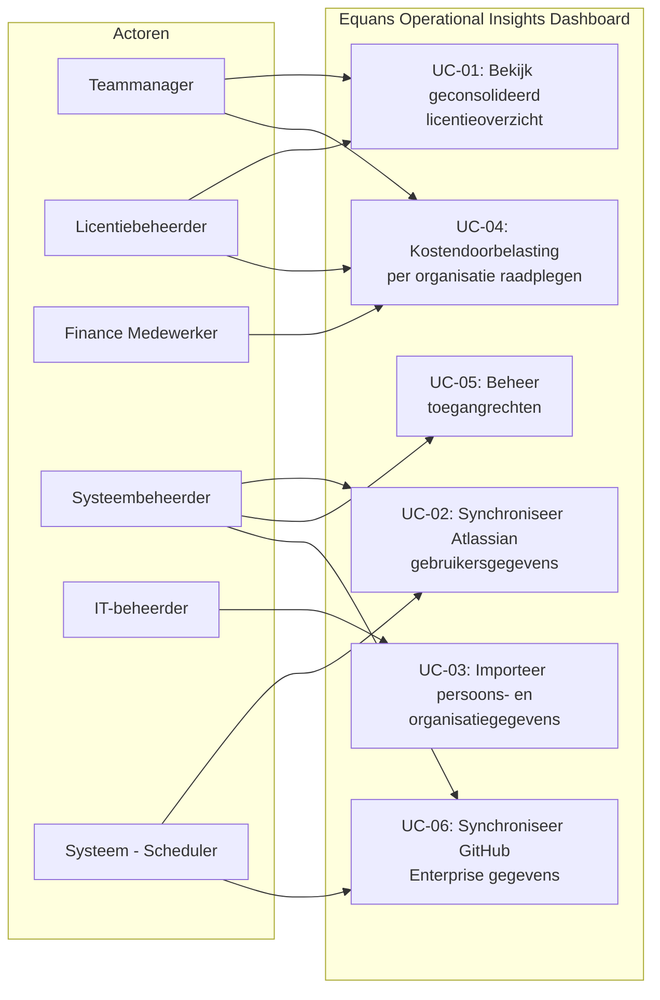
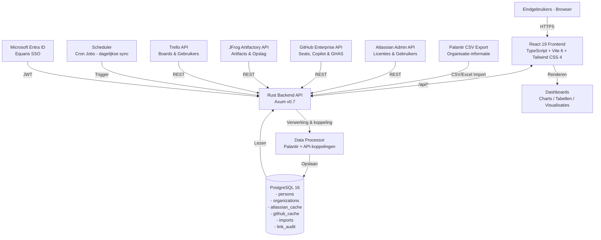

# Software requirements specification (SRS)

## Equans Operational Insights Dashboard

| Metadata                               | Details                                      |
| -------------------------------------- | -------------------------------------------- |
| **Documentnummer**                     | SRS-001                                      |
| **Versie**                             | 2.0                                          |
| **Status**                             | In Review                                    |
| **Studiejaar**                         | 2026                                         |
| **Auteur**                             | Ahmad Alhaj Asaad                            |
| **Instelling**                         | Equans, SLS Digital Platforms / DevOps Forge |
| **Technisch Begeleider**               | Brian Veltman                                |
| **Bedrijfsbegeleider / Opdrachtgever** | Viktor Klein                                 |

## Inhoudsopgave

1. [Inleiding](#1-inleiding)
   - 1.1 Doel
   - 1.2 Achtergrond
   - 1.3 Doelgroep
2. [Systeembeschrijving](#2-systeembeschrijving)
   - 2.1 Overzicht
3. [Functionele eisen (MoSCoW)](#3-functionele-eisen-moscow)
   - 3.1 Must Have
   - 3.2 Should Have
   - 3.3 Could Have
   - 3.4 Won't Have
4. [Technische requirements (MoSCoW)](#4-technische-requirements-moscow)
   - 4.1 Must Have
   - 4.2 Should Have
   - 4.3 Could Have
   - 4.4 Won't Have
5. [Use cases](#5-use-cases)
6. [User stories](#6-user-stories)
7. [Architectuur](#7-architectuur)
   - 7.1 Overzichtsdiagram
   - 7.2 Technologieen
8. [Dataontwerp](#8-dataontwerp)
   - 8.1 Datavelden Atlassian API
   - 8.2 Datavelden GitHub API
   - 8.3 Importtabellen
   - 8.4 Koppelingstabellen
9. [Ontwerp (UI/UX)](#9-ontwerp-uiux)
10. [Teststrategie](#10-teststrategie)
11. [Risico's en beperkingen](#11-risicos-en-beperkingen)
12. [Bronnen](#12-bronnen)

## 1. Inleiding

### 1.1 Doel

Dit document beschrijft de software requirements specification (SRS) voor het Equans Operational Insights Dashboard. Ik heb dit document geschreven om alle functionele en technische vereisten op een gestructureerde manier vast te leggen voordat de daadwerkelijke ontwikkeling begint. Op die manier weet iedereen vooraf wat het systeem moet kunnen, hoe het technisch in elkaar zit en welke keuzes daaraan ten grondslag liggen.

Het SRS-document vormt de afspraak tussen de opdrachtgever (Equans SLS Digital Platforms) en het ontwikkelteam. Daarnaast gebruik ik het als referentiekader voor mijn afstudeerscriptie. De specificaties heb ik opgebouwd volgens het MoSCoW-prioriteringsmodel (Must Have, Should Have, Could Have, Won't Have), omdat ze voortkomen uit eerder opgestelde Business Requirements en Functionele Requirements. De reden dat ik voor MoSCoW heb gekozen is vrij simpel: het maakt in een oogopslag duidelijk welke eisen echt noodzakelijk zijn voor de oplevering en welke eventueel naar een later moment geschoven kunnen worden. Dat voorkomt discussie achteraf over wat er wel en niet in het MVP hoort.

### 1.2 Achtergrond

Equans is een internationale technische dienstverlener die dagelijks met meerdere softwareplatformen werkt: Atlassian (Jira Software, Confluence, Trello, Jira Service Management), GitHub Enterprise en JFrog Artifactory. Elk van deze platformen heeft zijn eigen beheeromgeving voor licenties en gebruikersaccounts. Het gevolg daarvan is dat het overzicht over licentieverbruik en bijbehorende kosten behoorlijk versnipperd raakt.

Uit de eerste gesprekken met de opdrachtgever kwam naar voren dat het ontbreken van een centraal beheerpunt tot een aantal concrete problemen leidt. Ten eerste ontbreekt een actueel, samenhangend overzicht van licentieverbruik over alle platformen heen. Beheerders moeten daardoor steeds in verschillende systemen kijken om een beeld te krijgen. Daarnaast kost het doorberekenen van licentiekosten aan interne teams en kostenplaatsen veel handmatig werk, wat foutgevoelig en tijdrovend is. Ongebruikte licenties worden ook niet systematisch herkend, wat leidt tot onnodige uitgaven. Tot slot zijn medewerkers niet structureel gekoppeld aan hun organisatorische eenheid, waardoor rapportage en doorbelasting lastig worden.

Het Equans Operational Insights Dashboard wordt ontwikkeld om deze knelpunten op te lossen. Het systeem gaat gegevens verzamelen via de API's van Atlassian, GitHub en JFrog, en presenteert die in een interactief dashboard. Hierbij heb ik gekozen voor een gecentraliseerde aanpak, zodat licentiebeheerders, teammanagers, financieel medewerkers en IT-beheerders allemaal vanuit een en dezelfde plek hun inzicht kunnen halen in plaats van drie of vier losse admin-portals te moeten raadplegen.

Dit project wordt uitgevoerd als afstudeeronderzoek bij Equans SLS Digital Platforms, onderdeel van de DevOps Forge-afdeling.

### 1.3 Doelgroep

Dit document richt zich op de volgende betrokkenen:

| Doelgroep              | Rol                                                                   |
| ---------------------- | --------------------------------------------------------------------- |
| **Viktor Klein**       | Business Owner, eindverantwoordelijke voor de inhoudelijke vereisten  |
| **Brian Veltman**      | Technical Lead, beoordeling van technische haalbaarheid               |
| **Henk**               | Executive Sponsor, executief overzicht en strategische besluitvorming |
| **Licentiebeheerders** | Primaire gebruikers van het dashboard                                 |
| **Finance Team**       | Gebruikers van de kostentoewijzings- en chargebackfuncties            |
| **IT/HR Beheerders**   | Gebruikers van de persoons- en organisatiebeheermodules               |
| **Ontwikkelteam**      | Technische uitvoering op basis van dit document                       |
| **Examencommissie**    | Beoordeling van het afstudeerwerk                                     |

## 2. Systeembeschrijving

### 2.1 Overzicht

Het Equans Operational Insights Dashboard wordt een full-stack webapplicatie die licentieverbruik, gebruikersgegevens en kosten centraliseert vanuit meerdere externe platformen: Atlassian (Jira Software, Confluence, Trello, Jira Service Management), GitHub Enterprise (seats, Copilot, GHAS) en JFrog Artifactory (opslagcapaciteit en downloadstatistieken).

Na het analyseren van de systeemeisen heb ik gekozen voor een drielaagse architectuur. De reden daarvoor is dat de verantwoordelijkheden helder gescheiden moeten blijven: de frontend hoeft niet te weten hoe de backend data ophaalt bij Atlassian, en de backend hoeft zich niet bezig te houden met hoe de data gepresenteerd wordt. De frontend wordt een React 19 Single Page Application (SPA) met TypeScript, Vite 6, Tailwind CSS 4 en Radix UI. Daarmee bied ik de eindgebruikers dashboards, overzichtstabellen en configuratiemogelijkheden. De backend wordt een REST API in Rust (Axum v0.7) die verantwoordelijk is voor datacollectie, verwerking, authenticatie en het beschikbaar stellen van gegevens. Daaronder draait een PostgreSQL 16 database voor de opslag van alles: verzamelde gegevens, persoons- en organisatiegegevens, gecachede vendor-data en historische licentiedata.

Toegang tot het systeem verloopt uitsluitend via Equans SSO (Microsoft Entra ID) met rolgebaseerde toegangscontrole. Gegevensverzameling vindt automatisch plaats via geplande achtergrondtaken (dagelijkse synchronisatie), maar beheerders kunnen ook handmatig een verversing starten. Er is bewust niet gekozen voor real-time synchronisatie, omdat de externe API's (met name Atlassian en GitHub) strikte rate limits hanteren waardoor dat simpelweg niet haalbaar zou zijn.

Het systeem wordt ontwikkeld conform de Equans corporate-huisstijlrichtlijnen en krijgt een exportfunctie (CSV) voor externe rapportage.

## 3. Functionele eisen (MoSCoW)

De functionele eisen heb ik geordend volgens het MoSCoW-prioriteringsmodel. De reden voor MoSCoW is dat het een heldere structuur biedt om samen met de opdrachtgever af te stemmen wat er minimaal opgeleverd moet worden en wat eventueel later kan. Elke eis heeft een uniek ID en een beschrijving, en verwijst naar het onderliggende functionele requirements-document.

### 3.1 Must Have (M)

De onderstaande eisen zijn allemaal noodzakelijk om tot een werkend minimaal levensvatbaar product (MVP) te komen. Zonder deze eisen is het systeem niet compleet genoeg om op te leveren aan de opdrachtgever. Bij het opstellen van deze lijst heb ik samen met Viktor Klein scherp geprioriteerd om de scope beheersbaar te houden.

| ID   | Omschrijving                                                                                                                             |
| ---- | ---------------------------------------------------------------------------------------------------------------------------------------- |
| M-01 | Het systeem toont een geconsolideerd overzichtsdashboard met geaggregeerde licentie- en gebruikersstatistieken over alle leveranciers.   |
| M-02 | Het systeem toont gedetailleerde Atlassian-gebruiks- en licentiegegevens (actieve gebruikers, inactieve gebruikers, licentietoewijzing). |
| M-03 | Het systeem toont GitHub-gebruiksgegevens, waaronder seat-toewijzing en Copilot-gebruik.                                                 |
| M-04 | Het systeem verzamelt automatisch gebruikers- en licentiegegevens via de Atlassian Admin API.                                            |
| M-05 | Het systeem verzamelt automatisch seat- en gebruiksgegevens via de GitHub Enterprise API.                                                |
| M-06 | Alle verzamelde gegevens worden opgeslagen in een PostgreSQL-database.                                                                   |
| M-07 | Het systeem biedt een overzicht van alle Atlassian-gebruikers inclusief filteren op status en producttoegang.                            |
| M-08 | Gebruikers authenticeren uitsluitend via Equans SSO (Microsoft Entra ID).                                                                |
| M-09 | Alle API-endpoints vereisen JWT-authenticatie.                                                                                           |
| M-10 | Het systeem toont een overzicht van alle personen in het systeem inclusief hun vendor-identifiers.                                       |
| M-11 | Het systeem toont een overzicht van alle organisaties inclusief gekoppelde personen.                                                     |
| M-12 | Het systeem ondersteunt het importeren van persoons- en organisatiegegevens via CSV en Excel (.xlsx).                                    |
| M-13 | Personen kunnen worden gekoppeld aan Atlassian-accounts op basis van `local_id` en e-mailadres.                                          |
| M-14 | Het dashboard toont licentiekosten per Atlassian-product (Jira Software, Confluence, Trello, Jira Service Management).                   |
| M-15 | Het systeem toont een GitHub vendor-overzichtspagina met productkaarten voor Copilot, GHAS en License seats.                             |
| M-16 | Het systeem toont per GitHub-product: aantal actieve gebruikers, inkoopprijs, factureerbaar tarief, marge en totale kosten.              |
| M-17 | Personen kunnen worden gekoppeld aan GitHub-accounts op basis van username (met `_equans`-suffix matching).                              |
| M-18 | Het systeem cachet Atlassian-data in de database met een TTL van 25 uur en biedt fallback bij API-uitval.                                |
| M-19 | Het systeem cachet GitHub Enterprise-data (users, licenses, copilot) in de database.                                                     |

### 3.2 Should Have (S)

De volgende eisen bieden duidelijke meerwaarde en horen bij voorkeur in het eindproduct. Ze zijn niet strikt nodig voor de basiswerking, maar ze maken het systeem wel een stuk completer en prettiger in gebruik.

| ID   | Omschrijving                                                                                              |
| ---- | --------------------------------------------------------------------------------------------------------- |
| S-01 | Gegevensverzameling wordt automatisch uitgevoerd volgens een dagelijks schema.                            |
| S-02 | Beheerders kunnen handmatig een verversing van de Atlassian-gegevens triggeren.                           |
| S-03 | Het systeem toont de datum en het tijdstip van de laatste synchronisatie.                                 |
| S-04 | Gebruikerssessies worden automatisch verlengd gedurende actief gebruik.                                   |
| S-05 | Personen zijn doorzoekbaar op naam, e-mailadres of persoon-ID.                                            |
| S-06 | Personen zijn filterbaar op organisatie, land en billing location.                                        |
| S-07 | Organisatiestatistieken tonen het aantal personen, licenties en kosten per organisatie.                   |
| S-08 | Het systeem toont een preview van wijzigingen voordat een CSV/Excel-import wordt uitgevoerd.              |
| S-09 | Gebruikersgegevens worden automatisch gesynchroniseerd tussen Atlassian en de lokale database.            |
| S-10 | Het dashboard ondersteunt filtering op team, business unit en datumbereik.                                |
| S-11 | Dashboardgegevens zijn exporteerbaar als CSV.                                                             |
| S-12 | Productprijzen (inkoopprijs en factureerbaar tarief) zijn configureerbaar via `config/productPricing.ts`. |
| S-13 | Paginering is beschikbaar voor alle lijstweergaven (standaard 25 items per pagina).                       |
| S-14 | Beheerders kunnen handmatig een verversing van de GitHub-gegevens triggeren.                              |
| S-15 | GitHub-gebruikers per product zijn doorzoekbaar en gepagineerd.                                           |
| S-16 | Inactieve GitHub-gebruikers (>90 dagen geen activiteit) kunnen worden geidentificeerd.                    |

### 3.3 Could Have (C)

De volgende eisen zijn wenselijk maar hebben een lagere prioriteit. Ze worden alleen opgepakt als de tijd en middelen het toelaten. Gezien de afstudeerperiode is de verwachting dat niet alle Could Have-eisen gerealiseerd zullen worden, maar ze staan hier wel beschreven zodat een vervolg-team ermee aan de slag kan.

| ID   | Omschrijving                                                                                         |
| ---- | ---------------------------------------------------------------------------------------------------- |
| C-01 | Het systeem genereert waarschuwingen bij ongebruikelijke licentiekosten.                             |
| C-02 | Predictieve analyses voor licentieprognoses worden aangeboden.                                       |
| C-03 | Integratie met Power BI voor geavanceerde rapportage.                                                |
| C-04 | JFrog-gebruiksgegevens worden verzameld en weergegeven.                                              |
| C-05 | Trello-gebruiksgegevens worden verzameld en weergegeven.                                             |
| C-06 | Gecombineerde rapportage van persoons-, organisatie- en licentiegegevens is exporteerbaar als Excel. |
| C-07 | Atlassian-groepen kunnen worden gekoppeld aan organisatorische eenheden voor kostendoorbelasting.    |
| C-08 | De import-wizard in de UI ondersteunt het uploaden van JSON-bestanden met voortgangsindicator.       |

### 3.4 Won't Have (W)

De onderstaande eisen vallen bewust buiten de scope van dit project. Ze zijn expliciet afgebakend zodat de focus op de kernfunctionaliteit blijft en er geen scope creep optreedt.

| ID   | Omschrijving                                                                     |
| ---- | -------------------------------------------------------------------------------- |
| W-01 | Terugschrijfoperaties naar externe vendor API's (read-only architectuur).        |
| W-02 | Real-time streaming datacollectie (uitsluitend batch-verversing).                |
| W-03 | Geavanceerde rolgebaseerde toegangscontrole buiten de rollen admin en gebruiker. |
| W-04 | Twee-factor authenticatiebeheer voor Atlassian-gebruikers.                       |
| W-05 | Directory-synchronisatie via SCIM.                                               |
| W-06 | API token management voor individuele gebruikers.                                |
| W-07 | Auditlogbeheer voor Atlassian.                                                   |

## 4. Technische requirements (MoSCoW)

### 4.1 Must Have (TM)

De technische requirements vormen het fundament van het systeem. Hier heb ik bewust streng geprioriteerd, want een systeem dat onveilig is of slecht presteert is simpelweg niet bruikbaar, ongeacht hoeveel functionaliteit het biedt. Een dashboard dat er 10 seconden over doet om te laden gaat niemand gebruiken, en een API zonder authenticatie is bij Equans geen optie.

| ID    | Omschrijving                                                                                                                                       |
| ----- | -------------------------------------------------------------------------------------------------------------------------------------------------- |
| TM-01 | Alle communicatie verloopt via HTTPS (TLS 1.2 of hoger); HTTP-verzoeken worden omgeleid naar HTTPS.                                                |
| TM-02 | API-tokens en geheimen worden opgeslagen via GitHub Secrets of Docker-omgevingsvariabelen, nooit in versiebeheer.                                  |
| TM-03 | Alle gebruikersgerichte endpoints vereisen authenticatie via JWT.                                                                                  |
| TM-04 | E-mailadressen worden gemaskeerd in logberichten (GDPR-conformiteit).                                                                              |
| TM-05 | De backend is gebouwd in Rust met gebruik van `Result<T, E>` voor foutafhandeling; het gebruik van `unwrap()` is niet toegestaan in productiecode. |
| TM-06 | De frontend is gebouwd in React 19 + TypeScript 5.9 met `strict mode` ingeschakeld (geen gebruik van `any`).                                       |
| TM-07 | De database is PostgreSQL 16; migraties worden beheerd via versiegecontroleerde migratiebestanden (SQLx).                                          |
| TM-08 | De API-responstijd bedraagt voor minimaal 95% van de verzoeken minder dan 200 milliseconden.                                                       |
| TM-09 | Het dashboard laadt binnen 3 seconden bij een initieel bezoek (FCP < 1,5 seconden).                                                                |
| TM-10 | Alle fouten worden gelogd met een correlatie-ID voor traceerbaarheid.                                                                              |
| TM-11 | Het systeem verwerkt partiele uitval van externe vendor API's zonder de beschikbaarheid van het dashboard te beinvloeden.                          |
| TM-12 | De frontend bundel (gzip) mag niet groter zijn dan 300 KB.                                                                                         |

Eis TM-05 verdient extra toelichting. In Rust is het mogelijk om met `unwrap()` direct de waarde uit een `Result` te halen, maar als er een fout zit crasht het hele programma. Dat is in een productieomgeving onacceptabel. De keuze om `Result<T, E>` af te dwingen betekent dat elke mogelijke fout expliciet afgehandeld moet worden, wat de robuustheid van de backend aanzienlijk verhoogt.

### 4.2 Should Have (TS)

| ID    | Omschrijving                                                                                                                        |
| ----- | ----------------------------------------------------------------------------------------------------------------------------------- |
| TS-01 | Rate-limitering van externe API's wordt gedetecteerd en afgehandeld via exponentieel uitstel (exponential backoff).                 |
| TS-02 | Databasevelden die veelvuldig worden bevraagd zijn voorzien van indexering.                                                         |
| TS-03 | Alle modules beschikken over unit tests; integratietests zijn vereist voor API-endpoints.                                           |
| TS-04 | Gecachede gegevens worden aangeboden wanneer live-data niet beschikbaar is, inclusief vermelding van de laatste synchronisatietijd. |
| TS-05 | JWT-tokens beschikken over passende verloopdatum en -tijd (max sessieduur 24 uur).                                                  |
| TS-06 | Persoonsgegevens zijn identificeerbaar ten behoeve van verwijderingsverzoeken (GDPR, recht op vergetelheid).                        |
| TS-07 | De Docker Compose-configuratie ondersteunt lokale ontwikkeling inclusief PostgreSQL.                                                |
| TS-08 | CI/CD-pipelines (GitHub Actions) controleren automatisch op compileerfouten, codekwaliteit en beveiligingskwetsbaarheden.           |

### 4.3 Could Have (TC)

| ID    | Omschrijving                                                                                           |
| ----- | ------------------------------------------------------------------------------------------------------ |
| TC-01 | Observability-tooling (metrics en tracing) wordt geimplementeerd voor productie-monitoring.            |
| TC-02 | Belastingstests worden uitgevoerd met behulp van k6 om prestaties onder verhoogd verkeer te valideren. |
| TC-03 | Dataretentiebeleid wordt gedefinieerd en geautomatiseerd uitgevoerd.                                   |

### 4.4 Won't Have (TW)

| ID    | Omschrijving                                                                                                |
| ----- | ----------------------------------------------------------------------------------------------------------- |
| TW-01 | Volledige SIEM-integratie (Security Information and Event Management) valt buiten de scope van dit project. |
| TW-02 | Geautomatiseerde herstelprocessen (self-healing) bij infrastructuurfouten zijn niet voorzien in het MVP.    |
| TW-03 | Multi-regio deployment of geografische redundantie.                                                         |

## 5. Use cases

Onderstaand use-case-diagram geeft een visueel overzicht van de interacties tussen de verschillende actoren en het systeem. Ik heb de actoren gegroepeerd op basis van hun rol binnen de organisatie, zodat in een oogopslag duidelijk is wie welke functionaliteit gebruikt.

### UC-01: Bekijk geconsolideerd licentieoverzicht

Dit is de meest gebruikte use case van het systeem. Een teammanager of licentiebeheerder wil in een oogopslag zien hoeveel licenties er per platform actief zijn, wat dat kost en waar er eventueel bespaard kan worden. De keuze om bij API-uitval toch gecachede data te tonen is bewust: beheerders hebben meer aan verouderde data (mits duidelijk aangegeven) dan aan een leeg scherm.

| Element                 | Beschrijving                                                                                                                                                                                                                                                                                                                         |
| ----------------------- | ------------------------------------------------------------------------------------------------------------------------------------------------------------------------------------------------------------------------------------------------------------------------------------------------------------------------------------ |
| **Actoren**             | Teammanager, Licentiebeheerder                                                                                                                                                                                                                                                                                                       |
| **Preconditie**         | Gebruiker is geauthenticeerd via Equans SSO                                                                                                                                                                                                                                                                                          |
| **Trigger**             | Gebruiker navigeert naar het overzichtsdashboard                                                                                                                                                                                                                                                                                     |
| **Normaal verloop**     | 1. Gebruiker logt in via SSO. 2. Systeem laadt geaggregeerde licentiegegevens uit de database. 3. Dashboard toont actieve vs. inactieve gebruikers per platform, licentiebezettingspercentage en kostenopgave. 4. Gebruiker past filters toe (team, BU, datumbereik). 5. Dashboard actualiseert de weergave op basis van de filters. |
| **Alternatief verloop** | Als API-data niet beschikbaar is, toont het systeem gecachede data met de vermelding van de laatste synchronisatietijd.                                                                                                                                                                                                              |
| **Postconditie**        | Gebruiker heeft actueel inzicht in het licentie- en kostenlandschap.                                                                                                                                                                                                                                                                 |

### UC-02: Synchroniseer Atlassian gebruikersgegevens

De synchronisatie van Atlassian-data is een van de kernprocessen van het systeem. Het idee is dat dit dagelijks automatisch draait via een cron-job, maar dat een beheerder het ook handmatig kan triggeren als dat nodig is (bijvoorbeeld na een grote wijziging in de Atlassian-omgeving). Na elke synchronisatie probeert het systeem automatisch om nieuw opgehaalde Atlassian-gebruikers te koppelen aan bestaande personen in de database op basis van e-mailadres.

| Element                 | Beschrijving                                                                                                                                                                                                                                                                                                                                                                 |
| ----------------------- | ---------------------------------------------------------------------------------------------------------------------------------------------------------------------------------------------------------------------------------------------------------------------------------------------------------------------------------------------------------------------------- |
| **Actoren**             | Systeem (geautomatiseerd), Systeembeheerder (handmatig)                                                                                                                                                                                                                                                                                                                      |
| **Preconditie**         | Geldige Atlassian API-credentials zijn geconfigureerd                                                                                                                                                                                                                                                                                                                        |
| **Trigger**             | Dagelijkse cron-job of handmatige trigger door beheerder                                                                                                                                                                                                                                                                                                                     |
| **Normaal verloop**     | 1. Systeem roept de Atlassian Admin API aan voor gebruikers- en licentiegegevens. 2. Ontvangen data wordt getransformeerd en gevalideerd. 3. Data wordt opgeslagen in de PostgreSQL-database. 4. Synchronisatietijdstip wordt bijgewerkt. 5. Nieuw ontvangen Atlassian-gebruikers worden automatisch geprobeerd te koppelen aan bestaande personen op basis van e-mailadres. |
| **Alternatief verloop** | Bij API-fout: systeem logt de fout met correlatie-ID en past exponentieel uitstel toe. Synchronisatie van andere vendors blijft ongestoord doorgaan.                                                                                                                                                                                                                         |
| **Postconditie**        | Database bevat actuele Atlassian-gebruikers- en licentiedata.                                                                                                                                                                                                                                                                                                                |

### UC-03: Importeer persoons- en organisatiegegevens

Het importeren van persoons- en organisatiegegevens is nodig omdat Equans deze data beheert in Palantir, en er geen directe API-koppeling beschikbaar is. De data komt binnen als CSV- of Excel-export. Omdat die exports niet altijd compleet zijn (soms ontbreken velden zoals `person_id` of `email`), moet het importmechanisme flexibel genoeg zijn om ook met onvolledige datasets te werken (zie FR-007 US-7.5).

| Element                 | Beschrijving                                                                                                                                                                                                                                                                                                                                                                                                              |
| ----------------------- | ------------------------------------------------------------------------------------------------------------------------------------------------------------------------------------------------------------------------------------------------------------------------------------------------------------------------------------------------------------------------------------------------------------------------- |
| **Actoren**             | IT-beheerder                                                                                                                                                                                                                                                                                                                                                                                                              |
| **Preconditie**         | Gebruiker is ingelogd met beheerdersrechten; CSV- of Excel-bestand is beschikbaar                                                                                                                                                                                                                                                                                                                                         |
| **Trigger**             | Beheerder initieert een nieuwe import via de importmodule                                                                                                                                                                                                                                                                                                                                                                 |
| **Normaal verloop**     | 1. Beheerder uploadt het importbestand. 2. Systeem valideert het bestand en toont een preview van toe te voegen, te wijzigen en te verwijderen records. 3. Beheerder bevestigt de import. 4. Systeem voert de import uit en herberekent `person_count` per organisatie. 5. Eerder inactief gemarkeerde personen die opnieuw in het bestand voorkomen, worden automatisch gereactiveerd. 6. Importresultaat wordt getoond. |
| **Alternatief verloop** | Bij validatiefouten: beheerder kan kiezen om uitsluitend geldige records te importeren.                                                                                                                                                                                                                                                                                                                                   |
| **Postconditie**        | Database bevat actuele persoons- en organisatiegegevens.                                                                                                                                                                                                                                                                                                                                                                  |

### UC-04: Kostendoorbelasting per organisatie raadplegen

Voor het Finance Team is dit de belangrijkste use case. Ze willen per organisatie of kostenplaats zien hoeveel er aan licenties wordt uitgegeven, en dat vervolgens exporteren voor interne doorberekening. Het systeem berekent de kosten op basis van actieve gebruikersaantallen vermenigvuldigd met de geconfigureerde tarieven per product.

| Element             | Beschrijving                                                                                                                                                                                                                                                                                                                                 |
| ------------------- | -------------------------------------------------------------------------------------------------------------------------------------------------------------------------------------------------------------------------------------------------------------------------------------------------------------------------------------------- |
| **Actoren**         | Finance Medewerker                                                                                                                                                                                                                                                                                                                           |
| **Preconditie**     | Gebruiker is geauthenticeerd; personen zijn gekoppeld aan organisaties                                                                                                                                                                                                                                                                       |
| **Trigger**         | Finance medewerker navigeert naar de chargeback-weergave                                                                                                                                                                                                                                                                                     |
| **Normaal verloop** | 1. Gebruiker selecteert de gewenste organisatie, kostenplaats of datumbereik. 2. Systeem berekent licentiekosten op basis van actieve gebruikersaantallen en geconfigureerde tarieven. 3. Overzicht toont inkoopprijs, factureerbaar tarief, consultancymarge per product en per organisatie. 4. Gebruiker exporteert het overzicht als CSV. |
| **Postconditie**    | Finance medewerker beschikt over een geexporteerd kostenoverzicht voor interne doorberekening.                                                                                                                                                                                                                                               |

### UC-05: Beheer toegangsrechten

Het beheer van toegangsrechten is vrij eenvoudig opgezet: het systeem kent twee rollen (admin en gebruiker). Dat is een bewuste keuze, omdat de doelgroep relatief klein is en complexe rolhierarchien vooralsnog geen meerwaarde bieden. Mocht dat in de toekomst anders worden, dan kan dit uitgebreid worden (maar dat valt nu onder W-03).

| Element                 | Beschrijving                                                                                                                                                                                                          |
| ----------------------- | --------------------------------------------------------------------------------------------------------------------------------------------------------------------------------------------------------------------- |
| **Actoren**             | Systeembeheerder                                                                                                                                                                                                      |
| **Preconditie**         | Beheerder is ingelogd via Equans SSO                                                                                                                                                                                  |
| **Trigger**             | Nieuwe medewerker dient toegang te krijgen tot het systeem                                                                                                                                                            |
| **Normaal verloop**     | 1. Beheerder wijst de juiste rol toe aan de gebruiker (admin of gebruiker). 2. Systeem kent de bijbehorende toegangsniveaus toe. 3. Gebruiker kan na volgende aanmelding de geautoriseerde functionaliteit benaderen. |
| **Alternatief verloop** | Gebruiker zonder juiste rechten ontvangt een duidelijke foutmelding en instructie om contact op te nemen met een beheerder.                                                                                           |
| **Postconditie**        | Gebruiker heeft de juiste toegangsrechten binnen het systeem.                                                                                                                                                         |

### UC-06: Synchroniseer GitHub Enterprise gegevens

De GitHub Enterprise synchronisatie werkt op vergelijkbare wijze als de Atlassian-synchronisatie, maar haalt andere data op: seats, Copilot-seats en GHAS-data. Een aandachtspunt bij de GitHub API is dat de rate limits vrij streng zijn. Daarom wordt exponentieel uitstel toegepast bij 429-responses, en wordt ontvangen data direct in cache-tabellen opgeslagen zodat er bij een afgebroken synchronisatie niet helemaal opnieuw begonnen hoeft te worden.

| Element                 | Beschrijving                                                                                                                                                                                                                                                                                                                      |
| ----------------------- | --------------------------------------------------------------------------------------------------------------------------------------------------------------------------------------------------------------------------------------------------------------------------------------------------------------------------------- |
| **Actoren**             | Systeem (geautomatiseerd), Systeembeheerder (handmatig)                                                                                                                                                                                                                                                                           |
| **Preconditie**         | Geldig GitHub Enterprise Personal Access Token (PAT) is geconfigureerd                                                                                                                                                                                                                                                            |
| **Trigger**             | Dagelijkse synchronisatietaak of handmatige trigger door beheerder                                                                                                                                                                                                                                                                |
| **Normaal verloop**     | 1. Systeem roept de GitHub Enterprise API aan voor seats, Copilot-seats en GHAS-data. 2. Ontvangen data wordt getransformeerd en opgeslagen in cache-tabellen. 3. Synchronisatietijdstip wordt bijgewerkt. 4. Nieuw ontvangen GitHub-gebruikers worden automatisch gekoppeld aan bestaande personen op basis van username/e-mail. |
| **Alternatief verloop** | Bij API-fout of rate limiting: systeem logt de fout en past exponentieel uitstel toe. Gecachede data blijft beschikbaar.                                                                                                                                                                                                          |
| **Postconditie**        | Database bevat actuele GitHub Enterprise gebruikers-, licentie- en Copilot-data.                                                                                                                                                                                                                                                  |

## 6. User stories

De user stories zijn gegroepeerd per functioneel requirement-document. Elke story beschrijft vanuit het perspectief van een specifieke gebruikersrol wat diegene wil bereiken en waarom. Op die manier blijft de link tussen de requirement en de daadwerkelijke gebruikersbehoefte zichtbaar.

### FR-001: License dashboard

| ID     | User Story                                                                                                                                                                   |
| ------ | ---------------------------------------------------------------------------------------------------------------------------------------------------------------------------- |
| US-1.1 | **Als** teammanager **wil ik** een geconsolideerd overzicht zien van licentieverbruik over alle leveranciers **zodat** ik snel de algehele softwarebenutting kan beoordelen. |
| US-1.2 | **Als** licentiebeheerder **wil ik** gedetailleerd Atlassian licentieverbruik bekijken **zodat** ik ongebruikte Jira/Confluence licenties kan identificeren.                 |
| US-1.3 | **Als** engineering manager **wil ik** GitHub seat-toewijzing en Copilot-gebruik zien **zodat** ik de uitgaven aan ontwikkelaarstools kan optimaliseren.                     |
| US-1.4 | **Als** DevOps lead **wil ik** JFrog Artifactory gebruiksstatistieken monitoren **zodat** ik capaciteit en kosten kan plannen.                                               |
| US-1.5 | **Als** finance medewerker **wil ik** kosten zien die zijn toegewezen aan teams en kostenplaatsen **zodat** ik nauwkeurige doorberekening kan uitvoeren.                     |

### FR-002: Vendor data collection

| ID     | User Story                                                                                                                                                                   |
| ------ | ---------------------------------------------------------------------------------------------------------------------------------------------------------------------------- |
| US-2.1 | **Als** systeem **wil ik** automatisch gebruikers- en licentiedata verzamelen via de Atlassian Admin API **zodat** het dashboard het actuele Atlassian gebruik weerspiegelt. |
| US-2.2 | **Als** systeem **wil ik** automatisch seat- en gebruiksdata verzamelen via de GitHub Enterprise API **zodat** het dashboard het actuele GitHub gebruik weerspiegelt.        |
| US-2.3 | **Als** systeem **wil ik** automatisch gebruiksstatistieken verzamelen via de JFrog Artifactory API **zodat** het dashboard het actuele JFrog gebruik weerspiegelt.          |
| US-2.4 | **Als** systeem **wil ik** automatisch bord- en gebruikersdata verzamelen via de Trello API **zodat** het dashboard het actuele Trello gebruik weerspiegelt.                 |
| US-2.5 | **Als** systeem **wil ik** alle verzamelde data opslaan in PostgreSQL **zodat** historische data beschikbaar is voor trendanalyse.                                           |

### FR-003: Atlassian cache

| ID     | User Story                                                                                                                                                   |
| ------ | ------------------------------------------------------------------------------------------------------------------------------------------------------------ |
| US-3.1 | **Als** licentiebeheerder **wil ik** een lijst van alle Atlassian gebruikers zien **zodat** ik kan analyseren wie toegang heeft tot Atlassian producten.     |
| US-3.2 | **Als** teammanager **wil ik** alle Atlassian groepen en hun leden zien **zodat** ik kan verifieren of de juiste personen in de juiste groepen zitten.       |
| US-3.3 | **Als** systeembeheerder **wil ik** geforceerd verse data ophalen van Atlassian **zodat** ik direct de meest actuele informatie kan bekijken na wijzigingen. |
| US-3.4 | **Als** operations engineer **wil ik** zien wanneer de data voor het laatst is gesynchroniseerd **zodat** ik weet hoe actueel de getoonde informatie is.     |

### FR-004: API authenticatie

| ID     | User Story                                                                                                                                                                     |
| ------ | ------------------------------------------------------------------------------------------------------------------------------------------------------------------------------ |
| US-4.1 | **Als** Equans medewerker **wil ik** inloggen met mijn bestaande Equans account (Microsoft Entra ID) **zodat** ik geen apart account hoef aan te maken voor dit systeem.       |
| US-4.2 | **Als** ingelogde gebruiker **wil ik** mijn sessie automatisch verlengd zien worden **zodat** ik niet steeds opnieuw hoef in te loggen tijdens mijn werkdag.                   |
| US-4.3 | **Als** gebruiker **wil ik** kunnen uitloggen **zodat** anderen op mijn computer geen toegang hebben tot mijn sessie.                                                          |
| US-4.4 | **Als** gebruiker zonder juiste rechten **wil ik** een duidelijke melding zien wanneer ik geen toegang heb **zodat** ik weet dat ik contact moet opnemen met een beheerder.    |
| US-4.5 | **Als** systeembeheerder **wil ik** verschillende toegangsniveaus kunnen toekennen aan gebruikers **zodat** gevoelige data alleen beschikbaar is voor geautoriseerde personen. |

### FR-005: Persoonsmanagement

| ID     | User Story                                                                                                                                                                                          |
| ------ | --------------------------------------------------------------------------------------------------------------------------------------------------------------------------------------------------- |
| US-5.1 | **Als** licentiebeheerder **wil ik** een overzicht van alle personen in het systeem bekijken **zodat** ik snel kan zien wie er licenties toegewezen heeft.                                          |
| US-5.2 | **Als** teammanager **wil ik** personen kunnen zoeken op naam, e-mail of persoon-ID **zodat** ik snel specifieke teamleden kan vinden.                                                              |
| US-5.3 | **Als** licentiebeheerder **wil ik** de volledige details van een persoon bekijken inclusief vendor identifiers **zodat** ik kan zien welke licenties aan deze persoon zijn gekoppeld per platform. |
| US-5.4 | **Als** finance medewerker **wil ik** personen kunnen filteren op organisatie, land en billing location **zodat** ik nauwkeurige doorbelastingsrapportages kan maken per locatie.                   |
| US-5.5 | **Als** licentiebeheerder **wil ik** een overzicht van inactieve personen zien **zodat** ik ongebruikte licenties kan identificeren en vrijgeven.                                                   |
| US-5.6 | **Als** IT-beheerder **wil ik** de Global ID (GID) matching status van personen bekijken **zodat** ik kan verifieren dat identiteiten correct zijn gekoppeld.                                       |

### FR-006: Organisatiebeheer

| ID     | User Story                                                                                                                                                         |
| ------ | ------------------------------------------------------------------------------------------------------------------------------------------------------------------ |
| US-6.1 | **Als** licentiebeheerder **wil ik** een overzicht van alle organisaties in het systeem bekijken **zodat** ik de structuur van Equans entiteiten begrijp.          |
| US-6.2 | **Als** finance medewerker **wil ik** de details van een organisatie bekijken inclusief gekoppelde personen **zodat** ik kosten per organisatie kan analyseren.    |
| US-6.3 | **Als** IT-beheerder **wil ik** de hierarchische structuur van organisaties beheren **zodat** de rapportagestructuur correct is voor doorbelasting.                |
| US-6.4 | **Als** teammanager **wil ik** zien welke personen aan een organisatie gekoppeld zijn **zodat** ik mijn teamoverzicht heb.                                         |
| US-6.5 | **Als** licentiebeheerder **wil ik** statistieken per organisatie zien (aantal personen, licenties, kosten) **zodat** ik de impact per organisatie kan beoordelen. |

### FR-007: Data synchronisatie

| ID     | User Story                                                                                                                                                                                                             |
| ------ | ---------------------------------------------------------------------------------------------------------------------------------------------------------------------------------------------------------------------- |
| US-7.1 | **Als** beheerder **wil ik** organisatie- en persoonsgegevens kunnen importeren via een CSV- of Excel-bestand **zodat** de database actueel blijft met de laatste organisatie- en personeelsinformatie.                |
| US-7.2 | **Als** beheerder **wil ik** een preview kunnen zien van alle wijzigingen voordat de import wordt uitgevoerd **zodat** ik kan controleren welke data wordt toegevoegd, gewijzigd of verwijderd.                        |
| US-7.3 | **Als** beheerder **wil ik** dat personen die eerder als inactief zijn gemarkeerd automatisch worden gereactiveerd bij nieuwe import **zodat** terugkerende medewerkers automatisch weer actief worden in het systeem. |
| US-7.4 | **Als** beheerder **wil ik** kunnen kiezen om alleen geldige records te importeren wanneer er validatiefouten zijn **zodat** ik niet de hele import hoef te annuleren bij enkele fouten.                               |
| US-7.5 | **Als** beheerder **wil ik** kunnen importeren met onvolledige data (ontbrekende persoon-ID, e-mail, namen) **zodat** ik kan werken met datasets waar niet alle informatie beschikbaar is.                             |

### FR-008: Atlassian gebruikersbeheer

| ID     | User Story                                                                                                                                                            |
| ------ | --------------------------------------------------------------------------------------------------------------------------------------------------------------------- |
| US-8.1 | **Als** beheerder **wil ik** een overzicht kunnen zien van alle gebruikers in onze Atlassian organisatie **zodat** ik weet wie toegang heeft tot Atlassian producten. |
| US-8.2 | **Als** beheerder **wil ik** gedetailleerde informatie kunnen bekijken van een specifieke gebruiker **zodat** ik hun toegang en status kan controleren.               |
| US-8.3 | **Als** beheerder **wil ik** kunnen filteren welke gebruikers toegang hebben tot specifieke producten **zodat** ik licentieverbruik per product kan analyseren.       |
| US-8.4 | **Als** systeem **wil ik** automatisch gebruikersdata synchroniseren tussen Atlassian en onze database **zodat** onze applicatie actuele data heeft.                  |
| US-8.5 | **Als** beheerder **wil ik** geavanceerd kunnen zoeken en filteren in gebruikersdata **zodat** ik snel specifieke gebruikers kan vinden.                              |
| US-8.6 | **Als** beheerder **wil ik** gebruikersdata kunnen exporteren naar CSV **zodat** ik externe analyses kan uitvoeren.                                                   |

### FR-009: Atlassian-database synchronisatie

| ID     | User Story                                                                                                                                                                                              |
| ------ | ------------------------------------------------------------------------------------------------------------------------------------------------------------------------------------------------------- |
| US-9.1 | **Als** systeem **wil ik** na elke Atlassian-synchronisatie automatisch personen koppelen aan hun Atlassian-account **zodat** de koppelstatus altijd up-to-date is zonder handmatige actie.             |
| US-9.2 | **Als** licentiebeheerder **wil ik** per persoon kunnen zien of zij gekoppeld zijn aan een Atlassian-account **zodat** ik kan controleren welke personen een Atlassian-licentie hebben.                 |
| US-9.3 | **Als** licentiebeheerder **wil ik** de gekoppelde Atlassian-gegevens kunnen zien op de persoon detailpagina **zodat** ik weet welke Atlassian-producten een persoon gebruikt.                          |
| US-9.4 | **Als** licentiebeheerder **wil ik** Atlassian-groepen kunnen koppelen aan operationele organisaties **zodat** ik licentiekosten per organisatorische eenheid kan doorbelasten.                         |
| US-9.5 | **Als** finance medewerker **wil ik** een rapport kunnen genereren dat persoons- en organisatiedata combineert met Atlassian-licentiedata **zodat** ik nauwkeurige doorbelastingsrapportages kan maken. |

### FR-010: Frontend licentiedashboard

| ID      | User Story                                                                                                                                                                                                               |
| ------- | ------------------------------------------------------------------------------------------------------------------------------------------------------------------------------------------------------------------------ |
| US-10.1 | **Als** finance medewerker/licentiebeheerder **wil ik** een overzichtelijk dashboard zien met kosten per Atlassian-product **zodat** ik de inkoop- en factureerbare kosten per product in een oogopslag kan vergelijken. |
| US-10.2 | **Als** beheerder **wil ik** de inkoopprijzen en factureerbare tarieven per product kunnen aanpassen **zodat** de dashboardberekeningen altijd de actuele contractprijzen weerspiegelen.                                 |
| US-10.3 | **Als** licentiebeheerder **wil ik** een tabeloverzicht van alle personen zien **zodat** ik snel kan controleren welke medewerkers actief zijn en aan welke organisatie ze zijn gekoppeld.                               |
| US-10.4 | **Als** teammanager **wil ik** een overzicht van alle organisaties zien met hun licentieverbruik **zodat** ik doorbelastingsrapportages per afdeling kan opstellen.                                                      |
| US-10.5 | **Als** IT-beheerder **wil ik** via de UI Atlassian- en GitHub-gebruikersdata kunnen importeren **zodat** het dashboard altijd actuele gebruikersaantallen toont.                                                        |

### FR-011: GitHub vendor integratie

| ID      | User Story                                                                                                                                                                                           |
| ------- | ---------------------------------------------------------------------------------------------------------------------------------------------------------------------------------------------------- |
| US-11.1 | **Als** licentiebeheerder **wil ik** een GitHub vendor-overzichtspagina zien met productkaarten voor Copilot, GHAS en License seats **zodat** ik alle GitHub-kosten in een oogopslag kan beoordelen. |
| US-11.2 | **Als** finance medewerker **wil ik** per GitHub-product de inkoopprijs, het factureerbaar tarief en de marge zien **zodat** ik nauwkeurige kostenrapportages kan maken.                             |
| US-11.3 | **Als** engineering manager **wil ik** het aantal actieve Copilot-gebruikers monitoren **zodat** ik het gebruik en de ROI van GitHub Copilot kan evalueren.                                          |
| US-11.4 | **Als** security engineer **wil ik** het aantal actieve GHAS-committers zien **zodat** ik kan verifieren dat beveiligingsscanning breed wordt ingezet.                                               |
| US-11.5 | **Als** licentiebeheerder **wil ik** een totaalrij zien met geaggregeerde GitHub-kosten **zodat** ik de totale GitHub-uitgaven kan rapporteren.                                                      |

### FR-012: GitHub-database synchronisatie

| ID      | User Story                                                                                                                                                                                     |
| ------- | ---------------------------------------------------------------------------------------------------------------------------------------------------------------------------------------------- |
| US-12.1 | **Als** systeem **wil ik** na elke GitHub-synchronisatie automatisch personen koppelen aan hun GitHub-account **zodat** de koppelstatus altijd up-to-date is.                                  |
| US-12.2 | **Als** licentiebeheerder **wil ik** per persoon kunnen zien of zij gekoppeld zijn aan een GitHub-account **zodat** ik kan controleren wie een GitHub-licentie heeft.                          |
| US-12.3 | **Als** licentiebeheerder **wil ik** de Enterprise seat, Copilot seat en GHAS-status per persoon zien op de detailpagina **zodat** ik het volledige GitHub-gebruik per persoon kan beoordelen. |
| US-12.4 | **Als** beheerder **wil ik** handmatig een GitHub-synchronisatie kunnen triggeren **zodat** ik direct actuele data beschikbaar heb na wijzigingen.                                             |
| US-12.5 | **Als** licentiebeheerder **wil ik** ongekoppelde GitHub-accounts kunnen identificeren **zodat** ik ontbrekende persoonskoppelingen kan herstellen.                                            |

## 7. Architectuur

### 7.1 Overzichtsdiagram

Het systeem wordt opgebouwd als een gelaagde REST API-architectuur waarbij de frontend en backend strikt gescheiden zijn. De reden voor die strikte scheiding is dat beide lagen onafhankelijk van elkaar doorontwikkeld en gedeployed moeten kunnen worden. Stel dat er een bugfix nodig is in de frontend, dan hoeft de backend niet opnieuw gebouwd te worden (en andersom). De backend functioneert als een headless REST API. De frontend is een standalone Single Page Application die uitsluitend via de `/api/*`-interface communiceert met de backend.

Concreet werkt het als volgt: een gebruiker benadert via de browser de React-frontend, die alle data ophaalt via REST-endpoints van de Rust-backend. De backend haalt op zijn beurt data op bij de externe platformen (Atlassian, GitHub, JFrog) en slaat alles op in PostgreSQL. De scheduler zorgt ervoor dat dit dagelijks automatisch gebeurt, zodat het dashboard 's ochtends altijd verse data heeft.

### 7.2 Technologieen

Bij de technologiekeuze heb ik gekeken naar wat het beste past bij de eisen van dit specifieke project. Rust als backend-taal is gekozen vanwege de hoge prestaties en geheugenveiligheid. Dat klinkt misschien overkill voor een dashboard, maar de combinatie met SQLx (dat SQL-queries al tijdens het compileren valideert) maakt het een erg solide basis. React met TypeScript biedt daarnaast een modulaire en type-veilige frontend. Vite 6 als bundler zorgt voor snelle builds tijdens development.

| Laag                   | Technologie                                         | Motivatie                                                                       |
| ---------------------- | --------------------------------------------------- | ------------------------------------------------------------------------------- |
| **Frontend**           | React 19 + TypeScript 5.9 + Tailwind CSS 4 + Vite 6 | Modulaire componentenarchitectuur, sterke typering, snelle ontwikkelomgeving    |
| **UI Componenten**     | Radix UI + Recharts + Lucide React                  | Toegankelijke, ongestylde componenten met flexibele grafiekbibliotheek          |
| **Authenticatie (FE)** | @azure/msal-react 5.0                               | MSAL-integratie voor OAuth 2.0/OIDC met Microsoft Entra ID                      |
| **Backend**            | Rust + Axum v0.7                                    | Hoge prestaties, geheugenveiligheid, betrouwbare foutafhandeling                |
| **Database**           | PostgreSQL 16 (via SQLx)                            | Robuuste relationele database met compile-time query verificatie                |
| **Authenticatie (BE)** | jsonwebtoken (RS256) + Azure AD JWKS                | JWT-validatie met automatische sleutelrotatie                                   |
| **Containerisatie**    | Docker + Docker Compose                             | Reproduceerbare ontwikkel- en testomgevingen                                    |
| **CI/CD**              | GitHub Actions                                      | Geautomatiseerde codekwaliteit, tests en beveiligingsscans bij pull requests    |
| **Testautomatisering** | cargo test + PowerShell-testscripts                 | Geautomatiseerde validatie van API-endpoints in Windows/cross-platform omgeving |
| **Design**             | Figma                                               | Wireframes en UI-mockups afgestemd op de Equans corporate-huisstijl             |
| **Versiebeheer**       | Git + GitHub                                        | Versiebeheer, branch-strategie en code reviews via pull requests                |

## 8. Dataontwerp

### 8.1 Datavelden Atlassian API

De Atlassian Admin API levert gebruikers- en licentiegegevens op organisatieniveau. Onderstaande tabel toont welke datavelden opgehaald en lokaal opgeslagen worden. Ik heb er bewust voor gekozen om alleen de velden op te slaan die daadwerkelijk nodig zijn voor het dashboard, zodat de database niet onnodig groot wordt. Het veld `email` wordt opgeslagen voor koppelingsdoeleinden, maar in logberichten altijd gemaskeerd conform de GDPR-eisen (zie ook TM-04). Het veld `product_access` komt vanuit de API terug als een geneste array, wat betekent dat daar extra parsing-logica voor nodig is in de backend.

| Veldnaam          | Type       | Beschrijving                                               | Opgeslagen in            |
| ----------------- | ---------- | ---------------------------------------------------------- | ------------------------ |
| `account_id`      | `string`   | Unieke Atlassian account-identificatie                     | `atlassian_users_cache`  |
| `email`           | `string`   | E-mailadres van de gebruiker (gemaskeerd in logs)          | `atlassian_users_cache`  |
| `display_name`    | `string`   | Volledige weergavenaam                                     | `atlassian_users_cache`  |
| `account_status`  | `enum`     | `active` \| `inactive` \| `closed`                         | `atlassian_users_cache`  |
| `account_type`    | `enum`     | `atlassian` \| `customer` \| `app`                         | `atlassian_users_cache`  |
| `product_access`  | `array`    | Lijst van toegankelijke producten (Jira, Confluence, etc.) | `atlassian_users_cache`  |
| `last_active`     | `datetime` | Datum en tijdstip van laatste activiteit                   | `atlassian_users_cache`  |
| `access_billable` | `boolean`  | Of het account factureerbaar is                            | `atlassian_users_cache`  |
| `group_id`        | `string`   | Identifier van de Atlassian-groep                          | `atlassian_groups_cache` |
| `group_name`      | `string`   | Naam van de Atlassian-groep                                | `atlassian_groups_cache` |
| `member_count`    | `integer`  | Aantal leden in de groep                                   | `atlassian_groups_cache` |

### 8.2 Datavelden GitHub API

De GitHub Enterprise API levert gegevens over seats, Copilot-gebruik en GitHub Advanced Security (GHAS). Een aandachtspunt bij deze data is dat het `login`-veld niet altijd de verwachte `_equans`-suffix bevat. De koppelingslogica (zie M-17) moet daar dus flexibel mee omgaan.

| Veldnaam                 | Type      | Beschrijving                            | Opgeslagen in           |
| ------------------------ | --------- | --------------------------------------- | ----------------------- |
| `login`                  | `string`  | GitHub gebruikersnaam                   | `github_users_cache`    |
| `email`                  | `string`  | Geverifieerd e-mailadres                | `github_users_cache`    |
| `name`                   | `string`  | Weergavenaam                            | `github_users_cache`    |
| `enterprise_role`        | `enum`    | `member` \| `admin`                     | `github_users_cache`    |
| `is_active`              | `boolean` | Of het account actief is                | `github_users_cache`    |
| `total_seats`            | `integer` | Totaal aantal beschikbare licentieseats | `github_licenses_cache` |
| `seats_used`             | `integer` | Aantal gebruikte seats                  | `github_licenses_cache` |
| `seats_available`        | `integer` | Aantal beschikbare (vrije) seats        | `github_licenses_cache` |
| `copilot_seat_breakdown` | `object`  | Uitsplitsing van Copilot-seats per type | `github_copilot_cache`  |
| `copilot_seats_active`   | `integer` | Aantal actieve Copilot-gebruikers       | `github_copilot_cache`  |
| `ghas_active_committers` | `integer` | Aantal actieve GHAS-commiters           | `github_users_cache`    |

### 8.3 Importtabellen

Het systeem legt elke import vast voor auditdoeleinden en ondersteunt atomaire transacties met rollback. Dit betekent dat als een import halverwege faalt, alle wijzigingen worden teruggedraaid en de database in een consistente staat blijft. Bij grote imports (meer dan 80.000 records) is de verwachting dat de client-timeout verhoogd moet worden naar circa 30 minuten om te voorkomen dat de verbinding voortijdig wordt verbroken.

| Veldnaam        | Type      | Beschrijving                                            | Opgeslagen in |
| --------------- | --------- | ------------------------------------------------------- | ------------- |
| `import_id`     | `string`  | Unieke import-identificatie (bijv. `IMP-2026-0217-001`) | `imports`     |
| `file_name`     | `string`  | Naam van het geuploade bestand                          | `imports`     |
| `file_size`     | `integer` | Bestandsgrootte in bytes                                | `imports`     |
| `record_type`   | `enum`    | `Person` \| `Organization`                              | `imports`     |
| `status`        | `enum`    | `Pending` \| `Processing` \| `Completed` \| `Failed`    | `imports`     |
| `total_rows`    | `integer` | Totaal aantal rijen in het bestand                      | `imports`     |
| `imported`      | `integer` | Aantal nieuw geimporteerde records                      | `imports`     |
| `updated`       | `integer` | Aantal bijgewerkte records                              | `imports`     |
| `skipped`       | `integer` | Aantal overgeslagen records                             | `imports`     |
| `errors`        | `integer` | Aantal foutrijen                                        | `imports`     |
| `rollback_data` | `jsonb`   | Data voor eventuele rollback                            | `imports`     |
| `error_details` | `jsonb`   | Gedetailleerde foutinformatie per rij                   | `imports`     |

### 8.4 Koppelingstabellen

Het systeem legt alle persoon-vendor koppelingen vast met een onveranderlijke audit trail. Op basis van de analyse van de datastromen heb ik gekozen voor aparte audittabellen per vendor, zodat elke wijziging in koppelingen altijd traceerbaar blijft. Dit is ook nodig voor de GDPR-compliance (TS-06): als een persoon verwijderd moet worden, moet precies gereconstrueerd kunnen worden welke koppelingen er ooit waren.

| Tabel                           | Beschrijving                                                    |
| ------------------------------- | --------------------------------------------------------------- |
| `atlassian_link_audit`          | Onveranderlijk auditlog van alle Atlassian link/unlink acties   |
| `organization_atlassian_groups` | Many-to-many koppeling tussen organisaties en Atlassian-groepen |
| `github_link_audit`             | Onveranderlijk auditlog van alle GitHub link/unlink acties      |

## 9. Ontwerp (UI/UX)

Het dashboard wordt ontworpen volgens de Equans Corporate Style Guide. De ontwerpprincipes zijn vastgesteld in overleg met Viktor Klein en Brian Veltman en formeel vastgelegd in de architectuurbeslissing (ADR-UI). De keuze om de Equans huisstijl strikt te volgen is bewust: het dashboard moet naadloos aanpassen bij de andere interne tooling die medewerkers dagelijks gebruiken, zodat het vertrouwd aanvoelt.

### Kleurpallet

| Kleur         | HEX-waarde | Toepassing                                               |
| ------------- | ---------- | -------------------------------------------------------- |
| Donkerblauw   | `#002439`  | Primaire achtergrond, navigatiebalk, koppen              |
| Donkergroen   | `#008163`  | Primaire accentkleur, knoppen, actieve statusindicatoren |
| Turkooisgroen | `#70BD95`  | Secundaire accenten, grafieken, voortgangsbalken         |
| Wit           | `#FFFFFF`  | Achtergrond van kaarten en inhoudsgebieden               |

### Typografie

De Equans huisstijl schrijft het gebruik van de Equans-fonts voor, met een duidelijke hierarchie in koppen (H1 t/m H4) en bodytekst. Data in tabellen en grafieken moet voldoende contrast hebben voor toegankelijkheid (WCAG AA). Bij de grafiekkleuren moet hier extra op gelet worden: de standaard kleuren van grafiekbibliotheken voldoen niet altijd aan de contrastrichtlijnen, dus daar wordt bij het ontwerp in Figma rekening mee gehouden.

### Ontwerpprincipes

Het dashboard wordt opgebouwd rond vier kernprincipes. Allereerst staat duidelijkheid boven volledigheid: de meest relevante KPI's worden als metrische kaarten bovenaan het dashboard getoond, zodat beheerders direct de belangrijkste cijfers zien zonder te hoeven scrollen. Daarnaast streef ik consistentie na: alle dashboardpagina's delen dezelfde navigatiestructuur en componentenstijl. Een gebruiker die de Atlassian-pagina kent, vindt ook direct zijn weg op de GitHub-pagina. Ook neem ik toegankelijkheid mee: het kleurgebruik voldoet aan de WCAG AA-contrastrichtlijnen. Tot slot is het dashboard ontworpen voor desktopschermen (minimaal 1280px breed), aangezien de doelgroep vrijwel uitsluitend achter een bureaublad werkt.

### Dashboardstructuur (overzicht)

| Pagina               | Beschrijving                                         |
| -------------------- | ---------------------------------------------------- |
| `/login`             | Aanmeldpagina via Microsoft Entra ID (SSO)           |
| `/dashboard`         | Geaggregeerd overzicht van alle vendors              |
| `/atlassian`         | Atlassian-gebruikers, licenties en kosten            |
| `/github`            | GitHub Enterprise: seats, Copilot-gebruik, GHAS      |
| `/products`          | Licentiekosten uitsplitsing per product en vendor    |
| `/persons`           | Persoonslijst met zoek- en filterfunctionaliteit     |
| `/persons/:id`       | Persoon-detailpagina met vendor-koppelingen          |
| `/organizations`     | Organisatieoverzicht met statistieken                |
| `/organizations/:id` | Organisatie-detailpagina met gekoppelde personen     |
| `/import`            | Importmodule voor CSV/Excel met preview en voortgang |
| `/status`            | Backend health check en verbindingsstatus            |

Deze structuur is in overleg met de opdrachtgever opgesteld. De verwachting is dat gebruikers vooral behoefte hebben aan snelle navigatie tussen het algemene overzicht en de detailpagina's per vendor, daarom staan die bovenin de navigatie.

### Productprijsconfiguratie

Licentiekosten worden berekend op basis van de configuratie in `config/productPricing.ts`. De reden dat ik de prijzen configureerbaar maak is dat bij contractwijzigingen (en die zijn er regelmatig bij Equans) alleen het configuratiebestand aangepast hoeft te worden, niet de broncode zelf. Dat voorkomt onnodige deployments en maakt het ook voor niet-developers mogelijk om prijzen bij te werken.

| Product                  | Inkoopprijs/gebruiker | Factureerbaar/gebruiker | Marge    |
| ------------------------ | --------------------- | ----------------------- | -------- |
| Jira Software            | EUR 8,55              | EUR 11,50               | EUR 2,95 |
| Confluence               | EUR 6,40              | EUR 9,25                | EUR 2,85 |
| Trello                   | EUR 5,50              | EUR 7,25                | EUR 1,75 |
| Jira Service Management  | EUR 7,00              | EUR 9,50                | EUR 2,50 |
| GitHub Copilot           | EUR 19,00             | EUR 25,00               | EUR 6,00 |
| GitHub Advanced Security | EUR 49,00             | EUR 55,00               | EUR 6,00 |
| GitHub License (seats)   | EUR 3,67              | EUR 5,00                | EUR 1,33 |

## 10. Teststrategie

De teststrategie is opgezet volgens het testpiramidemodel, met meerdere lagen van validatie. De keuze voor een combinatie van geautomatiseerde en handmatige tests komt voort uit het feit dat sommige scenario's (zoals de volledige import-flow met preview en bevestiging) lastig volledig geautomatiseerd te testen zijn.

### Unit tests

Unit tests valideren de werking van individuele functies en modules. Concreet gaat het om de API-endpoint handlers voor Atlassian, GitHub, personen, organisaties en imports, maar ook om data-transformatielogica, authenticatie- en autorisatiemechanismen en de koppelingslogica tussen personen en vendor-accounts. Hierbij wordt Rust's ingebouwde testframework (`#[cfg(test)]`) gebruikt omdat dit naadloos integreert met de codebase en geen extra dependencies vereist.

### Integratietests

Integratietests valideren of de backend-API correct samenwerkt met de PostgreSQL-database. Dit omvat CRUD-operaties op de tabellen `persons` en `organizations`, import- en synchronisatieprocessen, JWT-validatie in API-requests en vendor-synchronisatie met caching. Per testrun draait er een schone testdatabase-instantie via Docker, zodat tests niet van elkaar afhankelijk zijn en reproduceerbare resultaten geven.

### Handmatige validatie

Naast de geautomatiseerde tests worden ook handmatige tests uitgevoerd via PowerShell-testscripts. De keuze voor PowerShell is praktisch: het ontwikkelteam werkt op Windows en PowerShell is cross-platform beschikbaar. De scripts `test_atlassian_endpoints.ps1` en `test_github_endpoints.ps1` testen alle respectievelijke API-endpoints, terwijl `run_all_tests.ps1` als orchestrator fungeert die alles inclusief de health check uitvoert. Testresultaten worden geregistreerd met een PASS/FAIL-status in logbestanden.

### CI/CD pipelines (GitHub Actions)

Geautomatiseerde kwaliteitscontroles draaien bij elke pull request naar `main`. De Code Review Pipeline (`code-review.yml`) controleert de Rust-code met `cargo fmt` voor formatting, `cargo clippy` voor linting, en draait de build en unit tests inclusief coverage via tarpaulin. Dezelfde pipeline voert ook ESLint/TypeScript checks, een build test en unit tests uit voor de frontend. Daarnaast draait de Security Scan Pipeline (`security-scan.yml`) `cargo-audit` voor bekende kwetsbaarheden in Rust-dependencies en `npm audit` voor frontend-afhankelijkheden. Deze pipeline triggert bij push naar `main`, bij pull requests en wekelijks op maandag om 09:00 UTC.

### Prestatietests

Prestatietests meten of aan de vastgestelde prestatienormen wordt voldaan. De API-responstijd moet op P95-niveau onder de 200ms blijven, het dashboard moet binnen 3 seconden laden en de First Contentful Paint (FCP) moet onder 1,5 seconden zijn. Hiervoor wordt k6 ingezet als belastingstest-tool. Vooral de import-endpoints vormen hierbij een aandachtspunt, want bij grote bestanden (80.000+ records) zitten die naar verwachting dicht tegen de prestatiegrenzen aan.

### Beveiligingstests

Op het gebied van beveiliging worden meerdere controles uitgevoerd: validatie van HTTPS-afdwinging, controle op geheimen in versiebeheer via secret scanning, GDPR-naleving (maskering van e-mailadressen in logbestanden) en geautomatiseerde dependency audits via de CI/CD pipeline.

## 11. Risico's en beperkingen

Bij het analyseren van het project heb ik een aantal risico's en beperkingen geidentificeerd. Hieruit komt naar voren dat vooral de afhankelijkheid van externe API's en de tijdsdruk van de afstudeerperiode de grootste uitdagingen vormen. Per risico heb ik een inschatting gemaakt van de kans en impact, en een concrete maatregel geformuleerd.

| ID   | Risico / Beperking                                                             | Kans   | Impact | Maatregel                                                                      |
| ---- | ------------------------------------------------------------------------------ | ------ | ------ | ------------------------------------------------------------------------------ |
| R-01 | Atlassian API-wijzigingen breken bestaande integraties                         | Middel | Hoog   | Versiebeheer van API-endpoints; monitoring van Atlassian changelogs            |
| R-02 | GitHub rate limiting hindert datacollectie                                     | Hoog   | Middel | Exponentieel uitstel; verzoekenwachtrij; caching van resultaten                |
| R-03 | GDPR-incidenten bij onjuiste verwerking persoonsgegevens                       | Laag   | Hoog   | Maskering in logs; data-retentiebeleid; toegangscontrole                       |
| R-04 | Onvolledige Palantir CSV-exports leiden tot ontbrekende organisatiekoppelingen | Middel | Middel | Flexibel importmechanisme; ondersteuning voor onvolledige data (FR-007 US-7.5) |
| R-05 | Afstudeerdeadline beperkt de implementatie van Could Have-eisen                | Hoog   | Laag   | Strikt prioriteren via MoSCoW; Must Have-eisen als harde grens                 |
| R-06 | Azure AD SSO-integratie vereist toegang tot Equans tenant                      | Middel | Hoog   | Vroeg verkrijgen van benodigde toegangsrechten; escalatie naar beheerder       |
| R-07 | JFrog API niet beschikbaar in testomgeving                                     | Middel | Laag   | JFrog-integratie geplaatst in Could Have; mock-data voor development           |
| R-08 | Grote imports (>80.000 records) veroorzaken time-outs                          | Middel | Middel | Client-timeout verhoogd naar 30 minuten; atomaire transacties met rollback     |

Risico R-02 is een van de grotere zorgen: de GitHub Enterprise API heeft strikte rate limits, en bij het ophalen van grote hoeveelheden Copilot-data is het reeel dat 429-responses (Too Many Requests) voorkomen. De maatregel is exponentieel uitstel gecombineerd met een verzoekenwachtrij, aangevuld met caching zodat partieel opgehaalde data niet verloren gaat. Risico R-04 is ook relevant: uit onderzoek naar de Palantir-exports is geconstateerd dat deze niet altijd alle verwachte kolommen bevatten, waardoor het importmechanisme flexibel genoeg moet zijn om daarmee om te gaan.

## 12. Bronnen

1. Atlassian Cloud REST API Documentation, https://developer.atlassian.com/cloud/
2. GitHub REST API v3, https://docs.github.com/en/rest
3. Microsoft Entra ID (voorheen Azure AD) SSO Docs, https://learn.microsoft.com/en-us/azure/active-directory/
4. Rust Axum Framework, https://docs.rs/axum/latest/axum/
5. SQLx, Async Rust SQL Toolkit, https://docs.rs/sqlx/latest/sqlx/
6. SLS Digital Platforms UI/UX Guidelines (Equans Internal), Equans Corporate Style Guide
7. Equans Brand Guidelines (Short Version, 2021), Richtlijnen voor kleuren, patronen en lettertypen gebruikt bij het ontwerp van het dashboard
8. Figma Design Tool, https://www.figma.com/
9. Robertson, S. & Robertson, J. (2012). _Mastering the Requirements Process: Getting Requirements Right_ (3rd ed.). Addison-Wesley.
10. IEEE Std 830-1998. _IEEE Recommended Practice for Software Requirements Specifications_. IEEE.
11. Wiegers, K. & Beatty, J. (2013). _Software Requirements_ (3rd ed.). Microsoft Press.
12. Gesprekken met stakeholders: Viktor Klein (Business Owner), Brian Veltman (Technical Lead), Henk (Executive Sponsor)
