# Software Design Document (SDD)

## Equans Operational Insights Dashboard

---

| Documentmeta        | Waarde                                        |
| ------------------- | --------------------------------------------- |
| **Documentnummer**  | SDD-001                                       |
| **Versie**          | 1.0                                           |
| **Status**          | Definitief                                    |
| **Studiejaar**      | 2025 - 2026                                   |
| **Auteur**          | Ahmad Alhaj Asaad                             |
| **Instelling**      | Equans SLS Digital Platforms / DevOps Forge   |
| **Begeleider**      | Brian Veltman                                 |
| **Opdrachtgever**   | Viktor Klein (PO)                             |
| **Gerelateerd SRS** | SRS-001 (Software Requirements Specification) |

---

## Inhoudsopgave

1. [Inleiding](#1-inleiding)
   - 1.1 [Doelstelling van het document](#11-doelstelling-van-het-document)
   - 1.2 [Projectachtergrond en probleemstelling](#12-projectachtergrond-en-probleemstelling)
   - 1.3 [Scope en afbakening](#13-scope-en-afbakening)
   - 1.4 [Leeswijzer](#14-leeswijzer)
2. [Theoretisch kader](#2-theoretisch-kader)
   - 2.1 [Architectuurpatronen](#21-architectuurpatronen)
   - 2.2 [Ontwerpprincipes](#22-ontwerpprincipes)
   - 2.3 [Kwaliteitsattributen](#23-kwaliteitsattributen)
   - 2.4 [Technologiekeuzes](#24-technologiekeuzes)
3. [Systeemoverzicht](#3-systeemoverzicht)
   - 3.1 [Conceptueel architectuurdiagram](#31-conceptueel-architectuurdiagram)
   - 3.2 [Technologiestack](#32-technologiestack)
4. [Architectuurontwerp](#4-architectuurontwerp)
   - 4.1 [Drielagenarchitectuur](#41-drielagenarchitectuur)
   - 4.2 [Componentdiagram](#42-componentdiagram)
   - 4.3 [Pakketdiagram](#43-pakketdiagram)
5. [Componentontwerp](#5-componentontwerp)
   - 5.1 [Frontend-laag (React/TypeScript)](#51-frontend-laag-reacttypescript)
   - 5.2 [Backend-laag (Rust/Axum)](#52-backend-laag-rustaxum)
   - 5.3 [Integratie met externe services](#53-integratie-met-externe-services)
   - 5.4 [Configuratiebeheer](#54-configuratiebeheer)
6. [Data-ontwerp](#6-data-ontwerp)
   - 6.1 [Domeinmodellen](#61-domeinmodellen)
   - 6.2 [Entiteit-relatiediagram](#62-entiteit-relatiediagram)
   - 6.3 [Data storage design](#63-data-storage-design)
   - 6.4 [Gegevensstroomdiagram](#64-gegevensstroomdiagram)
7. [Interface-ontwerp](#7-interface-ontwerp)
   - 7.1 [REST API-specificatie](#71-rest-api-specificatie)
   - 7.2 [Sequentiediagrammen](#72-sequentiediagrammen)
   - 7.3 [Gebruikersstroomdiagrammen](#73-gebruikersstroomdiagrammen)
   - 7.4 [Activiteitendiagram: importproces](#74-activiteitendiagram-importproces)
8. [Beveiligingsontwerp](#8-beveiligingsontwerp)
   - 8.1 [Authenticatie en autorisatie](#81-authenticatie-en-autorisatie)
   - 8.2 [Dataprotectie](#82-dataprotectie)
   - 8.3 [Beveiligingslagen](#83-beveiligingslagen)
   - 8.4 [OWASP-compliance](#84-owasp-compliance)
9. [Deploymentontwerp](#9-deploymentontwerp)
   - 9.1 [Containerarchitectuur](#91-containerarchitectuur)
   - 9.2 [Deploymentdiagram](#92-deploymentdiagram)
10. [Testontwerp](#10-testontwerp)
    - 10.1 [Teststrategie](#101-teststrategie)
    - 10.2 [Acceptatiescenario's](#102-acceptatiescenarios)
    - 10.3 [Stateovergangen bij fouten](#103-stateovergangen-bij-fouten)
11. [Ontwerpverantwoording en alternatievenanalyse](#11-ontwerpverantwoording-en-alternatievenanalyse)
    - 11.1 [Kritische reflectie](#111-kritische-reflectie)
    - 11.2 [Trade-offs](#112-trade-offs)
    - 11.3 [Technische schuld](#113-technische-schuld)
    - 11.4 [Toekomstige uitbreidingen](#114-toekomstige-uitbreidingen)
12. [Conclusie en aanbevelingen](#12-conclusie-en-aanbevelingen)
    - 12.1 [Conclusie](#121-conclusie)
    - 12.2 [Aanbevelingen](#122-aanbevelingen)
13. [Referenties](#13-referenties)

---

## 1. Inleiding

Het Equans Operational Insights Dashboard is ontstaan vanuit een vrij concreet probleem. Equans gebruikt intern allerlei softwareplatformen (Jira, Confluence, GitHub Enterprise, Trello) en elk van die platformen heeft z'n eigen beheerpaneel met licentiegegevens. Niemand had echt overzicht over wat al die licenties bij elkaar kosten. Dat klinkt misschien simpel, maar als je met duizenden gebruikers werkt verspreid over meerdere landen en kostenplaatsen, dan is het echt een rommeltje om bij te houden. Ik heb daarom een intern webplatform gebouwd dat die gegevens bij elkaar brengt en visueel maakt.

Concreet spreek ik twee externe bronnen aan. De eerste is de Atlassian Cloud REST API waarmee ik gebruikers- en licentiegegevens ophaal uit Jira en Confluence (About Cloud Admin REST APIs, z.d.). De tweede is de GitHub Enterprise REST API (v3) voor repository- en Copilot-licentiedata (GitHub REST API Documentation, z.d.). Ik had in het begin ook JFrog Artifactory op de planning staan, maar daar ben ik om tijdsredenen nog niet aan toegekomen.

De opbouw van het systeem is vrij traditioneel eigenlijk. Er is een strikte scheiding tussen een REST API (headless, geen UI) en een Single-Page Application als frontend. Niets bijzonders in dat opzicht, maar het werkt wel goed voor dit soort dashboard-applicaties.

De backend heb ik in Rust geschreven. Dat was eerlijk gezegd best een gewaagde keuze want niemand in het team had er veel ervaring mee. Rust garandeert geheugenveiligheid zonder garbage collector, via het ownership- en borrowing-model. Dat voorkomt data races en null pointer-fouten al op compilatietijd (Klabnik & Nichols, 2023). Het webframework is Axum 0.7, gebouwd bovenop Tokio's async runtime en de Tower middleware-stack (Announcing Axum 0.7.0, 2023). In het begin was Axum even wennen want de documentatie was op sommige punten wat karig. Maar na een week of twee had ik de meeste patronen door.

De frontend draait op React 19 met TypeScript. React kennen de meeste webontwikkelaars wel, het is een componentgebaseerde JavaScript-library van Meta (React, z.d.). TypeScript voegt statische typering toe zodat typefouten al bij het compileren worden gevonden (Justinha, z.d.). Ik bundel alles met Vite, dat echt merkbaar sneller is dan webpack qua hot module replacement (Vite, z.d.). Voor styling gebruik ik Tailwind CSS. Even wennen aan al die utility-klassen, maar het scheelt uiteindelijk wel een hoop losse CSS-bestanden (Tailwind CSS, z.d.).

De database is PostgreSQL 16. Eerlijk gezegd was dat een vrij voor de hand liggende keuze. PostgreSQL heeft goede ACID-compliance, sterke indexeringsmogelijkheden en native JSONB-ondersteuning (PostgreSQL 16.13 Documentation, 2026). Die JSONB-kolommen gebruik ik om ruwe API-responses en metadata op te slaan. Ik had eerst overwogen om daar een apart MongoDB-cluster voor te gebruiken, maar dat bleek helemaal niet nodig. PostgreSQL's JSONB dekt het prima af.

Authenticatie loopt via Microsoft Entra ID (wat vroeger Azure Active Directory heette). Dat biedt OAuth 2.0, OpenID Connect, SSO en RBAC (Justinha, z.d.). Equans gebruikte dit al voor andere interne applicaties, dus het lag voor de hand om daarbij aan te sluiten. 't Was wel even puzzelen om de MSAL-library goed werkend te krijgen in de React-app, vooral de silent token renewal gaf in het begin wat hoofdpijn.

Samengevat: Rust voor de backend (geheugenveiligheid, async I/O), React met TypeScript voor de UI, en een cachingstrategie om niet tegen de rate-limits van Atlassian aan te lopen. Waarom juist deze keuzes? Dat onderbouw ik verderop in dit document.

### 1.1 Doelstelling van het document

Dit SDD legt vast hoe het Equans Operational Insights Dashboard technisch in elkaar zit. Welke architectuurbeslissingen zijn genomen en waarom. Het volgt de IEEE 1016-2009-standaard en dient als referentiedocument voor het team, als toetsingsdocument tegen de requirements uit SRS-001, en als verantwoording voor mijn afstudeerscriptie.

### 1.2 Projectachtergrond en probleemstelling

Equans is een internationale technische dienstverlener. Intern worden diverse softwareplatformen ingezet: Atlassian (Jira, Confluence, Trello), GitHub Enterprise en JFrog Artifactory. Elk platform heeft z'n eigen beheerportaal, en dat geeft problemen.

Toen ik met dit project begon, kwamen er al vrij snel drie knelpunten boven water. Het eerste was een gebrek aan transparantie. Licentiebeheerders konden nergens in een oogopslag zien wat de totale kosten per platform waren per afdeling. Het tweede was dat de kostentoewijzing handmatig ging. Facturen werden handmatig verdeeld over kostenplaatsen en dat ging regelmatig fout. Het derde was dat niemand echt bijhield welke licenties er ongebruikt rondhingen. En bij de prijzen van Atlassian-licenties tikt dat best snel aan.

Hieruit volgde de onderzoeksvraag:

> _Hoe kan een gecentraliseerd, geautomatiseerd en visueel inzichtelijk dashboard worden ontworpen en gebouwd waarmee Equans haar licentieverbruik en licentiekosten cross-platform kan monitoren en doorbelasten?_

### 1.3 Scope en afbakening

**Binnen scope:** de React/TypeScript SPA met Vite, de Rust/Axum backend, PostgreSQL, Docker Compose, Atlassian Admin API-integratie, JWT-authenticatie via Equans SSO, en de features voor het licentiedashboard (M-14), personenbeheer (M-10), organisatiebeheer (M-11) en data-import (M-12).

**Buiten scope:** terugschrijven naar vendor-API's (alles is read-only), real-time streaming (alleen polling/batch), JFrog-integratie (toekomstig) en het GitHub-licentiedashboard (M-15, latere sprint).

### 1.4 Leeswijzer

Hoofdstuk 2 gaat over het theoretisch kader. Hoofdstuk 3 is het systeemoverzicht. In 4 en 5 behandel ik het architectuur- en componentontwerp. Hoofdstuk 6 is het data-ontwerp, 7 het interface-ontwerp. Beveiliging en deployment staan in 8 en 9. Hoofdstuk 10 beschrijft het testontwerp. Daarna volgen de conclusie en referenties.

---

## 2. Theoretisch kader

### 2.1 Architectuurpatronen

Er zitten drie grote principes onder de architectuur van dit systeem. Ik loop ze hieronder langs.

Het eerste is Separation of Concerns via een gelaagde opbouw. De backend is opgedeeld in vier lagen: routes voor HTTP-afhandeling, services voor bedrijfslogica en API-integraties, repositories voor de database, en domeinmodellen. Martin (2017) beschrijft dit in Clean Architecture: afhankelijkheden lopen naar binnen, richting het domein, nooit naar buiten richting frameworks. Klinkt theoretisch, maar in de praktijk merkte ik het verschil echt. Ik kon de AtlassianService unit-testen zonder dat PostgreSQL draaide. Dat scheelde een hoop opstarttijd bij het debuggen.

Het tweede is cache-first voor externe API-afhankelijkheden. De Atlassian API heeft rate-limits (ze geven je een 429 Too Many Requests als je te veel aanvragen doet in korte tijd) en kan gewoon een keer plat liggen. Dan wil je niet dat je hele dashboard meegaat. Dus ik geef altijd de gecachte data terug aan de frontend, ook als die misschien een paar uur oud is. Nygard (2007) noemt dit het Circuit Breaker-patroon in Release It! en dat past hier goed. Ik heb hier lang over getwijfeld eigenlijk, want je wilt ook niet dat beheerders beslissingen nemen op basis van hele verouderde cijfers. Na overleg met Viktor (de PO) bleek dat data van een paar uur oud voor maandrapportages prima is.

Het derde is type-veiligheid. Rust en TypeScript dwingen allebei type-correctheid af voor je code draait. Fowler (2018) noemt dit een kernfactor tegen technische schuld bij langlopende projecten. Wat me opviel tijdens het bouwen: SQLx controleert je SQL-queries ook op compilatietijd. Dus als je een kolom verkeerd spelt in een query, krijg je meteen een compile-error. In een Node.js-project was dat gewoon een runtime crash geweest, waarschijnlijk op vrijdagmiddag in productie.

### 2.2 Ontwerpprincipes

---

| Principe                                  | Toepassing in dit systeem                                                                               |
| ----------------------------------------- | ------------------------------------------------------------------------------------------------------- |
| **Separation of Concerns (SoC)**          | Frontend, backend en database zijn strikte, gescheiden lagen met expliciete interfaces.                 |
| **Single Responsibility Principle (SRP)** | Elke React-component en Rust-module heeft een duidelijk afgebakende verantwoordelijkheid.               |
| **DRY (Don't Repeat Yourself)**           | Gedeelde TypeScript-types via centraal `types/index.ts`; productprijzen in een los `productPricing.ts`. |
| **Fail Fast**                             | API-fouten worden direct aan de gebruiker gemeld; nooit stilzwijgend oude data tonen.                   |

---

### 2.3 Kwaliteitsattributen

Dit zijn de niet-functionele eisen die het meest invloed hadden op de architectuur (Bass, Clements & Kazman, 2021).

---

| Kwaliteitsattribuut   | Architecturele beslissing                                                                      |
| --------------------- | ---------------------------------------------------------------------------------------------- |
| **Beschikbaarheid**   | Cache-first: dashboard werkt ook als Atlassian API traag of offline is                         |
| **Beveiliging**       | Azure AD JWT-validatie, RBAC via AD-groepen, HTTPS-only, geen secrets in frontend              |
| **Onderhoudbaarheid** | Module-per-domein structuur (persons/, atlassian/, organizations/), Rust compile-time checks   |
| **Schaalbaarheid**    | Async Tokio runtime, connection pooling (max 50), server-side paginering voor 12.000+ personen |
| **Testbaarheid**      | Repository-traits achter services, dependency injection via Arc<dyn Trait>                     |

---

### 2.4 Technologiekeuzes

#### 2.4.1 Backend: Rust + Axum

Ik heb gekozen voor Rust met Axum (0.7) en SQLx voor compile-time SQL-verificatie.

Waarom Rust? Dat is eigenlijk het meest gewaagde aan dit project. Rust combineert geheugenveiligheid zonder garbage collector met near-zero-cost abstracties voor async I/O. Voor een API-aggregator die meerdere externe services tegelijk bevraagt is dat relevant: Tokio's runtime kan honderden gelijktijdige verbindingen aan met lage latency (Klabnik & Nichols, 2023). En SQLx controleert je SQL-queries op compilatietijd, wat een hele categorie bugs voorkomt.

Ik had Node.js met Express ook serieus overwogen, want daar had het team meer ervaring mee. Na een klein prototype in beide talen bleek echter dat Rust's compiler veel eerder fouten opving. Dat gaf uiteindelijk de doorslag.

_Tabel 1 -- Vergelijking backend-technologieen_

---

| Eigenschap              | Rust + Axum (gekozen)                                                                | Node.js + Express/Fastify                                           | Python + FastAPI                                    |
| ----------------------- | ------------------------------------------------------------------------------------ | ------------------------------------------------------------------- | --------------------------------------------------- |
| **Type-veiligheid**     | Compile-time; ownership voorkomt null- en data race-fouten (Klabnik & Nichols, 2023) | Runtime; TypeScript voegt optionele typering toe maar niet voor SQL | Runtime; type hints niet afdwingbaar zonder tooling |
| **SQL-verificatie**     | Compile-time via SQLx                                                                | Geen compile-time controle                                          | Geen compile-time controle; ORM alleen at runtime   |
| **Concurrency-model**   | Async I/O via Tokio; geen GC overhead                                                | Event loop (libuv); V8 GC geeft latency-pieken                      | Async via asyncio; GIL beperkt CPU-parallellisme    |
| **Geheugenefficiëntie** | Laag en voorspelbaar                                                                 | Hoger door V8 heap en GC                                            | Hoger door dynamische allocatie en GC               |
| **Ecosysteem**          | Kleiner; steilere leercurve                                                          | Zeer groot; lage drempel (Richards & Ford, 2020)                    | Groot data-science ecosysteem                       |
| **Geschiktheid**        | Optimaal voor hoge concurrency met compile-time garanties                            | Vergelijkbaar voor I/O, mist compile-time SQL                       | OK voor klein team, GIL is nadeel                   |

---

Uiteindelijk heeft Rust gewonnen op de compile-time garanties en het voorspelbare geheugenverbruik (Richards & Ford, 2020). De leercurve was steil, dat ontken ik niet, maar achteraf gezien was het de investering waard.

#### 2.4.2 Frontend: React 19 + TypeScript + Vite

React 19 met TypeScript, gebundeld via Vite, gestyled met Tailwind CSS.

Eerlijk gezegd was de frontend-keuze minder spannend dan de backend-keuze. React is gewoon de standaard binnen Equans. Vue 3 had technisch ook gekund (vergelijkbare Composition API), maar dan had een volgende ontwikkelaar bij Equans weer een nieuw framework moeten leren. Dat wilde ik voorkomen.

_Tabel 2 -- Vergelijking frontend-frameworks_

---

| Eigenschap          | React 19 + TypeScript + Vite (gekozen)             | Vue 3 + TypeScript + Vite                            | Angular 17 + TypeScript                    |
| ------------------- | -------------------------------------------------- | ---------------------------------------------------- | ------------------------------------------ |
| **Componentmodel**  | Functionele componenten met hooks                  | Composition API, vergelijkbaar met hooks             | Class-based met DI                         |
| **Type-veiligheid** | Volledig via TypeScript                            | Volledig via TypeScript                              | Strikt afgedwongen door framework          |
| **Bundler en DX**   | Vite: native ES-modules, snelle HMR                | Vite: zelfde DX                                      | Angular CLI; langzamere cold start         |
| **Boilerplate**     | Minimaal                                           | Minimaal                                             | Hoog (modules, decorators)                 |
| **Ecosysteem**      | Grootste; enterprise standaard (State of JS, 2024) | Groeiend                                             | Volwassen; sterk bij grote teams           |
| **Geschiktheid**    | Past bij de organisatie, minimale overhead         | Technisch vergelijkbaar, extra drempel binnen Equans | Te veel boilerplate voor 1-2 ontwikkelaars |

---

Angular was vrij snel afgevallen. De hoeveelheid boilerplate die je nodig hebt voor relatief simpele CRUD-schermen is echt overdreven als je maar met een of twee ontwikkelaars werkt.

#### 2.4.3 Database: PostgreSQL

PostgreSQL 16. Niet de meest verrassende keuze, maar wel de juiste voor dit project.

Het datamodel heeft een hybride karakter: de kernentiteiten (personen, organisaties, Atlassian-accounts) zijn sterk relationeel en hebben foreign keys nodig, maar de ruwe API-data en metadata zijn semigestructureerd. PostgreSQL's JSONB lost dat op zonder een tweede database (Momjian, 2001). Bij de omvang van onze dataset (zo'n 12.000 personen en 8.000 Atlassian-gebruikers) zitten we sowieso niet in de buurt van PostgreSQL's schaalbaarheidsgrenzen.

_Tabel 3 -- Vergelijking databasetechnologieen_

---

| Eigenschap                   | PostgreSQL 16 (gekozen)                                                  | MongoDB 7                                  |
| ---------------------------- | ------------------------------------------------------------------------ | ------------------------------------------ |
| **Datamodel**                | Relationeel met JSONB voor semigestructureerde data                      | Documentgeorienteerd (BSON)                |
| **JOIN-semantiek**           | Native SQL JOINs met query-optimalisatie                                 | Beperkt via $lookup                        |
| **Referentiele integriteit** | Foreign keys, ACID over meerdere tabellen                                | Geen native foreign keys                   |
| **JSON-ondersteuning**       | JSONB met GIN-indexering en pad-queries                                  | Native BSON, krachtige documentqueries     |
| **Consistentiemodel**        | Strict ACID                                                              | Eventually consistent (standaard)          |
| **Geschiktheid**             | Optimaal: JOINs voor persoon-org-Atlassian relaties, JSONB voor API-data | Beter voor pure documentopslag, mist JOINs |

---

MongoDB had de documentopslag wat makkelijker gemaakt, maar de queries die ik nodig had (JOINs tussen personen, organisaties en Atlassian-accounts) zouden dan ingewikkeld worden. De transactionele consistentie bij gecombineerde writes was ook een factor (Sadalage & Fowler, 2013). Ik heb het even geprobeerd met MongoDB voor de cache-tabel, maar het voegde meer complexiteit toe dan het oploste.

---

## 3. Systeemoverzicht

Het Operational Insights Dashboard bestaat uit drie hoofdonderdelen: een React-frontend, een Rust-backend en een PostgreSQL-database. In essentie is het een aggregator. Het haalt data op uit de Atlassian Admin API en (binnenkort) GitHub Enterprise, combineert dat met interne personeelsdata uit CSV-imports, en presenteert alles in een overzichtelijk dashboard.

Wat ik hier probeer te bereiken is eigenlijk simpel: beheerders bij Equans moeten in een oogopslag kunnen zien hoeveel Atlassian-licenties er per organisatie-eenheid gebruikt worden, wat dat kost, en welke medewerkers aan welke accounts gekoppeld zijn. Klinkt rechttoe rechtaan, maar in de praktijk loopt je tegen allerlei uitdagingen aan. De Atlassian API kan er zomaar even tussenuit gaan, de persoonsdata uit het HR-systeem matcht lang niet altijd een-op-een met Atlassian-accounts, en je hebt te maken met duizenden records die je efficiënt moet verwerken.

Onderstaand gelaagd diagram laat de drie lagen zien en hoe ze met elkaar communiceren.

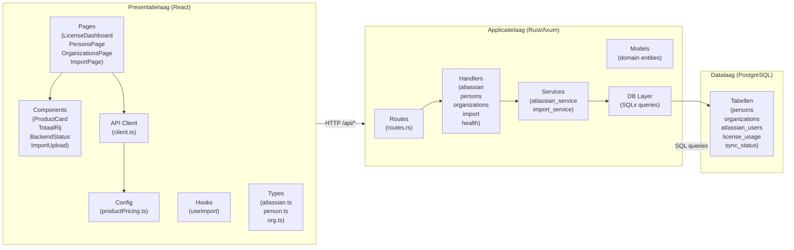
```mermaid
flowchart LR
    subgraph Presentation["Presentatielaag (React)"]
        direction TB
        Pages["Pages<br/>(LicenseDashboard<br/>PersonsPage<br/>OrganizationsPage<br/>ImportPage)"]
        Components["Components<br/>(ProductCard<br/>TotaalRij<br/>BackendStatus<br/>ImportUpload)"]
        Hooks["Hooks<br/>(useImport)"]
        API_Client["API Client<br/>(client.ts)"]
        Config["Config<br/>(productPricing.ts)"]
        Types["Types<br/>(atlassian.ts<br/>person.ts<br/>org.ts)"]
    end

    subgraph Application["Applicatielaag (Rust/Axum)"]
        direction TB
        Routes["Routes<br/>(routes.rs)"]
        Handlers["Handlers<br/>(atlassian<br/>persons<br/>organizations<br/>import<br/>health)"]
        Services["Services<br/>(atlassian_service<br/>import_service)"]
        Models["Models<br/>(domain entities)"]
        DB_Layer["DB Layer<br/>(SQLx queries)"]
    end

    subgraph DataLayer["Datalaag (PostgreSQL)"]
        direction TB
        Tables["Tabellen<br/>(persons<br/>organizations<br/>atlassian_users<br/>license_usage<br/>sync_status)"]
    end

    Presentation -->|"HTTP /api/*"| Application
    Application -->|"SQL queries"| DataLayer
    Pages --> Components
    Pages --> API_Client
    API_Client --> Config
    Routes --> Handlers
    Handlers --> Services
    Services --> DB_Layer
    DB_Layer --> Tables
```

De presentatielaag draait in de browser en praat via HTTP met de applicatielaag. Ik heb bewust gekozen om alle API-calls via een centrale client.ts te laten lopen. Dat klinkt misschien overdreven voor een project van deze omvang, maar het voorkomt dat je overal losse fetch-calls hebt die je later allemaal moet aanpassen als de API verandert.

De applicatielaag in Rust volgt een vrij standaard patroon: routes delegeren naar handlers, handlers roepen services aan, en services praten met de database via SQLx. Wat je hier niet ziet maar wat ik best lastig vond om goed te krijgen, is de foutafhandeling. Rust dwingt je om elk pad af te handelen (daar is geen ontsnappen aan met die compiler), wat soms frustrerend is maar uiteindelijk een stuk robuuster dan een try-catch die alles stilletjes opvangt.

De datalaag is PostgreSQL 16 met een combinatie van relationele tabellen en JSONB-kolommen. De rationele structuur (personen, organisaties, koppelingen) zit in genormaliseerde tabellen met foreign keys. Maar de ruwe API-responses van Atlassian sla ik op als JSONB, omdat die structuur nogal eens verandert en ik niet elke keer mijn schema wil migreren als Atlassian een veld toevoegt.

---

## 4. Architectuurontwerp

### 4.1 Gelaagde architectuur

De architectuur is opgebouwd uit drie lagen die strikt gescheiden zijn. Dat is niet per se origineel (het is gewoon een klassieke drielagenarchitectuur), maar het werkt hier goed. Elke laag heeft z'n eigen verantwoordelijkheid en communiceert alleen met de laag direct eronder.

In de praktijk merkte ik dat deze scheiding mij vooral hielp toen ik de Atlassian-integratie moest omgooien. Ik kon de service-laag aanpassen zonder dat de frontend ook maar iets hoefde te veranderen. De handlers bleven dezelfde response-structuur teruggeven, terwijl daarachter de hele caching-strategie anders werkte.

### 4.2 Componentdiagram

Het componentdiagram hieronder laat de volledige frontend-hierarchie zien. App.tsx is het startpunt en stuurt alles aan via routing. Wat opvalt is dat de import-flow best complex is: er zit een wizard met meerdere stappen in, met een custom hook (useImport) die de state beheert en een aparte importService die de API-calls doet.

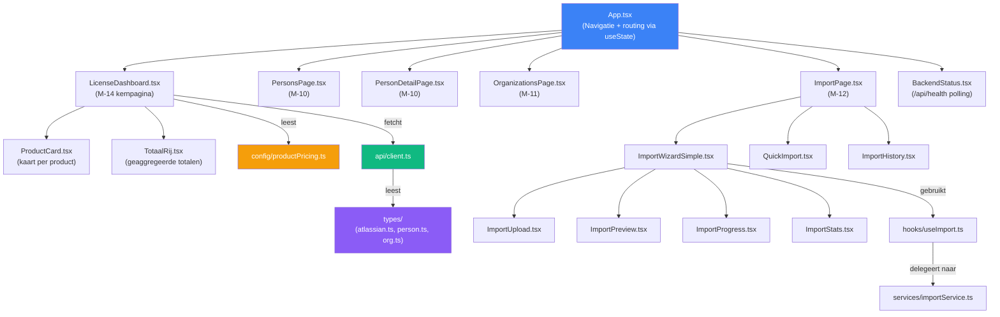
```mermaid
graph TD
    APP["App.tsx<br/>(Navigatie + routing via useState)"]

    APP --> LD["LicenseDashboard.tsx<br/>(M-14 kernpagina)"]
    APP --> PP["PersonsPage.tsx<br/>(M-10)"]
    APP --> PDP["PersonDetailPage.tsx<br/>(M-10)"]
    APP --> OP["OrganizationsPage.tsx<br/>(M-11)"]
    APP --> IP["ImportPage.tsx<br/>(M-12)"]
    APP --> BS["BackendStatus.tsx<br/>(/api/health polling)"]

    LD --> PC["ProductCard.tsx<br/>(kaart per product)"]
    LD --> TR["TotaalRij.tsx<br/>(geaggregeerde totalen)"]
    LD --> |"leest"| PRICE["config/productPricing.ts"]
    LD --> |"fetcht"| APIC["api/client.ts"]

    IP --> IW["ImportWizardSimple.tsx"]
    IP --> QI["QuickImport.tsx"]
    IP --> IH["ImportHistory.tsx"]

    IW --> IUP["ImportUpload.tsx"]
    IW --> IPREV["ImportPreview.tsx"]
    IW --> IPROG["ImportProgress.tsx"]
    IW --> IS["ImportStats.tsx"]
    IW --> |"gebruikt"| HOOK["hooks/useImport.ts"]
    HOOK --> |"delegeert naar"| SVC["services/importService.ts"]

    APIC --> |"leest"| TYPES["types/<br/>(atlassian.ts, person.ts, org.ts)"]

    style APP fill:#3b82f6,color:#fff
    style PRICE fill:#f59e0b,color:#fff
    style APIC fill:#10b981,color:#fff
    style TYPES fill:#8b5cf6,color:#fff
```

Ik had in eerste instantie alle import-logica direct in de ImportPage gezet. Dat werd al snel onwerkbaar: de component was 400+ regels lang en deed zowel validatie als API-calls als state management. Door het op te splitsen in een hook, een service en losse wizard-stappen werd het een stuk overzichtelijker.

### 4.3 Pakketdiagram (module-afhankelijkheden)

Het pakketdiagram toont hoe de frontend-modules van elkaar afhangen. De afhankelijkheden lopen altijd in een richting: pages gebruiken api en config, de api-laag leest types, en hooks delegeren naar services. Circulaire afhankelijkheden zijn er niet, wat debugging een stuk makkelijker maakt.

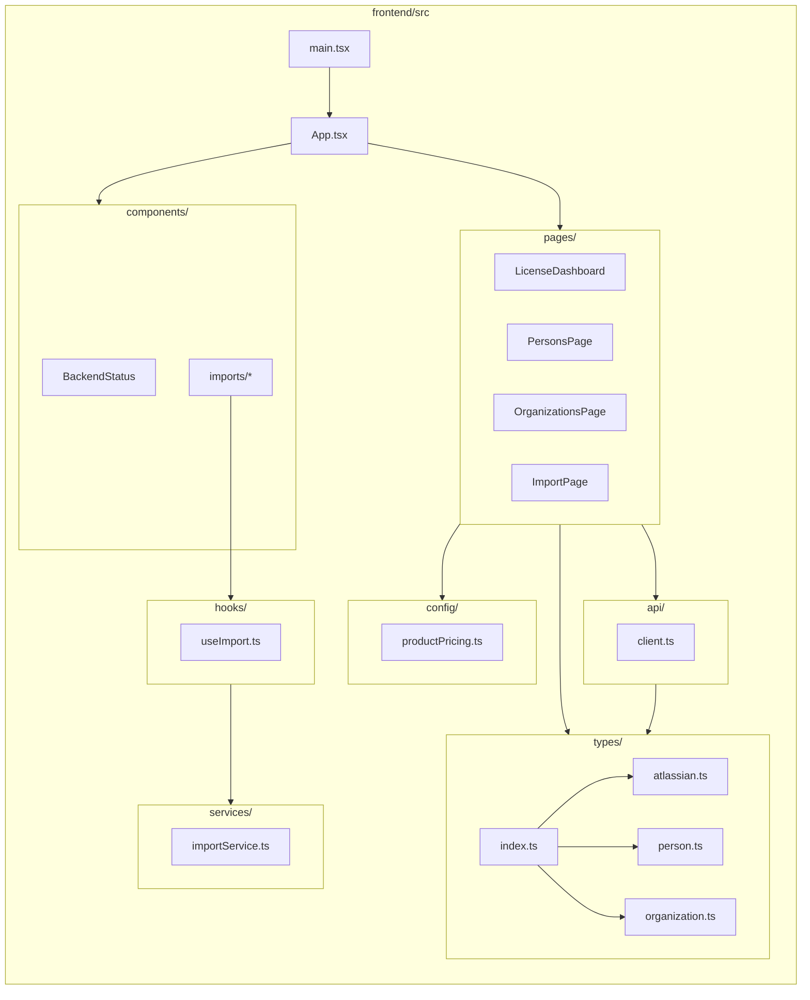
```mermaid
graph LR
    subgraph frontend["frontend/src"]
        main["main.tsx"]
        app["App.tsx"]
        subgraph pages["pages/"]
            ld["LicenseDashboard"]
            pp["PersonsPage"]
            op["OrganizationsPage"]
            imp["ImportPage"]
        end
        subgraph components["components/"]
            bs["BackendStatus"]
            imports_c["imports/*"]
        end
        subgraph api_pkg["api/"]
            client["client.ts"]
        end
        subgraph config_pkg["config/"]
            pricing["productPricing.ts"]
        end
        subgraph types_pkg["types/"]
            atl_t["atlassian.ts"]
            per_t["person.ts"]
            org_t["organization.ts"]
            idx["index.ts"]
        end
        subgraph hooks_pkg["hooks/"]
            uimp["useImport.ts"]
        end
        subgraph services_pkg["services/"]
            isvc["importService.ts"]
        end
    end

    main --> app
    app --> pages
    app --> components
    pages --> api_pkg
    pages --> config_pkg
    pages --> types_pkg
    imports_c --> hooks_pkg
    hooks_pkg --> services_pkg
    api_pkg --> types_pkg
    idx --> atl_t
    idx --> per_t
    idx --> org_t
```

Hierbij viel me op dat de types/ map eigenlijk het fundament is waar bijna alles op leunt. Als ik daar een interface wijzig, heeft dat impact op zowel de api-client als de pages. Dat is een bewust risico: liever een plek waar types gedefinieerd staan dan dat elke component z'n eigen types bijhoudt.

---

## 5. Componentontwerp

### 5.1 Frontend-laag (React/TypeScript)

#### 5.1.1 UI-architectuur en mapstructuur

De frontend is een Single-Page Application gebouwd met React 19 en TypeScript. Navigatie loopt via React Router. Ik heb de app opgedeeld in pages (hele schermweergaven) en components (herbruikbare stukken UI). Dat onderscheid klinkt logisch, maar in de praktijk was het soms lastig om te bepalen waar iets thuishoort. Is een importwizard een page of een component? Uiteindelijk heb ik gekozen voor een losse ImportPage die de wizard-componenten als kinderen rendert.

De mapstructuur ziet er als volgt uit:

```text
frontend/src/
├── App.tsx                           # Root component met routing
├── main.tsx                          # Applicatie entry point
├── index.css                         # Globale CSS imports
├── pages/
│   ├── Login.tsx                     # Inlogpagina
│   ├── OrganizationOverview.tsx      # Overzicht KPIs
│   ├── ProductBreakdown.tsx          # Per-product gebruikerslijst
│   ├── OrganizationDetail.tsx        # Detailpagina organisatie
│   ├── Users.tsx                     # Atlassian-gebruikersoverzicht
│   ├── UserDetail.tsx                # Detailpagina gebruiker
│   ├── DataImport.tsx                # CSV/XLSX uploadpagina
│   └── Import.tsx                    # Importoverzicht
├── components/
│   ├── BackendStatus.tsx             # Backend-connectiviteitsindicator
│   ├── Import/
│   │   └── ImportData.tsx            # Import-wizard component
│   ├── auth/
│   │   └── ProtectedRoute.tsx        # Route guard voor authenticatie
│   ├── charts/                       # Grafiekcomponenten
│   │   ├── CylindricalMonthlyChart.tsx
│   │   ├── LicenseChart.tsx
│   │   ├── OrgCostTrendChart.tsx
│   │   ├── ProductTrendChart.tsx
│   │   ├── TrendChart.tsx
│   │   └── UsageDonut.tsx
│   ├── layout/
│   │   ├── Sidebar.tsx               # Zijnavigatie
│   │   └── Topbar.tsx                # Bovenbalk
│   └── ui/                           # Shadcn/Radix UI componenten
├── api/
│   └── backendClient.ts              # Centrale API-client
├── config/
│   ├── msalConfig.ts                 # Azure AD / MSAL configuratie
│   ├── productPricing.ts             # Licentiekosten-configuratie
│   └── AuthContext.tsx               # React context voor authenticatiestatus
├── data/
│   ├── mockData.ts                   # Mock-data voor ontwikkeling
│   └── updatedUsers.ts              # Gebruikersdata-helpers
├── styles/
│   └── tailwind.css                  # Tailwind CSS imports
├── hooks/
│   └── useImport.ts                  # Custom hook voor importlogica
└── services/
    └── importService.ts              # Service voor import-API calls
```

LicenseDashboard.tsx is de kernpagina voor M-14 en doet eigenlijk het meeste zware werk. De component haalt de lijst met Atlassian-organisaties op, vraagt per organisatie de licentieaantallen op per product, en berekent dan de maandelijkse kosten. Die berekening is client-side, wat een bewuste keuze was: de tarieven staan in productPricing.ts en als een beheerder een prijs aanpast, hoeft alleen dat configuratiebestand te veranderen.

De berekeningslogica is vrij simpel:

```
totalCost      = costPerUser     x userCount
totalBillable  = billablePerUser x userCount
totalMargin    = margin          x userCount
marginPct      = (margin / costPerUser) x 100
```

Een ding waar ik tegenaan liep was de foutafhandeling bij het laden. Als een van de drie product-fetches faalt (zeg, Confluence geeft een 502 terug maar Jira en Trello werken wel), dan wil je niet het hele dashboard leeg tonen. Ik heb daarom een state-machine gemaakt die ook een "deels fout"-toestand ondersteunt.

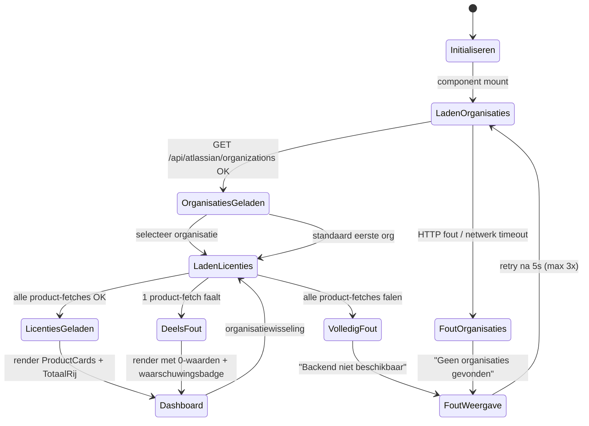
```mermaid
stateDiagram-v2
    [*] --> Initialiseren

    Initialiseren --> LadenOrganisaties : component mount

    LadenOrganisaties --> OrganisatiesGeladen : GET /api/atlassian/organizations OK
    LadenOrganisaties --> FoutOrganisaties : HTTP fout / netwerk timeout

    OrganisatiesGeladen --> LadenLicenties : selecteer organisatie
    OrganisatiesGeladen --> LadenLicenties : standaard eerste org

    LadenLicenties --> LicentiesGeladen : alle product-fetches OK
    LadenLicenties --> DeelsFout : 1 product-fetch faalt
    LadenLicenties --> VolledigFout : alle product-fetches falen

    LicentiesGeladen --> Dashboard : render ProductCards + TotaalRij
    DeelsFout --> Dashboard : render met 0-waarden + waarschuwingsbadge
    VolledigFout --> FoutWeergave : "Backend niet beschikbaar"
    FoutOrganisaties --> FoutWeergave : "Geen organisaties gevonden"

    Dashboard --> LadenLicenties : organisatiewisseling
    FoutWeergave --> LadenOrganisaties : retry na 5s (max 3x)
```

#### 5.1.6 ProductCard

ProductCard.tsx is een puur presentatiecomponent, geen eigen state. Het krijgt z'n data via props en rendert de volgende velden:

---

| Veld               | Type     | Beschrijving                              |
| ------------------ | -------- | ----------------------------------------- |
| `productName`      | `string` | Weergavenaam (bijv. "Jira Software")      |
| `userCount`        | `number` | Aantal actieve gebruikers                 |
| `costPerUser`      | `number` | Inkoopprijs per gebruiker/maand           |
| `billablePerUser`  | `number` | Factureerbaar tarief per gebruiker/maand  |
| `totalCost`        | `number` | Totale maandelijkse inkoopkosten          |
| `totalBillable`    | `number` | Totaal factureerbaar per maand            |
| `totalMargin`      | `number` | Totale consultancymarge per maand         |
| `marginPercentage` | `string` | Margepercentage als geformatteerde string |

---

#### 5.1.7 API-client

De API-client is een generieke typed fetch-wrapper. In eerste instantie had ik in elke page aparte fetch-calls staan, maar dat werd snel een puinhoop. Nu zit alles achter een fetchApi functie die automatisch types checkt en sub-clients per domein biedt:

```typescript
// Vereenvoudigde structuur
async function fetchApi<T>(path: string, options?: RequestInit): Promise<T>

// Sub-clients per domein
const atlassianApi = {
  getOrganizations(): Promise<AtlassianOrg[]>
  getLicenseCount(orgId: string, product: string): Promise<LicenseCount>
}

const personsApi = {
  getPersons(params: PaginationParams): Promise<PaginatedResponse<PersonSummary>>
  getPerson(id: string): Promise<PersonDetail>
}
```

#### 5.1.8 Productprijsconfiguratie

Alle tarieven staan op een plek: productPricing.ts. De reden is simpel. Als Equans een nieuw contract sluit met Atlassian en de prijzen veranderen, hoeft een beheerder maar een enkel bestand aan te passen. Niet drie componenten, niet de backend, niet de database. Dat is DRY in z'n puurste vorm.

```typescript
export interface ProductPricing {
  name: string; // Weergavenaam
  product: string; // API-sleutel
  costPerUser: number; // Inkoopprijs/gebruiker/maand
  billablePerUser: number; // Factureerbaar tarief/gebruiker/maand
  margin: number; // billablePerUser - costPerUser
}
```

De huidige tarieven:

---

| Product       | Inkoopprijs/gebruiker | Factureerbaar/gebruiker | Marge    | Margepercentage |
| ------------- | --------------------- | ----------------------- | -------- | --------------- |
| Jira Software | EUR 8,50              | EUR 11,00               | EUR 2,50 | 29,4%           |
| Confluence    | EUR 6,25              | EUR 9,00                | EUR 2,75 | 44,0%           |

---

### 5.2 Backend-laag (Rust/Axum)

De backend volgt een gelaagde modulestructuur die ik hieronder als diagram laat zien. De scheiding tussen handlers, services en database-queries was niet meteen zo helder als het diagram doet vermoeden. Ik heb het een paar keer moeten herstructureren voordat het goed zat. Aanvankelijk zaten de SQL-queries gewoon in de handlers, maar toen die 200+ regels werden was het duidelijk dat er een apart laagje voor nodig was.

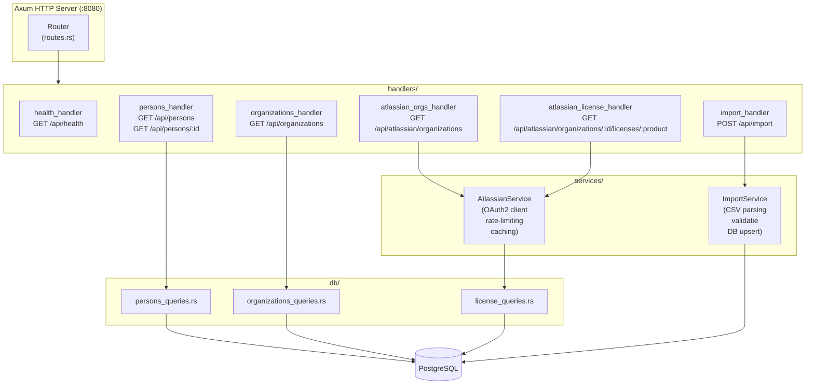
```mermaid
graph TD
    subgraph axum_server["Axum HTTP Server (:8080)"]
        router["Router<br/>(routes.rs)"]
    end

    subgraph handlers["handlers/"]
        h_health["health_handler<br/>GET /api/health"]
        h_atl_orgs["atlassian_orgs_handler<br/>GET /api/atlassian/organizations"]
        h_atl_lic["atlassian_license_handler<br/>GET /api/atlassian/organizations/:id/licenses/:product"]
        h_persons["persons_handler<br/>GET /api/persons<br/>GET /api/persons/:id"]
        h_orgs["organizations_handler<br/>GET /api/organizations"]
        h_import["import_handler<br/>POST /api/import"]
    end

    subgraph services["services/"]
        s_atl["AtlassianService<br/>(OAuth2 client<br/>rate-limiting<br/>caching)"]
        s_import["ImportService<br/>(CSV parsing<br/>validatie<br/>DB upsert)"]
    end

    subgraph db_layer["db/"]
        q_persons["persons_queries.rs"]
        q_orgs["organizations_queries.rs"]
        q_license["license_queries.rs"]
    end

    router --> handlers
    h_atl_orgs --> s_atl
    h_atl_lic --> s_atl
    h_import --> s_import
    h_persons --> q_persons
    h_orgs --> q_orgs
    s_atl --> q_license
    q_persons --> DB[("PostgreSQL")]
    q_orgs --> DB
    q_license --> DB
    s_import --> DB
```

#### 5.2.1 Routestructuur en middleware

De routes zijn RESTful opgezet. Wat me nogal wat tijd kostte was het goed krijgen van de middleware-stack. In Axum werkt middleware via Tower layers, en de volgorde maakt uit. Als je de CORS-layer na de auth-layer zet, krijg je CORS-fouten bij preflight requests omdat die geen JWT meesturen. Dat soort dingen ontdek je alleen door het fout te doen.

De volledige routestructuur:

```
GET  /health
GET  /api/atlassian/users
GET  /api/atlassian/users/stats
GET  /api/organizations
GET  /api/organizations/:org_id
GET  /api/organizations/:org_id/persons
GET  /api/organizations/:org_id/atlassian-linked-count
GET  /api/persons
GET  /api/persons/:id
POST /api/imports/organizations
POST /api/imports/persons
GET  /api/imports/:id
GET  /api/github/enterprises/:enterprise/licenses
GET  /api/github/enterprises/:enterprise/copilot
```

De middleware-stack van buiten naar binnen: TraceLayer voor structured logging, CorsLayer voor CORS-headers, DefaultBodyLimit van 50 MB tegen te grote uploads, en als laatste de JWT-validatie middleware die tokens van Azure AD controleert.

Input-validatie loopt via Rust's type-systeem. Serde probeert de JSON te deserialiseren, en als dat mislukt (ontbrekend verplicht veld, verkeerd type, out-of-range waarden) krijg je automatisch een 422 Unprocessable Entity terug. Geen handmatige if-else-validation nodig.

De foutafhandeling loopt via een centrale AppError enum. Elke variant mapt naar een HTTP-statuscode. Wat echt opvalt aan deze aanpak: interne details worden gelogd maar nooit meegestuurd naar de client. Dat is OWASP 101 (Information Exposure), maar het aantal projecten dat stacktraces naar de frontend stuurt is schrikbarend.

### 5.3 Integratie met externe services

De AtlassianClient gebruikt reqwest met een 30 seconden HTTP-timeout en 10 seconden connectie-timeout. Paginated API-responses worden volledig gelezen voordat ze opgeslagen worden. Authenticatie verloopt via API-token in de Authorization-header (Atlassian vereist Basic Auth formaat). Hierbij bleek dat de Atlassian Admin API nogal wisselend documenteert hoe paginering precies werkt. Sommige endpoints gebruiken cursor-based pagination, andere offset-based. Dat maakte de client code complexer dan ik had verwacht.

Voor GitHub Enterprise is er een aparte GitHubClient die de REST API v3 aanspreekt via een Personal Access Token in de Authorization header. Die integratie is vrij recht-door-zee vergeleken met Atlassian.

Bij tijdelijke fouten (5xx, timeout) logt het systeem de fout en geeft gecachte data terug. Bij permanente fouten (401, 403) wordt een kritieke beveiligingswaarschuwing gelogd. Er zit bewust geen automatische retry in zonder backoff, om rate-limits te respecteren (R. Martin, 2025).

### 5.4 Configuratiebeheer

De Vite-ontwikkelserver werkt als proxy voor alle /api/\* verzoeken richting de Rust-backend op port 8080. Dat bespaart je CORS-problemen tijdens het ontwikkelen. Zonder deze proxy had ik constant CORS-headers moeten configureren voor localhost, wat gewoon irritant is.

```typescript
// vite.config.ts
export default defineConfig({
  plugins: [react()],
  server: {
    proxy: {
      "/api": {
        target: "http://localhost:8080",
        changeOrigin: true,
      },
    },
  },
});
```

---

## 6. Data-ontwerp

### 6.1 Domeinmodellen

Het klassediagram hieronder laat alle entiteiten en hun relaties zien. Ik geef toe dat het er op het eerste gezicht overweldigend uitziet, maar de kern is eigenlijk vrij simpel: personen horen bij organisaties, en die personen worden gekoppeld aan externe Atlassian- en GitHub-accounts via link-tabellen met een vertrouwensscore.

De AtlassianPersonLink is wellicht de meest interessante entiteit. Die koppelt een interne Person aan een extern AtlassianUsersCache record, en slaat daarbij een confidence_score op. Die score geeft aan hoe zeker het systeem is dat het de juiste koppeling heeft gemaakt. Een exacte e-mailmatch geeft een hogere score dan een displaynaam-match. Dit volgt het Probabilistic Matching-patroon dat Christen (2014) beschrijft.

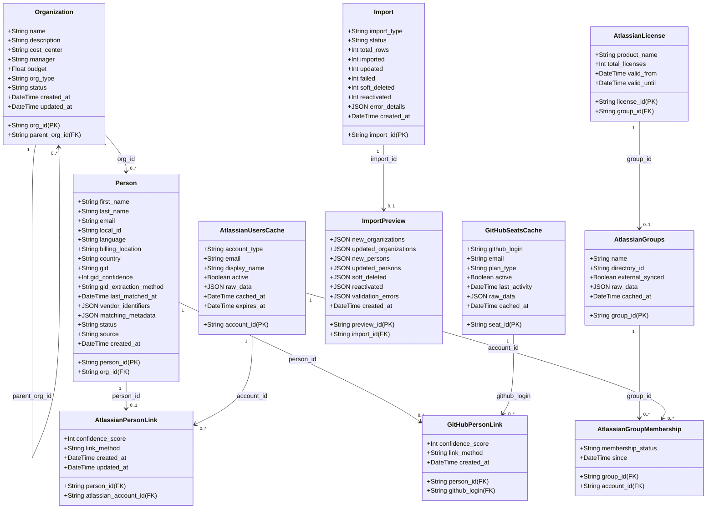
```mermaid
classDiagram
   direction TB

   class Organization {
       +String org_id (PK)
       +String name
       +String description
       +String cost_center
       +String manager
       +Float budget
       +String org_type
       +String status
       +String parent_org_id (FK)
       +DateTime created_at
       +DateTime updated_at
   }

   class Person {
       +String person_id (PK)
       +String first_name
       +String last_name
       +String email
       +String local_id
       +String language
       +String billing_location
       +String country
       +String org_id (FK)
       +String gid
       +Int gid_confidence
       +String gid_extraction_method
       +DateTime last_matched_at
       +JSON vendor_identifiers
       +JSON matching_metadata
       +String status
       +String source
       +DateTime created_at
   }

   class AtlassianUsersCache {
       +String account_id (PK)
       +String account_type
       +String email
       +String display_name
       +Boolean active
       +JSON raw_data
       +DateTime cached_at
       +DateTime expires_at
   }

   class AtlassianGroups {
       +String group_id (PK)
       +String name
       +String directory_id
       +Boolean external_synced
       +JSON raw_data
       +DateTime cached_at
   }

   class AtlassianGroupMembership {
       +String group_id (FK)
       +String account_id (FK)
       +String membership_status
       +DateTime since
   }

   class AtlassianPersonLink {
       +String person_id (FK)
       +String atlassian_account_id (FK)
       +Int confidence_score
       +String link_method
       +DateTime created_at
       +DateTime updated_at
   }

   class AtlassianLicense {
       +String license_id (PK)
       +String product_name
       +String group_id (FK)
       +Int total_licenses
       +DateTime valid_from
       +DateTime valid_until
   }

   class GitHubSeatsCache {
       +String seat_id (PK)
       +String github_login
       +String email
       +String plan_type
       +Boolean active
       +DateTime last_activity
       +JSON raw_data
       +DateTime cached_at
   }

   class GitHubPersonLink {
       +String person_id (FK)
       +String github_login (FK)
       +Int confidence_score
       +String link_method
       +DateTime created_at
   }

   class Import {
       +String import_id (PK)
       +String import_type
       +String status
       +Int total_rows
       +Int imported
       +Int updated
       +Int failed
       +Int soft_deleted
       +Int reactivated
       +JSON error_details
       +DateTime created_at
   }

   class ImportPreview {
       +String preview_id (PK)
       +String import_id (FK)
       +JSON new_organizations
       +JSON updated_organizations
       +JSON new_persons
       +JSON updated_persons
       +JSON soft_deleted
       +JSON reactivated
       +JSON validation_errors
       +DateTime created_at
   }

   Organization "1" --> "0..*" Organization : parent_org_id
   Organization "1" --> "0..*" Person : org_id

   Person "1" --> "0..1" AtlassianPersonLink : person_id
   Person "1" --> "0..1" GitHubPersonLink : person_id

   AtlassianUsersCache "1" --> "0..*" AtlassianPersonLink : account_id
   GitHubSeatsCache "1" --> "0..*" GitHubPersonLink : github_login

   AtlassianGroups "1" --> "0..*" AtlassianGroupMembership : group_id
   AtlassianUsersCache "1" --> "0..*" AtlassianGroupMembership : account_id

   AtlassianLicense "1" --> "0..1" AtlassianGroups : group_id

   Import "1" --> "0..1" ImportPreview : import_id
```

_Figuur 2 -- Class Diagram_

Even de belangrijkste entiteiten langslopen. Organization vertegenwoordigt een business unit of afdeling met budget- en beheergegevens. Person is de centrale entiteit voor alle medewerkers, afkomstig uit Palantir-imports. Dan heb je AtlassianUsersCache en GitHubSeatsCache: dat zijn tijdelijke opslagtabellen voor de ruwe API-data. AtlassianGroups en AtlassianLicense slaan de groeps- en licentie-informatie op uit Atlassian.

De koppeling tussen interne personen en externe accounts loopt via twee associatieklassen. AtlassianPersonLink koppelt een Person aan een AtlassianUsersCache record met die vertrouwensscore. GitHubPersonLink doet hetzelfde voor GitHub-accounts. Het matching-algoritme weegt meerdere kenmerken (e-mail, naam, GID) en berekent daar een totaalscore uit. Dat is een pragmatische implementatie van het patroon dat Christen (2014) beschrijft. Een volwaardig Fellegi-Sunter model zou nauwkeuriger zijn, maar vereist gelabelde trainingsdata die op dit moment niet beschikbaar is.

Elke Person heeft optionele velden gid en gid_extraction_method. Het GID (Generic ID) is de interne Equans-identifier. Matching gebeurt op e-mailadres, displaynaam of local_id. In de praktijk bleek dat e-mailmatching een betrouwbaarheid van rond de 85% haalt; de rest moet via andere velden aangevuld worden.

De import-functionaliteit wordt ondersteund door twee entiteiten: Import logt elke importactie met statistieken (hoeveel toegevoegd, gewijzigd, soft-deleted), en ImportPreview slaat tijdelijk de preview op zodat een beheerder kan controleren wat er gaat veranderen voordat de import definitief wordt uitgevoerd.

### 6.2 Entiteit-relatiediagram

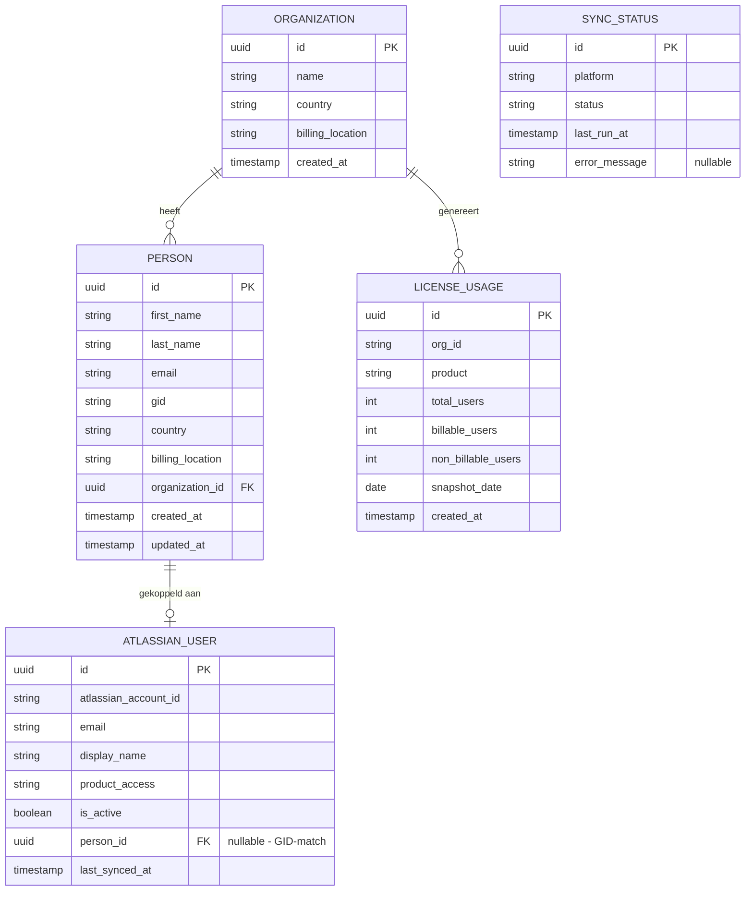
```mermaid
erDiagram
    PERSON {
        uuid id PK
        string first_name
        string last_name
        string email
        string gid
        string country
        string billing_location
        uuid organization_id FK
        timestamp created_at
        timestamp updated_at
    }

    ORGANIZATION {
        uuid id PK
        string name
        string country
        string billing_location
        timestamp created_at
    }

    ATLASSIAN_USER {
        uuid id PK
        string atlassian_account_id
        string email
        string display_name
        string product_access
        boolean is_active
        uuid person_id FK "nullable - GID-match"
        timestamp last_synced_at
    }

    LICENSE_USAGE {
        uuid id PK
        string org_id
        string product
        int total_users
        int billable_users
        int non_billable_users
        date snapshot_date
        timestamp created_at
    }

    SYNC_STATUS {
        uuid id PK
        string platform
        string status
        timestamp last_run_at
        string error_message "nullable"
    }

    ORGANIZATION ||--o{ PERSON : "heeft"
    PERSON ||--o| ATLASSIAN_USER : "gekoppeld aan"
    ORGANIZATION ||--o{ LICENSE_USAGE : "genereert"
```

### 6.3 Data storage design

_Tabel 5 -- Schema-overzicht_

---

| Tabel                   | Doel                                        | Indexen                                    |
| ----------------------- | ------------------------------------------- | ------------------------------------------ |
| `organizations`         | Organisatiehierarchie (max. 3 niveaus diep) | `parent_org_id`, `status`, `cost_center`   |
| `persons`               | Persoonsmasterdata uit CSV-import           | `org_id`, `email`, `gid`, full-text `name` |
| `atlassian_users_cache` | Cache van Atlassian API-data                | `email`, `active`, `expires_at`            |
| `atlassian_person_link` | M:1 koppeling persoon - Atlassian-account   | `person_id`, `account_id`                  |
| `imports`               | Voortgangs- en statustracking van imports   | `status`, `created_at`                     |

---

De caching werkt als volgt: atlassian_users_cache heeft een expires_at veld, maar in de huidige implementatie geeft het systeem altijd de bestaande data terug, ook als die verlopen is. Dat is het "stale-while-revalidate" patroon. Een Tokio-achtergrondtaak ververst de cache periodiek. Hierdoor is de frontend-latency volledig losgekoppeld van hoe snel (of langzaam) de Atlassian API reageert. Het nadeel is dat data maximaal sync_interval_hours oud kan zijn, maar voor maandrapportages is dat acceptabel.

Over de keuze voor SQL versus NoSQL: de relaties tussen personen, organisaties en Atlassian-accounts vereisen JOIN-semantiek met referentiele integriteit. JSONB-kolommen geven genoeg flexibiliteit voor de semigestructureerde API-data, zonder dat je het relationele model hoeft te verlaten (Momjian, 2001). Ik heb serieus overwogen om de cache in MongoDB te zetten, maar dat introduceerde een extra database die gemanaged moest worden. De JSONB-oplossing in PostgreSQL werkt gewoon goed genoeg.

### 6.4 Gegevensstroomdiagram

Het diagram hieronder toont hoe data van de Atlassian API via de backend naar de database en uiteindelijk naar de frontend stroomt. Twee paden zijn zichtbaar: het achtergrondpad (scheduler ververst de cache) en het realtime pad (gebruiker opent dashboard, frontend haalt data op). Die twee paden delen dezelfde database, wat het stale-while-revalidate patroon mogelijk maakt.

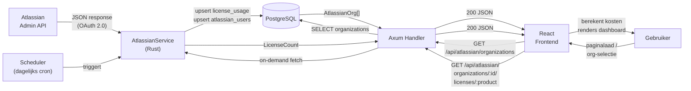
```mermaid
flowchart LR
    ATL_API["Atlassian<br/>Admin API"]
    SCHED["Scheduler<br/>(dagelijks cron)"]
    SVC["AtlassianService<br/>(Rust)"]
    DB[("PostgreSQL")]
    HANDLER["Axum Handler"]
    FRONTEND["React<br/>Frontend"]
    USER["Gebruiker"]

    ATL_API -->|"JSON response<br/>(OAuth 2.0)"| SVC
    SCHED -->|"triggert"| SVC
    SVC -->|"upsert license_usage<br/>upsert atlassian_users"| DB
    USER -->|"paginalaad /<br/>org-selectie"| FRONTEND
    FRONTEND -->|"GET /api/atlassian/organizations"| HANDLER
    HANDLER -->|"SELECT organizations"| DB
    DB -->|"AtlassianOrg[]"| HANDLER
    HANDLER -->|"200 JSON"| FRONTEND
    FRONTEND -->|"GET /api/atlassian/<br/>organizations/:id/<br/>licenses/:product"| HANDLER
    HANDLER -->|"on-demand fetch"| SVC
    SVC -->|"LicenseCount"| HANDLER
    HANDLER -->|"200 JSON"| FRONTEND
    FRONTEND -->|"berekent kosten<br/>renders dashboard"| USER
```

---

## 7. Interface-ontwerp

### 7.1 REST API-specificatie

De backend biedt een REST API aan. Alle endpoints verwachten Content-Type: application/json; beveiligde endpoints vereisen ook een Authorization: Bearer JWT header. Het /health endpoint is het enige dat zonder authenticatie bereikbaar is, zodat monitoring-tools makkelijk kunnen controleren of de service draait.

---

| Methode | Pad                                                          | Auth | Response-type                            | Statuscodes        |
| ------- | ------------------------------------------------------------ | ---- | ---------------------------------------- | ------------------ |
| `GET`   | `/api/health`                                                | Nee  | `{ status: "ok", version: string }`      | 200                |
| `GET`   | `/api/atlassian/organizations`                               | JWT  | `AtlassianOrg[]`                         | 200, 401, 502      |
| `GET`   | `/api/atlassian/organizations/:id/licenses/:product`         | JWT  | `LicenseCount`                           | 200, 401, 404, 502 |
| `GET`   | `/api/atlassian/organizations/:id/licenses/:product/details` | JWT  | `LicenseDetails`                         | 200, 401, 404, 502 |
| `GET`   | `/api/atlassian/users`                                       | JWT  | `AtlassianUsersResponse`                 | 200, 401           |
| `GET`   | `/api/persons`                                               | JWT  | `PaginatedResponse<PersonSummary>`       | 200, 401           |
| `GET`   | `/api/persons/:id`                                           | JWT  | `PersonDetail`                           | 200, 401, 404      |
| `GET`   | `/api/organizations`                                         | JWT  | `PaginatedResponse<OrganizationSummary>` | 200, 401           |
| `POST`  | `/api/import`                                                | JWT  | `ImportResult`                           | 202, 401, 422      |

---

### 7.2 Sequentiediagrammen

#### 7.2.1 Dashboard initialisatie

Dit diagram laat zien wat er allemaal gebeurt als een gebruiker het dashboard opent. Het begint met een health-check (is de backend bereikbaar?), dan worden de organisaties opgehaald, en vervolgens loopt het per Atlassian-product de licentiedata langs. Wat hierbij opvalt: de kostenberekening is volledig client-side. De backend levert alleen de ruwe aantallen, de frontend berekent alle bedragen op basis van productPricing.ts.

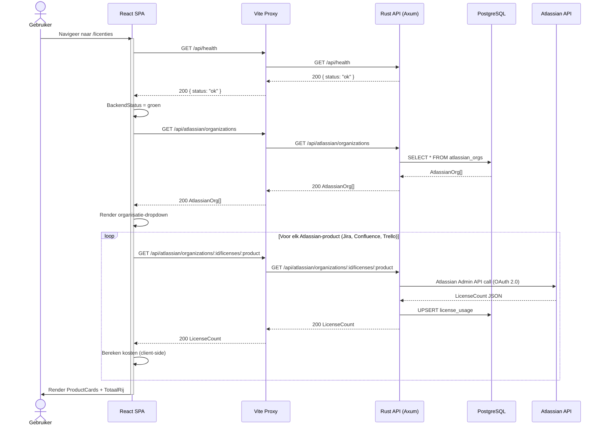
```mermaid
sequenceDiagram
    actor Gebruiker
    participant SPA as React SPA
    participant Vite as Vite Proxy
    participant API as Rust API (Axum)
    participant DB as PostgreSQL
    participant ATL as Atlassian API

    Gebruiker->>SPA: Navigeer naar /licenties
    activate SPA

    SPA->>Vite: GET /api/health
    Vite->>API: GET /api/health
    API-->>Vite: 200 { status: "ok" }
    Vite-->>SPA: 200 { status: "ok" }
    SPA->>SPA: BackendStatus = groen

    SPA->>Vite: GET /api/atlassian/organizations
    Vite->>API: GET /api/atlassian/organizations
    API->>DB: SELECT * FROM atlassian_orgs
    DB-->>API: AtlassianOrg[]
    API-->>Vite: 200 AtlassianOrg[]
    Vite-->>SPA: 200 AtlassianOrg[]
    SPA->>SPA: Render organisatie-dropdown

    loop Voor elk Atlassian-product (Jira, Confluence, Trello)
        SPA->>Vite: GET /api/atlassian/organizations/:id/licenses/:product
        Vite->>API: GET /api/atlassian/organizations/:id/licenses/:product
        API->>ATL: Atlassian Admin API call (OAuth 2.0)
        ATL-->>API: LicenseCount JSON
        API->>DB: UPSERT license_usage
        API-->>Vite: 200 LicenseCount
        Vite-->>SPA: 200 LicenseCount
        SPA->>SPA: Bereken kosten (client-side)
    end

    SPA->>Gebruiker: Render ProductCards + TotaalRij
    deactivate SPA
```

#### 7.2.2 Data-import sequentie

De import-flow ziet er simpel uit in het diagram, maar was een van de lastigste onderdelen om goed te krijgen. Het hele proces draait in een database-transactie: als er halverwege iets misgaat (stel, record 500 van 2000 heeft een foreign key-conflict), dan wordt alles teruggerold. Geen half-geimporteerde datasets.

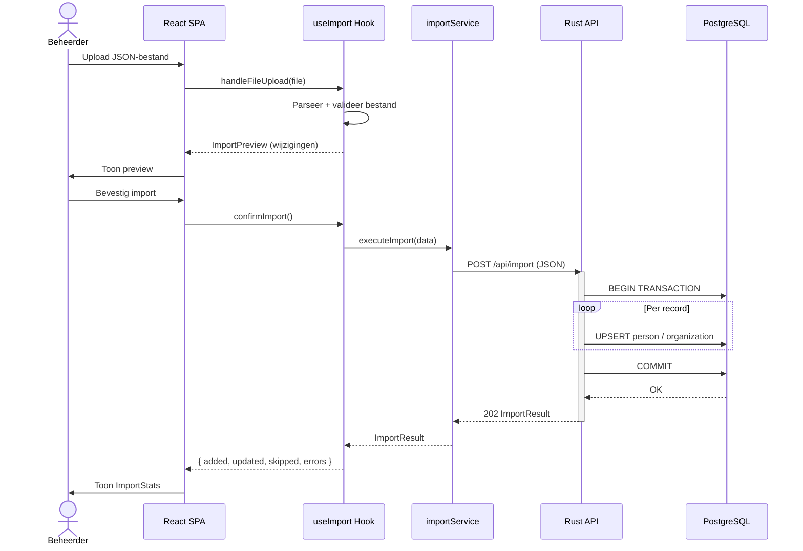
```mermaid
sequenceDiagram
    actor Beheerder
    participant SPA as React SPA
    participant Hook as useImport Hook
    participant Svc as importService
    participant API as Rust API
    participant DB as PostgreSQL

    Beheerder->>SPA: Upload JSON-bestand
    SPA->>Hook: handleFileUpload(file)
    Hook->>Hook: Parseer + valideer bestand
    Hook-->>SPA: ImportPreview (wijzigingen)
    SPA->>Beheerder: Toon preview

    Beheerder->>SPA: Bevestig import
    SPA->>Hook: confirmImport()
    Hook->>Svc: executeImport(data)
    Svc->>API: POST /api/import (JSON)
    activate API
    API->>DB: BEGIN TRANSACTION
    loop Per record
        API->>DB: UPSERT person / organization
    end
    API->>DB: COMMIT
    DB-->>API: OK
    API-->>Svc: 202 ImportResult
    deactivate API
    Svc-->>Hook: ImportResult
    Hook-->>SPA: { added, updated, skipped, errors }
    SPA->>Beheerder: Toon ImportStats
```

#### 7.2.3 Authenticatiesequentie (Azure AD MSAL-flow)

De authenticatie was een hoofdstuk apart. MSAL (Microsoft Authentication Library) handelt de OAuth 2.0 Authorization Code Flow met PKCE af. In de praktijk kostte het me behoorlijk wat tijd om dit werkend te krijgen, vooral omdat de MSAL-documentatie niet altijd even duidelijk is over welke scopes je precies nodig hebt en hoe token-vernieuwing werkt in een SPA-context (Cilwerner, z.d.). Figuur 3 toont de volledige flow.

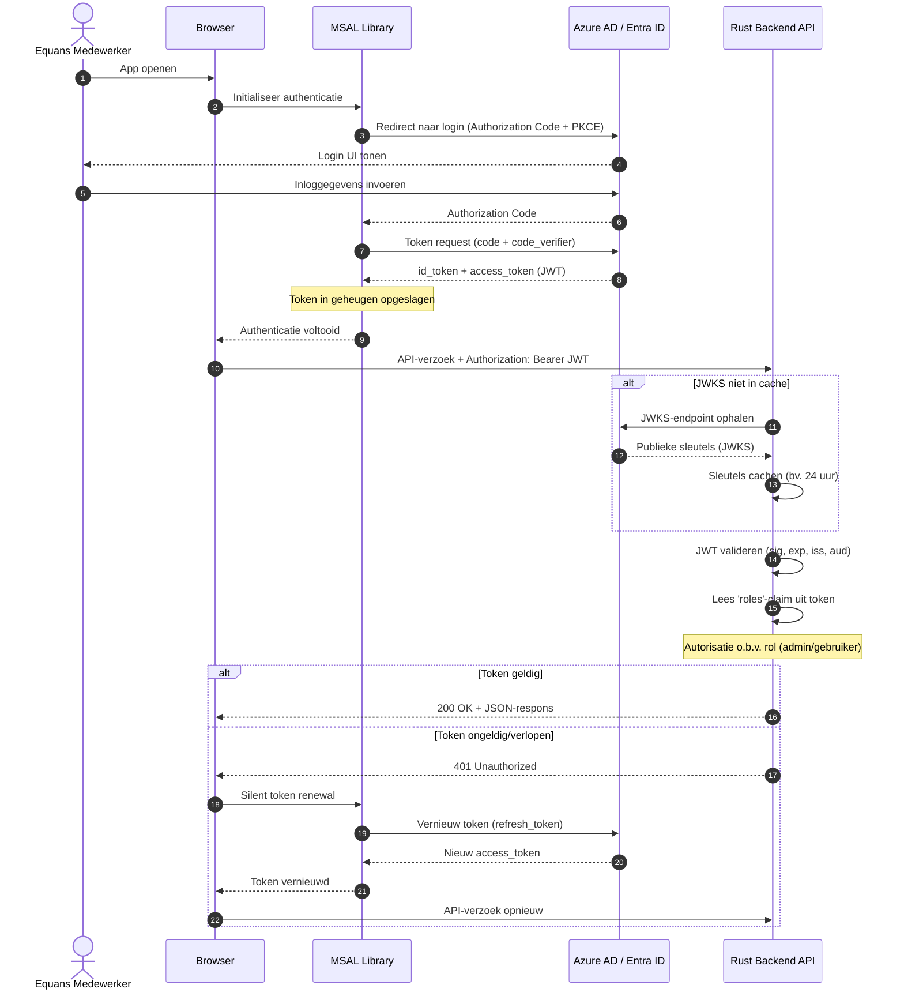
```mermaid
sequenceDiagram
    autonumber
    actor Gebruiker as Equans Medewerker
    participant Browser
    participant MSAL as MSAL Library
    participant AzureAD as Azure AD / Entra ID
    participant Backend as Rust Backend API

    Gebruiker->>Browser: App openen
    Browser->>MSAL: Initialiseer authenticatie
    MSAL->>AzureAD: Redirect naar login (Authorization Code + PKCE)
    AzureAD-->>Gebruiker: Login UI tonen
    Gebruiker->>AzureAD: Inloggegevens invoeren
    AzureAD-->>MSAL: Authorization Code
    MSAL->>AzureAD: Token request (code + code_verifier)
    AzureAD-->>MSAL: id_token + access_token (JWT)
    Note over MSAL: Token in geheugen opgeslagen

    MSAL-->>Browser: Authenticatie voltooid

    Browser->>Backend: API-verzoek + Authorization: Bearer JWT

    alt JWKS niet in cache
        Backend->>AzureAD: JWKS-endpoint ophalen
        AzureAD-->>Backend: Publieke sleutels (JWKS)
        Backend->>Backend: Sleutels cachen (bv. 24 uur)
    end

    Backend->>Backend: JWT valideren (sig, exp, iss, aud)
    Backend->>Backend: Lees 'roles'-claim uit token
    Note over Backend: Autorisatie o.b.v. rol (admin/gebruiker)

    alt Token geldig
        Backend-->>Browser: 200 OK + JSON-respons
    else Token ongeldig/verlopen
        Backend-->>Browser: 401 Unauthorized
        Browser->>MSAL: Silent token renewal
        MSAL->>AzureAD: Vernieuw token (refresh_token)
        AzureAD-->>MSAL: Nieuw access_token
        MSAL-->>Browser: Token vernieuwd
        Browser->>Backend: API-verzoek opnieuw
    end
```

_Figuur 3 -- Sequentiediagram: authenticatie (OAuth 2.0 Authorization Code Flow met PKCE)_

Een paar beveiligingsdetails die hierbij horen. PKCE voorkomt dat iemand de autorisatiecode onderschept. Tokens worden nooit in localStorage opgeslagen (dat zou XSS-kwetsbaarheden creëren), maar in het geheugen van de MSAL-library. De backend valideert tokens via het JWKS-endpoint van Azure AD, dus alleen door Microsoft ondertekende tokens worden geaccepteerd. En de silent renewal zorgt ervoor dat gebruikers niet opnieuw hoeven in te loggen als hun token verloopt.

#### 7.2.4 Atlassian cache-refreshflow (achtergrond)

Figuur 4 laat de asynchrone cache-verversing zien. Dit gebeurt los van wat de gebruiker doet. Een Tokio-scheduler draait op de achtergrond en ververst de Atlassian-data periodiek. Hierbij bleek dat de Atlassian API nogal streng is met rate-limits. Tijdens een van de eerste tests kreeg ik binnen een minuut een 429 terug omdat ik alle paginas te snel achter elkaar opvroeg.

Data stroomt als volgt: de scheduler triggert de AtlassianService, die via de AtlassianClient alle gebruikers ophaalt met cursor-based paginering. Bij een 429 wacht de client even (exponential backoff) en probeert opnieuw. Daarna dedupliceeert de service de product_access gegevens per gebruiker (sommige gebruikers stonden dubbel in de API-response, waarschijnlijk door hoe Atlassian groups werkt) en doet een UPSERT in PostgreSQL.

Het stale-while-revalidate patroon (Nygard, 2007) houdt in dat de frontend altijd uit de lokale database leest, nooit direct uit de Atlassian API. Dat maakt het dashboard snel en betrouwbaar, ook als Atlassian even niet bereikbaar is.

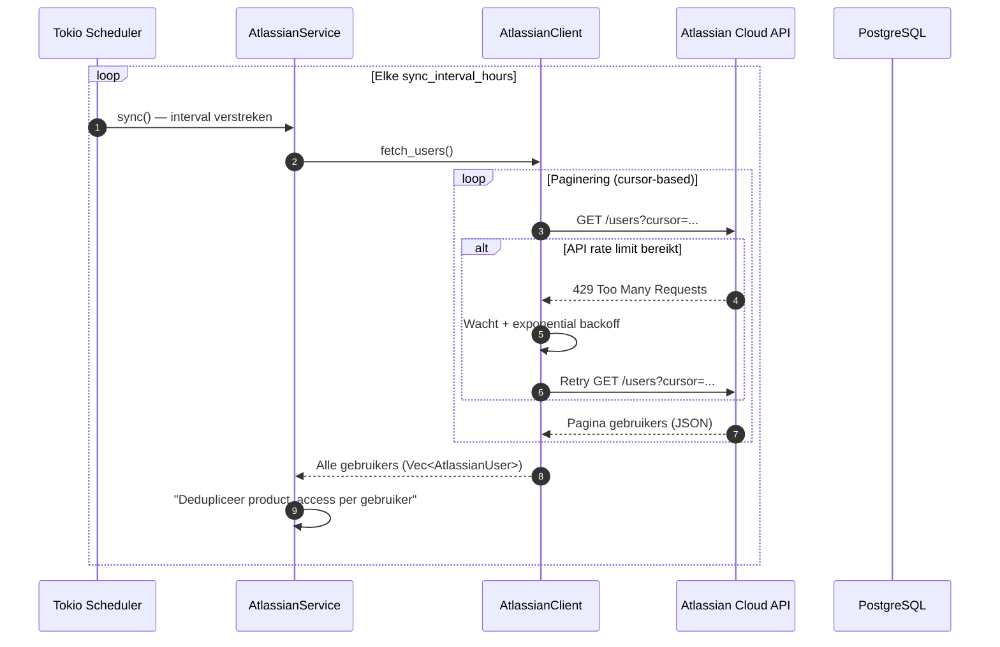
```mermaid
sequenceDiagram
    autonumber
    participant Scheduler as Tokio Scheduler
    participant Service as AtlassianService
    participant Client as AtlassianClient
    participant AtlassianAPI as Atlassian Cloud API
    participant DB as PostgreSQL

    loop Elke sync_interval_hours
        Scheduler->>Service: sync() — interval verstreken
        Service->>Client: fetch_users()

        loop Paginering (cursor-based)
            Client->>AtlassianAPI: GET /users?cursor=...

            alt API rate limit bereikt
                AtlassianAPI-->>Client: 429 Too Many Requests
                Client->>Client: Wacht + exponential backoff
                Client->>AtlassianAPI: Retry GET /users?cursor=...
            end

            AtlassianAPI-->>Client: Pagina gebruikers (JSON)
        end

        Client-->>Service: Alle gebruikers (Vec<AtlassianUser>)

        Service->>Service: "Dedupliceer product_access per gebruiker"
    end
```

_Figuur 4 -- Sequentiediagram: Atlassian cache-refreshflow_

#### 7.2.5 Server-side paginering OrganizationDetail

Met 12.000+ personen in de database kan je niet alles naar de frontend sturen. Dat was meteen duidelijk na de eerste test met echte data: de browser hing zo'n 8 seconden bezig met het renderen van een tabel met 12.000 rijen. Server-side paginering was de enige optie.

De frontend stuurt een verzoek met parameters als page, per_page, search en atlassian_filter. De backend bouwt daar een SQL-query van met LIMIT, OFFSET en WHERE-clauses. Een detail dat me best wat tijd kostte: de debounce op de zoekbalk. Bij elke toetsaanslag een API-call doen zou de backend overspoelen, dus er zit een vertraging van 350 ms op. Pas als de gebruiker stopt met typen gaat het verzoek eruit (Fowler, z.d.).

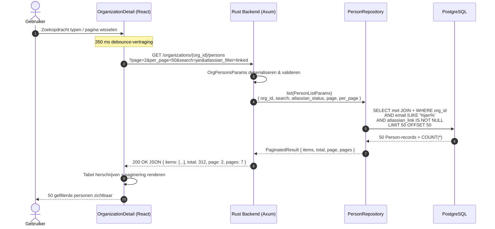
```mermaid
sequenceDiagram
    autonumber
    actor Gebruiker
    participant FE as OrganizationDetail (React)
    participant API as Rust Backend (Axum)
    participant Repo as PersonRepository
    participant DB as PostgreSQL

    Gebruiker->>FE: Zoekopdracht typen / pagina wisselen
    Note over FE: 350 ms debounce-vertraging
    FE->>API: GET /organizations/{org_id}/persons<br/>?page=2&per_page=50&search=jan&atlassian_filter=linked

    API->>API: OrgPersonsParams deserialiseren & valideren
    API->>Repo: list(PersonListParams)<br/>{ org_id, search, atlassian_status, page, per_page }

    Repo->>DB: SELECT met JOIN + WHERE org_id<br/>AND email ILIKE '%jan%'<br/>AND atlassian_link IS NOT NULL<br/>LIMIT 50 OFFSET 50
    DB-->>Repo: 50 Person-records + COUNT(*)

    Repo-->>API: PaginatedResult { items, total, page, pages }
    API-->>FE: 200 OK JSON { items: [...], total: 312, page: 2, pages: 7 }
    FE->>FE: Tabel herschrijven + paginering renderen
    FE-->>Gebruiker: 50 gefilterde personen zichtbaar
```

_Figuur 5 -- Sequentiediagram: server-side paginering OrganizationDetail_

De backend ontvangt en valideert de queryparameters, de PersonRepository bouwt een SQL-query met WHERE org_id = ?, AND email ILIKE '%jan%' (case-insensitief zoeken), AND atlassian_link IS NOT NULL (filter op Atlassian-status), en LIMIT 50 OFFSET 50 voor de paginering. Een tweede query telt het totaal met COUNT(\*) zodat de frontend de paginering-knoppen goed kan renderen.

### 7.3 Gebruikersstroomdiagrammen

#### 7.3.1 Dashboardnavigatie

De navigatiestructuur volgt een Hub and Spoke-model (Tidwell, 2010): de sidebar is de hub, de detailpaginas zijn de spokes. Ik heb bewust gekozen om detailpaginas alleen bereikbaar te maken via doorkliks vanuit lijstweergaven. Geen directe deep-links in de sidebar naar individuele organisaties of personen. Dat houdt de navigatie overzichtelijk en voorkomt dat de sidebar een oneindig lange lijst wordt.

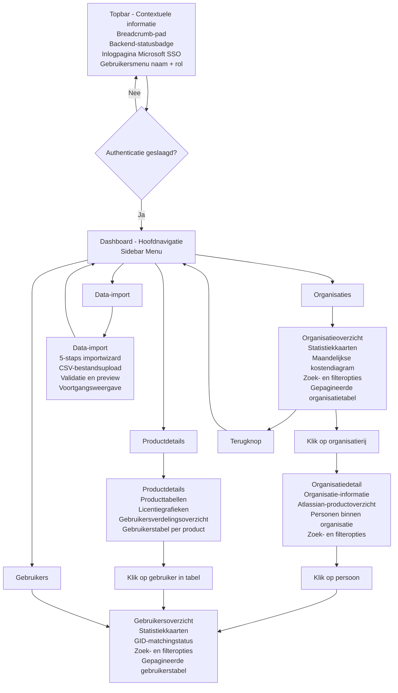
```mermaid
graph TD
    A[Topbar - Contextuele informatie<br/>Breadcrumb-pad<br/>Backend-statusbadge<br/>Inlogpagina Microsoft SSO<br/>Gebruikersmenu naam + rol] --> B{Authenticatie geslaagd?}

    B -->|Ja| C[Dashboard - Hoofdnavigatie<br/>Sidebar Menu]
    B -->|Nee| A

    C --> D[Organisaties]
    C --> E[Productdetails]
    C --> F[Gebruikers]
    C --> G[Data-import]

    D --> H[Organisatieoverzicht<br/>Statistiekkaarten<br/>Maandelijkse kostendiagram<br/>Zoek- en filteropties<br/>Gepagineerde organisatietabel]
    H --> I[Klik op organisatierij]
    I --> J[Organisatiedetail<br/>Organisatie-informatie<br/>Atlassian-productoverzicht<br/>Personen binnen organisatie<br/>Zoek- en filteropties]
    J --> K[Klik op persoon]
    K --> L[Gebruikersoverzicht]

    H --> M[Terugknop]
    M --> C

    E --> N[Productdetails<br/>Producttabellen<br/>Licentiegrafieken<br/>Gebruikersverdelingsoverzicht<br/>Gebruikerstabel per product]
    N --> O[Klik op gebruiker in tabel]
    O --> L

    F --> L[Gebruikersoverzicht<br/>Statistiekkaarten<br/>GID-matchingstatus<br/>Zoek- en filteropties<br/>Gepagineerde gebruikerstabel]

    G --> P[Data-import<br/>5-staps importwizard<br/>CSV-bestandsupload<br/>Validatie en preview<br/>Voortgangsweergave]
    P --> C
```

_Figuur 6a -- Navigatiestructuur overzicht_

De vier hoofdtakken zijn: Organisaties (met drill-down naar detail en personen), Productdetails (met licentiegrafieken en doorkliks naar gebruikers), Gebruikers (direct overzicht met filters en zoekfunctie), en Data-import (de 5-staps wizard). De terugknop in detailpaginas brengt je altijd terug naar het overzichtsniveau. Dat klinkt vanzelfsprekend, maar ik heb het expliciet zo gebouwd omdat React Router standaard de hele history stack gebruikt, en ik niet wilde dat gebruikers per ongeluk terug navigeren naar een pagina die ze drie klikken geleden bezochten.

#### 7.3.2 Gebruikersreis: Organisatieanalyse

De primaire use case: een licentiebeheerder wil weten wat een specifieke organisatie-eenheid kost aan Atlassian-licenties. Figuur 6b toont de stappen die zo iemand doorloopt.

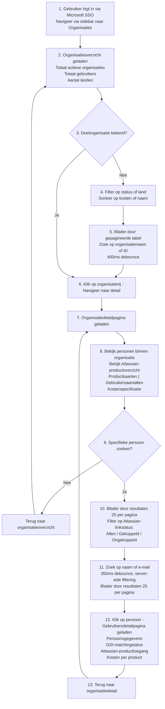
```mermaid
graph TD
    A["1. Gebruiker logt in via Microsoft SSO<br/>Navigeer via sidebar naar Organisaties"] --> B["2. Organisatieoverzicht geladen<br/>Totaal actieve organisaties<br/>Totaal gebruikers<br/>Aantal landen"]

    B --> C{"3. Doelorganisatie bekend?"}

    C -->|Nee| D["4. Filter op status of land<br/>Sorteer op kosten of naam"]
    D --> E["5. Blader door gepagineerde tabel<br/>Zoek op organisatienaam of ID<br/>400ms debounce"]
    E --> F["6. Klik op organisatierij - Navigeer naar detail"]

    C -->|Ja| F

    F --> G["7. Organisatiedetailpagina geladen"]

    G --> H["8. Bekijk personen binnen organisatie<br/>Bekijk Atlassian-productoverzicht<br/>Productkaarten | Gebruikersaantallen<br/>Kostenspecificatie"]

    H --> I{"9. Specifieke persoon zoeken?"}

    I -->|Nee| J["Terug naar organisatieoverzicht"]
    J --> B

    I -->|Ja| K["10. Blader door resultaten 25 per pagina<br/>Filter op Atlassian-linkstatus:<br/>Allen / Gekoppeld / Ongekoppeld"]

    K --> L["11. Zoek op naam of e-mail<br/>350ms debounce, server-side filtering<br/>Blader door resultaten 25 per pagina"]

    L --> M["12. Klik op persoon -<br/>Gebruikersdetailpagina geladen<br/>Persoonsgegevens<br/>GID-matchingstatus<br/>Atlassian-producttoegang<br/>Kosten per product"]

    M --> N["13. Terug naar organisatiedetail"]
    N --> G
```

_Figuur 6b -- Gebruikersreis: organisatieanalyse_

Het beslismoment bij stap 3 ("weet je welke organisatie je zoekt?") is best typisch voor hoe het systeem echt gebruikt wordt door beheerders bij Equans. Soms weten ze precies welke afdeling ze willen bekijken en klikken ze er direct op. Andere keren browsen ze door de lijst, sorteren op kosten, en ontdekken zo welke afdelingen het duurst zijn. Beide routes leiden naar dezelfde detailpagina.

#### 7.3.3 Gebruikersreis: Gebruikersbeheer en GID-koppelingsanalyse

GID-koppeling is een centraal concept in dit systeem. Het bepaalt welke licentiekosten aan welke medewerker worden toegerekend. Als een Atlassian-account niet gekoppeld is aan een interne medewerker, dan weten we niet wie er eigenlijk voor betaalt. Figuur 6c toont hoe een IT-manager die koppelingstatus monitort.

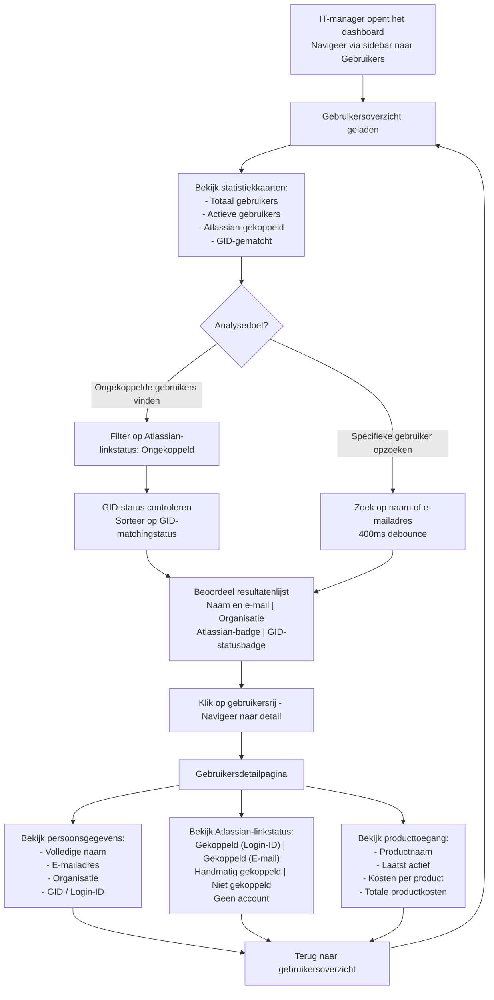
```mermaid
graph TD
    A["IT-manager opent het dashboard<br/>Navigeer via sidebar naar Gebruikers"] --> B["Gebruikersoverzicht geladen"]

    B --> C["Bekijk statistiekkaarten:<br/>- Totaal gebruikers<br/>- Actieve gebruikers<br/>- Atlassian-gekoppeld<br/>- GID-gematcht"]

    C --> D{"Analysedoel?"}

    D -->|Ongekoppelde gebruikers vinden| E["Filter op Atlassian-linkstatus: Ongekoppeld"]
    E --> F["GID-status controleren<br/>Sorteer op GID-matchingstatus"]
    F --> G["Beoordeel resultatenlijst<br/>Naam en e-mail | Organisatie<br/>Atlassian-badge | GID-statusbadge"]
    G --> H["Klik op gebruikersrij - Navigeer naar detail"]

    D -->|Specifieke gebruiker opzoeken| I["Zoek op naam of e-mailadres<br/>400ms debounce"]
    I --> G

    H --> J["Gebruikersdetailpagina"]

    J --> K["Bekijk persoonsgegevens:<br/>- Volledige naam<br/>- E-mailadres<br/>- Organisatie<br/>- GID / Login-ID"]

    J --> L["Bekijk Atlassian-linkstatus:<br/>Gekoppeld (Login-ID) | Gekoppeld (E-mail)<br/>Handmatig gekoppeld | Niet gekoppeld<br/>Geen account"]

    J --> M["Bekijk producttoegang:<br/>- Productnaam<br/>- Laatst actief<br/>- Kosten per product<br/>- Totale productkosten"]

    K --> N["Terug naar gebruikersoverzicht"]
    L --> N
    M --> N
    N --> B
```

_Figuur 6c -- Gebruikersreis: Gebruikersbeheer en GID-koppelingsanalyse_

De statistiekkaarten bovenaan geven een snel overzicht: hoeveel gebruikers er totaal zijn, hoeveel actief, hoeveel aan Atlassian gekoppeld, en hoeveel via GID gematcht. In de eerste versie had ik die statistieken niet. Na feedback van Viktor bleek dat beheerders als eerste willen weten "hoeveel procent is gekoppeld?", voordat ze in de details duiken. Dat was een goed leerpunt: bouw eerst de context, dan de details.

#### 7.3.4 Gebruikersreis: Data-importproces

De importwizard is een 5-stapsproces. Ik heb bewust gekozen voor een wizard in plaats van een simpel uploadformulier, omdat de data-import consequenties heeft: je overschrijft of voegt medewerkers toe aan het systeem. Een foutieve import kan betekenen dat honderden personen verkeerd gekoppeld worden aan organisaties.

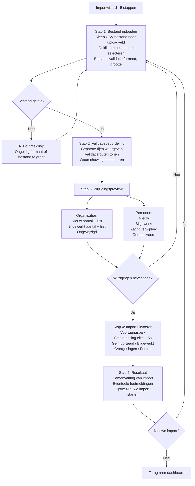
```mermaid
graph TD
    START[Importwizard - 5 stappen] --> A[Stap 1: Bestand uploaden<br/>Sleep CSV-bestand naar uploadveld<br/>Of klik om bestand te selecteren<br/>Bestandsvalidatie formaat, grootte]

    A --> B{Bestand geldig?}

    B -->|Nee| C[A. Foutmelding:<br/>Ongeldig formaat of bestand te groot]
    C --> A

    B -->|Ja| D[Stap 2: Validatiebeoordeling<br/>Geparste rijen weergeven<br/>Validatiefouten tonen<br/>Waarschuwingen markeren]

    D --> E[Stap 3: Wijzigingspreview]

    E --> F[Organisaties:<br/>Nieuw aantal + lijst<br/>Bijgewerkt aantal + lijst<br/>Ongewijzigd]

    E --> G[Personen:<br/>Nieuw<br/>Bijgewerkt<br/>Zacht verwijderd<br/>Gereactiveerd]

    F --> H{Wijzigingen bevestigen?}
    G --> H

    H -->|Nee| A

    H -->|Ja| I[Stap 4: Import uitvoeren<br/>Voortgangsbalk<br/>Status polling elke 1,5s<br/>Geimporteerd / Bijgewerkt<br/>Overgeslagen / Fouten]

    I --> J[Stap 5: Resultaat<br/>Samenvatting van import<br/>Eventuele foutmeldingen<br/>Optie: Nieuwe import starten]

    J --> K{Nieuwe import?}
    K -->|Ja| A
    K -->|Nee| L[Terug naar dashboard]
```

_Figuur 6d -- Gebruikersreis: Data-importproces_

Stap 3 (de wijzigingspreview) is het meest waardevolle onderdeel. Voordat er iets in de database verandert, ziet de beheerder precies hoeveel organisaties nieuw zijn, hoeveel bijgewerkt worden, en hoeveel personen soft-deleted of gereactiveerd worden. Dat geeft vertrouwen om op "bevestigen" te klikken. In de eerste versie miste die preview en was de feedback van de testgebruikers: "Ik durf niet te importeren want ik weet niet wat er gaat veranderen."

#### 7.3.5 Interactieoverzicht

Figuur 6e toont het volledige navigatiegedrag als state diagram (gebaseerd op Harel, 1987). Elke node is een pagina of subweergave en de transities zijn gebruikersacties.

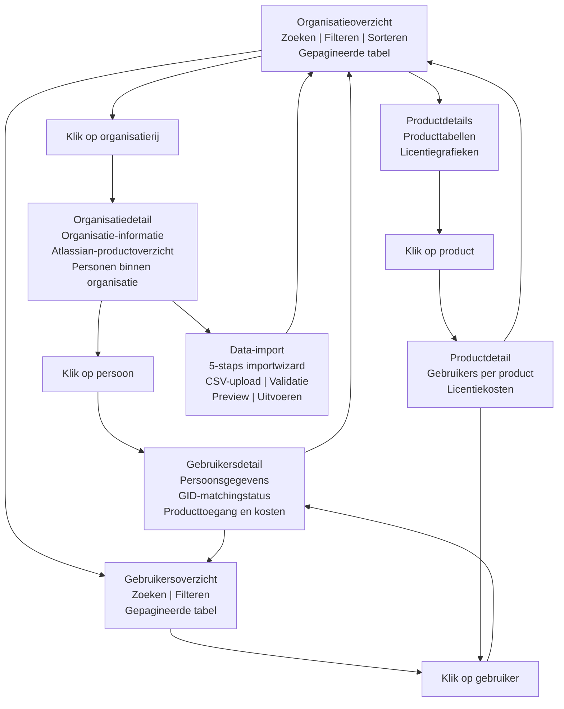
```mermaid
graph TD
    A["Organisatieoverzicht<br/>Zoeken | Filteren | Sorteren<br/>Gepagineerde tabel"] --> B["Klik op organisatierij"]
    B --> C["Organisatiedetail<br/>Organisatie-informatie<br/>Atlassian-productoverzicht<br/>Personen binnen organisatie"]
    C --> D["Klik op persoon"]
    D --> E["Gebruikersdetail<br/>Persoonsgegevens<br/>GID-matchingstatus<br/>Producttoegang en kosten"]

    F["Gebruikersoverzicht<br/>Zoeken | Filteren<br/>Gepagineerde tabel"] --> G["Klik op gebruiker"]
    G --> E

    H["Productdetails<br/>Producttabellen<br/>Licentiegrafieken"] --> I["Klik op product"]
    I --> J["Productdetail<br/>Gebruikers per product<br/>Licentiekosten"]
    J --> G

    K["Data-import<br/>5-staps importwizard<br/>CSV-upload | Validatie<br/>Preview | Uitvoeren"]

    A --> F
    A --> H
    C --> K
    E --> A
    E --> F
    J --> A
    K --> A
```

_Figuur 6e -- Navigatiestructuur (state diagram)_

De navigatiepatronen samengevat:

---

| Paginacomponent      | Toegangspunt(en)                          | Interacties op pagina                                         | Navigatie naar                              |
| -------------------- | ----------------------------------------- | ------------------------------------------------------------- | ------------------------------------------- |
| Inlogpagina          | Directe URL; uitlogactie                  | Microsoft SSO-knop                                            | Organisatieoverzicht (na succesvolle login) |
| Organisatieoverzicht | Sidebar; terugknop vanuit detail          | Zoeken (400ms debounce), filteren, sorteren, pagineren        | Organisatiedetail (klik op rij)             |
| Organisatiedetail    | Klik op organisatie in overzicht          | Productkaarten, personen zoeken/filteren (350ms debounce)     | Gebruikersdetail (klik op persoon)          |
| Gebruikersoverzicht  | Sidebar; terugknop vanuit detail          | Zoeken (400ms), filteren op status/Atlassian-link/GID         | Gebruikersdetail (klik op rij)              |
| Gebruikersdetail     | Klik vanuit overzicht/organisatie/product | Persoonsgegevens, linkstatus en producttoegang inzien         | Terug naar vorige pagina                    |
| Productdetails       | Sidebar                                   | Producttab wisselen, gebruikers zoeken (350ms)                | Gebruikersdetail (klik op gebruiker)        |
| Data-import          | Sidebar                                   | 5-staps wizard: upload, valideer, preview, uitvoer, resultaat | Blijft op pagina; sidebar voor navigatie    |

---

De navigatiestructuur volgt consequent het Hub and Spoke-model: de sidebar biedt directe toegang tot de vier hoofdsecties, detailpaginas zijn alleen bereikbaar via doorkliks. Het aantal keuzes per interactiemoment is bewust beperkt gehouden, wat aansluit bij Hick's wet (Hick, 1952). De breadcrumb in de topbar communiceert altijd waar je je bevindt in de hierarchie.

### 7.4 Activiteitendiagram: importproces

Tot slot het activiteitendiagram van het importproces. Dit laat de volledige flow zien, inclusief de database-transactie en de error handling bij een mislukte commit.

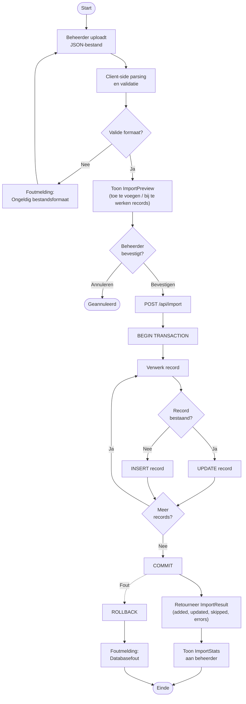
```mermaid
flowchart TD
    START([Start]) --> UPLOAD["Beheerder uploadt<br/>JSON-bestand"]
    UPLOAD --> PARSE["Client-side parsing<br/>en validatie"]
    PARSE --> VALID{Valide formaat?}
    VALID -- Nee --> ERR_FORMAT["Foutmelding:<br/>Ongeldig bestandsformaat"]
    ERR_FORMAT --> UPLOAD

    VALID -- Ja --> PREVIEW["Toon ImportPreview<br/>(toe te voegen / bij te werken records)"]
    PREVIEW --> CONFIRM{Beheerder<br/>bevestigt?}
    CONFIRM -- Annuleren --> CANCEL([Geannuleerd])

    CONFIRM -- Bevestigen --> POST["POST /api/import"]
    POST --> TX_BEGIN["BEGIN TRANSACTION"]
    TX_BEGIN --> LOOP["Verwerk record"]
    LOOP --> EXISTS{Record<br/>bestaand?}
    EXISTS -- Ja --> UPDATE["UPDATE record"]
    EXISTS -- Nee --> INSERT["INSERT record"]
    UPDATE --> MORE{Meer<br/>records?}
    INSERT --> MORE
    MORE -- Ja --> LOOP
    MORE -- Nee --> TX_COMMIT["COMMIT"]
    TX_COMMIT --> RESULT["Retourneer ImportResult<br/>(added, updated, skipped, errors)"]
    RESULT --> STATS["Toon ImportStats<br/>aan beheerder"]
    STATS --> END([Einde])

    TX_COMMIT -.->|"Fout"| TX_ROLLBACK["ROLLBACK"]
    TX_ROLLBACK --> ERR_DB["Foutmelding:<br/>Databasefout"]
    ERR_DB --> END
```

De hele import draait in een transactie. Als ergens halverwege iets misgaat, wordt alles teruggerold. Ik had aanvankelijk overwogen om per record een aparte transactie te doen (zodat een fout bij record 500 niet de voorgaande 499 verloren laat gaan), maar na overleg met de product owner bleek dat "alles of niets" de voorkeur had. Beheerders willen liever opnieuw importeren met een gecorrigeerd bestand dan dat ze een half-geimporteerde dataset moeten opschonen.

---

## 8. Beveiligingsontwerp

### 8.1 Authenticatie en autorisatie

Alle API-endpoints (behalve /health) zijn beveiligd met JWT-validatie via Azure AD (Entra ID). De backend controleert vier dingen: de JWT-handtekening via het JWKS-endpoint van Azure AD, de exp claim (is het token verlopen?), de iss claim (komt het van de juiste tenant?), en de aud claim (is het voor onze applicatie bedoeld?).

Autorisatie loopt via RBAC op basis van Azure AD-groepen. Toegang tot kostgegevens en exportfuncties vereist een specifieke AD-groep. Dat is conform NIST SP 800-162 (Ferraiolo et al., 2007). In de praktijk betekent dit dat een gewone viewer wel het dashboard kan bekijken, maar geen data kan exporteren of importeren.

Er zit een bewuste fallback in: als de Azure AD-omgevingsvariabelen niet geconfigureerd zijn, logt de backend een expliciete waarschuwing ("Authentication DISABLED") en draaien alle endpoints onbeveiligd. Dat is puur voor lokale ontwikkeling. Het is niet ideaal (je zou per ongeluk zonder auth kunnen deployen), maar de waarschuwing in de logs is vrij duidelijk.

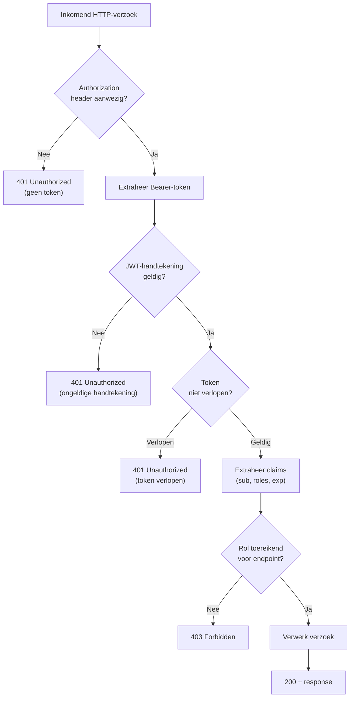
```mermaid
flowchart TD
    REQ["Inkomend HTTP-verzoek"] --> CHECK_AUTH{"Authorization<br/>header aanwezig?"}
    CHECK_AUTH -- Nee --> R401A["401 Unauthorized<br/>(geen token)"]
    CHECK_AUTH -- Ja --> EXTRACT["Extraheer Bearer-token"]
    EXTRACT --> VERIFY_SIG{"JWT-handtekening<br/>geldig?"}
    VERIFY_SIG -- Nee --> R401B["401 Unauthorized<br/>(ongeldige handtekening)"]
    VERIFY_SIG -- Ja --> VERIFY_EXP{"Token<br/>niet verlopen?"}
    VERIFY_EXP -- Verlopen --> R401C["401 Unauthorized<br/>(token verlopen)"]
    VERIFY_EXP -- Geldig --> EXTRACT_CLAIMS["Extraheer claims<br/>(sub, roles, exp)"]
    EXTRACT_CLAIMS --> CHECK_ROLE{"Rol toereikend<br/>voor endpoint?"}
    CHECK_ROLE -- Nee --> R403["403 Forbidden"]
    CHECK_ROLE -- Ja --> PROCEED["Verwerk verzoek"]
    PROCEED --> RESP["200 + response"]
```

_Figuur 7 -- Authenticatie- en autorisatiestroom_

### 8.2 Dataprotectie

HTTPS is verplicht in alle niet-lokale omgevingen. Azure AD-tokens gaan nooit over een onversleutelde verbinding. API-tokens voor Atlassian en GitHub worden opgeslagen als omgevingsvariabelen op de server, nooit in de database of in frontend-code.

MSAL slaat JWT-tokens op in het geheugen (niet in localStorage of sessionStorage). Dat is een bewuste keuze: als er een XSS-kwetsbaarheid in de frontend zou zitten, kan een aanvaller niet bij de tokens.

Alle databasequeries gebruiken geparametriseerde SQL via SQLx. Er is nergens dynamische string-concatenatie in queries. Dat is de meest basale bescherming tegen SQL-injectie, maar het is verbazingwekkend hoeveel projecten dit nog steeds fout doen.

### 8.3 Beveiligingslagen

---

| Laag                | Maatregel                                  | Implementatie                           |
| ------------------- | ------------------------------------------ | --------------------------------------- |
| **Transport**       | HTTPS / TLS 1.2+ verplicht                 | Nginx reverse proxy of Docker-niveau    |
| **Authenticatie**   | JWT (HS256/RS256) via Azure AD SSO         | Axum middleware: `tower_http::auth`     |
| **Autorisatie**     | Rolgebaseerde toegangscontrole (RBAC)      | Rollen: `admin`, `viewer` in JWT-claims |
| **Input-validatie** | Alle invoer gevalideerd voor verwerking    | Rust: `serde` + custom validators       |
| **Geheimbeheer**    | API-tokens en DB-wachtwoorden in env-vars  | Docker Compose `.env`; nooit in VCS     |
| **GDPR**            | E-mailadressen gemaskeerd in logberichten  | Custom `tracing` formatter              |
| **SQL-injectie**    | Uitsluitend parameterized queries via SQLx | Compile-time type-checking              |
| **CORS**            | Strikte origin-whitelist                   | `tower_http::cors::CorsLayer`           |

---

### 8.4 OWASP-compliance

De OWASP Top 10 (OWASP, 2021) is leidend geweest bij het beveiligingsontwerp. Ik loop de relevante categorieeen hieronder langs.

---

| OWASP Top 10 categorie         | Hoe afgedekt                                                                                           |
| ------------------------------ | ------------------------------------------------------------------------------------------------------ |
| Broken Access Control          | JWT-validatie middleware op alle endpoints; RBAC via Azure AD                                          |
| Injection                      | Geparametriseerde SQL (SQLx), geen dynamic query building                                              |
| Security Misconfiguration      | Expliciete waarschuwing bij uitgeschakelde auth; geen debug-info in responses                          |
| Identification & Auth Failures | Korte token-levensduur (Azure AD default: 1 uur), automatische vernieuwing via MSAL                    |
| Security Logging               | TraceLayer logt alle requests met status; fouten worden gelogd maar nooit teruggestuurd naar de client |

---

Een uitdaging hierbij was de balans vinden tussen beveiliging en ontwikkelsnelheid. De JWT-validatie middleware moest ook CORS-preflight requests doorlaten (die hebben geen Authorization header), wat in Axum niet standaard goed werkt. Dat kostte me een halve dag debuggen.

---

## 9. Deploymentontwerp

### 9.1 Containerarchitectuur

Het hele systeem draait in Docker Compose. Drie containers: frontend (Vite dev server op port 5173), backend (Rust binary op port 8080), en de database (PostgreSQL 16 op port 5432). Ze zitten allemaal op hetzelfde Docker-netwerk (equans-net) zodat ze elkaar bij naam kunnen aanspreken.

De frontend-container proxyt /api/\* verzoeken naar de backend-container. De backend praat via TCP met PostgreSQL. Een Docker-volume (postgres_data) zorgt ervoor dat de database-data persistent is, ook als je de containers herstart.

```mermaid
graph TB
    subgraph host["Host Machine (Linux/Windows)"]
        subgraph dc["docker-compose netwerk: equans-net"]
            subgraph fe_c["Container: frontend"]
                FE["Node.js<br/>Vite dev server<br/>:5173"]
            end
            subgraph be_c["Container: backend"]
                BE["Rust Binary<br/>Axum server<br/>:8080"]
            end
            subgraph db_c["Container: db"]
                DB[("PostgreSQL 16<br/>:5432")]
                VOL["Volume:<br/>postgres_data"]
            end
        end
        BROWSER["Browser"] -->|"HTTP :5173"| FE
        FE -->|"proxy /api/*  :8080"| BE
        BE -->|"TCP :5432"| DB
        DB --- VOL
    end
```

Tijdens het opzetten van Docker Compose liep ik tegen een vervelend probleem aan: de backend-container startte voordat PostgreSQL klaar was met opstarten. Axum probeerde dan meteen een database-connectie te maken en crashte. Ik heb dat opgelost met een health-check op de PostgreSQL-container en een depends_on met condition: service_healthy. Klinkt simpel, maar het kostte me een middag om erachter te komen waarom de backend random crashte bij docker-compose up.

### 9.2 Deploymentdiagram

De CI/CD-pipeline is redelijk standaard. Een git push naar main triggert GitHub Actions: de frontend wordt gebuild met npm run build, de backend met cargo build --release, tests draaien (cargo test en npm run lint), daarna worden Docker images gebouwd en gepusht naar een container registry. In de productieomgeving haalt docker-compose de nieuwe images op.

```mermaid
flowchart LR
    subgraph CI["CI/CD Pipeline (GitHub Actions)"]
        direction TB
        GIT["git push<br/>main branch"]
        BUILD_FE["npm run build<br/>(Vite)"]
        BUILD_BE["cargo build --release<br/>(Rust)"]
        TEST["cargo test<br/>npm run lint"]
        DOCKER_BUILD["docker build<br/>(frontend + backend images)"]
        PUSH["docker push<br/>(Container Registry)"]
    end

    subgraph PROD["Productieomgeving"]
        direction TB
        COMPOSE["docker-compose up -d"]
        FE_PROD["Frontend Container<br/>:5173 / :80"]
        BE_PROD["Backend Container<br/>:8080"]
        DB_PROD[("PostgreSQL<br/>:5432")]
    end

    GIT --> BUILD_FE
    GIT --> BUILD_BE
    BUILD_FE --> TEST
    BUILD_BE --> TEST
    TEST --> DOCKER_BUILD
    DOCKER_BUILD --> PUSH
    PUSH --> COMPOSE
    COMPOSE --> FE_PROD
    COMPOSE --> BE_PROD
    COMPOSE --> DB_PROD
    FE_PROD -->|"/api/*"| BE_PROD
    BE_PROD -->|"SQL"| DB_PROD
```

Hierbij was een uitdaging dat cargo build --release voor Rust vrij lang duurt (op de GitHub Actions runner zo'n 10 minuten). Ik heb caching ingesteld voor de Rust target-directory en de Cargo registry, wat het terugbracht naar rond de 3 minuten voor incrementele builds. Dat scheelt enorm als je meerdere keren per dag pusht.

---

## 10. Testontwerp

### 10.1 Teststrategie

De teststrategie volgt de testpyramide (Cohn, 2009). Onderaan een brede laag unit-tests, in het midden integratietests op API-niveau, en bovenaan een dunne laag handmatige acceptatietests. Ik ben eerlijk: de unit-testdekking is nog niet waar die zou moeten zijn. De services en repositories hebben nog te weinig tests. De integratietests dekken het happy path, maar edge cases zijn onvoldoende getest. Dat is bewuste technische schuld vanwege de tijdsdruk van het afstudeerproject.

```mermaid
graph BT
    subgraph pyramid["Testpyramide"]
        UNIT["Unit Tests<br/>(Rust: cargo test<br/>React: component tests)<br/> snel, geïsoleerd, veel"]
        INTEGRATION["Integratietests<br/>(API-endpoint tests<br/>DB-roundtrips via SQLx)<br/> middel"]
        ACCEPTANCE["Acceptatietests<br/>(handmatig: T-010-01 t/m T-010-06)<br/> langzaam, weinig"]
    end
    UNIT --> INTEGRATION --> ACCEPTANCE
    style UNIT fill:#86efac,stroke:#22c55e
    style INTEGRATION fill:#fde68a,stroke:#f59e0b
    style ACCEPTANCE fill:#fca5a5,stroke:#ef4444
```

### 10.2 Acceptatiescenarios

Hieronder de handmatige tests die ik voor het dashboard heb opgesteld. Test T-010-01 vond ik persoonlijk het nuttigst: wat gebeurt er als de backend niet draait? Tijdens de demo liep ik precies tegen dat scenario aan (de Docker-container was gecrasht) en dankzij die test wist ik dat er een rode statusbadge moest verschijnen.

---

| Test-ID  | Scenario                 | Teststap                            | Verwacht resultaat                                   |
| -------- | ------------------------ | ----------------------------------- | ---------------------------------------------------- |
| T-010-01 | Dashboard zonder backend | Open dashboard; backend offline     | BackendStatus: rood; "Backend niet beschikbaar"      |
| T-010-02 | Dashboard met backend    | Open dashboard; backend online      | Drie ProductCards geladen (Jira, Confluence, Trello) |
| T-010-03 | Organisatieselectie      | Wijzig organisatie in dropdown      | Gebruikersaantallen herladen per product             |
| T-010-04 | Prijswijziging           | Pas productPricing.ts aan + rebuild | Dashboard toont bijgewerkte berekeningen             |
| T-010-05 | Totaalrij validatie      | Controleer totaalrij                | Som van drie producten klopt met ProductCards        |
| T-010-06 | Valutaformaat            | Inspecteer bedragen op scherm       | Bedragen getoond als EUR 8,50 (nl-NL locale)         |

---

### 10.3 Stateovergangen bij fouten

Het systeem kent meerdere fouttoestanden. Het onderstaande state diagram laat zien hoe het systeem reageert op verschillende soorten fouten en hoe het probeert te herstellen.

```mermaid
stateDiagram-v2
    [*] --> Normaal : systeem actief

    Normaal --> BackendOnbereikbaar : health-check faalt
    BackendOnbereikbaar --> Normaal : verbinding hersteld
    BackendOnbereikbaar --> BackendOnbereikbaar : retry (max 3x)

    Normaal --> ProductFout : product API faalt
    ProductFout --> Normaal : herladen succesvol
    ProductFout --> ProductFout : fallback (0-waarden + melding)

    Normaal --> ImportFout : import mislukt
    ImportFout --> Normaal : import opnieuw gestart
    ImportFout --> ImportFout : foutdetails zichtbaar

    BackendOnbereikbaar --> MaxRetriesBehaald : retries mislukt
    MaxRetriesBehaald --> [*] : permanente foutstatus
```

Een ding dat ik geleerd heb: de "deels fout" toestand (een product-fetch faalt maar de rest werkt) is lastiger dan "helemaal fout". Bij een volledige outage weet je dat de backend down is. Bij een gedeeltelijke fout krijg je 0-waarden voor een product terwijl de rest klopt, en dat kan verwarrend zijn voor een beheerder die niet weet dat Confluence even niet bereikbaar was. Vandaar de waarschuwingsbadge die dan verschijnt.

---

## 11. Ontwerpverantwoording en alternatievenanalyse

### 11.1 Kritische reflectie

Als ik terugkijk op het ontwerp zijn er een paar punten waar ik niet helemaal tevreden mee ben.

De cache-strategie werkt goed, maar biedt geen manier voor gebruikers om handmatig een verversing te triggeren. Als een beheerder weet dat er net nieuwe medewerkers zijn toegevoegd in Atlassian, moet die wachten tot de volgende sync-cyclus. Een "Refresh"-knop in de UI was handig geweest, maar kwam er niet meer van binnen de beschikbare tijd. Dat zou in een volgende iteratie prioriteit moeten krijgen.

De GID-matching is deterministisch en regelgebaseerd (e-mail, displaynaam). Dat werkt redelijk goed (rond de 85% hit rate op basis van e-mailmatching), maar een probabilistisch model zoals Fellegi-Sunter zou nauwkeuriger zijn. Het probleem is dat je daar gelabelde trainingsdata voor nodig hebt (handmatig geverifieerde koppelingen) en die heb ik niet.

De testdekking is een pijnpunt. Integratietests op API-niveau zijn er, maar unit-tests voor de services en repositories grotendeels niet. Dat is bewuste technische schuld: de deadline van het afstudeerproject stond vast en ik moest kiezen tussen meer tests of meer functionaliteit.

### 11.2 Trade-offs

**De eerste trade-off gaat over beschikbaarheid versus dataconsistentie.** Het systeem serveert altijd gecachte data, ook als die verlopen is. In termen van het CAP-theorema (Brewer, 2000) kies ik daarmee voor beschikbaarheid boven consistentie. Gebruikers zien mogelijk data die een paar uur oud is. Na overleg met de product owner bleek dat dit voor een licentiedashboard (dat voornamelijk voor maandrapportages wordt gebruikt) volkomen acceptabel is. Voor een transactioneel systeem had je deze keuze niet kunnen maken.

**De tweede trade-off gaat over ontwikkelsnelheid versus type-veiligheid.** Rust heeft een steilere leercurve dan Python of Node.js. De eerste twee weken besteedde ik vooral aan het worstelen met de borrow checker; code die ik in TypeScript in een uurtje had geschreven, kostte in Rust soms een hele dag. Maar naarmate het project vorderde, merkte ik dat de compiler steeds meer fouten opving die ik anders pas in productie had gevonden. Null-dereferences, data races, verkeerde types: allemaal compile-time errors in Rust (Klabnik & Nichols, 2023). Voor een systeem dat meerdere jaren mee moet gaan, weegt die onderhoudbaarheid zwaarder dan een snellere start.

### 11.3 Technische schuld

---

| Schuld                                                                | Waarom geaccepteerd                                                                                                 | Aanpakplan                                                  |
| --------------------------------------------------------------------- | ------------------------------------------------------------------------------------------------------------------- | ----------------------------------------------------------- |
| `xlsx` npm-dependency (GHSA-4r6h-8v6p-xvw6, GHSA-5pgg-2g8v-p4x9)      | XLSX-preview is een helper voor gebruiker-geiinitieerde import; kwetsbaarheid vereist specifiek gecraftde bestanden | Vervangen door exceljs in volgende sprint                   |
| `rsa` 0.9.10 Marvin Attack (RUSTSEC-2023-0071, medium) via sqlx-mysql | Geen directe RSA-key-operaties in de applicatie; transitieve afhankelijkheid                                        | Opvolgen bij volgende sqlx-release                          |
| Beperkte unit-testdekking services/repositories                       | Tijdsdruk afstudeerproject; integratietests dekken happy path                                                       | Unit-tests met mock-repositories na eerste productierelease |

---

Die xlsx-kwetsbaarheid is het meest concrete risico. Het vereist dat een gebruiker een speciaal geprepareerd XLSX-bestand uploadt, en de upload-functie is alleen toegankelijk voor geauthenticeerde beheerders, dus het aanvalsoppervlak is beperkt. Maar het blijft een bekende kwetsbaarheid en het vervangen door exceljs staat hoog op de backlog.

### 11.4 Toekomstige uitbreidingen

De architectuur is bewust zo opgezet dat uitbreidingen makkelijk zijn. Een paar concrete voorbeelden.

JFrog Artifactory en Trello integraties passen in de module-per-domein structuur (backend/src/atlassian/, backend/src/github/). Een nieuwe map jfrog/ of trello/ met z'n eigen service, handler en queries kan worden toegevoegd zonder bestaande code aan te raken. De AppState-struct in routes/mod.rs krijgt er gewoon een nieuwe service-Arc bij.

Kosten en chargeback rapporten zijn al half voorbereid: de organizations-tabel heeft cost_center en budget velden. Wat nog ontbreekt is de query-logica om die gegevens te aggregeren en een rapportage-view in de frontend.

Multi-vendor dashboard uitbreidingen passen in het bestaande frontend-patroon (per-page + centrale backendClient). Een nieuwe pagina voor JFrog of Trello vereist geen refactoring van bestaande componenten.

Excel-export zou op termijn server-side moeten draaien (via exceljs), waarmee de afhankelijkheid van de kwetsbare client-side xlsx-parser verdwijnt.

---

## 12. Conclusie en aanbevelingen

### 12.1 Conclusie

Terugkijkend beschrijft dit Software Design Document een technisch ontwerp dat doet wat het moet doen. De drielagenarchitectuur met React/TypeScript, Rust/Axum en PostgreSQL biedt een goede scheiding van verantwoordelijkheden. Het licentiekostendashboard (M-14) lost het probleem op waarvoor het gebouwd is: een gecentraliseerd, geautomatiseerd overzicht van Atlassian-licentiekosten met inkoopkosten, factureerbare bedragen en consultancymarges per product en organisatie.

De keuze voor client-side kostenberekening op basis van productPricing.ts geeft beheerders directe controle over tariefwijzigingen. Dat was een pragmatische keuze: server-side berekening met database-opslag is schoner vanuit architectuurperspectief, maar voor een team van twee ontwikkelaars is een enkel configuratiebestand makkelijker te onderhouden.

Het project is niet perfect. De testdekking laat te wensen over, de GID-matching kan nauwkeuriger, en de cache-strategie mist een handmatige refresh-optie. Maar het systeem werkt, het is veilig, en het is uitbreidbaar. Voor een afstudeerproject bij Equans is dat, denk ik, een goed resultaat.

### 12.2 Aanbevelingen

Op basis van wat ik geleerd heb tijdens het ontwerp en de implementatie, raad ik het volgende aan als vervolgstappen.

Ten eerste een beheerinterface voor productprijzen. Op dit moment moeten tarieven handmatig in een configuratiebestand worden aangepast. Een admin-UI die tarieven in de database opslaat, maakt het systeem toegankelijker voor niet-technische beheerders.

Ten tweede WebSocket-integratie voor real-time updates. De huidige polling-architectuur (elke 30 seconden) werkt, maar is niet efficient. Een WebSocket-verbinding voor live licentie-updates zou zowel de latentie als de serverbelasting verlagen.

Ten derde de GitHub- en JFrog-integratie. De architectuur is er klaar voor. Die modules toevoegen vereist geen architecturele herziening, alleen nieuwe code in de bestaande structuur.

Ten vierde geautomatiseerde end-to-end tests. De acceptatiescenarios zijn nu handmatig. Playwright of Cypress zou de regressietestdekking flink verbeteren en de deploy-cyclus betrouwbaarder maken.

Tot slot monitoring en observability. Een structurele logging-pipeline (bijvoorbeeld via OpenTelemetry met Grafana) en uptime-monitoring zouden de operationele betrouwbaarheid in productie vergroten. Op dit moment vertrouw ik op Docker logs en handmatige health-checks, wat voor een productiescenario niet voldoende is.

---

## 13. Referenties

[1] About cloud admin REST APIs. (z.d.). https://developer.atlassian.com/cloud/admin/rest-apis/

[2] Announcing axum 0.7.0 | Tokio - An asynchronous Rust runtime. (2023, 27 november). https://tokio.rs/blog/2023-11-27-announcing-axum-0-7-0

[3] Bass, L., Clements, P., & Kazman, R. (2021). Software Architecture in practice. SEI Series in Software Engineering.

[4] Brewer, E. A. (2000). Towards robust distributed systems (abstract). Proceedings Of The Nineteenth Annual ACM Symposium On Principles Of Distributed Computing, 7. https://doi.org/10.1145/343477.343502

[5] Chen, P. P. (1976). The entity-relationship model -- toward a unified view of data. ACM Transactions On Database Systems, 1(1), 9-36. https://doi.org/10.1145/320434.320440

[6] Christen, P. (2014). Data matching: Concepts and Techniques for Record Linkage, Entity Resolution, and Duplicate Detection. Springer.

[7] Cilwerner. (z.d.). Overview of the Microsoft Authentication Library (MSAL) - Microsoft identity platform. Microsoft Learn. https://learn.microsoft.com/en-us/entra/identity-platform/msal-overview

[8] Ferraiolo, D., Kuhn, D. R., & Chandramouli, R. (2007). Role-based access control. Artech House Publishers.

[9] Ford, M. R. N. (2020, 29 januari). Fundamentals of Software Architecture. O'Reilly Online Learning. https://learning.oreilly.com/library/view/fundamentals-of-software/9781492043447/

[10] Fowler, M. (z.d.). bliki: CQRS. martinfowler.com. https://martinfowler.com/bliki/CQRS.html

[11] Fowler, M. (2018, 27 november). Refactoring: Improving the Design of Existing Code. O'Reilly Online Learning. https://www.oreilly.com/library/view/refactoring-improving-the/9780134757681/

[12] GitHub REST API documentation - GitHub Enterprise Cloud Docs. (z.d.). GitHub Docs. https://docs.github.com/en/enterprise-cloud@latest/rest

[13] Home. (z.d.). C4 Model. https://c4model.com/

[14] Justinha. (z.d.). Microsoft Entra ID documentation - Microsoft Entra ID. Microsoft Learn. https://learn.microsoft.com/en-us/entra/identity/

[15] Klabnik, S., & Nichols, C. (2023). The Rust Programming Language, 2nd Edition. No Starch Press.

[16] Martin, R. (2025). Clean code: A Handbook of Agile Software Craftsmanship. Addison-Wesley Professional.

[17] Martin, R. C. (2017, 10 september). Clean Architecture: A Craftsman's Guide to Software Structure and Design. O'Reilly Online Learning. https://www.oreilly.com/library/view/clean-architecture-a/9780134494272/

[18] Momjian, B. (2001). PostgreSQL Introduction and Concepts. ADDISON-WESLEY. https://www.foo.be/docs-free/aw_pgsql_book.pdf

[19] Nygard, M. T. (2007, 30 maart). Release it! O'Reilly Online Learning. https://learning.oreilly.com/library/view/release-it/9781680500264/

[20] PostgreSQL 16.13 documentation. (2026, 26 februari). PostgreSQL Documentation. https://www.postgresql.org/docs/16/index.html

[21] React. (z.d.). https://react.dev/

[22] Sadalage, P. J., & Fowler, M. (2013). NoSQL distilled. Pearson Education, Inc. https://ptgmedia.pearsoncmg.com/images/9780321826626/samplepages/0321826620.pdf

[23] State of JavaScript 2024. (z.d.). https://2024.stateofjs.com/

[24] Tailwind CSS - Rapidly build modern websites without ever leaving your HTML. (z.d.). Tailwind CSS. https://tailwindcss.com/

[25] The Rust programming language - The Rust programming language. (z.d.). https://doc.rust-lang.org/book/title-page.html

[26] Tokio-Rs. (z.d.). GitHub - tokio-rs/axum: HTTP routing and request-handling library for Rust that focuses on ergonomics and modularity. GitHub. https://github.com/tokio-rs/axum

[27] Vite. (z.d.). Vitejs. https://vite.dev/

---
