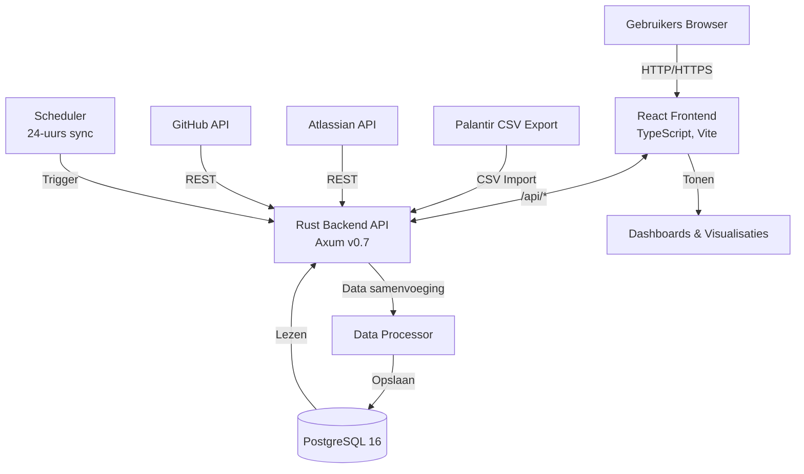
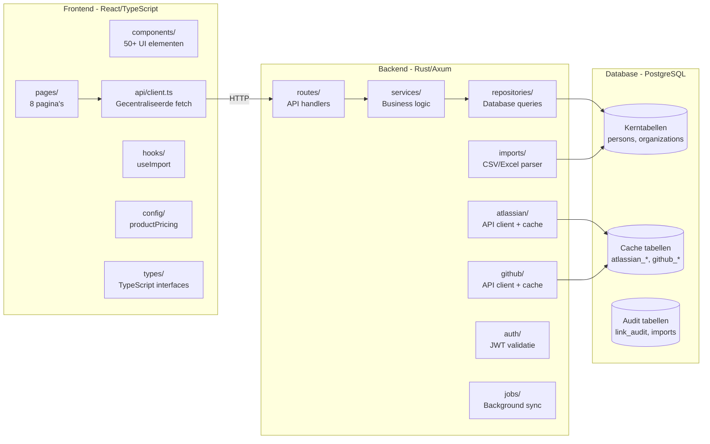
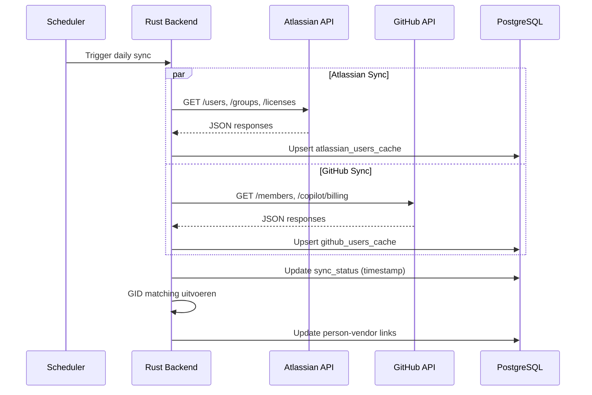
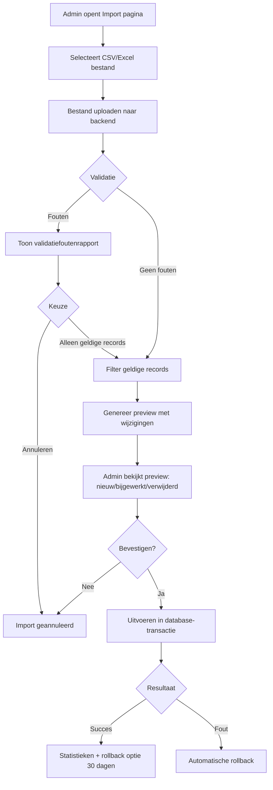
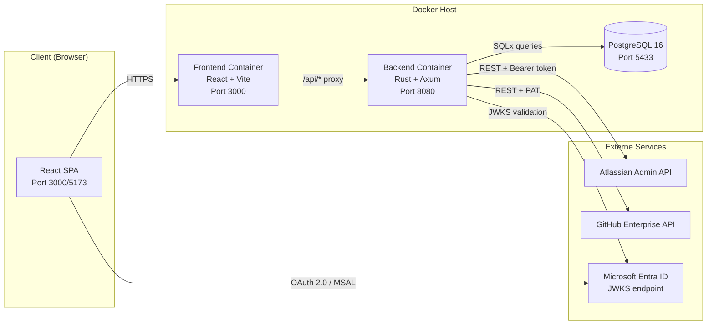
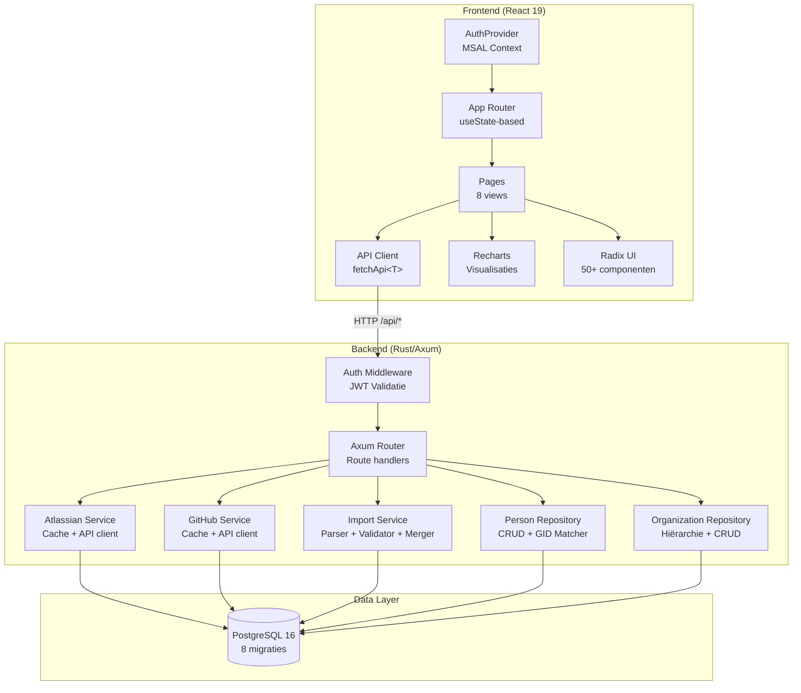
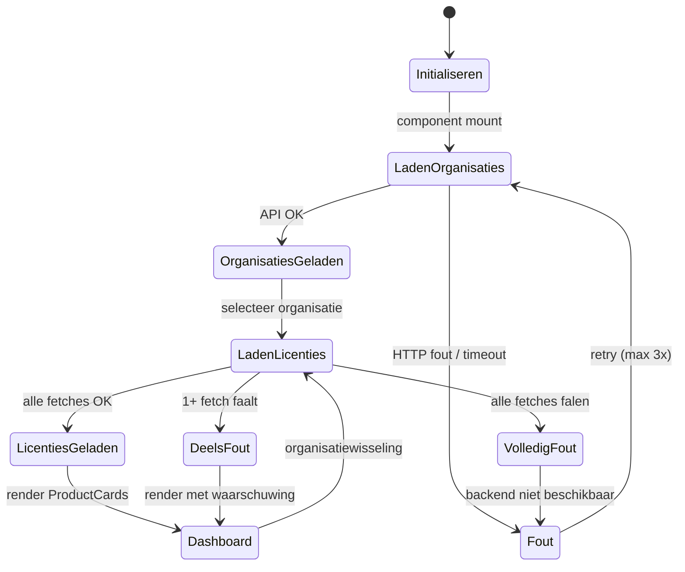
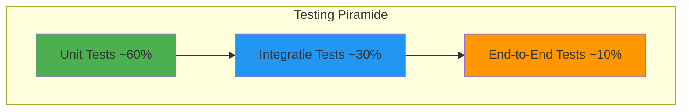

# Afstudeerpresentatie: Equans Operational Insights

### Ahmad Alhaj Asaad | CMI-Informatica | Hogeschool Rotterdam

### Afstudeerbedrijf: Equans - DevOps Forge

---

# Dia 0 — Introductie

**Inhoud dia:**

- Naam: Ahmad Alhaj Asaad

- Opleiding: CMI-Informatica, Hogeschool Rotterdam

- Afstudeerbedrijf: Equans, afdeling DevOps Forge

- Begeleiders: Viktor Klein (Product Owner), Brian Veltman (Technisch begeleider)

- Duur project: 20 weken, 8 sprints, solo-ontwikkelaar

**Uitleg bij presentatie (~1.5 min):**

> Goedemorgen/goedemiddag. Mijn naam is Ahmad Alhaj Asaad, student CMI-Informatica aan de Hogeschool Rotterdam. De afgelopen 20 weken heb ik afgestudeerd bij Equans, een grote technische dienstverlener met duizenden medewerkers. Ik zat bij de afdeling DevOps Forge, het team dat de softwareplatformen beheert — denk aan Jira, Confluence, GitHub Enterprise. Mijn begeleiders waren Viktor Klein als Product Owner en Brian Veltman als technisch begeleider. Ik was de enige ontwikkelaar op dit project, wat zowel een voordeel als een uitdaging bleek.

---

# Dia 1 — Motivatie van de opdracht

**Inhoud dia:**

- Equans beheert duizenden softwarelicenties over meerdere vendors

- Geen centraal overzicht van licentiegebruik en kosten

- Handmatig doorberekenen van kosten aan teams (spreadsheets)

- Inactieve licenties worden niet systematisch opgespoord

- Atlassian werkt met **Maximum Quantity Billing**: je betaalt voor de piek

**Uitleg bij presentatie (~1.5 min):**

> Waarom dit project? Bij Equans werken duizenden mensen dagelijks met tools als Jira, Confluence en GitHub Enterprise. Het probleem was: niemand wist precies hoeveel licenties er draaiden, wat dat kostte, en hoeveel accounts ongebruikt waren. Alles zat verspreid over losse admin-portals. Wil je kosten doorberekenen aan een team? Dan zit je handmatig spreadsheets aan elkaar te knopen. Daar komt bij dat Atlassian werkt met Maximum Quantity Billing — je betaalt voor het hoogste aantal licenties in een factureringsperiode. Zelfs als je eind van de maand opruimt, betaal je toch voor de piek. Dat maakt continu monitoren noodzakelijk.

---

# Dia 2 — Opdrachtbeschrijving

**Inhoud dia:**

- **Hoofdvraag:** _"Hoe kan Equans inzicht krijgen in het gebruik van Atlassian Cloud Enterprise licenties en de bijbehorende kosten, om besparingsmogelijkheden te identificeren?"_

- **Deelvragen:**
  1. Welke datastructuren bieden de Atlassian en GitHub API's?

  2. Hoe kan actief licentiegebruik gemeten worden?

  3. Hoe kan een kostenanalyse per product/team worden uitgevoerd?

  4. Welke patronen van inefficiënt gebruik zijn herkenbaar?

  5. Hoe presenteer je die informatie effectief in een dashboard?

- **Doel:** Een centraal dashboard dat licentiedata automatisch ophaalt en bruikbaar maakt

**Uitleg bij presentatie (~1.5 min):**

> De hoofdvraag van het project was: hoe kan Equans inzicht krijgen in licentiegebruik en kosten, om besparingsmogelijkheden te vinden? Ik heb dat opgesplitst in vijf deelvragen. Eerst moest ik begrijpen wat de API's van Atlassian en GitHub überhaupt aan data leveren. Vervolgens hoe je actief gebruik kunt meten, want dat bleek niet zo simpel als het klinkt. Dan de kostenanalyse per product en per team. Daarna patronen van inefficiënt gebruik identificeren. En tot slot: hoe presenteer je dat zo dat een beheerder er ook daadwerkelijk iets mee kan? Het einddoel was een werkend dashboard dat dit allemaal automatisch doet.

---

# Dia 3 — Analyse: Huidige situatie

**Inhoud dia:**

- **Centraal probleem:** Geen gecentraliseerd inzicht in licentiegebruik en kosten

- **Uitgangspunten:**
  - Data zit verspreid over Atlassian, GitHub Enterprise, JFrog portals

  - Organisatiegegevens komen uit Palantir Foundry (CSV)

  - Geen bestaand systeem dat dit combineert

**Uitleg bij presentatie (~1.5 min):**

> Laten we kijken naar de huidige situatie. Het centrale probleem was simpel: Equans had geen gecentraliseerd overzicht. Data zat verspreid over meerdere admin-portals. Organisatiegegevens — wie zit in welke afdeling, wie is de manager — dat kwam helemaal niet uit de vendor-API's maar uit Palantir Foundry, via CSV-exports. Er bestond geen enkel systeem dat dit combineerde. Daarom heb ik besloten om zelf een oplossing te bouwen die precies past bij hun situatie.

---

# Dia 4 — Analyse: Functionele beschrijving

**Inhoud dia:**

- **Niet alle gewenste data is direct beschikbaar — drie kernbeperkingen:**
  1. **Geen historische trenddata** — De API's geven alleen de huidige stand van zaken. Voor trends over tijd moeten we zelf data opslaan in onze database.

  2. **Geen kant-en-klare koppeling met cost centers of teams** — Die informatie komt uit Palantir, maar moet handmatig worden gemapped aan gebruikers en licenties.

  3. **Beperkte activity-data** — Sommige API's geven alleen basisinformatie. Wat een gebruiker écht doet in een tool is vaak niet zichtbaar.

- **Aanvullend:** Atlassian API biedt geen billing-data; kostenberekening moest volledig zelf gebouwd worden.

- **Potentiële gebruikers:**

  | Gebruiker | Behoefte |

  |-----------|----------|

  | Team Managers | Softwarekosten per team |

  | Licentiebeheerders | Inactieve gebruikers identificeren |

  | Finance | Chargeback per organisatie |

  | IT Directie (Henk Soppe) | KPI's, strategische beslissingen |

  | DevOps Forge | Operationeel platformbeheer |

- **Stakeholder-interviews:** Viktor Klein, Brian Veltman, Henk Soppe

**Uitleg bij presentatie (~1.5 min):**

> Vervolgens de functionele analyse. Ik begon met interviews met drie stakeholders. Viktor wilde stuurinformatie, Henk wilde kostenoverzichten, en Brian wilde weten of het technisch schaalbaar was. Maar niet alle gewenste data is direct beschikbaar — en dat was een van de belangrijkste ontdekkingen in de analysefase. Concreet zijn er drie beperkingen. Ten eerste: de API’s geven alleen de huidige stand van zaken. Er is geen historische trenddata. Als je trends wilt zien, moet je zelf dagelijks snapshots opslaan — en dat doen we dus. Ten tweede: er is geen kant-en-klare koppeling met cost centers of teams. Die data komt uit Palantir Foundry, maar moet handmatig worden gemapped aan gebruikers en licenties. Ten derde: de activity-data is beperkt. Sommige API’s geven alleen basisinformatie — wat een gebruiker écht doet in een tool is vaak niet zichtbaar. Daar bovenop: de Atlassian API levert geen billing-data, dus de kostenberekening moest ik volledig zelf bouwen op basis van seat-aantallen en tarieven. De doelgroep is breed: van team managers die willen weten wat hun software kost, tot finance die chargeback wil doen, tot de directie die KPI’s wil zien.

---

# Dia 5 — Functionele Requirements (SRS MoSCoW)

**Inhoud dia:**

**Must Have (M) — 19 eisen (MVP-kritisch)**

| SRS-ID | Omschrijving |

| ------ | ---------------------------------------------------------------------------------------- |

| M-01 | Geconsolideerd overzichtsdashboard met geaggregeerde statistieken over alle leveranciers |

| M-02 | Gedetailleerde Atlassian-gebruiks- en licentiegegevens |

| M-03 | GitHub-gebruiksgegevens: seat-toewijzing en Copilot-gebruik |

| M-04 | Automatisch verzamelen gebruikers-/licentiegegevens via Atlassian Admin API |

| M-05 | Automatisch verzamelen seat-/gebruiksgegevens via GitHub Enterprise API |

| M-06 | Alle verzamelde gegevens opgeslagen in PostgreSQL |

| M-07 | Overzicht Atlassian-gebruikers met filteren op status en producttoegang |

| M-08 | Authenticatie uitsluitend via Equans SSO (Microsoft Entra ID) |

| M-09 | Alle API-endpoints vereisen JWT-authenticatie |

| M-10 | Overzicht van alle personen inclusief vendor-identifiers |

| M-11 | Overzicht van alle organisaties inclusief gekoppelde personen |

| M-12 | Importeren van persoons-/organisatiegegevens via CSV en Excel (.xlsx) |

| M-13 | Personen koppelen aan Atlassian-accounts (`local_id` + e-mail) |

| M-14 | Dashboard toont licentiekosten per Atlassian-product |

| M-15 | GitHub vendor-overzichtspagina met productkaarten (Copilot, GHAS, License) |

| M-16 | Per GitHub-product: actieve gebruikers, prijs, marge en totale kosten |

| M-17 | Personen koppelen aan GitHub-accounts (`_equans`-suffix matching) |

| M-18 | Atlassian-data cachen met TTL van 25 uur + fallback bij API-uitval |

| M-19 | GitHub Enterprise-data cachen (users, licenses, copilot) |

**Uitleg bij presentatie (~2 min):**

> In het SRS-document heb ik alle requirements genummerd volgens het MoSCoW-model. Dit zijn de 19 Must Have eisen — zonder deze is het systeem niet compleet genoeg om op te leveren. Elke eis heeft een SRS-ID en verwijst naar het onderliggende functionele requirements-document. M-01 tot M-03 gaan over het dashboard zelf. M-04 tot M-06 over de dataverzameling. M-07 en M-08/M-09 over gebruikersbeheer en authenticatie. M-10 en M-11 over persoons- en organisatiebeheer. M-12 is de import-module. M-13 en M-17 gaan over het koppelen van vendor-accounts aan personen — Atlassian via local_id en e-mail, GitHub via de username met \_equans-suffix. M-14 tot M-16 zijn de kostendashboards. En M-18/M-19 de caching. Al deze 19 eisen zijn geïmplementeerd.

---

# Dia 6 — Formulering & Prioritering Requirements

**Inhoud dia:**

- **Functionele MoSCoW Prioritering:**

| Prioriteit | ID-reeks | Aantal | Voorbeelden |

| --------------- | ------------- | ------ | -------------------------------------------------------------------------------------- |

| **Must Have** | M-01 t/m M-19 | 19 | Dashboard (M-01), API-integratie (M-04/M-05), authenticatie (M-08/M-09), import (M-12) |

| **Should Have** | S-01 t/m S-16 | 16 | Dagelijkse sync (S-01), zoeken (S-05), preview (S-08), GitHub filters (S-16) |

| **Could Have** | C-01 t/m C-08 | 8 | Kostenwaarschuwingen (C-01), Power BI (C-03), JFrog (C-04) |

| **Won't Have** | W-01 t/m W-07 | 7 | Read-only architectuur (W-01), SCIM (W-05), 2FA (W-04) |

- **Technische MoSCoW Prioritering:**

| Prioriteit | ID-reeks | Aantal | Voorbeelden |

| --------------- | --------------- | ------ | ----------------------------------------------------------------------------- |

| **Must Have** | TM-01 t/m TM-12 | 12 | HTTPS (TM-01), JWT (TM-03), Rust + `Result<T,E>` (TM-05), P95 < 200ms (TM-08) |

| **Should Have** | TS-01 t/m TS-08 | 8 | Rate limiting (TS-01), indexering (TS-02), unit tests (TS-03) |

| **Could Have** | TC-01 t/m TC-03 | 3 | Observability (TC-01), k6 belasting (TC-02) |

| **Won't Have** | TW-01 t/m TW-03 | 3 | SIEM (TW-01), self-healing (TW-02), multi-regio (TW-03) |

**Uitleg bij presentatie (~2 min):**

> In het SRS heb ik twee gescheiden MoSCoW-tabellen: functioneel en technisch. Functioneel: 19 Must Haves voor het MVP, 16 Should Haves zoals dagelijkse sync en zoekfunctionaliteit, 8 Could Haves zoals JFrog-integratie, en 7 Won't Haves die expliciet buiten scope zijn afgebakend. Technisch: 12 Must Haves voor kwaliteit en security, 8 Should Haves, 3 Could Haves, en 3 Won't Haves. In totaal 50 functionele en 26 technische eisen. Die dubbele prioritering was cruciaal: je wilt niet alleen weten wát je bouwt, maar ook hóe goed het moet zijn.

---

# Dia 7 — Onderzochte alternatieven: Backend

**Inhoud dia:**

| Alternatief | Onderzocht | Reden voor afwijzing |

| ----------------- | ------------------- | -------------------------------------------------------------------------------------------------------------------------- |

| **Rust + Axum** | **Gekozen** | Compile-time SQL-verificatie (SQLx), zero-cost abstractions, ownership = geen memory bugs, P95 < 200ms |

| Node.js + Express | Proof-of-concept | Geen compile-time SQL-checks, GC-latency spikes, single-threaded event-loop minder efficient bij veel parallelle API-calls |

| Python + FastAPI | Literatuuronderzoek | GIL beperkt parallelle verwerking, merkbaar lagere performance, geen compile-time checks |

| C# / .NET | Vergelijking | Volwassen ecosysteem, maar grotere memory footprint (CLR), minder efficient voor API-aggregatie |

- **Doorslaggevend voor Rust:**
  - SQLx valideert SQL **tijdens compilatie** tegen het echte schema → nul SQL-runtime-fouten

  - Ownership-model: geen buffer overflows, use-after-free, data races — zonder garbage collector

  - Tokio async runtime: P95 < 200ms bij 100 simultane gebruikers (k6 load test)

  - Gelaagde architectuur (Routes → Handlers → Services → Repositories) maakte vendor-toevoeging eenvoudig

**Uitleg bij presentatie (~2 min):**

> Ik heb meerdere backend-technologieën onderzocht. Node.js met Express was mijn eerste overweging — daar had ik ervaring mee. Maar het mist compile-time SQL-verificatie en de garbage collector geeft onvoorspelbare latency spikes. Python met FastAPI viel af op performance: de GIL beperkt echte parallelle verwerking, en dat is essentieel als je tegelijk met Atlassian, GitHub en je database praat. Uiteindelijk koos ik Rust met Axum. De doorslaggevende reden was SQLx: alle SQL-queries worden tijdens het compileren gevalideerd tegen het echte databaseschema. Schrijf je SELECT verkeerd? Compileert niet. Verwijs je naar een kolom die niet bestaat? Compileert niet. Daardoor heb ik in het hele project nul SQL-runtime-fouten gehad. Dat plus het ownership-model — geen memory bugs zonder garbage collector — maakte dat de server stabiel draaide bij load tests.

---

# Dia 7b — Onderzochte alternatieven: Frontend

**Inhoud dia:**

| Alternatief | Onderzocht | Reden voor afwijzing |

| -------------------------------- | ------------ | ---------------------------------------------------------------------------------------------------- |

| **React 19 + TypeScript + Vite** | **Gekozen** | Componentmodel past bij dashboards, strict mode, Vite HMR instant, 280 KB gzip, standaard bij Equans |

| Angular 17+ | Vergelijking | Te veel boilerplate (modules, DI, RxJS), grotere bundle, overhead voor dashboard van deze omvang |

| Vanilla JS / Web Components | Vergelijking | Kleinste bundle, maar enorme ontwikkeltijd voor state management, routing, interactieve charts |

- **Doorslaggevend voor React:**
  - Componentmodel: 8 pagina's delen bijna allemaal dezelfde basiscomponenten

  - TypeScript strict mode: als je backend Rust gebruikt, wil je in de frontend ook type safety

  - Vite + SWC: HMR vrijwel instant, productiebundle 280 KB gzip (< TM-12: 300 KB)

  - Radix UI: 50+ headless componenten met WCAG 2.1 accessibility ingebouwd

  - **Praktisch:** React is standaard bij Equans — de volgende ontwikkelaar kent het al

- **Resultaat:** 8 pagina's, interactieve charts, laadtijd < 3 sec (TM-09)

**Uitleg bij presentatie (~1.5 min):**

> Voor de frontend was de keuze minder spannend maar wel bewust. Angular viel af op boilerplate: modules, dependency injection, RxJS — dat is veel overhead voor een dashboard. React paste het beste: het componentmodel is ideaal voor dashboards met herbruikbare blokken. TypeScript in strict mode geeft type safety vergelijkbaar met de backend. En Vite als bundler maakt het ontwikkelen gewoon prettig — je slaat op en het is er meteen. De productiebundle is 280 KB, ruim binnen het requirement.

---

# Dia 7c — Onderzochte alternatieven: Database

**Inhoud dia:**

| Alternatief | Onderzocht | Reden voor afwijzing |

| ----------------- | ---------------- | ---------------------------------------------------------------------------------------------------------------------------------------------------------------------------- |

| **PostgreSQL 16** | **Gekozen** | ACID-garanties, JSONB + GIN-indexen, full-text search (tsvector), SQLx compile-time checks |

| MongoDB | Proof-of-concept | Goed voor semi-gestructureerde data, maar systeem heeft JOINs nodig (personen ↔ organisaties). Twee databases = onnodige complexiteit. PostgreSQL JSONB biedt beide modellen |

| MySQL 8 | Vergelijking | JSON-support minder volwassen dan JSONB, geen `jsonb_path_query`, beperktere containment operators, geen SQLx compile-time verificatie |

| SQLite | Vergelijking | Niet bedoeld voor meerdere gelijktijdige schrijfbewerkingen. File-level locking = bottleneck bij achtergrondsyncs |

- **Doorslaggevend voor PostgreSQL:**
  - ACID-transacties voor import-workflow: alles of niks (rollback tot 30 dagen)

  - JSONB-kolommen voor flexibele vendor-API-responses + GIN-indexering

  - Full-text search (`tsvector`): zoeken in 85.000 records van 400ms → ~2ms

  - Eén database = één backup, één migratieproces, één ding om te monitoren

  - SQLx compile-time SQL-validatie

- **Resultaat:** 85.842 personen verwerkt, 8 migraties zonder dataverlies, queries < 150ms

**Uitleg bij presentatie (~1.5 min):**

> Voor de database heb ik bewust gekozen voor één systeem: PostgreSQL. Ik had eerst overwogen om MongoDB erbij te zetten voor de ruwe API-responses. Maar dat betekent twee databases beheren, twee backup-strategieën, twee dingen die stuk kunnen gaan. PostgreSQL's JSONB-kolommen geven me het beste van beide werelden: relationele tabellen voor personen en organisaties met JOINs, en flexibele JSONB voor de vendor-data. MySQL viel af omdat de JSON-support minder volwassen is — geen jsonb_path_query, beperktere operators. SQLite is niet geschikt voor meerdere gelijktijdige schrijvers, en met achtergrondsyncs die parallel draaien was dat direct een bottleneck. Het mooiste resultaat was de full-text search: zoeken in 85.000 records ging van 400 milliseconden naar 2 milliseconden dankzij tsvector met GIN-indexering. En de import-workflow profiteert enorm van ACID-transacties: als er halverwege iets misgaat, krijg je alles of niks.

---

# Dia 8 — Resultaat dataverzameling

**Inhoud dia:**

- **Atlassian API:**
  - Gebruikers, groepen, licenties per product

  - Geen billing-data → kostenberekening zelf gebouwd

  - Inconsistente JSON-structuren per endpoint

- **GitHub Enterprise API:**
  -     otal_seats_consumed vs 	otal_seats_purchased → inzichtelijk

  - Copilot seat usage data beschikbaar

  - Consistenter dan Atlassian

- **Palantir Foundry (CSV):**
  - Organisatiegegevens (kostenplaats, manager, budget)

  - 85.000+ rijen per import

- **Belangrijkste bevinding:**
  - **5-10% van alle licenties op inactieve accounts** (>90 dagen geen activiteit)

  - Externe gebruikers met billable toegang

  - Structurele overallocatie van seats

**Uitleg bij presentatie (~1.5 min):**

> Wat leverde de dataverzameling op? De Atlassian API geeft gebruikers, groepen en licenties per product, maar geen billing-data. Dat was een tegenvaller. De JSON-structuren waren ook niet overal consistent. GitHub Enterprise was een ander verhaal: daar krijg je netjes het aantal gebruikte versus gekochte seats, inclusief Copilot usage. Organisatiegegevens kwamen via CSV uit Palantir Foundry — bestanden van 85.000+ rijen. De belangrijkste bevinding: 5 tot 10 procent van alle licenties stond op accounts die al meer dan 90 dagen niks hadden gedaan. Daarnaast vond ik externe gebruikers met billable toegang en structurele overallocatie. Bij de aantallen van Equans gaat dat over serieus geld.

---

# Dia 8b — Workarounds: hoe we de beperkingen hebben opgelost

**Inhoud dia:**

- **Probleem:** Niet alle gewenste data is direct uit een API te halen

- **Drie workarounds geïmplementeerd:**
  1. **Opslag van data voor trends** — Dagelijkse sync slaat snapshots op in PostgreSQL; zo bouwen we zelf historische trenddata op

  2. **Mapping van Palantir naar gebruikers** — CSV-import + GID-matcher koppelt organisatiegegevens (kostenplaats, manager) aan vendor-accounts

  3. **Aggregatie voor bruikbare inzichten** — Backend combineert data uit Atlassian, GitHub en Palantir tot één samenhangende dataset

- **Resultaat:** De gebruiker merkt niets van deze complexiteit — die ziet gewoon een compleet dashboard

**Uitleg bij presentatie (~1 min):**

> Ik noemde net drie kernbeperkingen van de API’s. Maar we hebben voor elk daarvan een werkende oplossing gebouwd. Geen trenddata? We slaan dagelijks snapshots op — zo bouwen we onze eigen tijdlijn. Geen koppeling met cost centers? De CSV-import uit Palantir plus onze GID-matcher lost dat op: die koppelt automatisch organisatiegegevens aan vendor-accounts. Beperkte activity-data? Door data uit meerdere bronnen te aggregeren, krijgen we toch bruikbare inzichten. Het mooie is: de eindgebruiker merkt hier niets van. Die opent het dashboard en ziet gewoon een compleet overzicht. Alle workarounds draaien onzichtbaar op de achtergrond.

---

# Dia 9 — Oplossingsrichting: Architectuur (Kruchten 4+1)

**Inhoud dia:**

- **Kruchten 4+1 Architectural View Model:**
  - **Logical View** → Entities, relaties, OO-decompositie

  - **Process View** → Technische requirements, interprocess communication

  - **Development View** → Artefacten, modules, libraries

  - **Physical View** → Deployment, locatie in architectuur

  - **Scenarios** → Use cases, events

> _"Software Architecture deals with design and implementation of the high level structure of software. It is the result of assembling architectural elements in well chosen form to satisfy major functionality as well as non-functional requirements."_

**Uitleg bij presentatie (~1.5 min):**

> Voor het ontwerp heb ik het Kruchten 4+1 model gebruikt. Dit model beschrijft softwarearchitectuur vanuit vijf perspectieven. De Logical View beschrijft de entiteiten en hun relaties. De Process View gaat over interprocess communication en technische eisen. De Development View kijkt naar de softwaremodules en packages. De Physical View beschrijft de deployment. En de Scenarios binden alles samen met concrete use cases. Dit model dwingt je om vanuit meerdere invalshoeken na te denken over je architectuur — niet alleen de code, maar ook hoe het draait, hoe het deployed wordt, en hoe gebruikers het ervaren.

---

# Dia 10 — Logical View: Overall Architectuur

**Inhoud dia:**

**Uitleg bij presentatie (~1.5 min):**

> Hier zien jullie de overall architectuur. De gebruiker benadert de React-frontend via de browser. Alle API-calls gaan via /api/\* naar de Rust-backend. De backend haalt data op uit drie bronnen: de Atlassian API, de GitHub Enterprise API, en CSV-imports uit Palantir. Een Data Processor combineert en transformeert die data, en slaat alles op in PostgreSQL. Een scheduler triggert elke 24 uur een automatische synchronisatie. De frontend toont het resultaat in dashboards met grafieken en tabellen.

---

# Dia 11 — Development View: Package Overview

**Inhoud dia:**

**Uitleg bij presentatie (~1 min):**

> De Development View laat zien hoe de softwaremodules zijn georganiseerd. De frontend heeft acht pagina's, meer dan vijftig UI-componenten, een gecentraliseerde API-client, en TypeScript interfaces. De backend volgt een gelaagde structuur: routes, services, en repositories. Die scheiding dwingt af dat SQL niet in de route-handlers belandt. Aparte modules voor Atlassian, GitHub, imports en authenticatie. De database heeft drie categorieën: kerntabellen, cachetabellen met TTL, en audittabellen.

---

# Dia 12 — Process View: Data Synchronisatie

**Inhoud dia:**

**Uitleg bij presentatie (~1.5 min):**

> De Process View toont hoe de dagelijkse synchronisatie werkt. Elke 24 uur triggert de scheduler een sync-job. De backend haalt parallel data op van Atlassian en GitHub. De Atlassian API levert gebruikers, groepen en licenties; de GitHub API levert members en Copilot billing data. Alles wordt opgeslagen in cachetabellen met een TTL van 25 uur. Na het opslaan draait de GID-matcher: die probeert automatisch vendor-accounts te koppelen aan personen in onze database via e-mail, naampatronen en login-suffixen. Het resultaat wordt vastgelegd in audit-tabellen voor traceerbaarheid.

---

# Dia 13 — Scenarios: Import Workflow

**Inhoud dia:**

- CSV-bestanden tot 85.000+ rijen

-     okio::task::spawn_blocking om webserver niet te blokkeren

- Rollback-data 30 dagen bewaard in JSONB

**Uitleg bij presentatie (~1.5 min):**

> Een van de complexste onderdelen: de import-workflow. Een admin uploadt een CSV of Excel-bestand. De backend parseert het bestand, valideert elke rij, en genereert een preview. De admin ziet precies wat er nieuw is, wat wordt bijgewerkt, en wat verwijderd wordt. Pas na bevestiging wordt het daadwerkelijk weggeschreven, in één databasetransactie. Als er iets misgaat: automatische rollback. En ook na een succesvolle import kun je tot 30 dagen later een rollback doen. Dit was nodig omdat de CSV-bestanden uit Palantir meer dan 85.000 rijen bevatten. Ik moest spawn_blocking gebruiken om de webserver niet te blokkeren tijdens het parsen.

---

# Dia 14 — Physical View: Deployment Diagram

**Inhoud dia:**

**Uitleg bij presentatie (~1 min):**

> Het deployment diagram. Alles draait in Docker Compose. De frontend-container serveert de React SPA. Alle API-calls worden geproxied naar de backend-container op poort 8080. De backend communiceert via SQLx met PostgreSQL. Naar buiten toe praat de backend met de Atlassian API, de GitHub Enterprise API, en het Microsoft Entra ID JWKS-endpoint voor JWT-validatie. De browser zelf doet ook een directe OAuth-flow met Entra ID via de MSAL-library voor het inloggen.

---

# Dia 15 — Component Diagram

**Inhoud dia:**

**Uitleg bij presentatie (~1 min):**

> Het component diagram toont de interne structuur. Aan de frontend-kant: een AuthProvider voor MSAL, een router, acht pagina's, een gecentraliseerde API-client, Recharts voor grafieken, en Radix UI als componentbibliotheek. Aan de backend-kant: een auth-middleware die JWT-tokens valideert, een Axum-router die verdeelt naar services — Atlassian, GitHub, Import — en repositories voor personen en organisaties. Alles komt samen in PostgreSQL met acht migraties.

---

# Dia 16 — State Transition: Dashboard

**Inhoud dia:**

**Uitleg bij presentatie (~1 min):**

> Het state transition diagram van het dashboard. Bij het laden haalt het systeem eerst organisaties op. Daarna de licentiedata per product. Als alles lukt: volledig dashboard. Als één fetch faalt: gedeeltelijk dashboard met een waarschuwing. Als alles faalt: foutmelding met automatische retry. Bij een organisatiewisseling begint de licentie-lading opnieuw. Dit zorgt ervoor dat het dashboard altijd een bruikbare staat toont, ook bij gedeeltelijke storingen.

---

# Dia 16b — User Flow: Dashboard Navigatie

**Inhoud dia:**

```mermaid

flowchart TD

    Login[Login via SSO] --> Sidebar[Sidebar Hub]



    Sidebar --> Org[Organizations│Overzicht alle organisaties]

    Sidebar --> Prod[Product Details│Licenties per vendor]

    Sidebar --> GH[GitHub│Enterprise seats & Copilot]

    Sidebar --> Users[Users│Alle personen doorzoeken]

    Sidebar --> Import[Data Import│CSV/Excel upload]



    Org -->|klik op organisatie| OrgDetail[Organisatie Detail│Kostenplaats, gebruikers, producten]

    Users -->|klik op persoon| UserDetail[User Detail│Vendor-accounts, koppelingen]



    OrgDetail -->|terug| Org

    OrgDetail -->|bekijk gebruiker| UserDetail

    OrgDetail -->|bekijk product| Prod

    UserDetail -->|terug| Users

    GH -->|bekijk gebruiker| UserDetail



    style Sidebar fill:#002439,color:#fff

    style Org fill:#008163,color:#fff

    style Prod fill:#008163,color:#fff

    style GH fill:#008163,color:#fff

    style Users fill:#008163,color:#fff

    style Import fill:#008163,color:#fff

    style OrgDetail fill:#70BD95,color:#002439

    style UserDetail fill:#70BD95,color:#002439

```

- **Hub-and-Spoke model:** Sidebar is altijd zichtbaar en biedt toegang tot 5 hoofdpagina’s

- **Drill-down:** Organisatie Detail en User Detail zijn bereikbaar vanuit lijsten; terug-knop keert terug naar het overzicht

- **Cross-navigatie:** Vanuit Organisatie Detail kun je doorklikken naar een gebruiker of product; vanuit GitHub kun je doorklikken naar een gebruiker

- **Geen URL-routing:** Navigatie is state-based (useState) — de hele SPA draait zonder pagina-herlading

**Uitleg bij presentatie (~1 min):**

> Dit diagram toont hoe een gebruiker door het dashboard navigeert. Na het inloggen via SSO kom je in de sidebar — dat is de hub. Van daaruit kun je naar vijf hoofdpagina’s: Organizations, Product Details, GitHub, Users, en Data Import. Vanuit Organizations kun je doorklikken naar een specifieke organisatie, en vanuit die detailpagina weer naar een gebruiker of product. Vanuit Users kun je doorklikken naar een individueel profiel. Die detail-pagina’s zijn de spokes — je kunt altijd terug naar het overzicht. Dit Hub-and-Spoke model past goed bij beheerders die constant heen en weer wisselen tussen overzichten en details. De navigatie is volledig state-based, dus er is geen pagina-herlading. Alles voelt als één vloeiende applicatie.

---

# Dia 17 — Weergave van de resultaten

**Inhoud dia:**

- **Dashboard-ontwerp:** Hub-and-Spoke navigatiemodel
  - KPI-kaarten direct zichtbaar (totaal licenties, kosten, inactieve accounts)

  - Drill-down pagina's voor details

- **Technische prestaties:**
  - Productiebundle: 280 KB (gzip)

  - Laadtijd frontend: < 3 seconden

  - API responstijd: P95 < 200ms bij 100 gebruikers

  - Zoeken in 85.000 records: van 400ms → ~2ms (dankzij tsvector + GIN-index)

- **Equans huisstijl:** Donkerblauw #002439, donkergroen #008163, turquoise #70BD95

- **9 frontend-pagina's:** Organizations, Users, Products, GitHub Vendors, Data Import, Login, etc.

**Uitleg bij presentatie (~1.5 min):**

> Het resultaat: een volledig werkend dashboard. Ik koos voor een Hub-and-Spoke navigatiemodel. Beheerders switchen constant heen en weer — een lineaire flow past daar niet bij. KPI-kaarten maken de hoofdzaken direct zichtbaar: totaal aantal licenties, kosten, percentage inactief. Vanuit daar kun je doorklikken naar detailpagina's. Qua prestaties: de frontend is 280 KB gzip, laadt onder de drie seconden. De API haalt P95 onder 200ms. En dankzij PostgreSQL full-text search met GIN-indexering ging het zoeken in 85.000 records van 400 milliseconden naar een paar milliseconden. Het dashboard volgt de Equans-huisstijl, met maximaal één accentkleur per pagina om visuele ruis te voorkomen. En belangrijk: alle workarounds die ik eerder noemde — de dagelijkse opslag, de Palantir-mapping, de aggregatie — draaien volledig op de achtergrond. De gebruiker merkt er niets van. Die ziet gewoon een compleet, werkend dashboard.

---

# Dia 18 — Testing

**Inhoud dia:**

- **Unit tests (Rust):** Import-parsing, GID-matching, validatie

- **Integratietests:** API-endpoints, database-interactie

- **Performance:** P95 < 200ms bij 100 gelijktijdige gebruikers

- **Security:** JWT-validatie, CORS, OWASP-checks

- **Usability:** Think-aloud methode met 2 eindgebruikers
  - Bevinding: verschil "nieuw" vs "bijgewerkt" onduidelijk bij import-preview

  - Bevinding: zoekbalk viel niet genoeg op

**Uitleg bij presentatie (~1 min):**

> Testen volgden een risk-based aanpak, verdeeld volgens de testpiramide. 60% unit tests, vooral voor de complexe logica: import-parsing, GID-matching. 30% integratietests voor de samenwerking tussen componenten. Performance tests bevestigden P95 onder 200ms. Security tests dekten JWT, CORS en OWASP af. En usability tests met twee eindgebruikers via de think-aloud methode leverden verrassende inzichten: gebruikers begrepen het verschil tussen "nieuw" en "bijgewerkt" niet in de import-preview, en de zoekbalk viel niet genoeg op. Dat heb ik vervolgens aangepast.

---

# Dia 18b — Beveiliging & Security

**Inhoud dia:**

| Laag                     | Maatregel                      | Implementatie                                                                  |
| ------------------------ | ------------------------------ | ------------------------------------------------------------------------------ |
| **Authenticatie**        | SSO via Microsoft Entra ID     | MSAL-library in frontend; geen eigen wachtwoordbeheer                          |
| **Autorisatie**          | JWT-tokens op elk API-endpoint | Backend valideert Bearer tokens tegen Azure JWKS-endpoint (M-08, M-09)         |
| **Memory Safety**        | Rust ownership-model           | Geen buffer overflows, use-after-free of data races — zonder garbage collector |
| **SQL Injection**        | Compile-time SQL-verificatie   | SQLx valideert alle queries tegen het schema; alleen parameterized queries     |
| **Secrets Management**   | API-tokens alleen server-side  | Atlassian API-token en GitHub PAT nooit blootgesteld aan frontend              |
| **Transportbeveiliging** | HTTPS verplicht (TM-01)        | Alle communicatie versleuteld; CORS geconfigureerd voor toegestane origins     |
| **Invoervalidatie**      | CSV/Excel-imports gevalideerd  | Parser controleert structuur, vereiste velden en duplicaten vóór verwerking    |
| **Data-integriteit**     | ACID-transacties               | Imports draaien in één transactie — alles of niets — met 30-dagen rollback     |

- **OWASP Top 10 afgedekt:**
  - A01 Broken Access Control → JWT + middleware op elk endpoint

  - A02 Cryptographic Failures → HTTPS + tokens nooit in frontend

  - A03 Injection → SQLx compile-time checks + parameterized queries

  - A07 Authentication Failures → SSO via Entra ID, geen eigen auth

  - A09 Logging & Monitoring → Structured logging via `tracing` crate

**Uitleg bij presentatie (~1.5 min):**

> Beveiliging zat vanaf dag één in het ontwerp. De authenticatie loopt volledig via Microsoft Entra ID — er is geen eigen wachtwoordbeheer, dus geen risico op gelekte credentials. Elke API-call vereist een JWT-token dat de backend valideert tegen het Azure JWKS-endpoint. Maar security gaat verder dan authenticatie. Door Rust te gebruiken, heb ik een hele categorie kwetsbaarheden uitgesloten: buffer overflows, use-after-free, data races — dat bestaat simpelweg niet in Rust dankzij het ownership-model. SQL injection is onmogelijk doordat SQLx alle queries tijdens het compileren valideert en alleen parameterized queries toelaat. API-tokens voor Atlassian en GitHub blijven uitsluitend op de backend — de frontend weet niet eens dat ze bestaan. Imports worden volledig gevalideerd voordat ze de database raken, en draaien in ACID-transacties. Als ik dit map op de OWASP Top 10: Broken Access Control is afgedekt met JWT-middleware, injection met compile-time SQL-checks, en authentication failures bestaan niet omdat we geen eigen auth hebben.

---

# Dia 19 — Conclusie en aanbevelingen

**Inhoud dia:**

- **Conclusie:**
  - 12 functionele requirements geïmplementeerd (FR-001 t/m FR-012)

  - 5-10% licenties op inactieve accounts → concreet besparingspotentieel

  - Werkend dashboard met automatische dagelijkse synchronisatie

  - Atlassian API biedt geen billing-data, maar via seat-aantallen + tarieven is een werkbare kostenberekening mogelijk

- **Aanbevelingen:**
  1. **Behouden:** React + TypeScript + Vite, Rust + Axum + SQLx, PostgreSQL

  2. **Formaliseren:** kwartaalaudits op inactieve licenties

  3. **Uitbreiden:** trendanalyses, Palantir Foundry koppeling, JFrog integratie

- **Geleerde lessen:**
  - Rust is steiler dan verwacht, maar de type safety betaalt zich terug

  - De import-module was veel groter dan ingepland

  - Documentatie als Jira-taken plannen, niet als bijzaak

**Uitleg bij presentatie (~2 min):**

> Tot slot de conclusie. Alle twaalf functionele requirements zijn geïmplementeerd. De belangrijkste bevinding: 5 tot 10 procent van alle licenties stond op inactieve accounts. Equans heeft nu een dashboard waarmee ze concreet kunnen zien waar licentiegeld heen gaat. Mijn aanbevelingen: de huidige technologiestack behouden, kwartaalaudits op inactieve licenties formaliseren, en het systeem uitbreiden met trendanalyses en een JFrog-integratie. Persoonlijk heb ik geleerd dat Rust steiler is dan verwacht, maar de type safety — met name compile-time SQL-validatie — betaalt zich absoluut terug. En documentatie moet je als taak inplannen, niet als bijzaak. Dat heb ik op de harde manier geleerd.

---

# Dia 20 — Vragen?

**Inhoud dia:**

- Bedankt voor jullie aandacht

- Vragen?

- Contact: 1035912@hr.nl

- Repository: github.com/SLS-DP-DevOps-Forge/Equans-operational-insights

**Uitleg bij presentatie:**

> Dat was mijn presentatie. Zijn er vragen?
