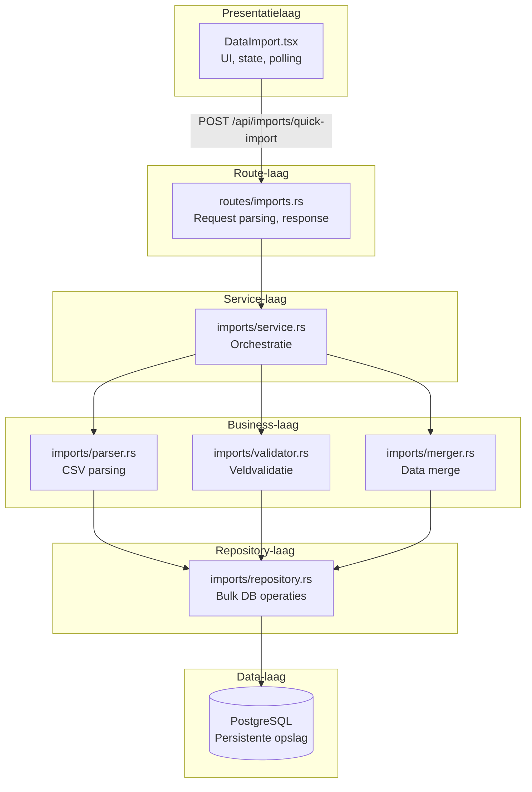

# Technische walkthrough: data import

## Equans Operational Insights Dashboard

---

| | |
|---|---|
| **Projecttitel** | Equans Operational Insights Dashboard |
| **Studentnaam** | Ahmad Alhaj Asaad |
| **Opleiding** | HBO-ICT, Software Engineering |
| **Bedrijf/Organisatie** | Equans Digital Technology |
| **Datum** | 24 maart 2026 |
| **Versie** | 1.0 |

---

## Inleiding

### Welke kernfunctionaliteit wordt beschreven?

Ik beschrijf hier hoe de Data Import (FR-007) werkt. Het idee is dat je een CSV-bestand met personen- en organisatiedata uploadt, en dat het systeem die data verwerkt en opslaat in PostgreSQL. Van het selecteren van het bestand tot de melding "klaar" op het scherm. Dat klinkt rechttoe rechtaan, maar er kwamen genoeg problemen bij kijken.

### Waarom is deze functionaliteit zo belangrijk?

Equans heeft meer dan 85.000 personen in hun systemen zitten, verdeeld over honderden organisaties. Niemand gaat dat met de hand invoeren. Wat ze doen is periodiek een export draaien vanuit Palantir (dat is het huidige datasysteem bij Equans) en die export moet dan het dashboard in.

Maar die bestanden zijn groot. 85.000 rijen. De data is vaak niet schoon, er zitten dubbele records in, velden die leeg zijn of juist verschoven kolommen. En je mag bestaande data niet zomaar overschrijven. Ik heb mijn aanpak meerdere keren moeten aanpassen omdat de eerste versie gewoon te langzaam was. Bij een eerdere poging raakte ik zelfs gegevens kwijt als een import halverwege stopte. Dat soort problemen kom je pas tegen als je met echte data werkt en niet met een testbestandje van 20 rijen.

---

## Hoofdstuk 1: Front-end gebruikersflow

### 1.1 Hoe start de gebruiker de functionaliteit?

Via de sidebar kan de gebruiker naar "Data Import" navigeren. In `App.tsx` staat een switch-case die bepaalt welke pagina gerenderd wordt:

```typescript
// App.tsx
const renderPage = () => {
  switch (currentPage) {
    case "import":
      return <DataImport />;
    // ...
  }
};
```

Niet heel spannend, maar het werkt.

### 1.2 Welke UI-componenten zijn betrokken?

Alles zit in een component: `DataImport` in `frontend/src/pages/DataImport.tsx`. Ik heb overwogen om het op te knippen in subcomponenten. Maar de workflow is zo lineair dat aparte componenten het alleen maar lastiger maken. Alle state hangt met elkaar samen, als je dat gaat verspreiden over meerdere bestanden raak je het overzicht kwijt.

Het component heeft een drop zone (sleep je CSV erin, of klik om een bestandskiezer te openen), een blok dat de bestandsnaam en grootte toont, een voortgangsbalk, vier kaartjes die live tonen hoeveel rijen geimporteerd, bijgewerkt, overgeslagen of fout zijn, en onderaan een plek voor foutmeldingen.

Wat misschien opvalt als je de code leest: er zit een `maxPctRef` in. Dat is een ref die het hoogste percentage bijhoudt dat de voortgangsbalk heeft gehad. De reden is een beetje stom eigenlijk. Toen ik aan het testen was zag ik de balk soms terugspringen. Van 45% naar 42% ofzo. Dat kwam doordat de backend soms tijdelijk minder verwerkte rijen rapporteert als hij net met een nieuwe batch begint. Voor de gebruiker ziet dat er raar uit, alsof er iets fout gaat. Vandaar die ref.

### 1.3 Hoe wordt data verzameld en verstuurd?

Als de gebruiker op "Start Import" klikt, gaat het bestand via `FormData` en een `XMLHttpRequest` naar de backend. Ik gebruik hier bewust geen `fetchApi` (de wrapper die ik voor de rest van de app heb), want dit is een multipart upload, geen JSON. Plus: met XHR kan ik later nog upload-progress tracking toevoegen als dat nodig is.

```typescript
const handleImport = useCallback(async () => {
  if (!file) return;

  setPhase("uploading");
  setError(null);
  startRef.current = Date.now();

  try {
    const form = new FormData();
    form.append("file", file);
    form.append("import_valid_only", "true");

    const result = await new Promise<{ import_id: string }>(
      (resolve, reject) => {
        const xhr = new XMLHttpRequest();
        xhr.addEventListener("load", () => {
          if (xhr.status >= 200 && xhr.status < 300) {
            resolve(JSON.parse(xhr.responseText));
          } else {
            const e = JSON.parse(xhr.responseText);
            reject(new Error(e.error ?? `HTTP ${xhr.status}`));
          }
        });
        xhr.addEventListener("error", () =>
          reject(new Error("Network error")));
        xhr.open("POST", `${API_BASE}/imports/quick-import`);
        xhr.send(form);
      },
    );

    // Backend verwerkt asynchroon, start polling
    setPhase("processing");
    pollRef.current = setInterval(
      () => poll(result.import_id), 1500);
    poll(result.import_id);
  } catch (err: any) {
    setPhase("failed");
    setError(err.message ?? "Import failed");
  }
}, [file, poll, stopAll]);
```

Het bestand gaat als `multipart/form-data` naar `POST /api/imports/quick-import`. De backend geeft vrijwel meteen een `import_id` terug en begint op de achtergrond te verwerken. Ondertussen start de frontend een poll die elke 1,5 seconde de status ophaalt.

Over die 1,5 seconde: ik had eerst 500ms staan. Leek me logisch, snellere updates. Maar toen ik in de browser-devtools keek zag ik tientallen requests per minuut binnenkomen die allemaal hetzelfde antwoord kregen. De voortgang verandert niet elke halve seconde, dus het was gewoon verspilde bandbreedte. 1,5 seconde is voldoende, de balk beweegt nog steeds vloeiend genoeg.

### 1.4 Polling voor realtime voortgang

De polling is een `setInterval` die een fetch doet naar `GET /api/imports/:import_id`:

```typescript
const poll = useCallback(async (importId: string) => {
  const res = await fetch(`${API_BASE}/imports/${importId}`);
  if (!res.ok) return;
  const data: ImportStatus = await res.json();
  setStatus(data);

  const newPct = calcProgress("processing", data);
  maxPctRef.current = Math.max(maxPctRef.current, newPct);
  setPct(maxPctRef.current);

  if (data.status === "Completed") {
    stopAll();
    setPct(100);
    setPhase("done");
  } else if (data.status === "Failed") {
    stopAll();
    setPhase("failed");
    setError(
      data.error_details?.error ?? "Import failed.");
  }
}, [stopAll]);
```

Iets wat ik niet had verwacht: error-handling op de poll-requests is eigenlijk overbodig. Als een request faalt (netwerk even weg, server even druk), dan komt er 1,5 seconde later gewoon een nieuwe. Ik had eerst een hele try-catch met retry-logica geschreven. Drie niveaus diep, met exponential backoff zelfs. Allemaal weggegooid, want het voegde niks toe. Alleen als de backend expliciet `"Failed"` terugstuurt stopt de import.

---

## Hoofdstuk 2: Backend-verwerking

### 2.1 Welk API-endpoint wordt aangeroepen?

```
POST /api/imports/quick-import
Content-Type: multipart/form-data

file: <CSV-bestand>
import_valid_only: "true"
```

Die `import_valid_only` parameter zegt: importeer alleen rijen die door de validatie komen, sla de rest over. In de praktijk staat die altijd op `true`. Ik dacht in het begin dat de data uit Palantir wel redelijk schoon zou zijn. Dat bleek niet zo te zijn. Na twee testrondes met echte exports (vol met corrupte rijen, dubbele records, verkeerd gecodeerde tekens) was duidelijk dat deze parameter eigenlijk standaard aan moet staan.

### 2.2 Hoe wordt de request verwerkt?

In `routes/imports.rs` pakt de handler het bestand uit via Axum's `Multipart` extractor:

```rust
pub async fn quick_import(
    State(state): State<ImportState>,
    mut multipart: Multipart,
) -> Result<impl IntoResponse, ImportError> {
    let mut file_name = String::new();
    let mut file_data = Vec::new();
    let mut import_valid_only = true;

    while let Some(field) = multipart.next_field().await
        .map_err(|e| ImportError::ParseError(
            format!("Multipart error: {}", e)))? {
        match field.name() {
            Some("file") => {
                file_name = field.file_name()
                    .unwrap_or("upload.csv").to_string();
                file_data = field.bytes().await
                    .map_err(|e| ImportError::ParseError(
                        e.to_string()))?.to_vec();
            }
            Some("import_valid_only") => {
                let val = field.text().await.unwrap_or_default();
                import_valid_only = val == "true";
            }
            _ => {}
        }
    }

    let service = state.service.clone();
    let import = service.start_quick_import(
        file_name, file_data, import_valid_only).await?;

    Ok(Json(json!({
        "import_id": import.import_id,
        "status": import.status
    })))
}
```

De handler doet zelf bijna niks. Multipart-velden uitlezen, doorsturen naar `ImportService`, klaar. Dat is bewust zo. Ik wil dat de route-laag alleen met HTTP bezig is en de service-laag met de logica. Scheelt enorm bij het testen, want dan hoef ik geen hele HTTP-server op te starten om de import te testen.

### 2.3 Welke validatie vindt plaats?

Eerst bestandsgrootte: alles boven 50 MB wordt geweigerd. Dat heb ik erin gezet nadat ik per ongeluk een keer een verkeerd bestand uploadde (een databasedump van 200 MB) en de server vastliep door geheugengebruik.

Daarna detecteert de backend het bestandsformaat via magic bytes en de extensie. CSV of Excel, meer opties zijn er niet.

Dan de echte validatie: alle rijen gaan langs de `Validator`, die per veld checkt of de data klopt. Vervolgens deduplicatie: als hetzelfde `person_id` of `email` meerdere keren voorkomt, blijft alleen de eerste staan. En tot slot een corruptie-check: als een `person_id` langer dan 50 tekens is of komma's bevat, dan is de rij waarschijnlijk verkeerd geparsed. Komma's in een ID betekent bijna altijd dat de CSV-parser de kolommen verkeerd heeft opgeknipt. Dat kwam regelmatig voor bij de Palantir-exports, vooral bij rijen met vrije-tekstvelden die zelf komma's bevatten.

---

## Hoofdstuk 3: Businesslogica

### 3.1 Upload en parsing

`ImportService` is de spil van het hele importproces. Stap een: het bestand parsen.

```rust
pub async fn upload_and_parse(
    &self,
    file_name: String,
    file_data: Vec<u8>,
) -> ImportResult<UploadData> {
    if file_data.len() > MAX_FILE_SIZE {
        return Err(ImportError::FileTooLarge(file_data.len()));
    }

    let format = FileParser::detect_format(&file_data, &file_name)?;
    let (persons_raw, orgs_raw) = match format {
        FileFormat::Csv => tokio::task::spawn_blocking(move || {
            let (p, o, _) = FileParser::parse_csv_fast(&file_data)?;
            Ok::<_, ImportError>((p, o))
        }).await
          .map_err(|e| ImportError::ParseError(
              format!("Parse task panicked: {}", e)))??,
        FileFormat::Excel => { /* Excel parsing path */ }
    };

    let validation = Validator::validate_persons(&persons_raw);

    Ok(UploadData {
      upload_id, file_name, persons, validation, /* ... */
    })
}
```

Die `tokio::task::spawn_blocking` verdient uitleg. Tokio (de async runtime) werkt met een beperkt aantal threads. Die moeten snel wisselen tussen taken. Maar CSV parsen van 85.000 rijen duurt zo'n 3 seconden. Dat is synchroon, en als je dat op een Tokio-thread doet, blokkeert die thread. Andere requests moeten dan wachten.

Ik kwam hier pas achter toen een collega klaagde dat het dashboard traag reageerde terwijl ik een import draaide. In de logs zag ik dat alle Tokio worker threads bezet waren door mijn parser. `spawn_blocking` lost dat op door het parse-werk naar een aparte threadpool te verplaatsen. Een halve dag naar gezocht, maar achteraf was de fix twee regels code.

### 3.2 Preview en merge

Na het parsen moet de importdata vergeleken worden met de database. Wat is nieuw, wat bestaat al, wat is veranderd?

```rust
pub async fn generate_preview(
    &self,
    upload_id: &str,
    import_valid_only: bool,
) -> ImportResult<PreviewData> {
    let upload = uploads.get(upload_id)
        .ok_or_else(|| ImportError::UploadNotFound(
            upload_id.to_string()))?;

    if import_valid_only && !upload.validation.valid {
        let error_rows: HashSet<usize> = upload.validation.errors
            .iter()
            .filter(|e| matches!(
                e.severity, ErrorSeverity::Error))
            .map(|e| e.row)
            .collect();

        let mut seen_person_ids = HashSet::new();
        let mut seen_emails = HashSet::new();

        let filtered_persons: Vec<PersonImportRow> = upload
            .persons.iter()
            .enumerate()
            .filter(|(idx, person)| {
                if error_rows.contains(&(idx + 2)) {
                    return false;
                }
                if let Some(id) = &person.id {
                    if id.contains(',') || id.len() > 50 {
                        return false;
                    }
                    if seen_person_ids.contains(id) {
                        return false;
                    }
                    seen_person_ids.insert(id.clone());
                }
                true
            })
            .map(|(_, p)| p.clone())
            .collect();
    }

    let persons_preview =
        self.preview_persons(&persons).await?;
    // ...
}
```

Die hele `import_valid_only` modus is eigenlijk ontstaan uit frustratie. De Palantir-exports zijn gewoon niet perfect. Dubbele entries, lege rijen, velden die verschoven zijn. Als je de hele import laat falen zodra er een foutieve rij inzit, kun je nooit iets importeren. Dus het systeem filtert slechte rijen eruit en gaat door met de rest. De `HashSet`s voor `seen_person_ids` en `seen_emails` zorgen dat dubbele records niet twee keer binnenkomen.

Over die `idx + 2` in de code: dat kostte me een paar uur. De rijnummers in de validatie zijn 1-based (rij 1 is de eerste datarij) en tellen de header-rij mee, maar de Vec-index is 0-based. Dus rij 3 in de foutmelding is index 1 in de Vec. Ik had eerst `idx + 1` staan, en toen werden steeds de verkeerde rijen overgeslagen. Pas na een print-debug sessie (letterlijk elke rij uitprinten en vergelijken) zag ik het.

### 3.3 Merge-strategie

Als een persoon al in de database staat, moet de `MergeEngine` beslissen wat er met conflicterende data gebeurt:

| Import veld | Database veld | Resultaat |
|-------------|---------------|-----------|
| Gevuld | Gevuld | Import wint |
| Gevuld | Leeg | Importwaarde |
| Leeg | Gevuld | Databasewaarde behouden |
| Leeg | Leeg | Placeholder of None |

Palantir geldt als bron van waarheid voor basisgegevens, vandaar dat de import standaard wint bij een conflict. Maar er zijn uitzonderingen. Velden die het systeem zelf beheert (GID-matching data, vendor-identifiers, link-status) mogen nooit overschreven worden door een import.

Dat laatste heb ik er pas later in gezet. Toen ik nog geen bescherming had voor die velden, uploadde ik een keer een testbestand dat per ongeluk de GID-data van duizenden personen leegmaakte. Alles weg. De rollback-functie bestond toen nog niet, dus dat was handmatig herstellen met een SQL-script. Niet mijn beste dag. Daarna heb ik meteen een lijst van beschermde velden toegevoegd aan de `MergeEngine`.

---

## Hoofdstuk 4: Data-opslag

### 4.1 Hoe worden gegevens opgeslagen?

Nieuwe personen gaan in batches van 1000 tegelijk naar de database, via `INSERT ... ON CONFLICT DO NOTHING`. Bestaande personen worden bijgewerkt met `UPDATE ... SET` op basis van de gemerge-de data. Die batch-grootte van 1000 is niet willekeurig; ik heb getest met 100, 500, 1000 en 5000. Bij 100 was het te langzaam (te veel roundtrips naar de database), bij 5000 werd de query zo groot dat PostgreSQL er merkbaar langer over deed om het executieplan te maken. 1000 bleek het snelst.

Personen die in de database staan maar niet in het importbestand voorkomen krijgen status `'Inactive'`. Geen hard delete. Fysiek verwijderen is onomkeerbaar en als er achteraf iets mis blijkt met het bronbestand dan ben je die data voorgoed kwijt. Met soft-delete kun je altijd terug.

### 4.2 Datastructuren

De `imports` tabel:

```sql
CREATE TABLE imports (
    import_id VARCHAR(50) NOT NULL UNIQUE,
    file_name VARCHAR(255) NOT NULL,
    status VARCHAR(20) NOT NULL DEFAULT 'Pending',
    total_rows INTEGER DEFAULT 0,
    imported INTEGER DEFAULT 0,
    updated INTEGER DEFAULT 0,
    skipped INTEGER DEFAULT 0,
    errors INTEGER DEFAULT 0,
    rollback_available BOOLEAN DEFAULT TRUE,
    rollback_deadline TIMESTAMPTZ,
    rollback_data JSONB,
    error_details JSONB,
    created_at TIMESTAMPTZ NOT NULL DEFAULT NOW(),
    completed_at TIMESTAMPTZ
);
```

De `status` gaat van `Pending` naar `Processing` naar `Completed` (of `Failed`). `rollback_data` is JSONB met een snapshot van de data voor de import, zodat je achteraf kunt terugdraaien. `error_details` bevat gestructureerde foutinformatie. Ik heb voor JSONB gekozen omdat het flexibel is. De structuur van foutmeldingen verschilt per type fout, en dat in genormaliseerde tabellen stoppen zou onnodig complex zijn.

### 4.3 Consistentie

Alle wijzigingen van een import zitten in een database-transactie. Faalt er iets halverwege, dan draait alles terug. Dat klinkt vanzelfsprekend, maar het was het eerste wat ik opzette nadat ik een keer een half-geimporteerd bestand had. 40.000 van de 85.000 rijen stonden erin, de rest niet, en ik moest handmatig uitzoeken welke rijen wel en niet verwerkt waren. Nooit meer.

Daarnaast: foreign key constraints (`persons.org_id` verwijst naar `organizations.org_id` met `ON DELETE SET NULL`) zodat personen niet aan een niet-bestaande organisatie gekoppeld raken. Unique constraints op `person_id` en `email` als extra vangnet voor duplicaten. En de rollback-functie waarmee een beheerder binnen een deadline een import ongedaan kan maken.

---

## Hoofdstuk 5: Terugkoppeling naar gebruiker

### 5.1 Hoe wordt het resultaat getoond?

Tijdens de import ziet de gebruiker een voortgangsbalk en een timer. Na afloop vier kaarten: geimporteerd, bijgewerkt, overgeslagen, fouten.

```typescript
function calcProgress(
  phase: Phase,
  st: ImportStatus | null
): number {
  if (phase === "done") return 100;
  if (phase === "failed") return 0;
  if (!st || !st.total_rows) return 0;
  const done = (st.imported ?? 0) + (st.updated ?? 0);
  return Math.min(
    Math.round((done / st.total_rows) * 100), 99);
}
```

Let op de `Math.min(..., 99)`. De balk gaat pas naar 100% zodra de backend "Completed" meldt. Ik had dat er eerst niet in zitten, en dan stond de balk al op 100% terwijl de backend nog bezig was met de laatste batch. Gebruikers denken dan dat het klaar is en navigeren weg. Dat wil je niet.

### 5.2 Feedbackmechanismen

De fase-indicatie bovenaan vertelt waar het systeem mee bezig is. De `maxPctRef` zorgt dat de balk niet teruggaat. De timer tikt elke seconde mee.

Die timer bleek achteraf het belangrijkste element te zijn. Ik had hem er bijna niet in gezet, want ik dacht: de voortgangsbalk is toch genoeg? Maar bij het testen met mensen van Equans bleek dat als de balk even stilstond (wat voorkomt als de backend een grote batch wegschrijft) ze dachten dat het systeem was gecrasht. De timer lost dat op. Zelfs als de balk stilstaat, tikt de seconde-teller door. Dan weet je dat er nog iets gebeurt. Een import van 85.000 rijen duurt zo'n 2 tot 3 minuten.

---

## Hoofdstuk 6: Architectuurreflectie

### 6.1 Hoe past deze functionaliteit in de gekozen architectuur?

De Data Import laat redelijk goed zien hoe de gelaagde architectuur in de praktijk werkt:



Elke laag praat alleen met de laag ernaast. `ImportService` weet niks van HTTP-statuscodes. De route-handler schrijft geen SQL. Dat voordeel merkte ik concreet toen ik de merge-logica moest herschrijven. De eerste versie overschreef te agressief bestaande data (het GID-incident dat ik eerder noemde). Ik opende `merger.rs`, paste de logica aan, en de rest van de codebase merkte er niks van.

### 6.2 Relevante ontwerpkeuzes

**Asynchrone executie.** De import draait niet in het HTTP-request maar op de achtergrond. Anders zou de gebruiker minutenlang een spinner zien, of erger: de browser geeft een timeout. Load balancers zijn hier ook gevoelig voor, veel hebben een limiet van 60 seconden en een grote import duurt langer.

**spawn_blocking voor het parsen.** 3 seconden synchrone operatie op een async thread is te lang. Dat heb ik al eerder beschreven, maar het was een van de lastigere bugs om te vinden dus ik noem hem nog een keer.

**In-memory state.** De geparseerde upload-data bewaar ik in een `HashMap` in het geheugen. Snel, simpel, maar niet persistent. Als de server herstart is de data weg. Voor dit project is dat prima (een backend-instantie, lokale deployment), maar voor productie met meerdere instanties zou je iets als Redis nodig hebben. Dat is een bewuste afbakening geweest.

**Separation of concerns binnen de module.** `parser.rs`, `validator.rs`, `merger.rs`, `repository.rs`. Elk bestand doet een ding. Toen de validator een keer te streng was voor bepaalde Palantir-exports (hij wees records af waar het telefoonnummer een spatie bevatte) hoefde ik alleen dat ene bestand aan te passen.

---

## Conclusie

### Wat maakt deze implementatie geslaagd?

De Data Import is het onderdeel waar ik het meest trots op ben. Maar ook het onderdeel waar ik het langst mee heb zitten stoeien.

De single-pass CSV parser doet 85.000 rijen in circa 3 seconden. Mijn eerste versie met een HashMap-lookup per rij deed daar meer dan 20 seconden over. Die optimalisatie maakte een groot verschil in de gebruikerservaring. De `import_valid_only` modus zorgt dat het systeem ook werkt met rommelige input, en dat is bij Palantir-exports gewoon de realiteit. De polling-indicatie geeft gebruikers het gevoel dat het systeem bezig is (in plaats van vastgelopen). En de merge-strategie samen met de rollback-optie zorgt dat je data niet onherstelbaar beschadigt als er iets misgaat.

### Aandachtspunten voor doorontwikkeling

Die in-memory HashMap is de grootste beperking. Server herstart = data weg. Redis zou dit oplossen. Het polling-mechanisme werkt maar is niet ideaal; server-sent events of WebSockets zouden minder onnodige requests genereren en sneller reageren. Iets voor een volgende versie.

De Excel parser staat uit vanwege type-inference problemen met de calamine crate in Rust. In de praktijk geen probleem want Palantir levert CSV, maar het is wel jammer. De batch-inserties zijn sequentieel; parallel inserten zou de doorlooptijd nog kunnen verbeteren, al is 2 tot 3 minuten voor 85.000 rijen werkbaar genoeg. En uiteindelijk zou je imports willen automatiseren via een directe koppeling met de Palantir API, zodat niemand meer handmatig een bestand hoeft te uploaden.

---

## Bronnen

1. Fowler, M. (2002). *Patterns of Enterprise Application Architecture*. Addison-Wesley.
2. Martin, R.C. (2003). *Agile Software Development: Principles, Patterns, and Practices*. Pearson.
3. Nygard, M.T. (2018). *Release It! Design and Deploy Production-Ready Software* (2e druk). Pragmatic Bookshelf.
4. Axum Documentation (2024). Geraadpleegd op https://docs.rs/axum/latest/axum/
5. PostgreSQL 16 Documentation (2024). Geraadpleegd op https://www.postgresql.org/docs/16/
6. sqlx Documentation (2024). Geraadpleegd op https://docs.rs/sqlx/latest/sqlx/
7. React 19 Documentation (2024). Geraadpleegd op https://react.dev/
8. Tokio Documentation (2024). Geraadpleegd op https://tokio.rs/
9. Atlassian Admin API (2024). Geraadpleegd op https://developer.atlassian.com/cloud/admin/
10. GitHub Enterprise REST API (2024). Geraadpleegd op https://docs.github.com/en/enterprise-cloud@latest/rest