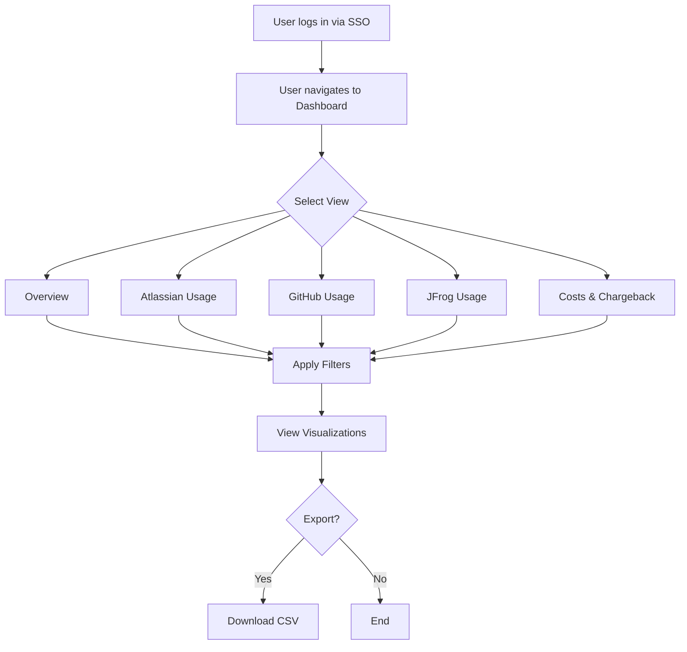

# FR-001: License Dashboard

**Status:** Draft  
**Date:** 2026-02-11  
**Author(s):** Ahmad Alhaj Asaad  
**Related BR:** [BR-001-Multi-Vendor-License-Insights](../Business-Requirements/BR-001-Multi-Vendor-License-Insights.md)

---

## User Stories

### US-1: View Overview Dashboard

**As a** Team Manager  
**I want to** see a consolidated overview of license usage across all vendors  
**So that** I can quickly assess overall software utilization

### US-2: View Atlassian Usage

**As a** License Administrator  
**I want to** view detailed Atlassian license utilization  
**So that** I can identify unused Jira/Confluence licenses

### US-3: View GitHub Usage

**As a** Engineering Manager  
**I want to** see GitHub seat allocation and Copilot usage  
**So that** I can optimize developer tool spending

### US-4: View JFrog Usage

**As a** DevOps Lead  
**I want to** monitor JFrog Artifactory usage metrics  
**So that** I can plan capacity and costs

### US-5: View Costs & Chargeback

**As a** Finance Team Member  
**I want to** see costs attributed to teams and cost centers  
**So that** I can perform accurate chargeback reporting

---

## Acceptance Criteria

### Dashboard Views (MUST HAVE)

- [ ] Overview dashboard displays aggregated metrics across all vendors
- [ ] Atlassian usage view shows license allocation and user activity
- [ ] GitHub usage view shows seats, Copilot usage, and org members
- [ ] JFrog usage view shows usage metrics
- [ ] Costs & Chargeback view shows expenses per team/cost center

### Visualizations (MUST HAVE)

- [ ] Active vs. inactive users displayed per platform
- [ ] License utilization percentage shown per platform
- [ ] Trends over time displayed as charts
- [ ] Team-based usage breakdown available

### Filtering (SHOULD HAVE)

- [ ] Filter by team
- [ ] Filter by business unit (BU)
- [ ] Filter by date range

### Export (SHOULD HAVE)

- [ ] Export dashboard data to CSV for reporting

### Alerts (COULD HAVE)

- [ ] Alerts for unusual license costs

### Analytics (COULD HAVE)

- [ ] Predictive analytics for license forecasting

### Integration (COULD HAVE)

- [ ] Integration with Power BI

---

## Workflow: Viewing License Dashboard

---

## Data Requirements

| Data Point         | Source            | Display                    |
| ------------------ | ----------------- | -------------------------- |
| Active users       | All vendors       | Count + percentage         |
| Inactive users     | All vendors       | Count + percentage         |
| License allocation | Atlassian, GitHub | Used vs. available         |
| Copilot usage      | GitHub            | Active users, usage trends |
| Usage metrics      | JFrog             | Storage, downloads         |
| Costs              | Calculated        | Per team, per vendor       |

---

## Error Handling

| Scenario                     | Expected Behavior                                 |
| ---------------------------- | ------------------------------------------------- |
| API data unavailable         | Display cached data with "last updated" timestamp |
| No data for selected filters | Display "No data available" message               |
| Export fails                 | Display error message with retry option           |

---

## Related Documents

- Business Requirement: [BR-001-Multi-Vendor-License-Insights](../Business-Requirements/BR-001-Multi-Vendor-License-Insights.md)
- Functional Requirement: [FR-002-Vendor-Data-Collection](FR-002-Vendor-Data-Collection.md)
- Technical Requirement: [TR-001-Performance-Security-Standards](../Technical-Requirements/TR-001-Performance-Security-Standards.md)
