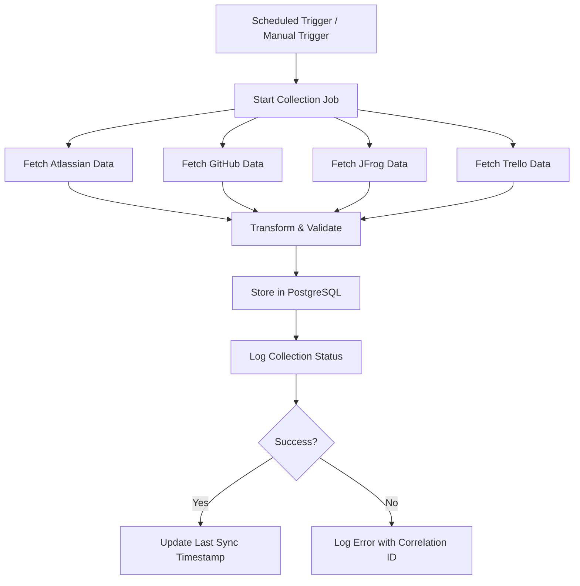

# FR-002: Vendor Data Collection

**Status:** Draft  
**Date:** 2026-02-11  
**Author(s):** Ahmad Alhaj Asaad  
**Related BR:** [BR-001-Multi-Vendor-License-Insights](../Business-Requirements/BR-001-Multi-Vendor-License-Insights.md)

---

## User Stories

### US-1: Collect Atlassian Data

**As a** System  
**I want to** automatically collect user and license data from Atlassian Admin API  
**So that** the dashboard reflects current Atlassian usage

### US-2: Collect GitHub Data

**As a** System  
**I want to** automatically collect seat and usage data from GitHub Enterprise API  
**So that** the dashboard reflects current GitHub usage

### US-3: Collect JFrog Data

**As a** System  
**I want to** automatically collect usage metrics from JFrog Artifactory API  
**So that** the dashboard reflects current JFrog usage

### US-4: Collect Trello Data

**As a** System  
**I want to** automatically collect board and user data from Trello API  
**So that** the dashboard reflects current Trello usage

### US-5: Store Collected Data

**As a** System  
**I want to** persist all collected data in PostgreSQL  
**So that** historical data is available for trend analysis

---

## Acceptance Criteria

### Data Collection (MUST HAVE)

- [ ] System collects users, groups, and license allocation from Atlassian Admin API
- [ ] System collects seats, Copilot usage, and org members from GitHub Enterprise API
- [ ] System collects usage metrics from JFrog Artifactory API
- [ ] System collects boards and users from Trello API
- [ ] All collected data is stored in PostgreSQL

### Automated Refresh (SHOULD HAVE)

- [ ] Data collection runs automatically on a daily schedule
- [ ] Manual refresh trigger available for administrators

---

## Workflow: Data Collection Process

---

## Data Requirements

### Atlassian Admin API

| Data Point         | API Endpoint | Storage              |
| ------------------ | ------------ | -------------------- |
| Users              | `/users`     | `atlassian_users`    |
| Groups             | `/groups`    | `atlassian_groups`   |
| License allocation | `/licenses`  | `atlassian_licenses` |

### GitHub Enterprise API

| Data Point    | API Endpoint                | Storage          |
| ------------- | --------------------------- | ---------------- |
| Seats         | `/orgs/{org}/seats`         | `github_seats`   |
| Copilot usage | `/orgs/{org}/copilot/usage` | `github_copilot` |
| Org members   | `/orgs/{org}/members`       | `github_members` |

### JFrog Artifactory API

| Data Point    | API Endpoint       | Storage       |
| ------------- | ------------------ | ------------- |
| Usage metrics | `/api/storageinfo` | `jfrog_usage` |

### Trello API

| Data Point | API Endpoint           | Storage         |
| ---------- | ---------------------- | --------------- |
| Boards     | `/members/{id}/boards` | `trello_boards` |
| Users      | `/boards/{id}/members` | `trello_users`  |

---

## Business Rules

1. Data collection must not modify any external vendor data (read-only)
2. Failed API calls must be retried with exponential backoff
3. Rate limits must be respected per vendor API specifications
4. Historical data must be preserved (append-only pattern)

---

## Error Handling

| Scenario                        | Expected Behavior                         |
| ------------------------------- | ----------------------------------------- |
| API rate limit exceeded         | Wait and retry with exponential backoff   |
| API authentication failure      | Log error, alert administrator            |
| Partial data collection failure | Complete other vendors, log failed vendor |
| Network timeout                 | Retry up to 3 times, then log failure     |

---

## Related Documents

- Business Requirement: [BR-001-Multi-Vendor-License-Insights](../Business-Requirements/BR-001-Multi-Vendor-License-Insights.md)
- Functional Requirement: [FR-001-License-Dashboard](FR-001-License-Dashboard.md)
- Technical Requirement: [TR-001-Performance-Security-Standards](../Technical-Requirements/TR-001-Performance-Security-Standards.md)
