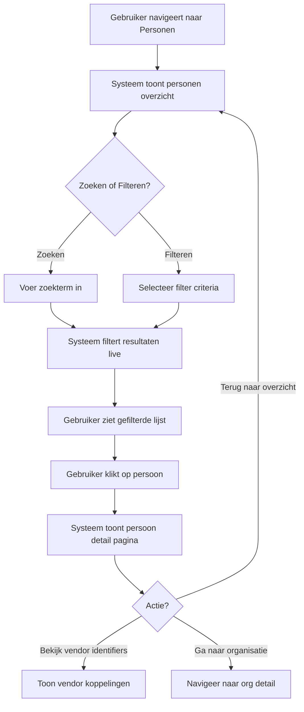
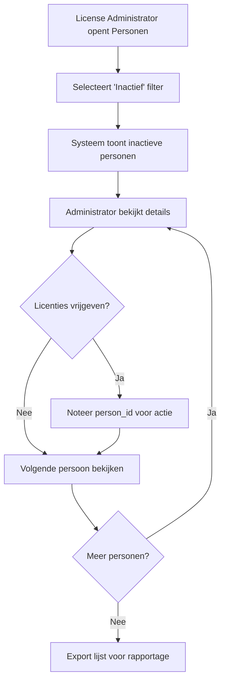

# FR-005: Personen Beheer

**Status:** Draft
**Datum:** 2026-02-17
**Auteur(s):** Ahmad Alhaj Asaad  
**Gerelateerde BR:** [BR-002-Person-Organization-Management](../Business-Requirements/BR-002-Person-Organization-Management.md)

---

## User Stories

### US-1: Personen Overzicht Bekijken

**Als een** License Administrator
**Wil ik** een overzicht van alle personen in het systeem bekijken
**Zodat** ik snel kan zien wie er licenties toegewezen heeft

### US-2: Personen Doorzoeken

**Als een** Teammanager
**Wil ik** personen kunnen zoeken op naam, e-mail of person_id
**Zodat** ik snel specifieke teamleden kan vinden

### US-3: Persoon Details Bekijken

**Als een** License Administrator
**Wil ik** de volledige details van een persoon bekijken inclusief vendor identifiers
**Zodat** ik kan zien welke licenties aan deze persoon zijn gekoppeld per platform

### US-4: Personen Filteren

**Als een** Finance Medewerker
**Wil ik** personen kunnen filteren op organisatie, land en billing location
**Zodat** ik nauwkeurige chargeback rapportages kan maken per locatie

### US-5: Inactieve Personen Identificeren

**Als een** License Administrator
**Wil ik** een overzicht van inactieve personen zien
**Zodat** ik ongebruikte licenties kan identificeren en vrijgeven

### US-6: Persoon-GID Matching Bekijken

**Als een** IT Administrator
**Wil ik** de Global ID (GID) matching status van personen bekijken
**Zodat** ik kan verifiëren dat identiteiten correct zijn gekoppeld

---

## Acceptatiecriteria

### Personen Overzicht (MUST HAVE)

- [ ] Tabel toont alle personen met kolommen: person_id, naam, e-mail, organisatie, land, billing location
- [ ] Standaard sortering op achternaam (A-Z)
- [ ] Paginering met configureerbaar aantal rijen per pagina (25, 50, 100)
- [ ] Totaal aantal personen wordt getoond
- [ ] Kolommen zijn sorteerbaar (klik op header)

### Zoeken (MUST HAVE)

- [ ] Zoekbalk voor vrije tekst zoeken
- [ ] Zoeken werkt op: person_id, voornaam, achternaam, e-mail
- [ ] Zoekresultaten worden direct (live) gefilterd tijdens typen
- [ ] Minimaal 2 karakters vereist voor zoeken

### Persoon Details (MUST HAVE)

- [ ] Detail pagina toont alle persoon attributen
- [ ] Vendor identifiers sectie toont koppelingen per platform (GitHub, Atlassian, JFrog)
- [ ] Matching metadata wordt getoond indien beschikbaar
- [ ] Laatste synchronisatie datum (updated_at) is zichtbaar
- [ ] Link naar organisatie detail pagina

### Filteren (SHOULD HAVE)

- [ ] Filter op organisatie (org_id) met dropdown
- [ ] Filter op land (country) met multi-select
- [ ] Filter op billing location met multi-select
- [ ] Filter op taal (person_language) met multi-select
- [ ] Filters zijn combineerbaar (AND logica)
- [ ] Actieve filters worden getoond als chips/tags
- [ ] "Wis filters" knop om alle filters te resetten

### Inactieve Personen (SHOULD HAVE)

- [ ] Toggle/tab om alleen inactieve personen te tonen
- [ ] Indicator in overzicht welke personen inactief zijn
- [ ] Kolom "laatste activiteit" per vendor platform
- [ ] Export mogelijkheid voor inactieve personen lijst

### GID Matching (SHOULD HAVE)

- [ ] Kolom toont GID matching status (matched/unmatched/pending)
- [ ] Filter op matching status
- [ ] GID confidence percentage is zichtbaar
- [ ] Extraction method wordt getoond

### Export (COULD HAVE)

- [ ] Export personen lijst naar CSV
- [ ] Export personen lijst naar Excel
- [ ] Export respecteert actieve filters

---

## Workflows

### Workflow: Persoon Opzoeken en Details Bekijken



### Workflow: Inactieve Personen Identificeren



---

## Business Rules

| Regel | Beschrijving                                                                                                               |
| ----- | -------------------------------------------------------------------------------------------------------------------------- |
| BR-1  | Een persoon is uniek geïdentificeerd door person_id (bijv. CCJ183)                                                         |
| BR-2  | person_email moet een geldig e-mailadres zijn, typisch in @equans.com domein                                               |
| BR-3  | person_local_id volgt het formaat [person_id]@equans.com                                                                   |
| BR-4  | Een persoon is "inactief" wanneer er geen activiteit is geregistreerd in de vendor platforms gedurende de laatste 90 dagen |
| BR-6  | GID confidence moet minimaal 80% zijn voor automatische matching status "matched"                                          |
| BR-7  | Personen zonder GID worden gemarkeerd als "unmatched"                                                                      |
| BR-8  | GID confidence tussen 50-80% resulteert in status "pending" voor handmatige review                                         |
| BR-9  | Een persoon is altijd gekoppeld aan exact één organisatie (org_id)                                                         |
| BR-10 | person_source geeft de herkomst van de data aan (bijv. "Azure AD")                                                         |
| BR-11 | vendor_identifiers bevat de koppelingen naar externe platforms per vendor                                                  |
| BR-12 | Zoekresultaten zijn beperkt tot maximaal 1000 resultaten voor performance                                                  |

---

## Data Requirements

### Personen Overzicht Weergave

| Veld             | Type   | Beschrijving                                           |
| ---------------- | ------ | ------------------------------------------------------ |
| person_id        | Tekst  | Unieke identifier (bijv. CCJ183)                       |
| Naam             | Tekst  | Combinatie person_first_name + person_last_name        |
| E-mail           | E-mail | person_email veld                                      |
| Organisatie      | Link   | org_id met link naar organisatie detail                |
| Land             | Tekst  | country veld (volledig uitgeschreven, bijv. "Austria") |
| Billing Location | Tekst  | person_billing_location (landcode, bijv. "AT")         |
| Status           | Badge  | Actief (groen) / Inactief (grijs) indicator            |
| GID Status       | Badge  | Matched (groen) / Pending (oranje) / Unmatched (rood)  |

### Persoon Detail Weergave - Algemeen

| Veld              | Type       | Beschrijving                            |
| ----------------- | ---------- | --------------------------------------- |
| person_id         | Tekst      | Unieke identifier                       |
| Voornaam          | Tekst      | person_first_name                       |
| Achternaam        | Tekst      | person_last_name                        |
| E-mail            | E-mail     | person_email                            |
| Local ID          | Tekst      | person_local_id                         |
| Taal              | Tekst      | person_language (DE, EN, FR, etc.)      |
| Bron              | Badge      | person_source (bijv. Azure AD)          |
| Billing Location  | Tekst      | person_billing_location                 |
| Organisatie       | Link       | org_id met link naar organisatie detail |
| Land              | Tekst      | country                                 |
| Aangemaakt op     | Datum/tijd | created_at timestamp                    |
| Laatst bijgewerkt | Datum/tijd | updated_at timestamp                    |

### Persoon Detail Weergave - GID Matching

| Veld                  | Type       | Beschrijving                    |
| --------------------- | ---------- | ------------------------------- |
| Global ID (GID)       | Tekst      | gid waarde (indien beschikbaar) |
| GID Confidence        | Percentage | gid_confidence (0-100%)         |
| GID Extraction Method | Tekst      | gid_extraction_method           |
| Matching Status       | Badge      | Matched / Pending / Unmatched   |
| Laatst Gematcht       | Datum/tijd | last_matched_at                 |
| Matching Metadata     | Expandable | matching_metadata details       |

### Persoon Detail Weergave - Vendor Identifiers

| Veld               | Type   | Beschrijving                                   |
| ------------------ | ------ | ---------------------------------------------- |
| GitHub             | Sectie | GitHub username, org membership, last activity |
| Atlassian          | Sectie | Atlassian account ID, Jira/Confluence access   |
| JFrog              | Sectie | JFrog username, repositories access            |
| Vendor Identifiers | JSON   | Raw vendor_identifiers object (expandable)     |

---

## UI Specificaties

### Personen Overzicht Pagina

```
+------------------------------------------------------------------+
| Personen                                                         |
+------------------------------------------------------------------+
| Zoeken: [________________________] [🔍]                          |
+------------------------------------------------------------------+
| Filters: [Organisatie ▼] [Land ▼] [Billing Loc ▼] [Status ▼]    |
|          [Wis filters]                                           |
+------------------------------------------------------------------+
| ☑ Actieve filters: ORG0042 × | Austria × | Actief ×             |
+------------------------------------------------------------------+
| person_id | Naam ▼           | E-mail         | Org  | Land | ● |
+-----------|------------------|----------------|------|------|---|
| CCJ183    | Wagensonner, T.  | thomas.wagen...| 0042 | AT   | ● |
| DEI311    | Ruppanner, J.    | juerg.ruppan...| 0042 | CH   | ● |
| DH8293    | Berdnik, G.      | gerald.berdn...| 0042 | AT   | ● |
| DH8294    | Glatz, J.        | jan.glatz@eq...| 0042 | AT   | ○ |
+------------------------------------------------------------------+
| Totaal: 1,247 personen | Getoond: 187   [< Prev] [1] [2] [Next >]|
+------------------------------------------------------------------+
| [Export CSV] [Export Excel]                                      |
+------------------------------------------------------------------+
```

### Persoon Detail Pagina

```
+------------------------------------------------------------------+
| ← Terug naar Personen                                            |
+------------------------------------------------------------------+
| CCJ183: Thomas Wagensonner                       Status: ● Actief|
+------------------------------------------------------------------+
| [Algemeen] [Vendor Identifiers] [Matching] [Activiteit]          |
+------------------------------------------------------------------+
|                                                                  |
| ALGEMENE INFORMATIE                                              |
| +--------------------------+  +-------------------------------+  |
| | person_id: CCJ183        |  | E-mail: thomas.wagensonner    |  |
| | Voornaam: Thomas         |  |         @equans.com           |  |
| | Achternaam: WAGENSONNER  |  | Local ID: CCJ183@equans.com   |  |
| | Taal: DE                 |  | Bron: Azure AD                |  |
| +--------------------------+  +-------------------------------+  |
|                                                                  |
| LOCATIE                                                          |
| +--------------------------+  +-------------------------------+  |
| | Land: Austria            |  | Billing Location: AT          |  |
| | Organisatie: ORG0042 →   |  |                               |  |
| +--------------------------+  +-------------------------------+  |
|                                                                  |
| TIMESTAMPS                                                       |
| Aangemaakt: 2025-10-15 08:58:32 | Bijgewerkt: 2026-01-05 11:20  |
+------------------------------------------------------------------+
```

### Persoon Vendor Identifiers Tab

```
+------------------------------------------------------------------+
| VENDOR IDENTIFIERS                                               |
+------------------------------------------------------------------+
|                                                                  |
| GITHUB                                                           |
| +------------------------------------------------------------+  |
| | Status: ● Gekoppeld                                        |  |
| | Username: twagensonner                                     |  |
| | Org Member: equans-tech                                    |  |
| | Copilot: ● Actief                                          |  |
| | Laatste Activiteit: 2026-02-16                             |  |
| +------------------------------------------------------------+  |
|                                                                  |
| ATLASSIAN                                                        |
| +------------------------------------------------------------+  |
| | Status: ● Gekoppeld                                        |  |
| | Account ID: 5f4e3d2c1b0a...                                |  |
| | Jira Access: ✓ | Confluence Access: ✓                      |  |
| | Laatste Activiteit: 2026-02-17                             |  |
| +------------------------------------------------------------+  |
|                                                                  |
| JFROG                                                            |
| +------------------------------------------------------------+  |
| | Status: ○ Niet gekoppeld                                   |  |
| | Reden: Geen matching identifier gevonden                   |  |
| +------------------------------------------------------------+  |
|                                                                  |
+------------------------------------------------------------------+
```

### Persoon GID Matching Tab

```
+------------------------------------------------------------------+
| GID MATCHING                                                     |
+------------------------------------------------------------------+
|                                                                  |
| MATCHING STATUS                                                  |
| +------------------------------------------------------------+  |
| | Status: ● Matched                                          |  |
| | Global ID (GID): EQ-EU-2024-001234                         |  |
| | Confidence: 95%  [████████████████████░░░░]                |  |
| | Extraction Method: email_domain_match                      |  |
| | Laatst Gematcht: 2026-01-05 11:20:29                       |  |
| +------------------------------------------------------------+  |
|                                                                  |
| MATCHING METADATA                                    [Expand ▼]  |
| +------------------------------------------------------------+  |
| | source_system: Azure AD                                    |  |
| | match_algorithm: v2.1                                      |  |
| | match_factors: [email, name, org]                          |  |
| +------------------------------------------------------------+  |
|                                                                  |
+------------------------------------------------------------------+
```

---

## Error Handling

| Scenario                                 | Foutmelding                                                     | Actie                                                              |
| ---------------------------------------- | --------------------------------------------------------------- | ------------------------------------------------------------------ |
| Geen personen gevonden voor zoekopdracht | "Geen personen gevonden voor '[zoekterm]'"                      | Toon suggestie om zoekterm aan te passen of filters te verwijderen |
| Geen personen in geselecteerde filters   | "Geen personen gevonden met de geselecteerde filters"           | Toon "Wis filters" knop prominent                                  |
| Persoon detail niet beschikbaar          | "Persoon '[person_id]' niet gevonden"                           | Navigeer terug naar overzicht met melding                          |
| Data synchronisatie vertraagd            | "Data kan tot 24 uur vertraagd zijn. Laatste sync: [timestamp]" | Informatieve banner, geen actie vereist                            |
| Export mislukt                           | "Export kon niet worden voltooid. Probeer opnieuw."             | Retry knop tonen                                                   |
| Te veel zoekresultaten                   | "Meer dan 1000 resultaten. Verfijn uw zoekopdracht."            | Toon eerste 1000, suggereer filters                                |
| Vendor API timeout                       | "Vendor data kon niet worden opgehaald voor [vendor]"           | Toon laatst bekende data met timestamp                             |
| Ongeldige person_id format               | "Ongeldige persoon identifier"                                  | Toon verwacht format                                               |

---

## Gerelateerde Documenten

- Business Requirement: [BR-002-Person-Organization-Management](../Business-Requirements/BR-002-Person-Organization-Management.md)
- Functional Requirement: [FR-006-Organization-Management](FR-006-Organization-Management.md)
- Functional Requirement: [FR-007-Data-Synchronization](FR-007-Data-Synchronization.md)
