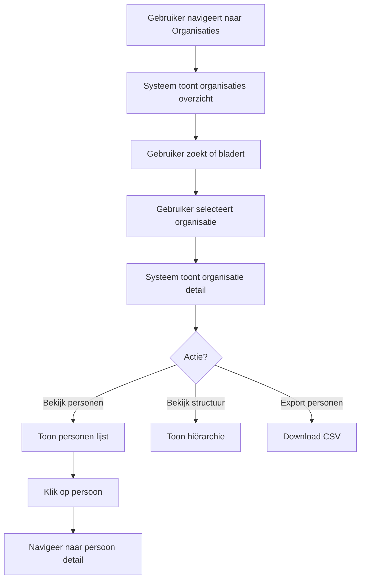
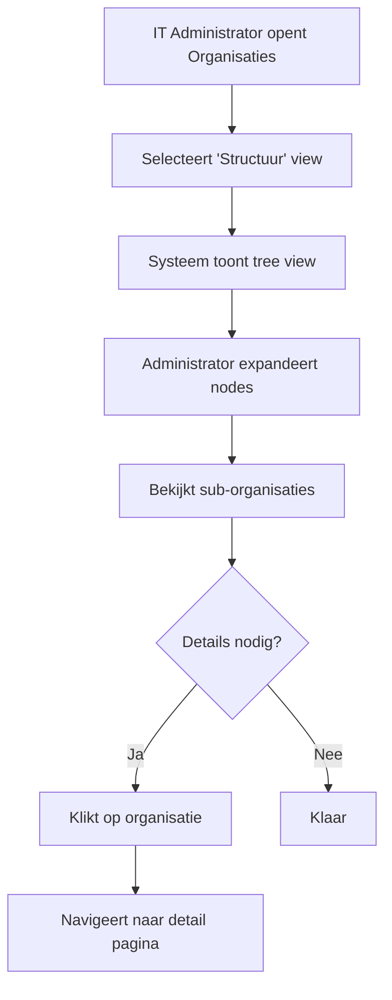

# FR-006: Organisatie Beheer

**Status:** Draft
**Datum:** 2026-02-17
**Auteur(s):** Functional Requirements Agent
**Gerelateerde BR:** [BR-002-Person-Organization-Management](../Business-Requirements/BR-002-Person-Organization-Management.md)

---

## User Stories

### US-1: Organisaties Overzicht Bekijken

**Als een** License Administrator
**Wil ik** een overzicht van alle organisaties in het systeem bekijken
**Zodat** ik de structuur van Equans entiteiten begrijp

### US-2: Organisatie Details Bekijken

**Als een** Finance Medewerker
**Wil ik** de details van een organisatie bekijken inclusief gekoppelde personen
**Zodat** ik kosten per organisatie kan analyseren

### US-3: Organisatie Structuur Beheren

**Als een** IT Administrator
**Wil ik** de hiërarchische structuur van organisaties beheren
**Zodat** de rapportage structuur correct is voor chargeback

### US-4: Personen per Organisatie Bekijken

**Als een** Teammanager
**Wil ik** zien welke personen aan een organisatie gekoppeld zijn
**Zodat** ik mijn team overzicht heb

### US-5: Organisatie Statistieken Bekijken

**Als een** License Administrator
**Wil ik** statistieken per organisatie zien (aantal personen, licenties, kosten)
**Zodat** ik de impact per organisatie kan beoordelen

---

## Acceptatiecriteria

### Organisaties Overzicht (MUST HAVE)

- [ ] Tabel toont alle organisaties met kolommen: org_id, naam, land, aantal personen
- [ ] Standaard sortering op org_id
- [ ] Zoekbalk voor zoeken op org_id of organisatienaam
- [ ] Totaal aantal organisaties wordt getoond

### Organisatie Details (MUST HAVE)

- [ ] Detail pagina toont alle organisatie attributen
- [ ] Lijst van gekoppelde personen wordt getoond
- [ ] Aantal personen per land/billing location wordt getoond
- [ ] Link naar personen overzicht met filter op deze organisatie

### Organisatie Structuur (SHOULD HAVE)

- [ ] Visuele weergave van organisatie hiërarchie (tree view)
- [ ] Mogelijkheid om parent-child relaties te bekijken
- [ ] Expandable/collapsible nodes voor sub-organisaties

### Personen Koppeling (SHOULD HAVE)

- [ ] Overzicht van personen gekoppeld aan organisatie
- [ ] Paginering voor grote organisaties
- [ ] Filter op status (actief/inactief)
- [ ] Export personen van organisatie naar CSV

### Statistieken (COULD HAVE)

- [ ] Totaal aantal personen in organisatie
- [ ] Verdeling per land
- [ ] Verdeling per billing location
- [ ] Trend over tijd (groei/krimp)

---

## Workflows

### Workflow: Organisatie Details Bekijken



### Workflow: Organisatie Hiërarchie Bekijken



---

## Business Rules

| Regel | Beschrijving |
| ----- | ------------ |
| BR-1 | org_id is uniek en volgt het formaat ORGXXXX (bijv. ORG0042) |
| BR-2 | Een persoon is altijd gekoppeld aan exact één organisatie via org_id |
| BR-3 | Organisaties kunnen hiërarchisch gestructureerd zijn (parent-child relatie) |
| BR-4 | Een organisatie kan meerdere landen bevatten (personen uit verschillende landen) |
| BR-5 | Billing location wordt bepaald per persoon, niet per organisatie |
| BR-6 | Bij verwijdering van een organisatie moeten alle personen eerst worden verplaatst |
| BR-7 | Organisatie statistieken worden dagelijks bijgewerkt om 06:00 UTC |
| BR-8 | Een organisatie heeft minimaal één persoon om als actief te worden beschouwd |
| BR-9 | Root organisaties hebben geen parent_org_id |
| BR-10 | Organisatienaam moet uniek zijn binnen het systeem |

---

## Data Requirements

### Organisaties Overzicht Weergave

| Veld | Type | Beschrijving |
| ---- | ---- | ------------ |
| org_id | Tekst | Unieke organisatie identifier (bijv. ORG0042) |
| Naam | Tekst | Volledige organisatienaam |
| Primair Land | Tekst | Land met meeste personen |
| Aantal Personen | Nummer | Totaal aantal gekoppelde personen |
| Aantal Landen | Nummer | Aantal unieke landen in organisatie |
| Status | Badge | Actief (groen) / Inactief (grijs) |

### Organisatie Detail Weergave

| Veld | Type | Beschrijving |
| ---- | ---- | ------------ |
| org_id | Tekst | Unieke identifier |
| Naam | Tekst | Volledige organisatienaam |
| Beschrijving | Tekst | Optionele omschrijving van de organisatie |
| Parent Organisatie | Link | org_id van parent, indien van toepassing |
| Child Organisaties | Lijst | Lijst van sub-organisaties met links |
| Aangemaakt op | Datum | Wanneer organisatie is aangemaakt |
| Laatst bijgewerkt | Datum/tijd | updated_at timestamp |

### Organisatie Personen Verdeling

| Veld | Type | Beschrijving |
| ---- | ---- | ------------ |
| Land | Tekst | country waarde (bijv. Austria, Switzerland) |
| Aantal | Nummer | Aantal personen in dit land |
| Percentage | Percentage | Aandeel van totaal |
| Billing Locations | Lijst | Unieke billing locations in dit land |

### Organisatie Statistieken

| Veld | Type | Beschrijving |
| ---- | ---- | ------------ |
| Totaal Personen | Nummer | Totaal aantal gekoppelde personen |
| Actieve Personen | Nummer | Personen met recente activiteit (laatste 90 dagen) |
| Inactieve Personen | Nummer | Personen zonder recente activiteit |
| Verdeling per Land | Grafiek | Pie/bar chart van landen |
| Verdeling per Billing Location | Grafiek | Pie/bar chart van billing locations |
| Groei/Krimp | Trend | Verandering t.o.v. vorige maand (%) |

---

## UI Specificaties

### Organisaties Overzicht Pagina

```
+------------------------------------------------------------------+
| Organisaties                                                     |
+------------------------------------------------------------------+
| Zoeken: [________________________] [🔍]                          |
+------------------------------------------------------------------+
| org_id ▼ | Naam            | Land        | Personen | Landen | ● |
+----------|-----------------|-------------|----------|--------|---|
| ORG0042  | Equans DACH     | Austria     | 187      | 4      | ● |
| ORG0043  | Equans France   | France      | 342      | 2      | ● |
| ORG0044  | Equans NL       | Netherlands | 89       | 1      | ● |
| ORG0045  | Equans UK       | UK          | 156      | 1      | ● |
+------------------------------------------------------------------+
| Totaal: 156 organisaties        [< Prev] [1] [2] [3] [Next >]    |
+------------------------------------------------------------------+
```

### Organisatie Detail Pagina

```
+------------------------------------------------------------------+
| ← Terug naar Organisaties                                        |
+------------------------------------------------------------------+
| ORG0042: Equans DACH                              Status: ● Actief|
+------------------------------------------------------------------+
| [Overzicht] [Personen (187)] [Structuur] [Statistieken]          |
+------------------------------------------------------------------+
|                                                                  |
| ALGEMENE INFORMATIE                                              |
| +--------------------------+  +-------------------------------+  |
| | org_id: ORG0042          |  | Parent: - (root organisatie) |  |
| | Naam: Equans DACH        |  | Children: 3 sub-organisaties |  |
| | Aangemaakt: 2025-10-15   |  | Laatst bijgewerkt: 2026-02-17|  |
| +--------------------------+  +-------------------------------+  |
|                                                                  |
| VERDELING PER LAND                                               |
| +----------------------------------------------------------+    |
| | Austria      |████████████████████████████████████| 98 (52%)|  |
| | Switzerland  |███████████████████████████         | 76 (41%)|  |
| | Germany      |████                                | 13 (7%) |  |
| +----------------------------------------------------------+    |
|                                                                  |
| BILLING LOCATIONS                                                |
| AT: 98 personen | CH: 76 personen | DE: 13 personen            |
|                                                                  |
+------------------------------------------------------------------+
```

### Organisatie Personen Tab

```
+------------------------------------------------------------------+
| Personen in ORG0042                              [Export CSV]    |
+------------------------------------------------------------------+
| Filter: [Alle Landen ▼] [Alle Status ▼]     Zoeken: [__________] |
+------------------------------------------------------------------+
| person_id | Naam                | E-mail              | Land | ● |
+-----------|---------------------|---------------------|------|---|
| CCJ183    | Thomas Wagensonner  | thomas.wagen...     | AT   | ● |
| DEI311    | Jürg Ruppanner      | juerg.ruppan...     | CH   | ● |
| DH8293    | Gerald Berdnik      | gerald.berdn...     | AT   | ● |
| FF5258    | Pirmin Kim          | pirmin.kim@...      | CH   | ● |
+------------------------------------------------------------------+
| Showing 1-25 of 187 personen          [< Prev] [1] [2] [Next >]  |
+------------------------------------------------------------------+
```

### Organisatie Structuur View

```
+------------------------------------------------------------------+
| Organisatie Structuur                                            |
+------------------------------------------------------------------+
|                                                                  |
| 📁 ORG0001 Equans Global                                         |
|   ├── 📁 ORG0010 Equans Europe                                   |
|   │     ├── 📁 ORG0042 Equans DACH ◄── (geselecteerd)           |
|   │     │     ├── 📄 ORG0042-AT (Austria - 98 personen)         |
|   │     │     ├── 📄 ORG0042-CH (Switzerland - 76 personen)     |
|   │     │     └── 📄 ORG0042-DE (Germany - 13 personen)         |
|   │     ├── 📁 ORG0043 Equans France                            |
|   │     └── 📁 ORG0044 Equans Benelux                           |
|   └── 📁 ORG0020 Equans Americas                                 |
|                                                                  |
+------------------------------------------------------------------+
| Klik op een organisatie om details te bekijken                   |
+------------------------------------------------------------------+
```

---

## Error Handling

| Scenario | Foutmelding | Actie |
| -------- | ----------- | ----- |
| Organisatie niet gevonden | "Organisatie '[org_id]' niet gevonden" | Toon link terug naar overzicht |
| Geen personen in organisatie | "Geen personen gekoppeld aan deze organisatie" | Informatieve melding, geen actie vereist |
| Structuur view niet beschikbaar | "Organisatie structuur kon niet worden geladen. Probeer opnieuw." | Retry knop tonen |
| Export mislukt | "Export kon niet worden voltooid. Controleer uw verbinding en probeer opnieuw." | Retry knop tonen |
| Zoekresultaten leeg | "Geen organisaties gevonden voor '[zoekterm]'" | Suggestie om zoekterm aan te passen |
| Data verouderd | "Data is mogelijk verouderd. Laatste update: [timestamp]" | Informatieve banner bovenaan pagina |
| Timeout bij laden personen | "Personen konden niet worden geladen. Te veel resultaten." | Suggereer filter toe te passen |
| Ongeldige org_id format | "Ongeldige organisatie identifier" | Toon verwacht format (ORGXXXX) |

---

## Toegangsrechten

| Rol | Overzicht Bekijken | Details Bekijken | Structuur Beheren | Export |
| --- | ------------------ | ---------------- | ----------------- | ------ |
| License Administrator | ✅ Alle | ✅ Alle | ❌ | ✅ |
| Teammanager | ✅ Eigen org | ✅ Eigen org | ❌ | ✅ Eigen org |
| Finance Medewerker | ✅ Alle | ✅ Alle | ❌ | ✅ |
| IT Administrator | ✅ Alle | ✅ Alle | ✅ | ✅ |

---

## Gerelateerde Documenten

- Business Requirement: [BR-002-Person-Organization-Management](../Business-Requirements/BR-002-Person-Organization-Management.md)
- Functional Requirement: [FR-005-Person-Management](FR-005-Person-Management.md)
- Functional Requirement: [FR-007-Data-Synchronization](FR-007-Data-Synchronization.md)
