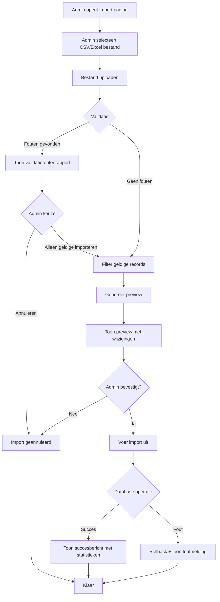

# FR-007: Import Organisaties en Personen

**Status:** In Review
**Datum:** 2026-02-18
**Auteur(s):** Functional Requirements Engineer
**Gerelateerde BR:** [BR-002](../Business-Requirements/BR-002-Person-Organization-Management.md)

---

## User Stories

### US-1: Organisaties en Personen Importeren

**Als een** Admin
**Wil ik** organisatie- en persoonsgegevens kunnen importeren via een CSV of Excel bestand
**Zodat** de database actueel blijft met de laatste organisatie- en personeelsinformatie

### US-2: Import Preview Bekijken

**Als een** Admin
**Wil ik** een preview kunnen zien van alle wijzigingen voordat de import wordt uitgevoerd
**Zodat** ik kan controleren welke data wordt toegevoegd, gewijzigd of verwijderd

### US-3: Personen Reactiveren

**Als een** Admin
**Wil ik** dat personen die eerder als inactief zijn gemarkeerd automatisch worden gereactiveerd bij nieuwe import
**Zodat** vertrokken medewerkers die terugkeren automatisch weer actief worden in het systeem

### US-4: Gedeeltelijke Import bij Validatiefouten

**Als een** Admin
**Wil ik** kunnen kiezen om alleen geldige records te importeren wanneer er validatiefouten zijn
**Zodat** ik niet de hele import hoef te annuleren bij enkele fouten

### US-5: Flexibele Import met Ontbrekende Velden (NIEUW - 2026-02-23)

**Als een** Admin
**Wil ik** kunnen importeren met onvolledige data (ontbrekende person_id, email, namen, etc.)
**Zodat** ik:
- Data kan importeren die stapsgewijs compleet wordt gemaakt
- Kan werken met datasets waar niet alle informatie beschikbaar is
- Later ontbrekende gegevens kan aanvullen via herhaalde imports

---

## Acceptatiecriteria

### Import Functionaliteit (MUST HAVE)

- [ ] Admin kan een import starten via de UI
- [ ] Systeem accepteert zowel CSV als Excel (.xlsx) bestanden
- [ ] Systeem importeert organisaties met OrgID en naam
- [ ] Systeem importeert personen met: person_id, person_email, person_first_name, person_last_name, gid (optioneel), person_local_id, org_id (optioneel)
- [ ] Import verwerkt zowel organisaties als personen in één actie

### Preview Functionaliteit (MUST HAVE)

- [ ] Na upload toont systeem een preview van alle wijzigingen
- [ ] Preview toont aantal nieuwe organisaties
- [ ] Preview toont aantal nieuwe personen
- [ ] Preview toont aantal te wijzigen personen met details
- [ ] Preview toont aantal personen die als inactief worden gemarkeerd
- [ ] Preview toont aantal personen die worden gereactiveerd
- [ ] Admin kan preview bevestigen of annuleren

### Organisatie Synchronisatie (MUST HAVE)

- [ ] Nieuwe organisaties worden toegevoegd aan database
- [ ] Bestaande organisaties worden bijgewerkt met nieuwe data
- [ ] Organisaties die niet in import staan blijven behouden in database
- [ ] OrgID wordt gebruikt als unieke identifier

### Personen Synchronisatie (MUST HAVE)

- [ ] Nieuwe personen (niet in database) worden toegevoegd
- [ ] Bestaande personen (in database én import) worden bijgewerkt volgens merge logica
- [ ] Personen die niet in import staan worden gemarkeerd als soft-delete
- [ ] Soft-deleted personen worden automatisch gereactiveerd bij nieuwe import
- [ ] person_id wordt gebruikt als unieke identifier

### Merge Logica (MUST HAVE)

- [ ] Gevulde velden in import overschrijven database waarden
- [ ] Lege velden in import behouden bestaande database waarden
- [ ] Optionele velden (gid, org_id) volgen dezelfde merge logica

### Validatie (MUST HAVE)

**Update (2026-02-23):** Validatie is MAXIMAAL vereenvoudigd - alleen duplicate checks:

- [ ] OrgID moet uniek zijn binnen de import (BLOCKING ERROR) indien aanwezig
- [ ] person_id moet uniek zijn binnen de import (BLOCKING ERROR) indien aanwezig
- [ ] person_email moet uniek zijn binnen de import (BLOCKING ERROR) indien aanwezig
- [ ] **GEEN** validatie voor ontbrekende velden - auto-generatie of placeholders worden gebruikt
- [ ] **GEEN** validatie voor email formaat - accepteer elke waarde
- [ ] **GEEN** validatie voor org_id formaat - accepteer elke waarde
- [ ] **GEEN** validatie voor budget formaat - accepteer elke waarde
- [ ] Bij duplicate errors krijgt admin foutmelding met rijnummers
- [ ] Validatierapport toont alleen duplicate errors, geen warnings

### Soft-Delete Gedrag (SHOULD HAVE)

- [ ] Soft-deleted personen zijn niet zichtbaar in de UI
- [ ] Soft-deleted personen blijven in database met marker
- [ ] Gereactiveerde personen zijn direct weer zichtbaar in UI

### Error Handling (SHOULD HAVE)

- [ ] Bij database fouten wordt volledige import teruggedraaid (rollback)
- [ ] Admin ontvangt duidelijke foutmeldingen
- [ ] Import log wordt bijgehouden met timestamp en resultaat

---

## Workflows

### Workflow 1: Organisaties en Personen Importeren

### Workflow 2: Preview Analyse

1. Admin uploadt bestand
2. Systeem valideert bestandsformaat en inhoud
3. Systeem vergelijkt import data met database
4. Voor organisaties:
   - Identificeer nieuwe organisaties (OrgID niet in database)
   - Identificeer te wijzigen organisaties (OrgID in database)
5. Voor personen:
   - Identificeer nieuwe personen (person_id niet in database)
   - Identificeer te wijzigen personen (person_id in database én import)
   - Identificeer soft-deletes (person_id in database maar niet in import, én niet al soft-deleted)
   - Identificeer reactivaties (person_id in import én al soft-deleted)
6. Toon overzichtelijk preview scherm met alle categorieën
7. Wacht op admin bevestiging

### Workflow 3: Merge Logica per Persoon

Voor elke persoon die in **beide** (database EN import) staat:

1. Vergelijk veld per veld
2. Voor elk veld:
   - Als import-waarde **niet leeg** → gebruik import-waarde
   - Als import-waarde **leeg** EN database-waarde **gevuld** → behoud database-waarde
   - Als beide leeg → laat leeg
3. Update database record met gemergde waarden
4. Log wijziging

---

## Business Rules

**Update (2026-02-23):** Business rules zijn maximaal vereenvoudigd - alleen duplicaten blokkeren imports:

| Regel | Beschrijving |
| ----- | ------------ |
| BR-1 | OrgID moet uniek zijn binnen het geïmporteerde bestand indien aanwezig (BLOCKING) |
| BR-2 | person_id moet uniek zijn binnen het geïmporteerde bestand indien aanwezig (BLOCKING) |
| BR-3 | person_email moet uniek zijn binnen het geïmporteerde bestand indien aanwezig (BLOCKING) |
| BR-4 | Organisaties blijven altijd bewaard, ook als ze niet in een nieuwe import staan |
| BR-5 | Personen die niet in de import staan worden gemarkeerd als soft-delete (niet permanent verwijderd) |
| BR-6 | Import data heeft prioriteit bij merge, behalve wanneer import veld leeg is en database veld gevuld |
| BR-7 | Ontbrekende person_id wordt auto-gegenereerd: `AUTO_{email_prefix}` of `AUTO_{UUID}` |
| BR-8 | Ontbrekende person_email wordt auto-gegenereerd: `unknown_{person_id}@placeholder.local` |
| BR-9 | Ongeldige email formaten worden GEACCEPTEERD zonder validatie |
| BR-10 | Ontbrekende org_id wordt auto-gegenereerd: `ORG_{name}` of `ORG_{UUID}` |
| BR-11 | Ontbrekende naam velden krijgen placeholder: `[To Be Determined]` |
| BR-12 | Placeholder waarden worden overschreven bij volgende imports met echte data |
| BR-13 | Soft-deleted personen worden automatisch gereactiveerd als hun person_id in een nieuwe import voorkomt |
| BR-14 | Alleen gebruikers met admin rol kunnen imports uitvoeren |
| BR-15 | Bij database fouten tijdens import wordt de hele transactie teruggedraaid (rollback) |
| BR-16 | **GEEN** format validatie - alle input wordt geaccepteerd zoals het is |
| BR-17 | **GEEN** missing field warnings - ontbrekende data wordt automatisch aangevuld |

---

## Data Requirements

**Update (2026-02-23):** Alle velden zijn optioneel - er zijn GEEN format restricties of validaties.

### Input: Organisatie Bestand

Het bestand kan organisaties bevatten met de volgende kolommen:

| Veld | Type | Verplicht | Validatie | Auto-generatie | Beschrijving |
| ---- | ---- | --------- | --------- | -------------- | ------------ |
| org_id | Tekst | Nee | Alleen duplicate check | `ORG_{name}` of `ORG_{UUID}` | Unieke identifier (accepteert ELKE waarde) |
| org_name | Tekst | Nee | Geen | `[Organization Name To Be Determined]` | Naam (accepteert ELKE waarde) |
| budget | Tekst | Nee | Geen | - | Budget (accepteert ELKE waarde, ook niet-numeriek) |

### Input: Personen Bestand

Het bestand kan personen bevatten met de volgende kolommen:

| Veld | Type | Verplicht | Validatie | Auto-generatie | Beschrijving |
| ---- | ---- | --------- | --------- | -------------- | ------------ |
| person_id | Tekst | Nee | Alleen duplicate check | `AUTO_{email_prefix}` of `AUTO_{UUID}` | Unieke identifier (accepteert ELKE waarde) |
| person_email | Email | Nee | Alleen duplicate check | `unknown_{person_id}@placeholder.local` | Email (accepteert ELKE waarde, ook zonder @) |
| person_first_name | Tekst | Nee | Geen | `[To Be Determined]` | Voornaam (accepteert ELKE waarde) |
| person_last_name | Tekst | Nee | Geen | `[To Be Determined]` | Achternaam (accepteert ELKE waarde) |
| person_local_id | Tekst | Nee | Geen | - | Lokale identifier |
| org_id | Tekst | Nee | Geen | - | Referentie naar organisatie |
| gid | Tekst | Nee | Geen | - | Global identifier |

**Belangrijke Opmerkingen:**
- **GEEN format validatie** - alle waardes worden geaccepteerd zoals ze zijn
- **GEEN missing field errors** - ontbrekende velden krijgen auto-generatie of placeholders
- **ALLEEN duplicate checks** - dubbele person_id, email of org_id binnen hetzelfde bestand blokkeren import
- Bij latere imports kunnen placeholder waarden worden overschreven met echte data
- Merge logica behoudt bestaande echte data boven placeholders

| Sectie | Informatie |
| ------ | ----------- |
| Organisaties - Nieuw | Aantal + lijst van nieuwe org_id's |
| Organisaties - Wijzigen | Aantal + lijst van org_id's met wijzigingen |
| Personen - Nieuw | Aantal + lijst van person_id's |
| Personen - Wijzigen | Aantal + lijst van person_id's met veld-niveau wijzigingen |
| Personen - Inactiveren | Aantal + lijst van person_id's die soft-delete worden |
| Personen - Reactiveren | Aantal + lijst van person_id's die gereactiveerd worden |
| Validatiefouten | Aantal + lijst met rijnummer, kolom en foutbeschrijving |

### Output: Import Resultaat

| Veld | Type | Beschrijving |
| ---- | ---- | ------------ |
| Succes | Boolean | Of de import succesvol was |
| Organisaties Toegevoegd | Nummer | Aantal nieuwe organisaties |
| Organisaties Gewijzigd | Nummer | Aantal gewijzigde organisaties |
| Personen Toegevoegd | Nummer | Aantal nieuwe personen |
| Personen Gewijzigd | Nummer | Aantal gewijzigde personen |
| Personen Inactief | Nummer | Aantal soft-deleted personen |
| Personen Gereactiveerd | Nummer | Aantal gereactiveerde personen |
| Timestamp | DateTime | Tijdstip van import |
| Foutmelding | Tekst | Eventuele foutmelding (indien niet succesvol) |

---

## Error Handling

| Scenario | Foutmelding | Actie |
| -------- | ----------- | ----- |
| Bestandsformaat niet ondersteund | "Bestandsformaat niet ondersteund. Upload een CSV of Excel (.xlsx) bestand." | Upload wordt geweigerd, admin moet opnieuw selecteren |
| Leer bestand | "Het bestand bevat geen data. Upload een geldig bestand met organisaties en/of personen." | Upload wordt geweigerd |
| Ontbrekende verplichte kolommen | "Verplichte kolommen ontbreken: [kolomnamen]. Controleer het bestand en probeer opnieuw." | Upload wordt geweigerd |
| Dubbele OrgID in import | "OrgID '[org_id]' komt meerdere keren voor in het importbestand (rijen: [rijnummers])." | Validatiefout, admin kan kiezen: annuleren of eerste behouden |
| Dubbele person_id in import | "person_id '[person_id]' komt meerdere keren voor in het importbestand (rijen: [rijnummers])." | Validatiefout, admin kan kiezen: annuleren of eerste behouden |
| Ongeldig email formaat | "Ongeldig email adres op rij [rij]: '[email]'." | Validatiefout, record wordt overgeslagen bij gedeeltelijke import |
| Ontbrekende person_email | "person_email ontbreekt op rij [rij]." | Validatiefout, record wordt overgeslagen bij gedeeltelijke import |
| Ontbrekende person_id | "person_id ontbreekt op rij [rij]." | Validatiefout, record wordt overgeslagen bij gedeeltelijke import |
| Database verbinding verloren | "Database verbinding verloren. Probeer het later opnieuw." | Import wordt afgebroken met rollback |
| Database constraint violation | "Database fout: [technische details]. Neem contact op met de beheerder." | Import wordt afgebroken met rollback |
| Onverwachte fout tijdens import | "Er is een onverwachte fout opgetreden. De import is teruggedraaid. Probeer opnieuw of neem contact op met de beheerder." | Import wordt afgebroken met rollback |

---

## Gerelateerde Documenten

- Business Requirement: [BR-002](../Business-Requirements/BR-002-Person-Organization-Management.md)
- Technical Requirement: [TR-007](../Technical-Requirements/TR-007.md) (indien beschikbaar)
