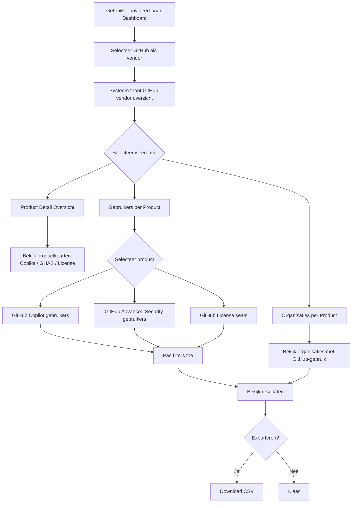
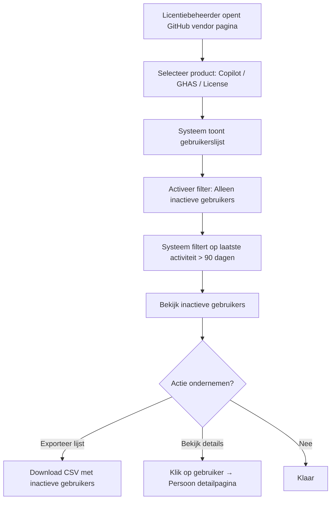
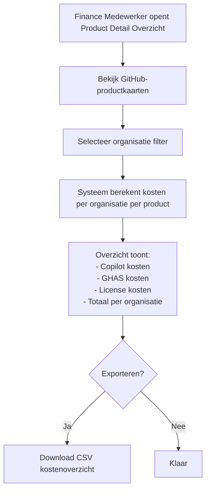

# FR-011: GitHub Vendor Integratie

**Status:** Draft
**Datum:** 2026-03-10
**Auteur(s):** Ahmad Alhaj Asaad
**Gerelateerde BR:** [BR-001-Operational-Dashboard](../business-requirements/BR-001-Operational-Dashboard.md)
**Gerelateerde FR:** [FR-001-Dashboard-Layout](FR-001-Dashboard-Layout.md) · [FR-002-KPI-Cards](FR-002-KPI-Cards.md) · [FR-026-Cost-Analysis-Module](FR-026-Cost-Analysis-Module.md) · [FR-039-Integration-Hub](FR-039-Integration-Hub.md)

---

## Samenvatting

Dit document beschrijft de functionele requirements voor het toevoegen van **GitHub Enterprise** als nieuwe vendor aan het Equans Operational Insights Dashboard. Gebruikers moeten inzicht krijgen in welke medewerkers en organisaties gebruik maken van drie specifieke GitHub-producten: **GitHub Copilot**, **GitHub Advanced Security (GHAS)** en **GitHub User License (seats)**. Deze producten worden als individuele kaarten weergegeven in het product detail overzicht, vergelijkbaar met de bestaande Atlassian-productkaarten.

---

## User Stories

### US-1: GitHub Vendor Overzicht Bekijken

**Als een** Licentiebeheerder
**Wil ik** een overzichtspagina zien voor GitHub als vendor
**Zodat** ik in één oogopslag kan beoordelen hoeveel licenties, seats en beveiligingsfeatures actief zijn binnen de organisatie

### US-2: GitHub Copilot Gebruik Bekijken

**Als een** Engineering Manager
**Wil ik** inzicht in welke gebruikers en organisaties actief gebruik maken van GitHub Copilot
**Zodat** ik kan beoordelen of de investering in Copilot effectief wordt benut en kosten per team kan optimaliseren

### US-3: GitHub Advanced Security Gebruik Bekijken

**Als een** Security Officer / DevOps Lead
**Wil ik** inzicht in welke gebruikers en organisaties gebruik maken van GitHub Advanced Security (GHAS)
**Zodat** ik kan verifiëren dat beveiligingstools breed worden ingezet en compliance-rapportages kan opstellen

### US-4: GitHub User License Gebruik Bekijken

**Als een** Licentiebeheerder
**Wil ik** een overzicht van alle actieve GitHub User Licenses (seats)
**Zodat** ik ongebruikte seats kan identificeren en licentiekosten kan optimaliseren

### US-5: GitHub Producten in Product Detail Overzicht

**Als een** Finance Medewerker
**Wil ik** in het product detail overzicht drie afzonderlijke kaarten zien voor GitHub Copilot, GitHub Advanced Security en GitHub License
**Zodat** ik per product de kosten, gebruikersaantallen en marges kan vergelijken en doorbelasten

### US-6: GitHub Gebruikers per Organisatie Bekijken

**Als een** Teammanager
**Wil ik** per organisatie zien welke medewerkers welke GitHub-producten gebruiken
**Zodat** ik weet welke teamleden toegang hebben tot Copilot, GHAS of een GitHub seat

### US-7: Inactieve GitHub Gebruikers Identificeren

**Als een** Licentiebeheerder
**Wil ik** een overzicht van inactieve GitHub-gebruikers per product
**Zodat** ik ongebruikte licenties kan identificeren en vrijgeven om kosten te besparen

---

## Acceptatiecriteria

### GitHub Vendor Pagina (MUST HAVE)

- [ ] GitHub wordt als aparte vendor weergegeven in het dashboard-navigatiemenu
- [ ] Vendor-overzichtspagina toont samenvattende statistieken: totaal seats, actieve Copilot-gebruikers, GHAS-u
- [ ] Datum en tijdstip van de laatste synchronisatie wordt getoond
- [ ] Badge/indicator toont de verbindingsstatus met de GitHub Enterprise API

### Product Detail Overzicht — Drie Productkaarten (MUST HAVE)

- [ ] Het product detail overzicht bevat drie afzonderlijke kaarten:

| Productkaart | Weergegeven gegevens |
|---|---|
| **GitHub Copilot** | Aantal actieve gebruikers, inkoopprijs/gebruiker/maand (€), factureerbaar tarief/gebruiker/maand (€), consultancy-marge (€ en %), totale maandelijkse inkoopkosten, totaal factureerbaar/maand |
| **GitHub Advanced Security** | Aantal actieve committers, inkoopprijs/committer/maand (€), factureerbaar tarief/committer/maand (€), consultancy-marge (€ en %), totale maandelijkse inkoopkosten, totaal factureerbaar/maand |
| **GitHub License** | Aantal seats (bezet/beschikbaar), inkoopprijs/seat/maand (€), factureerbaar tarief/seat/maand (€), consultancy-marge (€ en %), totale maandelijkse inkoopkosten, totaal factureerbaar/maand |

- [ ] Totaalrij onderaan toont geaggregeerde kosten over alle drie de GitHub-producten
- [ ] Valuta wordt weergegeven in € (EUR, nl-NL locale)
- [ ] Kaarten volgen hetzelfde visuele ontwerp als bestaande Atlassian-productkaarten

### Gebruikers per Product (MUST HAVE)

- [ ] Per GitHub-product is een gebruikerslijst beschikbaar met kolommen: naam, e-mail, intern organisatie, status (actief/inactief), laatste activiteit
- [ ] Gebruikerslijsten zijn doorzoekbaar op naam en e-mail
- [ ] Paginering is beschikbaar (standaard 25 items per pagina)

### Organisaties per Product (MUST HAVE)

- [ ] Per GitHub-product is een intern organisatie-overzicht beschikbaar met kolommen: organisatienaam, aantal gebruikers, land, kosten/maand
- [ ] Intern Organisatie-overzicht is doorzoekbaar op organisatienaam
- [ ] Elke organisatie is doorklikbaar naar de Intern organisatie detailpagina

### Filtering (SHOULD HAVE)

- [ ] Filteren op organisatie
- [ ] Filteren op land
- [ ] Filteren op status (actief/inactief)
- [ ] Filteren op product (Copilot / GHAS / License)
- [ ] Filters zijn combineerbaar (AND-logica)
- [ ] Actieve filters worden getoond als chips/tags
- [ ] "Wis filters" knop beschikbaar

### Inactieve Gebruikers (SHOULD HAVE)

- [ ] Toggle/tab om alleen inactieve gebruikers te tonen per product
- [ ] Inactiviteit wordt bepaald op basis van laatste activiteitsdatum (>90 dagen)
- [ ] Exportmogelijkheid voor inactieve gebruikers per product
- [ ] Elke gebruiker is doorklikbaar naar de persoon detailpagina

### Productprijzen Configuratie (SHOULD HAVE)

- [ ] GitHub-productprijzen zijn configureerbaar in het centrale configuratiebestand
- [ ] Wijzigingen in prijzen worden direct gereflecteerd in het dashboard
- [ ] Standaard geconfigureerde tarieven:

| Product | Inkoopprijs/gebruiker | Factureerbaar/gebruiker | Consultancy-marge |
|---|---|---|---|
| GitHub Copilot | € 19,00 | € 25,00 | € 6,00 (31,6%) |
| GitHub Advanced Security | € 49,00 | € 55,00 | € 6,00 (12,2%) |
| GitHub License | € 3,67 | € 5,00 | € 1,33 (36,2%) |

### Export (COULD HAVE)

- [ ] Gebruikerslijsten exporteerbaar als CSV per product
- [ ] Organisatie-overzicht exporteerbaar als CSV
- [ ] Kostenrapportage exporteerbaar als CSV met uitsplitsing per product

---

## Workflows

### Workflow: GitHub Vendor Overzicht Bekijken

### Workflow: Inactieve GitHub Gebruikers Identificeren

### Workflow: Kostendoorbelasting GitHub per Organisatie

---

## Business Rules

| Regel | Beschrijving |
|-------|-------------|
| BR-1 | Een gebruiker wordt als **inactief** beschouwd wanneer er geen GitHub-activiteit is geregistreerd in de afgelopen 90 dagen |
| BR-2 | GitHub Copilot-gebruik wordt gemeten op basis van het aantal gebruikers met een actieve Copilot seat-toewijzing |
| BR-3 | GitHub Advanced Security-gebruik wordt gemeten op basis van het aantal actieve unique committers in GHAS-enabled repositories |
| BR-4 | GitHub License-gebruik wordt gemeten op basis van het aantal bezette seats binnen de GitHub Enterprise organisatie |
| BR-5 | Kosten worden berekend als: aantal actieve gebruikers × geconfigureerd tarief per gebruiker per maand |
| BR-6 | Consultancy-marge per product = factureerbaar tarief − inkoopprijs |
| BR-7 | Een persoon kan meerdere GitHub-producten tegelijk gebruiken (bijv. zowel Copilot als GHAS) |
| BR-8 | Gegevens zijn read-only; het systeem schrijft geen data terug naar de GitHub Enterprise API |
| BR-9 | Productprijzen worden centraal geconfigureerd en gelden voor alle berekeningen in het dashboard |

---

## Data Requirements

### GitHub Copilot

| Veld | Type | Beschrijving |
|------|------|-------------|
| Gebruikersnaam | Tekst | GitHub login van de gebruiker |
| E-mail | Tekst | E-mailadres gekoppeld aan het GitHub-account |
| Organisatie | Tekst | Gekoppelde Equans-organisatie (via persons tabel) |
| Seat Status | Enum | `active` / `pending_cancellation` / `cancelled` |
| Laatste Activiteit | Datum | Datum van laatste Copilot-interactie |
| Toewijzingsdatum | Datum | Datum waarop Copilot seat is toegewezen |

### GitHub Advanced Security

| Veld | Type | Beschrijving |
|------|------|-------------|
| Gebruikersnaam | Tekst | GitHub login van de committer |
| E-mail | Tekst | E-mailadres gekoppeld aan het GitHub-account |
| Organisatie | Tekst | Gekoppelde Equans-organisatie |
| Aantal GHAS Repositories | Nummer | Aantal repositories met GHAS enabled waar gebruiker aan bijdraagt |
| Laatste Commit Datum | Datum | Datum van laatste commit in een GHAS-enabled repository |

### GitHub License (Seats)

| Veld | Type | Beschrijving |
|------|------|-------------|
| Gebruikersnaam | Tekst | GitHub login van de gebruiker |
| E-mail | Tekst | E-mailadres gekoppeld aan het GitHub-account |
| Organisatie | Tekst | Gekoppelde Equans-organisatie |
| Rol | Enum | `owner` / `member` / `billing_manager` |
| Twee-factor Authenticatie | Boolean | Of 2FA is ingeschakeld |
| Laatste Activiteit | Datum | Datum van laatste GitHub-activiteit |
| Aanmaakdatum | Datum | Datum waarop het account is aangemaakt in de organisatie |

### Productkaart Weergave

| Veld | Type | Beschrijving |
|------|------|-------------|
| Productnaam | Tekst | GitHub Copilot / GitHub Advanced Security / GitHub License |
| Actieve Gebruikers | Nummer | Aantal actieve gebruikers/committers/seats |
| Inkoopprijs/gebruiker/maand | Valuta (€) | Geconfigureerde inkoopprijs |
| Factureerbaar tarief/gebruiker/maand | Valuta (€) | Geconfigureerd factureerbaar tarief |
| Consultancy-marge/gebruiker | Valuta (€) | Factureerbaar − inkoopprijs |
| Consultancy-marge % | Percentage | (Marge / inkoopprijs) × 100 |
| Totale maandelijkse inkoopkosten | Valuta (€) | Actieve gebruikers × inkoopprijs |
| Totaal factureerbaar/maand | Valuta (€) | Actieve gebruikers × factureerbaar tarief |
| Totale consultancy-marge/maand | Valuta (€) | Actieve gebruikers × marge/gebruiker |

---

## Error Handling

| Scenario | Foutmelding | Actie |
|----------|-------------|-------|
| GitHub Enterprise API niet beschikbaar | "Data van GitHub is tijdelijk niet beschikbaar" | Toon laatst bekende data met timestamp van laatste synchronisatie |
| Geen data voor geselecteerde filters | "Geen gegevens gevonden voor de geselecteerde filters" | Suggereer andere filtercombinatie of wis filters |
| Copilot API niet bereikbaar | "GitHub Copilot data is tijdelijk niet beschikbaar" | Toon overige GitHub-producten met melding bij Copilot-kaart |
| GHAS API niet bereikbaar | "GitHub Advanced Security data is tijdelijk niet beschikbaar" | Toon overige GitHub-producten met melding bij GHAS-kaart |
| Export mislukt | "Export kon niet worden voltooid. Probeer opnieuw." | Retry-knop tonen |
| Persoon niet gekoppeld aan GitHub-account | Geen foutmelding; indicatie "Niet gekoppeld" in kolom | Beheerder kan handmatige koppeling initiëren |
| Rate limit GitHub API overschreden | Niet zichtbaar voor eindgebruiker | Backend past exponentieel uitstel (backoff) toe en herprobeert |

---

## Visueel Ontwerp — Productkaarten

```mermaid
block-beta
    columns 3
    block:copilot["🤖 GitHub Copilot"]:1
        cop_users["Actieve gebruikers: 142"]
        cop_cost["Inkoopprijs: € 19,00/user/maand"]
        cop_bill["Factureerbaar: € 25,00/user/maand"]
        cop_margin["Marge: € 6,00 (31,6%)"]
        cop_total_cost["Totaal inkoop: € 2.698,00"]
        cop_total_bill["Totaal factureerbaar: € 3.550,00"]
    end
    block:ghas["🔒 GitHub Advanced Security"]:1
        ghas_users["Actieve committers: 87"]
        ghas_cost["Inkoopprijs: € 49,00/user/maand"]
        ghas_bill["Factureerbaar: € 55,00/user/maand"]
        ghas_margin["Marge: € 6,00 (12,2%)"]
        ghas_total_cost["Totaal inkoop: € 4.263,00"]
        ghas_total_bill["Totaal factureerbaar: € 4.785,00"]
    end
    block:license["👤 GitHub License"]:1
        lic_users["Seats bezet: 312 / 400"]
        lic_cost["Inkoopprijs: € 3,67/seat/maand"]
        lic_bill["Factureerbaar: € 5,00/seat/maand"]
        lic_margin["Marge: € 1,33 (36,2%)"]
        lic_total_cost["Totaal inkoop: € 1.145,04"]
        lic_total_bill["Totaal factureerbaar: € 1.560,00"]
    end
```

---

## Gerelateerde Documenten

- Business Requirement: [BR-001-Operational-Dashboard](../business-requirements/BR-001-Operational-Dashboard.md)
- Functional Requirement: [FR-001-Dashboard-Layout](FR-001-Dashboard-Layout.md) — Dashboardindeling
- Functional Requirement: [FR-002-KPI-Cards](FR-002-KPI-Cards.md) — KPI-kaarten
- Functional Requirement: [FR-026-Cost-Analysis-Module](FR-026-Cost-Analysis-Module.md) — Kostenanalyse
- Functional Requirement: [FR-039-Integration-Hub](FR-039-Integration-Hub.md) — Integratiebeheer
- Technical Requirement: [TR-004-Integration-Requirements](../technical-requirements/TR-004-Integration-Requirements.md) — Integratiestandaarden
- Technical Requirement: [TR-002-Security-Requirements](../technical-requirements/TR-002-Security-Requirements.md) — Beveiligingseisen
