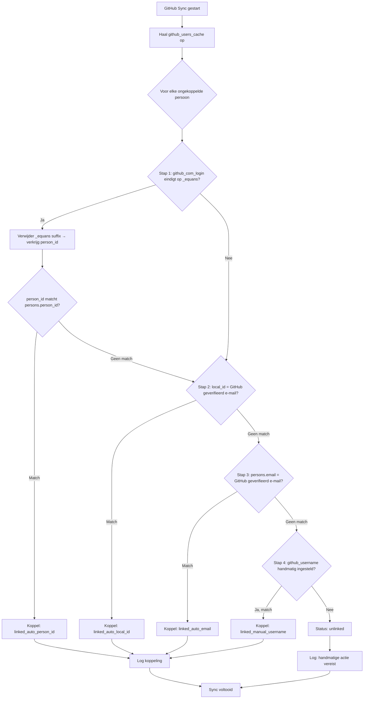
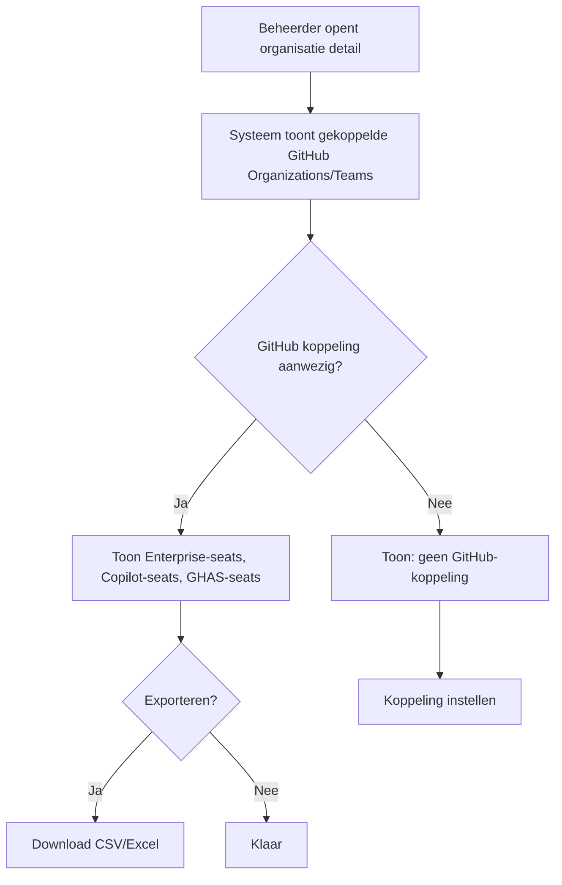

# FR-012: GitHub Gegevens Opslaan in Persons en Organizations

**Status:** Draft
**Datum:** 2026-03-17
**Auteur(s):** Ahmad Alhaj Asaad
**Gerelateerde BR:** [BR-002-Person-Organization-Management](../Business-Requirements/BR-002-Person-Organization-Management.md)
**Gerelateerde FR:** [FR-005-Person-Management](FR-005-Person-Management.md) [FR-006-Organization-Management](FR-006-Organization-Management.md) [FR-009-Atlassian-DB-Sync](FR-009-Atlassian-DB-Sync.md)
**Gerelateerde TR:** [TR-012-GitHub-DB-Sync](../Technical-Requirements/TR-012-GitHub-DB-Sync.md)

---

## Samenvatting

Dit document definieert de functionele requirements voor het **opslaan van GitHub-gegevens in de operationele tabellen `persons` en `organizations`**, en voor het **koppelen van GitHub-accountgegevens aan CSV-geïmporteerde persoons- en organisatiedata**.

De GitHub-cache (`github_users_cache`, `github_licenses_cache`, `github_copilot_cache`) bevat real-time licentie- en gebruiksdata van GitHub Enterprise. De operationele tabellen `persons` en `organizations` bevatten organisatorische masterdata die via CSV-import worden bijgehouden. Dit document beschrijft hoe die twee databronnen aan elkaar worden gekoppeld.

---

## Scope

### In Scope

- Koppelen van `github_users_cache` records aan `persons` records via `github_com_login` (minus `_equans` suffix = `person_id`) en als fallback via e-mailadressen
- Opslaan van de GitHub `github_com_login` (username) als stabiele identifier op een persoon
- Koppelen van GitHub Organizations en Teams aan `organizations` records
- Automatische koppeling bij GitHub-synchronisatie (achtergrondtaak)
- Handmatige synchronisatie starten via een knop in de beheer-UI (zonder wijziging van de automatische sync)
- Handmatige koppeling en ontkoppeling via beheer-UI
- Inzicht in koppelstatus per persoon en per organisatie
- Weergave van Enterprise-licenties, Copilot seats en GHAS-status per persoon en organisatie

### Out of Scope (MVP)

- Overschrijven van CSV-masterdata met GitHub-gegevens (GitHub is leidend voor licentiedata, CSV voor organisatorische data)
- Automatisch aanmaken van `persons` uit GitHub-gebruikers die niet via CSV zijn geïmporteerd
- SCIM-provisioning via GitHub
- Beheer van GitHub-rollen of -rechten vanuit de applicatie
- GitHub Actions gebruiksdata

---

## Context: Twee Databronnen

| Aspect                   | CSV-import (`persons`)                    | GitHub-cache                                                                 |
| ------------------------ | ----------------------------------------- | ---------------------------------------------------------------------------- |
| Bron                     | HR-systeem / Excel export (Palantir)      | GitHub Enterprise API                                                        |
| Inhoud                   | Naam, e-mail, org, land, kostenplaats     | Login, Enterprise-seat, Copilot-seat, GHAS-status                            |
| Frequentie               | Handmatig (periodiek)                     | Automatisch (dagelijks)                                                      |
| Unieke sleutel           | `person_id` (bijv. `ABG409`)              | `github_com_login` (bijv. `ABG409_equans`)                                   |
| Primaire koppelsleutel   | `person_id` (bijv. `ABG409`)              | `github_com_login` minus `_equans` suffix (bijv. `ABG409_equans` → `ABG409`) |
| Secundaire koppelsleutel | `local_id` (bijv. `ABG409@equans.com`)    | `github_com_verified_domain_emails` (bijv. `jim.veldhuis+equans@equans.com`) |
| Tertiaire koppelsleutel  | `email` (bijv. `jim.veldhuis@equans.com`) | `github_com_verified_domain_emails`                                          |
| Rol in systeem           | Organisatorische masterdata               | Licentie- en toegangsdata                                                    |

De koppeling maakt het mogelijk om per persoon te weten **welk GitHub-account** bij hem of haar hoort, zodat licentiekosten (Enterprise, Copilot, GHAS) kunnen worden doorbelast aan de juiste organisatie.

> **Belangrijk:** De `github_com_login` in GitHub volgt het patroon `{person_id}_equans` (bijv. `ABG409_equans`). Door het suffix `_equans` te verwijderen wordt de `person_id` verkregen (bijv. `ABG409`), die direct overeenkomt met het `person_id`-veld in de `persons`-tabel. Dit is de **primaire en meest betrouwbare koppelsleutel**.
>
> **Voorbeeld:**
>
> - GitHub login: `ABG409_equans` → strip `_equans` → `ABG409` = `person_id` van Jim Veldhuis
> - GitHub login: `RD5536_equans` → strip `_equans` → `RD5536` = `person_id` van Viktor Klein

---

## User Stories

### US-1: Automatische Koppeling bij GitHub Synchronisatie

**Als** Systeem
**Wil ik** na elke GitHub-synchronisatie automatisch personen koppelen aan hun GitHub-account
**Zodat** de koppelstatus altijd up-to-date is zonder handmatige actie

**Acceptatiecriteria:**

- Na elke achtergrond-synchronisatie worden nieuwe GitHub-gebruikers geprobeerd te koppelen aan bestaande `persons` op basis van e-mailadres
- Koppeling volgt de prioriteitsvolgorde: `person_id` via `_equans`-stripping → `local_id` → `email` → `github_username` (handmatig)
- Succesvolle koppelingen worden gelogd met koppelingstijdstip en -methode
- Reeds gekoppelde personen worden niet opnieuw gekoppeld tenzij het GitHub-account is veranderd
- Koppelingsfouten (geen match, meerdere matches) worden gelogd zonder de sync te stoppen

---

### US-2: Koppelstatus Inzien per Persoon

**Als** License Administrator
**Wil ik** per persoon kunnen zien of zij gekoppeld zijn aan een GitHub-account
**Zodat** ik kan controleren welke personen een GitHub Enterprise-licentie, Copilot-seat of GHAS-toegang hebben

**Acceptatiecriteria:**

- Personenlijst toont een kolom "GitHub Status" met de waarden: `Gekoppeld` / `Niet gekoppeld` / `Geen account`
- Koppelstatus toont wanneer de koppeling is gelegd en via welke methode
- Bij gekoppelde personen worden actieve GitHub-producten getoond (Enterprise, Copilot, GHAS)
- Filteroptie op koppelstatus is beschikbaar

---

### US-3: GitHub Gegevens Weergeven op Person Pagina

**Als** License Administrator
**Wil ik** de gekoppelde GitHub-gegevens kunnen zien op de persoon detail pagina
**Zodat** ik weet welke GitHub-producten een persoon gebruikt en welke kosten daarmee gemoeid zijn

**Acceptatiecriteria:**

- Person detail pagina toont GitHub-accountgegevens indien gekoppeld
- De volgende velden worden getoond: `github_login`, Enterprise-seat status, Copilot-seat status, GHAS-status, `last_activity_at`
- Indien niet gekoppeld wordt dit duidelijk aangegeven met een optie voor handmatige koppeling
- Data is real-time of maximaal 24 uur oud (afhankelijk van sync-interval)

---

### US-4: Koppeling GitHub Organizations en Teams aan Organisaties

**Als** License Administrator
**Wil ik** GitHub Organizations en Teams kunnen koppelen aan operationele organisaties
**Zodat** ik licentiekosten per organisatorische eenheid kan doorbelasten

**Acceptatiecriteria:**

- Organisaties tonen een optioneel veld "GitHub Organization" en "GitHub Teams"
- Koppeling kan worden gelegd op basis van naam-matching (automatisch) of handmatig
- Gekoppelde GitHub Organization toont het totaal aantal Enterprise-seats, Copilot-seats en GHAS-seats
- Meerdere GitHub Teams kunnen aan één operationele organisatie worden gekoppeld
- Eén GitHub Organization kan aan meerdere operationele organisaties worden gekoppeld via Teams

---

### US-5: Enterprise Licentie Overzicht per Organisatie

**Als** Finance Medewerker
**Wil ik** een overzicht zien van GitHub Enterprise-, Copilot- en GHAS-licenties per organisatie
**Zodat** ik de licentiekosten correct kan doorbelasten

**Acceptatiecriteria:**

- Organisatieoverzicht toont: totaal Enterprise-seats, gebruikte seats, Copilot-seats, GHAS-seats
- Data wordt opgesplitst per gekoppelde GitHub Organization of Team
- Overzicht is filterbaar op organisatie, land en licentiesoort
- Niet-gekoppelde GitHub-gebruikers worden apart weergegeven als "onbekende toewijzing"

---

### US-6: Gecombineerde Rapportage

**Als** Finance Medewerker
**Wil ik** een rapport kunnen genereren dat persoons- en organisatiedata combineert met GitHub-licentiedata
**Zodat** ik nauwkeurige chargeback-rapportages kan maken

**Acceptatiecriteria:**

- Rapport combineert: `person_id`, naam, e-mail, `org_id`, land, billing_location, `github_login`, actieve producten (Enterprise, Copilot, GHAS)
- Rapport is filterbaar op organisatie, land en GitHub-productstatus
- Rapport is exporteerbaar als CSV en Excel
- Personen zonder GitHub-account en GitHub-accounts zonder persoon worden apart weergegeven

---

### US-7: Handmatige Synchronisatie Starten via Knop

**Als** License Administrator
**Wil ik** een knop kunnen indrukken waarmee de GitHub-synchronisatie direct wordt gestart
**Zodat** ik niet hoef te wachten op de automatische dagelijkse sync bij urgente wijzigingen

**Acceptatiecriteria:**

- De beheer-UI toont een "Nu synchroniseren"-knop voor GitHub (Enterprise Licenties, Copilot, Gebruikers)
- Bij indrukken van de knop wordt de synchronisatietaak direct gestart in de achtergrond
- De knop toont een laad-indicator zolang de sync actief is en is disabled om dubbele uitvoering te voorkomen
- Na voltooiing toont de UI een bevestiging met tijdstip van de laatste sync
- Bij een fout toont de UI een foutmelding met de oorzaak
- De automatische dagelijkse synchronisatie blijft ongewijzigd actief, ongeacht gebruik van de handmatige knop
- Het tijdstip van de handmatige sync wordt vastgelegd (`last_manual_sync_at`) en is inzichtelijk voor beheerders
- Alleen gebruikers met de rol `License Administrator` of hoger kunnen de knop activeren

---

## Koppelingsmechanisme

### Automatische Matching Strategie (prioriteitsvolgorde)

| Prioriteit | CSV-veld / DB-kolom       | GitHub-veld                           | Beschrijving                                                                                                 |
| ---------- | ------------------------- | ------------------------------------- | ------------------------------------------------------------------------------------------------------------ |
| 1          | `persons.person_id`       | `github_com_login` (minus `_equans`)  | **Primaire match:** verwijder `_equans` suffix → `ABG409_equans` → `ABG409` = `person_id` (case-insensitive) |
| 2          | `persons.local_id`        | `github_com_verified_domain_emails`   | Fallback-1: `local_id` (`ABG409@equans.com`) matcht geverifieerd domein-e-mailadres in GitHub                |
| 3          | `persons.email`           | `github_com_verified_domain_emails`   | Fallback-2: persoonlijk werke-mailadres matcht geverifieerd domein-e-mailadres in GitHub                     |
| 4          | `persons.github_username` | `github_users_cache.github_com_login` | Handmatig ingesteld: username-veld is door beheerder gevuld                                                  |
| 5          | —                         | —                                     | Volledig handmatig: beheerder selecteert GitHub-account via zoekscherm                                       |

**Toelichting:**

- **Stap 1** (`person_id` via `_equans`-stripping) is de **primaire en meest betrouwbare methode**. De `github_com_login` volgt altijd het patroon `{person_id}_equans`. Door het suffix `_equans` te verwijderen wordt de `person_id` verkregen, die direct overeenkomt met het `person_id`-veld in de `persons`-tabel.
  - Voorbeeld: `ABG409_equans` → `ABG409` → koppel aan persoon met `person_id = ABG409` (Jim Veldhuis)
  - Voorbeeld: `RD5536_equans` → `RD5536` → koppel aan persoon met `person_id = RD5536` (Viktor Klein)
- **Stap 2** (`local_id`) wordt gebruikt als stap 1 geen match geeft (bijv. login volgt niet het `_equans`-patroon)
- **Stap 3** (`email`) wordt gebruikt als stap 1 en 2 geen resultaat geven
- **Stap 4** is alleen van toepassing als een beheerder eerder handmatig een `github_username` heeft ingesteld op de persoon; dit veld fungeert dan als koppelsleutel
- **Stap 5** is altijd mogelijk via de beheer-UI, ongeacht de automatische status

> **Let op:** GitHub logins die **niet** eindigen op `_equans` vallen terug op de stappen 2–5. Dit kan voorkomen bij externe of tijdelijke accounts.

### Koppelingstatus Definities

| Status                   | Betekenis                                                                                   |
| ------------------------ | ------------------------------------------------------------------------------------------- |
| `linked_auto_person_id`  | Automatisch gekoppeld via `github_com_login` minus `_equans` = `persons.person_id` (stap 1) |
| `linked_auto_local_id`   | Automatisch gekoppeld via `persons.local_id` = GitHub geverifieerd e-mailadres (stap 2)     |
| `linked_auto_email`      | Automatisch gekoppeld via `persons.email` = GitHub geverifieerd e-mailadres (stap 3)        |
| `linked_manual_username` | Gekoppeld via handmatig ingesteld `github_username` veld (stap 4)                           |
| `linked_manual`          | Volledig handmatig gekoppeld door beheerder via UI (stap 5)                                 |
| `unlinked`               | Geen koppeling gevonden via stap 1–4; handmatige actie vereist                              |
| `no_github_account`      | Persoon is niet gevonden in de GitHub-cache (actief noch inactief)                          |

---

## Workflows

### Workflow: Automatische Koppeling bij Synchronisatie

### Workflow: Handmatige Koppeling door Beheerder

1. Beheerder navigeert naar persoon detail pagina
2. Systeem toont huidige GitHub koppelstatus (`unlinked` of `no_github_account`)
3. Beheerder klikt op "GitHub Account Koppelen"
4. Systeem toont zoekscherm met GitHub-gebruikers uit `github_users_cache`
5. Beheerder zoekt op naam, e-mail of `github_login`
6. Beheerder selecteert het juiste GitHub-account
7. Systeem slaat koppeling op als `linked_manual` en logt de actie
8. Person detail pagina toont de bijgewerkte GitHub-gegevens

### Workflow: Licentie Overzicht Bekijken per Organisatie

---

## Bedrijfsregels

| Regel | Beschrijving                                                                                                                                                                                       |
| ----- | -------------------------------------------------------------------------------------------------------------------------------------------------------------------------------------------------- |
| BR-1  | GitHub is leidend voor licentiedata CSV-import bepaalt de organisatorische data; GitHub-data wordt nooit gebruikt om `person_id`, naam of `org_id` te overschrijven                                |
| BR-2  | Eén persoon, één GitHub-account een `persons`-record kan aan maximaal één `github_login` worden gekoppeld                                                                                          |
| BR-3  | Eén GitHub-account, één persoon een `github_login` kan aan maximaal één `persons`-record worden gekoppeld (unieke constraint)                                                                      |
| BR-4  | Koppeling blijft bij inactivering wanneer een persoon inactief wordt gemaakt via CSV-import, blijft de GitHub-koppeling behouden voor historische rapportage                                       |
| BR-5  | Handmatige koppeling overschrijft automatische een handmatige koppeling (`linked_manual` of `linked_manual_username`) wordt niet meer automatisch bijgewerkt                                       |
| BR-6  | Enterprise-seats zijn bepalend voor kosten een persoon telt mee als billable zodra hij/zij een actieve Enterprise-seat heeft, ongeacht Copilot of GHAS                                             |
| BR-7  | Copilot en GHAS zijn additionele kosten Copilot-seats en GHAS-seats worden apart bijgehouden en doorbelast bovenop de Enterprise-seat kosten                                                       |
| BR-8  | Organisatiekoppeling via Teams een GitHub Organization kan via meerdere Teams aan meerdere operationele organisaties worden gekoppeld; directe organisatiekoppeling (zonder Teams) is ook mogelijk |

---

## Data Requirements

### Person Weergave GitHub Sectie

| Veld                    | Type       | Bron                                    | Beschrijving                                    |
| ----------------------- | ---------- | --------------------------------------- | ----------------------------------------------- |
| `github_login`          | Tekst      | `github_users_cache.login`              | GitHub gebruikersnaam (bijv. `jdevries-equans`) |
| `github_account_id`     | Tekst      | `github_users_cache.id`                 | Numerieke GitHub user ID (stabiele identifier)  |
| Enterprise Seat Actief  | Boolean    | `github_licenses_cache`                 | Heeft de gebruiker een actieve Enterprise-seat  |
| Copilot Seat Actief     | Boolean    | `github_copilot_cache`                  | Heeft de gebruiker een actieve Copilot-seat     |
| Copilot Laatste Gebruik | Datum      | `github_copilot_cache.last_activity_at` | Datum van laatste Copilot-activiteit            |
| GHAS Actief             | Boolean    | `github_licenses_cache`                 | Heeft de gebruiker GHAS-toegang                 |
| `github_link_status`    | Enum       | `persons.github_link_status`            | Koppelstatus (zie statustabel)                  |
| `github_linked_at`      | Datum/tijd | `persons.github_linked_at`              | Tijdstip van koppeling                          |
| `github_linked_method`  | Tekst      | `persons.github_link_status`            | Koppelingsmethode                               |

### Organisatie Weergave GitHub Sectie

| Veld                              | Type   | Bron                             | Beschrijving                                             |
| --------------------------------- | ------ | -------------------------------- | -------------------------------------------------------- |
| Gekoppelde GitHub Organization(s) | Tekst  | `organizations.github_org_names` | Naam van de GitHub Enterprise Organization(s)            |
| Gekoppelde GitHub Teams           | Tekst  | `github_users_cache` (team veld) | Namen van gekoppelde Teams                               |
| Totaal Enterprise Seats           | Nummer | `github_licenses_cache`          | Aantal actieve Enterprise-seats voor deze org            |
| Totaal Copilot Seats              | Nummer | `github_copilot_cache`           | Aantal actieve Copilot-seats voor deze org               |
| Totaal GHAS Seats                 | Nummer | `github_licenses_cache`          | Aantal GHAS-seats voor deze org                          |
| Niet-gekoppelde Gebruikers        | Nummer | berekend                         | GitHub-gebruikers zonder `persons`-koppeling in deze org |

### Cache Tabellen Minimale Velden

#### `github_users_cache`

| Veld                | Type       | Beschrijving                             |
| ------------------- | ---------- | ---------------------------------------- |
| `id`                | Tekst      | GitHub numerieke user ID                 |
| `login`             | Tekst      | GitHub gebruikersnaam                    |
| `email`             | Tekst      | E-mailadres geregistreerd bij GitHub     |
| `name`              | Tekst      | Weergavenaam                             |
| `enterprise_role`   | Tekst      | Enterprise rol (bijv. `MEMBER`, `ADMIN`) |
| `organization_name` | Tekst      | Naam van de GitHub Organization          |
| `team_names`        | Array      | Teams waarvan de gebruiker lid is        |
| `synced_at`         | Datum/tijd | Tijdstip van laatste synchronisatie      |

#### `github_licenses_cache`

| Veld              | Type       | Beschrijving                             |
| ----------------- | ---------- | ---------------------------------------- |
| `enterprise_slug` | Tekst      | Enterprise identifier (bijv. `equans`)   |
| `total_seats`     | Nummer     | Totaal beschikbare Enterprise-seats      |
| `used_seats`      | Nummer     | Aantal actief gebruikte Enterprise-seats |
| `ghas_seats_used` | Nummer     | Aantal GHAS-seats in gebruik             |
| `synced_at`       | Datum/tijd | Tijdstip van laatste synchronisatie      |

#### `github_copilot_cache`

| Veld               | Type       | Beschrijving                                       |
| ------------------ | ---------- | -------------------------------------------------- |
| `github_login`     | Tekst      | GitHub gebruikersnaam                              |
| `seat_type`        | Tekst      | Type Copilot-seat (bijv. `business`, `enterprise`) |
| `is_active`        | Boolean    | Is de seat actief                                  |
| `last_activity_at` | Datum/tijd | Datum van laatste Copilot-gebruik                  |
| `assigning_team`   | Tekst      | Team dat de seat heeft toegewezen                  |
| `synced_at`        | Datum/tijd | Tijdstip van laatste synchronisatie                |

---

## Acceptatiecriteria Overzicht

### Koppeling PersonenGitHub (MUST HAVE)

- [ ] `persons` tabel heeft een stabiel veld voor `github_login` en `github_account_id`
- [ ] `persons` tabel heeft een veld `github_username` voor handmatig ingestelde usernames (stap 4)
- [ ] Na GitHub-synchronisatie: primaire koppeling via stap 1 (`github_com_login` minus `_equans` = `persons.person_id`)
- [ ] Systeem verwijdert automatisch het suffix `_equans` van `github_com_login` voor de matching
- [ ] Fallback stap 2: automatische koppeling via `persons.local_id` = GitHub geverifieerd e-mailadres
- [ ] Fallback stap 3: automatische koppeling via `persons.email` = GitHub geverifieerd e-mailadres indien stap 2 geen match geeft
- [ ] GitHub logins die niet eindigen op `_equans` worden direct doorgestuurd naar stap 2
- [ ] Koppelstatus en -methode worden opgeslagen met tijdstip
- [ ] GitHub-gegevens worden getoond op Person detail pagina (login, Enterprise-seat, Copilot-seat, GHAS, last_activity)
- [ ] Handmatige koppeling via beheer-UI is mogelijk
- [ ] GET endpoint beschikbaar voor ophalen GitHub-koppelstatus per persoon

### Koppeling OrganisatiesGitHub (SHOULD HAVE)

- [ ] `organizations` tabel ondersteunt koppeling aan één of meerdere GitHub Organizations
- [ ] `organizations` tabel ondersteunt koppeling aan GitHub Teams
- [ ] Automatische org/team-matching op naam is beschikbaar
- [ ] Licentieoverzicht (Enterprise, Copilot, GHAS) per organisatie is beschikbaar

### Rapportage (SHOULD HAVE)

- [ ] Gecombineerde persoons- en licentiedata is opvraagbaar
- [ ] CSV-export van koppelstatus inclusief GitHub-licentiedata is beschikbaar
- [ ] Niet-gekoppelde GitHub-accounts worden apart weergegeven

### Cache Beheer (MUST HAVE)

- [ ] `github_users_cache` wordt dagelijks gesynchroniseerd
- [ ] `github_licenses_cache` wordt dagelijks gesynchroniseerd
- [ ] `github_copilot_cache` wordt dagelijks gesynchroniseerd
- [ ] Sync-tijdstip en -status zijn inzichtelijk voor beheerders

### Handmatige Synchronisatie (SHOULD HAVE)

- [ ] "Nu synchroniseren"-knop is beschikbaar in de beheer-UI voor GitHub-producten
- [ ] Knop start de synchronisatietaak direct in de achtergrond
- [ ] Knop is disabled (met laad-indicator) zolang een sync actief is
- [ ] Bevestiging met tijdstip wordt getoond na succesvolle sync
- [ ] Foutmelding wordt getoond bij mislukte sync
- [ ] Automatische dagelijkse sync blijft ongewijzigd
- [ ] Tijdstip van handmatige sync (`last_manual_sync_at`) wordt opgeslagen
- [ ] Alleen geautoriseerde rollen kunnen de sync starten

---

## Error Handling

| Scenario                                          | Foutmelding                                                                          | Actie                                                                       |
| ------------------------------------------------- | ------------------------------------------------------------------------------------ | --------------------------------------------------------------------------- |
| Handmatige sync gestart terwijl sync actief is    | —                                                                                    | Knop is disabled; geen dubbele uitvoering mogelijk                          |
| Handmatige sync mislukt door API-fout             | "GitHub-synchronisatie mislukt. Reden: [fout]. Laatste succesvolle sync: [tijdstip]" | Foutmelding in UI; automatische sync blijft gepland                         |
| GitHub API niet beschikbaar tijdens sync          | "GitHub-data is tijdelijk niet beschikbaar. Laatste sync: [tijdstip]"                | Toon last-known data met tijdstip; sync opnieuw inplannen                   |
| Meerdere GitHub-accounts gevonden voor één e-mail | "Meerdere GitHub-accounts gevonden voor [email]. Handmatige selectie vereist."       | Status `unlinked`, log conflict, beheerder actie vereist                    |
| GitHub-account al gekoppeld aan andere persoon    | "GitHub-account [login] is al gekoppeld aan [naam]."                                 | Koppeling geblokkeerd; beheerder moet bestaande koppeling eerst verwijderen |
| Koppeling niet mogelijk: geen e-mail in GitHub    | "Geen e-mailadres beschikbaar voor GitHub-gebruiker [login]."                        | Status `unlinked`; handmatige koppeling via stap 4 vereist                  |
| Export mislukt                                    | "Export kon niet worden voltooid. Probeer opnieuw."                                  | Retry knop tonen                                                            |
| GitHub rate limit bereikt                         | "GitHub API limiet bereikt. Sync hervat over [tijd]."                                | Sync wordt automatisch hervat; gebruiker ontvangt notificatie               |

---

## Prioritering

| Requirement                                                        | Prioriteit  | Release |
| ------------------------------------------------------------------ | ----------- | ------- |
| `person_id`-gebaseerde koppeling via `_equans`-stripping (stap 1)  | MUST HAVE   | MVP     |
| `local_id`-gebaseerde automatische koppeling als fallback (stap 2) | MUST HAVE   | MVP     |
| `email`-gebaseerde automatische koppeling als fallback (stap 3)    | MUST HAVE   | MVP     |
| `github_username` veld voor handmatige koppelsleutel (stap 4)      | MUST HAVE   | MVP     |
| `github_login` en `github_account_id` veld in `persons`            | MUST HAVE   | MVP     |
| Enterprise-, Copilot- en GHAS-statusvelden op persoon pagina       | MUST HAVE   | MVP     |
| Koppelstatus in personenoverzicht                                  | MUST HAVE   | MVP     |
| GET endpoint voor GitHub-koppelstatus                              | MUST HAVE   | MVP     |
| `github_users_cache` dagelijkse sync                               | MUST HAVE   | MVP     |
| `github_licenses_cache` dagelijkse sync                            | MUST HAVE   | MVP     |
| `github_copilot_cache` dagelijkse sync                             | MUST HAVE   | MVP     |
| Koppeling organisatiesGitHub Organizations/Teams                   | SHOULD HAVE | v1.1    |
| Licentieoverzicht per organisatie (Enterprise, Copilot, GHAS)      | SHOULD HAVE | v1.1    |
| Gecombineerde CSV-exportrapportage                                 | SHOULD HAVE | v1.1    |
| Handmatige volledige koppeling via UI (stap 4)                     | SHOULD HAVE | v1.1    |
| "Nu synchroniseren"-knop voor GitHub in beheer-UI                  | SHOULD HAVE | v1.1    |

---

## Gerelateerde Documenten

- Business Requirement: [BR-002-Person-Organization-Management](../Business-Requirements/BR-002-Person-Organization-Management.md)
- Technical Requirement: [TR-012-GitHub-DB-Sync](../Technical-Requirements/TR-012-GitHub-DB-Sync.md)
- Vergelijkbaar document: [FR-009-Atlassian-DB-Sync](FR-009-Atlassian-DB-Sync.md)
