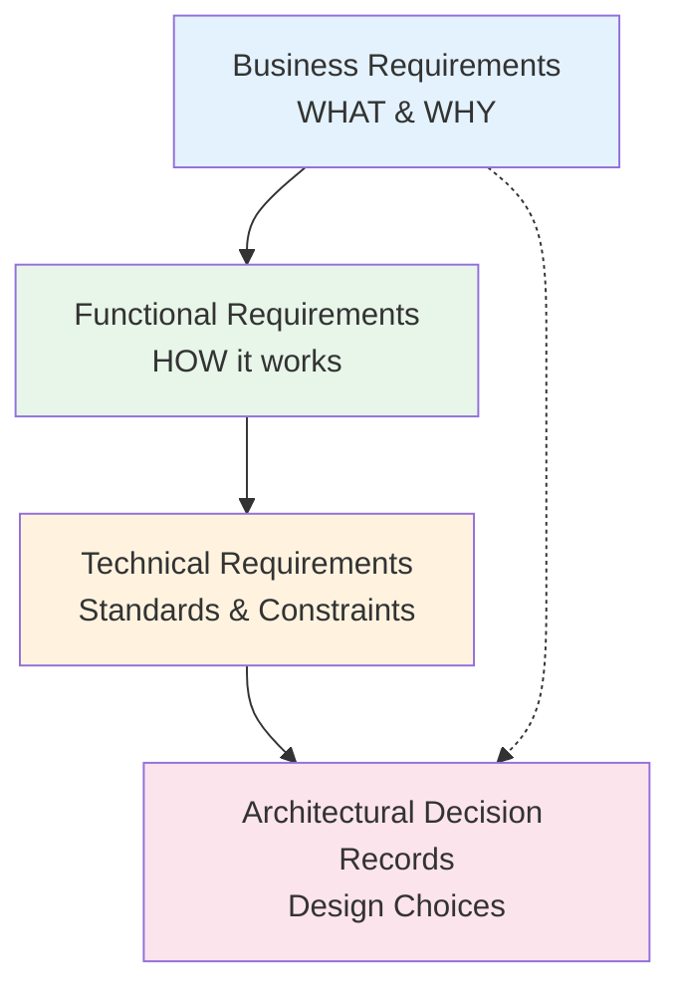

# DP-DevEx-Platform Documentation

Welcome to the DP-DevEx-Platform documentation. This multi-vendor billing data collection and analytics system helps you track usage, licenses, and costs across GitHub Enterprise, Atlassian, and JFrog platforms.

## Documentation Framework

This project follows a structured documentation approach with four types of documents, each serving a specific purpose in the development lifecycle. Understanding when and how to use each type ensures clear communication between stakeholders, developers, and architects.



### Document Types Overview

| Document Type           | Purpose                                            | Audience                                   | Location                               |
| ----------------------- | -------------------------------------------------- | ------------------------------------------ | -------------------------------------- |
| Business Requirements   | Define **what** needs to be built and **why**      | Product owners, stakeholders, developers   | `docs/Business-Requirements/`          |
| Functional Requirements | Describe **how** it should work (user perspective) | Designers, developers, QA                  | `docs/Functional-Requirements/`        |
| Technical Requirements  | Specify **standards** and **constraints**          | Developers, architects                     | `docs/Technical-Requirements/`         |
| ADRs                    | Record **decisions** and **rationale**             | Architects, developers, future maintainers | `docs/Architectural-Decision-Records/` |

---

## 1. Business Requirements

**Purpose:** Capture the business need, problem statement, and expected value. These documents answer "What are we building?" and "Why does it matter?"

**Location:** `docs/Business-Requirements/`

**When to Create:**

- Starting a new feature or project
- Addressing a stakeholder request
- Solving a business problem

**Key Sections:**

- **Problem Statement** - What problem are we solving?
- **Business Value** - Why is this important? What is the ROI?
- **Stakeholders** - Who benefits from this solution?
- **Success Criteria** - How do we measure success?
- **Scope** - What is in/out of scope?
- **Dependencies** - What other systems or teams are involved?

**Naming Convention:** `BR-XXX-[Feature-Name].md`

**Example:**

```markdown
# BR-001: Multi-Vendor Chargeback Reporting

**Status:** Approved
**Date:** 2026-02-01
**Author:** Product Team
**Stakeholders:** Finance, Team Managers

## Problem Statement

Team managers lack visibility into per-team software costs across GitHub,
Atlassian, and JFrog platforms, making budget allocation difficult.

## Business Value

- Enable accurate cost attribution per team/department
- Support quarterly chargeback processes
- Reduce finance team manual work by 80%

## Success Criteria

- [ ] Costs attributable to individual teams
- [ ] Monthly cost reports available within 24 hours
- [ ] Integration with existing finance systems
```

---

## 2. Functional Requirements

**Purpose:** Describe how the system should behave from a user's perspective without diving into technical implementation details. These focus on the user experience and system behavior.

**Location:** `docs/Functional-Requirements/`

**When to Create:**

- Translating business requirements into user-facing behavior
- Defining features and workflows
- Before starting UI/UX design or development

**Key Sections:**

- **User Stories** - As a [role], I want [feature], so that [benefit]
- **Acceptance Criteria** - Specific conditions for completion
- **Workflows** - Step-by-step user journeys
- **Business Rules** - Constraints on behavior
- **Data Requirements** - What information is needed/displayed
- **Error Handling** - Expected behavior for edge cases

**Naming Convention:** `FR-XXX-[Feature-Name].md`

**Guidelines:**

- Write from the user's perspective
- Avoid technical jargon (no database schemas, API endpoints, etc.)
- Focus on observable behavior
- Include diagrams for complex workflows

**Example:**

```markdown
# FR-001: Team Cost Dashboard

**Status:** Draft
**Date:** 2026-02-01
**Related BR:** BR-001

## User Stories

### US-1: View Team Costs

**As a** Team Manager
**I want to** see a dashboard of my team's software costs
**So that** I can track spending against budget

### Acceptance Criteria

- [ ] Dashboard displays costs grouped by vendor (GitHub, Atlassian, JFrog)
- [ ] Costs are shown in the user's preferred currency
- [ ] Date range selector allows filtering by month/quarter/year
- [ ] Export to CSV is available

## Workflow: Viewing Monthly Costs

1. User navigates to "Cost Dashboard"
2. System displays current month's costs by default
3. User selects desired date range
4. System updates display with filtered data
5. User can drill down into specific vendor details
```

---

## 3. Technical Requirements

**Purpose:** Define the technical standards, constraints, and specifications that solutions must comply with. These ensure consistency, security, and maintainability across the codebase.

**Location:** `docs/Technical-Requirements/`

**When to Create:**

- Establishing standards for new technology areas
- Defining integration patterns
- Setting security or performance requirements
- Before implementation of complex features

**Key Sections:**

- **Scope** - What systems/features does this apply to?
- **Standards** - Required patterns and practices
- **Constraints** - Limitations to work within
- **Security Requirements** - Authentication, authorization, data protection
- **Performance Requirements** - SLAs, response times, throughput
- **Compatibility** - Browser support, API versions, dependencies
- **Testing Requirements** - Coverage, types of tests required

**Naming Convention:** `TR-XXX-[Topic].md`

**Guidelines:**

- Be specific and measurable
- Reference existing standards (e.g., OWASP, PEP 8)
- Include code examples where helpful
- Link to related ADRs for design decisions

**Example:**

````markdown
# TR-001: API Design Standards

**Status:** Active
**Date:** 2026-01-15
**Applies To:** All backend REST APIs

## Standards

### Naming Conventions

- Use lowercase with hyphens for URLs: `/api/v1/team-costs`
- Use snake_case for JSON fields: `{ "team_name": "DevOps" }`

### Versioning

- All APIs must be versioned: `/api/v1/`, `/api/v2/`
- Breaking changes require a new major version

### Response Format

All responses must follow this structure:

```json
{
  "success": true,
  "data": { ... },
  "meta": { "page": 1, "total": 100 }
}
```
````

### Performance Requirements

- P95 response time: < 200ms
- Maximum payload size: 10MB

### Security

- All endpoints require authentication (JWT)
- Sensitive data must be logged with masking

````

---

## 4. Architectural Decision Records (ADRs)

**Purpose:** Document significant architectural decisions, including the context, decision, alternatives considered, and consequences. ADRs create a historical record of why certain approaches were chosen over others.

**Location:** `docs/Architectural-Decision-Records/` (root directory)

**When to Create:**
- Choosing between multiple valid approaches
- Making decisions that are difficult to reverse
- Introducing new technologies or patterns
- Deviating from established standards
- Decisions that affect multiple teams or systems

**Key Sections:**
- **Context** - Why is this decision needed?
- **Decision** - What approach are we taking?
- **Alternatives Considered** - What other options exist?
- **Consequences** - What are the positive/negative outcomes?
- **Implementation Roadmap** - How will this be implemented?

**Naming Convention:** `ADR-XXX-[Decision-Title].md`

**Status Values:**
- `Proposed` - Under review
- `Accepted` - Approved and active
- `Deprecated` - No longer recommended
- `Superseded` - Replaced by another ADR

**Template:** See [ADR-Template.md](../ADR/ADR-Template.md) for the full template.

**Guidelines:**
- Focus on the "why" - decisions are valuable; rationale is invaluable
- Document alternatives honestly, even if they were close calls
- Update status when decisions change
- Link to related ADRs when decisions build on each other

**Example:**
```markdown
# ADR-005: PostgreSQL for Primary Data Storage

**Status:** Accepted
**Date:** 2026-01-10
**Authors:** Architecture Team

## Context
We need a database solution that supports complex billing calculations,
audit compliance, and integration with multiple vendor data sources.

## Decision
We will use PostgreSQL as the primary database for all billing and
operational data.

## Alternatives Considered

### MongoDB
**Pros:** Flexible schema, horizontal scaling
**Cons:** Complex transactions, eventual consistency
**Rejected:** Billing data requires ACID transactions

### MySQL
**Pros:** Widely supported, familiar
**Cons:** Less capable JSON support, fewer advanced features
**Rejected:** We need advanced JSON querying for vendor data

## Consequences
### Positive
- Strong ACID guarantees for financial data
- Excellent JSON support for vendor-specific fields
- Rich ecosystem of tools and extensions

### Negative
- Vertical scaling limitations (acceptable for current scale)
- Requires database expertise for optimization
````

---

## Document Workflow

### Creating New Documentation

1. **Identify the document type** based on the content purpose
2. **Use the correct template** from the respective folder
3. **Follow naming conventions** for consistency
4. **Link related documents** (e.g., FR links to BR, ADR links to TR)
5. **Set appropriate status** (Draft, Proposed, Approved, etc.)
6. **Get reviews** from relevant stakeholders

### Maintaining Documentation

- Update documents when requirements change
- Mark obsolete documents as `Deprecated`
- Keep status fields current
- Add revision history for significant changes

### Linking Documents

Create explicit links between related documents:

```markdown
**Related Documents:**

- Business Requirement: [BR-001](Business-Requirements/BR-001-Chargeback.md)
- Functional Requirement: [FR-001](Functional-Requirements/FR-001-Dashboard.md)
- Technical Requirement: [TR-001](Technical-Requirements/TR-001-API-Standards.md)
- ADR: [ADR-005](.Architectural-Decision-Records/ADR-005-Database-Choice.md)
```

---

## Quick Reference

| I need to...                  | Create a...            | In folder...                           |
| ----------------------------- | ---------------------- | -------------------------------------- |
| Capture a stakeholder request | Business Requirement   | `docs/Business-Requirements/`          |
| Define user-facing behavior   | Functional Requirement | `docs/Functional-Requirements/`        |
| Set coding/API standards      | Technical Requirement  | `docs/Technical-Requirements/`         |
| Record a design choice        | ADR                    | `docs/Architectural-Decision-Records/` |

## Getting Started

- [API Documentation](API_DOCUMENTATION.md) - Backend API reference
- [Configuration Guide](CONFIGURATION.md) - Environment setup
- [Service Catalog](SERVICE-CATALOG.md) - Available services

---

**Last Updated:** 2026-02-11
**Version:** 1.0.0
**Maintained By:** DP-DevEx-Platform Team
