---
title: "Software Design Document  Equans Operational Insights Dashboard"
subtitle: "Afstudeerscriptie  Technisch Ontwerpdocument"
author: "Ahmad Alhaj Asaad"
version: "1.0"
status: "Definitief"
---

# Software Design Document (SDD)

## Equans Operational Insights Dashboard

---

| Documentmeta        | Waarde                                        |
| ------------------- | --------------------------------------------- |
| **Documentnummer**  | SDD-001                                       |
| **Versie**          | 1.0                                           |
| **Status**          | Definitief                                    |
| **Datum**           | 8 maart 2026                                  |
| **Auteur**          | Ahmad Alhaj Asaad                             |
| **Instelling**      | Equans SLS Digital Platforms / DevOps Forge   |
| **Begeleider**      | Brian Veltman                                 |
| **Opdrachtgever**   | Viktor Klein                                  |
| **Gerelateerd SRS** | SRS-001 (Software Requirements Specification) |

---

## Samenvatting

Dit Software Design Document (SDD) beschrijft het technisch ontwerp van het **Equans Operational Insights Dashboard**, een full-stack webapplicatie die is ontwikkeld in het kader van een afstudeeronderzoek bij Equans SLS Digital Platforms. Het systeem biedt een gecentraliseerd inzicht in licentieverbruik en bijbehorende kosten voor softwareplatformen als Atlassian (Jira Software, Confluence, Trello), GitHub Enterprise en JFrog Artifactory.

Het document is opgesteld conform de IEEE 1016-2009-standaard voor softwaredocumentatie en beschrijft de architecturele beslissingen, componentstructuren, data- en interfaceontwerpen, beveiligingsmechanismen en deploymentstrategie. Alle structurele en gedragsdiagrammen zijn weergegeven als uitvoerbare Mermaid-code, conform de vereisten voor reproduceerbare technische documentatie.

De applicatie volgt een meerlagenarchitectuur bestaande uit een React/TypeScript-frontend (Vite), een Rust/Axum REST API-backend en een PostgreSQL-database, gecontaineriseerd via Docker Compose. Het ontwerp is gericht op schaalbaarheid, onderhoudbaarheid en beveiligde dataverwerkend, waarbij scheiding van verantwoordelijkheden (Separation of Concerns) en het principe van enkel verantwoordelijkheid (Single Responsibility Principle) leidend zijn.

---

## Inhoudsopgave

1. [Inleiding](#1-inleiding)
   - 1.1 Doelstelling van het document
   - 1.2 Projectachtergrond en probleemstelling
   - 1.3 Scope en afbakening
   - 1.4 Leeswijzer
2. [Theoretisch kader](#2-theoretisch-kader)
   - 2.1 Architectuurpatronen
   - 2.2 Ontwerppricipes
3. [Systeemoverzicht](#3-systeemoverzicht)
   - 3.1 Conceptueel architectuurdiagram
   - 3.2 Technologiestack
4. [Architectuurontwerp](#4-architectuurontwerp)
   - 4.1 Drielagenarchitectuur
   - 4.2 Componentdiagram
   - 4.3 Pakketdiagram
5. [Componentontwerp](#5-componentontwerp)
   - 5.1 Frontend-laag (React/TypeScript)
   - 5.2 Backend-laag (Rust/Axum)
   - 5.3 Configuratiebeheer
6. [Data-ontwerp](#6-data-ontwerp)
   - 6.1 Conceptueel gegevensmodel
   - 6.2 Entiteit-Relatiediagram
   - 6.3 Gegevensstroomdiagram
7. [Interface-ontwerp](#7-interface-ontwerp)
   - 7.1 REST API-specificatie
   - 7.2 Sequentiediagrammen
   - 7.3 Activiteitendiagram: importproces
8. [Beveiligingsontwerp](#8-beveiligingsontwerp)
   - 8.1 Authenticatie- en autorisatiestroom
   - 8.2 Beveiligingslagen
9. [Deploymentontwerp](#9-deploymentontwerp)
   - 9.1 Containerarchitectuur
   - 9.2 Deploymentdiagram
10. [Testontwerp](#10-testontwerp)
    - 10.1 Teststrategie
    - 10.2 Stateovergangen in foutgevallen
11. [Conclusie en aanbevelingen](#11-conclusie-en-aanbevelingen)
12. [Referenties](#12-referenties)

---

## 1. Inleiding

### 1.1 Doelstelling van het document

Dit Software Design Document (SDD) heeft als primaire doelstelling het gedetailleerd vastleggen van de technische ontwerpen en architecturale beslissingen die ten grondslag liggen aan het Equans Operational Insights Dashboard. Het document voldoet aan de IEEE 1016-2009-standaard voor softwaredocumentatie en dient als:

- **Technisch referentiedocument** voor het ontwikkelteam en toekomstige onderhoudsprogrammeur;
- **Toetsingsdocument** waarmee kan worden geverifieerd of de implementatie aansluit bij de gestelde Requirements (zie SRS-001);
- **Academisch verantwoordingsdocument** in het kader van de afstudeerscriptie.

### 1.2 Projectachtergrond en probleemstelling

Equans is een internationale technische dienstverlener die voor haar interne bedrijfsvoering meerdere softwareplatformen inzet: Atlassian (Jira Software, Confluence, Trello), GitHub Enterprise en JFrog Artifactory. Deze platformen bezitten elk een eigen licentie- en gebruikersbeheeromgeving, hetgeen resulteert in een gefragmenteerd inzicht in licentieverbruik en de bijbehorende kosten.

Dit fragmentatie veroorzaakt drie concrete bedrijfskundige knelpunten:

1. **Transparantiegebrek**: Licentiebeheerders beschikken niet over een actueel, geconsolideerd kostenoverzicht per platform en per organisatorische eenheid.
2. **Inefficiënte kostentoewijzing**: De doorbelasting van licentiekosten aan interne kostenplaatsen vereist tijdrovend handmatig werk en is foutgevoelig.
3. **Ongeïdentificeerde inactiviteit**: Inactieve licenties worden niet systematisch gedetecteerd, wat leidt tot vermijdbare uitgaven.

De centrale onderzoeksvraag luidt derhalve:

> _Hoe kan een gecentraliseerd, geautomatiseerd en visueel inzichtelijk dashboard worden ontworpen en geïmplementeerd waarmee Equans haar licentieverbruik en licentiekosten cross-platform kan monitoren en doorbelasten?_

### 1.3 Scope en afbakening

Het ontwerp beschreven in dit document omvat:

**Binnen scope:**

- React/TypeScript Single Page Application (SPA) met Vite als build-tool;
- Rust/Axum REST API-backend;
- PostgreSQL-database voor persistente opslag;
- Containerisatie via Docker Compose;
- Integratie met de Atlassian Admin API (Jira Software, Confluence, Trello);
- Authenticatie via JWT / Equans SSO (Microsoft Azure Active Directory);
- Licentiekostendashboard (FR-010), personenbeheer (FR-005), organisatiebeheer (FR-006) en data-import (FR-007).

**Buiten scope:**

- Directe terugschrijfoperaties naar externe vendor-API's (read-only architectuur);
- Real-time streamingdatacollectie (uitsluitend batch-/polling-verversing);
- JFrog-integratie (gepland voor volgende iteratie);
- GitHub-licentiedashboard (FR-001, toekomstige sprint).

### 1.4 Leeswijzer

Dit document is als volgt opgebouwd: Hoofdstuk 2 beschrijft het theoretisch kader. Hoofdstuk 3 geeft een systeemoverzicht. Hoofdstukken 4 en 5 beschrijven respectievelijk het architectuur- en het componentontwerp. Hoofdstuk 6 behandelt het data-ontwerp, hoofdstuk 7 het interface-ontwerp. Hoofdstukken 8 en 9 beschrijven beveiliging en deployment. Hoofdstuk 10 bevat het testontwerp. Het document wordt afgesloten met een conclusie (hoofdstuk 11) en referenties (hoofdstuk 12).

---

## 2. Theoretisch kader

### 2.1 Architectuurpatronen

Het systeem maakt gebruik van een **drielagenarchitectuur** (Three-Tier Architecture), een klassiek en breed toegepast patroon waarbij de presentatielaag, de applicatielaag en de datalaag fysiek en logisch worden gescheiden (Fowler, 2002). Dit patroon bevordert onafhankelijke schaalbaarheid en onderhoudbaarheid per laag.

Binnen de frontend-laag is gekozen voor het **component-gebaseerd ontwerp** (Component-Based Architecture), zoals gepropageerd door het React-ecosysteem. Componenten zijn zelfstandige, herbruikbare en samengestelde UI-eenheden die via props en state communiceren (Abramov & Clark, 2015).

De backend volgt het **Repository-patroon** voor data-abstractie en het **Handler-Service-Model** voor scheiding tussen HTTP-afhandeling en bedrijfslogica, conform de principes van Clean Architecture (Martin, 2018).

### 2.2 Ontwerpprincipes

De volgende ontwerpprincipes zijn leidend bij het ontwerp en de implementatie:

| Principe                                  | Toepassing in dit systeem                                                                                                   |
| ----------------------------------------- | --------------------------------------------------------------------------------------------------------------------------- |
| **Separation of Concerns (SoC)**          | Frontend, backend en database zijn strikte, gescheiden lagen met expliciete interfaces.                                     |
| **Single Responsibility Principle (SRP)** | Elke React-component en Rust-module heeft één duidelijk afgebakende verantwoordelijkheid.                                   |
| **DRY (Don't Repeat Yourself)**           | Gedeelde TypeScript-types worden geëxporteerd via een centraal `types/index.ts`; productprijzen in één `productPricing.ts`. |
| **Fail Fast**                             | API-fouten worden direct aan de gebruiker gerapporteerd; er wordt nooit stilzwijgend teruggevallen op verouderde data.      |
| **Security by Design**                    | Authenticatie is verplicht op alle endpoints; geheimen worden uitsluitend beheerd via omgevingsvariabelen.                  |

---

## 3. Systeemoverzicht

### 3.1 Conceptueel architectuurdiagram

Het onderstaande diagram geeft het conceptueel overzicht van het volledige systeem, inclusief de externe API-integraties en de communicatiepatronen.

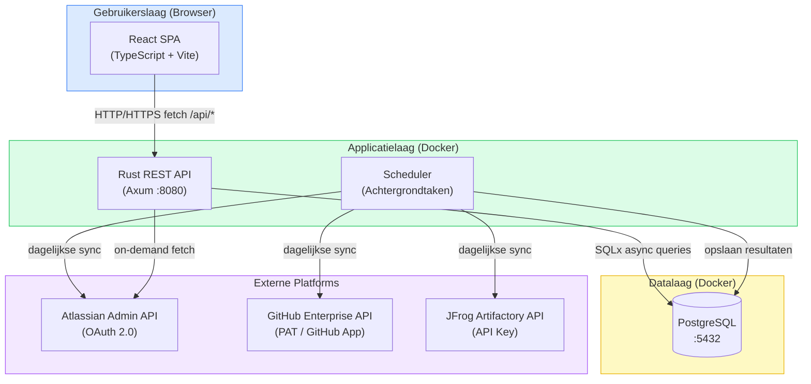

### 3.2 Technologiestack

| Laag              | Technologie    | Versie | Motivering                                            |
| ----------------- | -------------- | ------ | ----------------------------------------------------- |
| **Frontend**      | React          | ^19.x  | Component-gebaseerde UI; groot ecosysteem             |
| **Frontend**      | TypeScript     | ~5.9.x | Statische typering voor betrouwbaardere code          |
| **Frontend**      | Vite           | ^7.x   | Snelle HMR en optimale productie-bundle               |
| **Backend**       | Rust           | stable | Geheugenveiligheid, hoge prestaties, geen GC-pauzes   |
| **Backend**       | Axum           | 0.7.x  | Async HTTP-framework; naadloze Tokio-integratie       |
| **Backend**       | SQLx           | 0.8.x  | Type-safe async SQL-queries; compile-time verificatie |
| **Database**      | PostgreSQL     | 16     | ACID-compliant; rijke queryondersteuning              |
| **Container**     | Docker Compose | v2     | Reproduceerbare lokale en productieomgeving           |
| **Authenticatie** | JWT + Azure AD |        | Equans SSO-standaard                                  |

---

## 4. Architectuurontwerp

### 4.1 Drielagenarchitectuur

De volgende klassenstructuur illustreert de logische scheiding tussen de drie lagen en de communicatierichtingen.

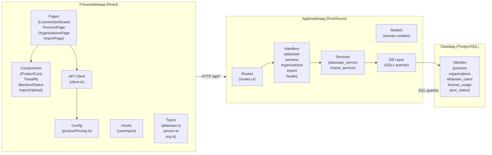

### 4.2 Componentdiagram

Het onderstaande diagram geeft de volledige componenthiërarchie van de frontend weer, inclusief de datastromen tussen componenten.

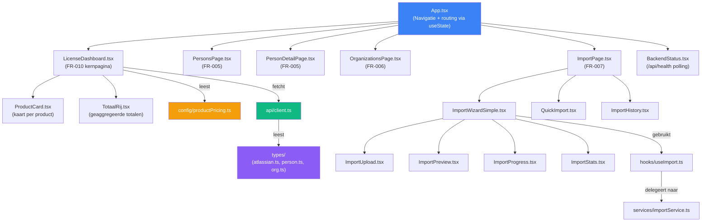

### 4.3 Pakketdiagram (module-afhankelijkheden)

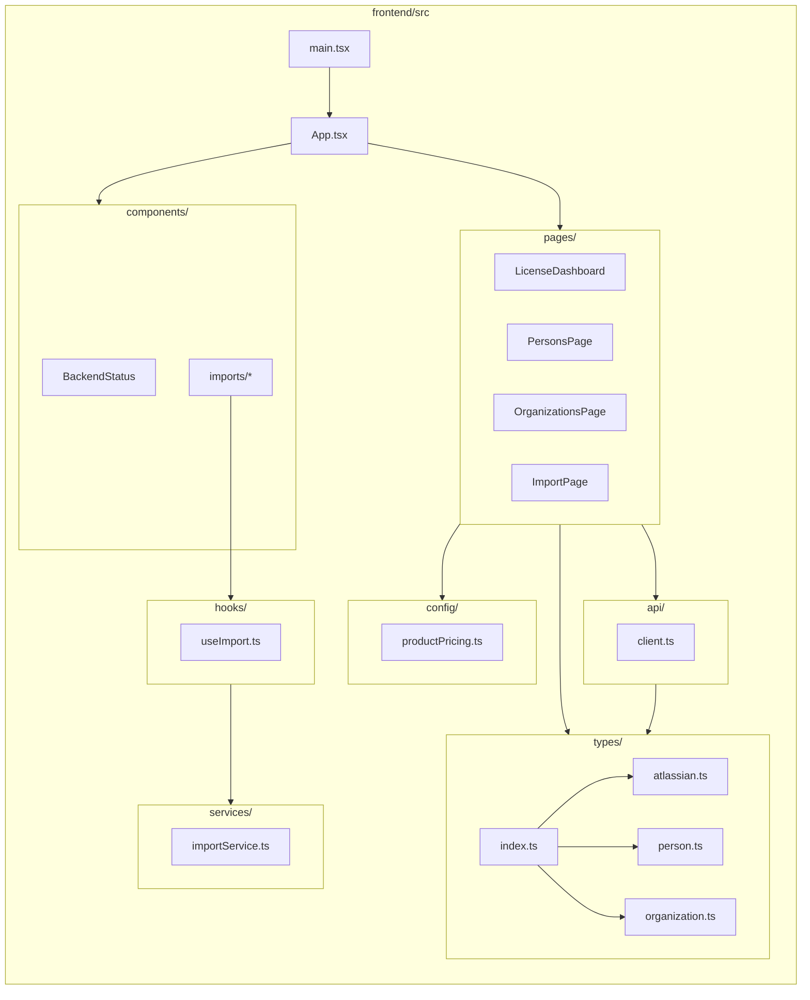

---

## 5. Componentontwerp

### 5.1 Frontend-laag (React/TypeScript)

#### 5.1.1 LicenseDashboard

`LicenseDashboard.tsx` is de kernpagina van FR-010. De component is verantwoordelijk voor:

- Het ophalen van de lijst met Atlassian-organisaties via de backend;
- Het ophalen van licentieaantallen per organisatie en per product;
- Het berekenen van maandelijkse inkoopkosten, factureerbare bedragen en consultancymarges op basis van de gecentraliseerde prijsconfiguratie;
- Het renderen van een `ProductCard` per product en een `TotaalRij` met geaggregeerde totalen.

**Berekeningslogica:**

```
totalCost      = costPerUser     × userCount
totalBillable  = billablePerUser × userCount
totalMargin    = margin          × userCount
marginPct      = (margin / costPerUser) × 100
```

**State-diagram van LicenseDashboard:**

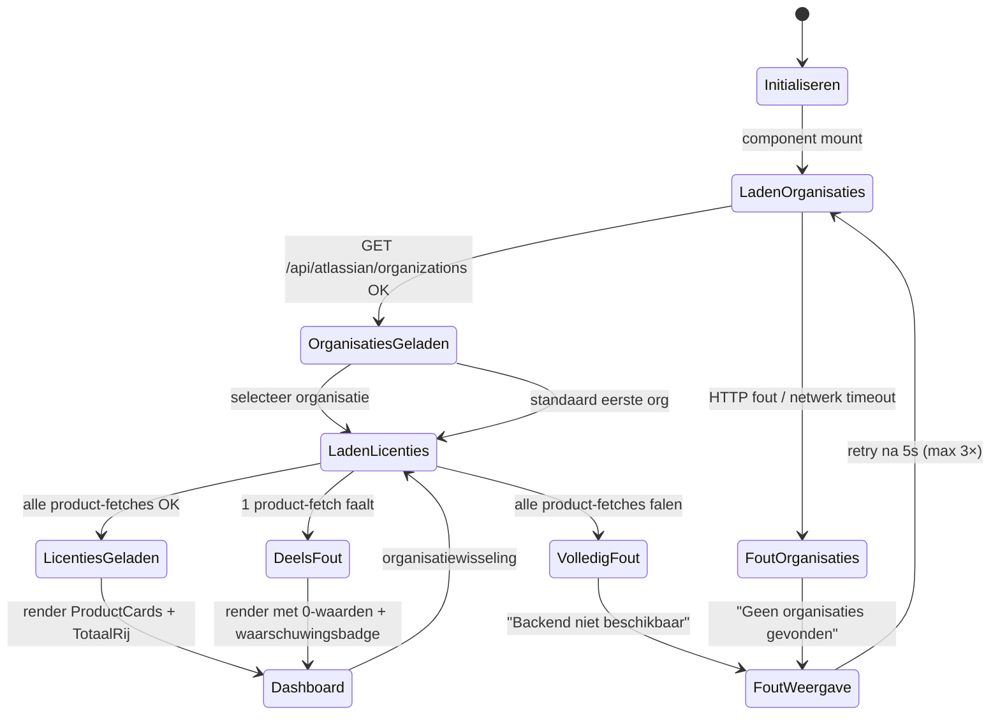

#### 5.1.2 ProductCard

`ProductCard.tsx` is een presentatiecomponent (geen eigen state) die de volgende gegevens visualiseert per Atlassian-product:

| Veld               | Type     | Beschrijving                                 |
| ------------------ | -------- | -------------------------------------------- |
| `productName`      | `string` | Weergavenaam (bijv. "Jira Software")         |
| `userCount`        | `number` | Aantal actieve gebruikers                    |
| `costPerUser`      | `number` | Inkoopprijs per gebruiker/maand (€)          |
| `billablePerUser`  | `number` | Factureerbaar tarief per gebruiker/maand (€) |
| `totalCost`        | `number` | Totale maandelijkse inkoopkosten             |
| `totalBillable`    | `number` | Totaal factureerbaar per maand               |
| `totalMargin`      | `number` | Totale consultancymarge per maand            |
| `marginPercentage` | `string` | Margepercentage als geformatteerde string    |

#### 5.1.3 API-client (`api/client.ts`)

De API-client biedt een generieke typed fetch-wrapper voor alle backend-communicatie:

```typescript
// Vereenvoudigde structuur
async function fetchApi<T>(path: string, options?: RequestInit): Promise<T>

// Sub-clients per domein
const atlassianApi = {
  getOrganizations(): Promise<AtlassianOrg[]>
  getLicenseCount(orgId: string, product: string): Promise<LicenseCount>
}

const personsApi = {
  getPersons(params: PaginationParams): Promise<PaginatedResponse<PersonSummary>>
  getPerson(id: string): Promise<PersonDetail>
}
```

#### 5.1.4 Productprijsconfiguratie (`config/productPricing.ts`)

Alle tariefinformatie is gecentraliseerd in één enkel configuratiebestand om het DRY-principe te handhaven en prijsaanpassingen te isoleren:

```typescript
export interface ProductPricing {
  name: string; // Weergavenaam
  product: string; // API-sleutel
  costPerUser: number; // Inkoopprijs/gebruiker/maand (€)
  billablePerUser: number; // Factureerbaar tarief/gebruiker/maand (€)
  margin: number; // billablePerUser  costPerUser
}
```

**Huidige tariefconfiguratie:**

| Product       | Inkoopprijs/gebruiker | Factureerbaar/gebruiker | Marge  | Margepercentage |
| ------------- | --------------------- | ----------------------- | ------ | --------------- |
| Jira Software | € 8,50                | € 11,00                 | € 2,50 | 29,4%           |
| Confluence    | € 6,25                | € 9,00                  | € 2,75 | 44,0%           |
| Trello        | € 4,50                | € 6,00                  | € 1,50 | 33,3%           |

### 5.2 Backend-laag (Rust/Axum)

De backend volgt een gelaagde modulestructuur:

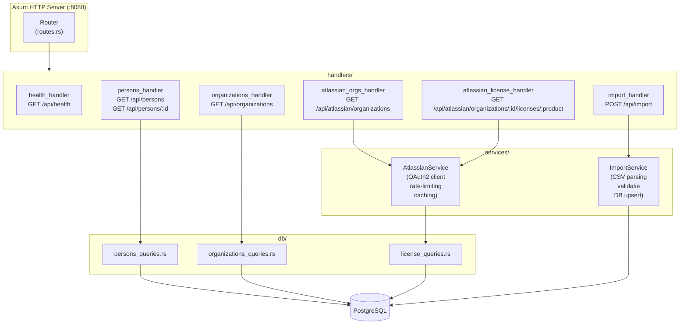

### 5.3 Vite Proxy-configuratie

De Vite-ontwikkelserver fungeert als transparante proxy voor alle `/api/*`-verzoeken, waardoor CORS-problemen tijdens ontwikkeling worden vermeden:

```typescript
// vite.config.ts
export default defineConfig({
  plugins: [react()],
  server: {
    proxy: {
      "/api": {
        target: "http://localhost:8080",
        changeOrigin: true,
      },
    },
  },
});
```

---

## 6. Data-ontwerp

### 6.1 Conceptueel gegevensmodel

Het systeem beheert de volgende kernentiteiten: `Person` (medewerker), `Organization` (organisatorische eenheid), `AtlassianUser` (account in het Atlassian-platform), `LicenseUsage` (snapshot licentieverbruik) en `SyncStatus` (synchronisatiestatus per platform).

### 6.2 Entiteit-Relatiediagram

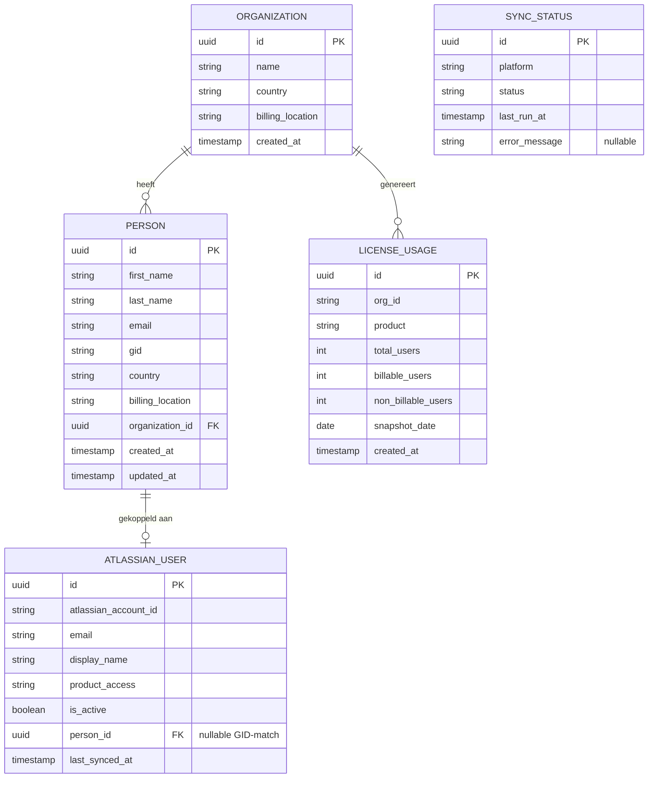

### 6.3 Gegevensstroomdiagram

Het onderstaande diagram illustreert hoe data van de externe Atlassian-API via de backend naar de database en uiteindelijk naar de frontend stroomt.

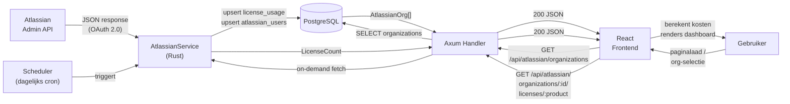

---

## 7. Interface-ontwerp

### 7.1 REST API-specificatie

De backend exposeert de volgende REST-endpoints. Alle endpoints vereisen de header `Content-Type: application/json`; geauthenticeerde endpoints vereisen bovendien `Authorization: Bearer <JWT>`.

| Methode | Pad                                                          | Authenticatie | Response-type                            | Statuscode(s)      |
| ------- | ------------------------------------------------------------ | ------------- | ---------------------------------------- | ------------------ |
| `GET`   | `/api/health`                                                |               | `{ status: "ok", version: string }`      | 200                |
| `GET`   | `/api/atlassian/organizations`                               | JWT           | `AtlassianOrg[]`                         | 200, 401, 502      |
| `GET`   | `/api/atlassian/organizations/:id/licenses/:product`         | JWT           | `LicenseCount`                           | 200, 401, 404, 502 |
| `GET`   | `/api/atlassian/organizations/:id/licenses/:product/details` | JWT           | `LicenseDetails`                         | 200, 401, 404, 502 |
| `GET`   | `/api/atlassian/users`                                       | JWT           | `AtlassianUsersResponse`                 | 200, 401           |
| `GET`   | `/api/persons`                                               | JWT           | `PaginatedResponse<PersonSummary>`       | 200, 401           |
| `GET`   | `/api/persons/:id`                                           | JWT           | `PersonDetail`                           | 200, 401, 404      |
| `GET`   | `/api/organizations`                                         | JWT           | `PaginatedResponse<OrganizationSummary>` | 200, 401           |
| `POST`  | `/api/import`                                                | JWT           | `ImportResult`                           | 202, 401, 422      |

### 7.2 Sequentiediagrammen

#### 7.2.1 Dashboard initialisatie

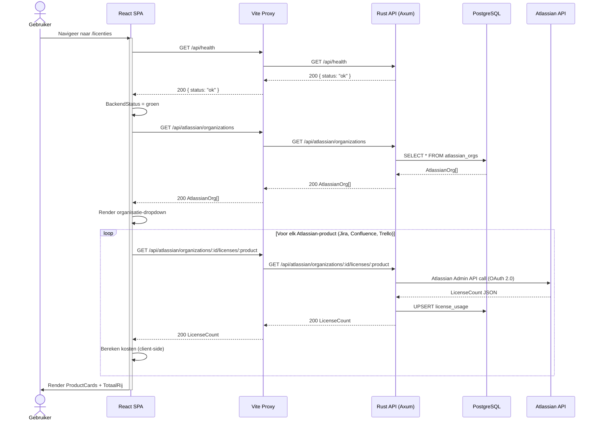

#### 7.2.2 Data-import sequentie

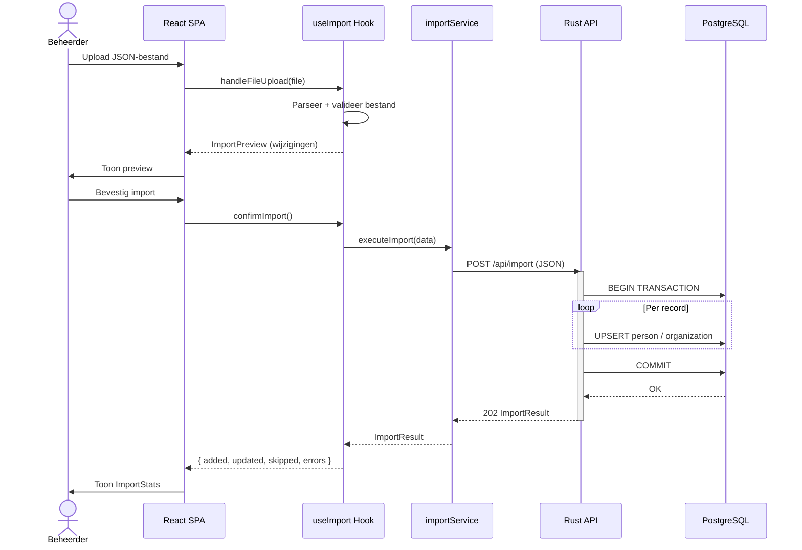

#### 7.2.3 Authenticatiesequentie (JWT/SSO)

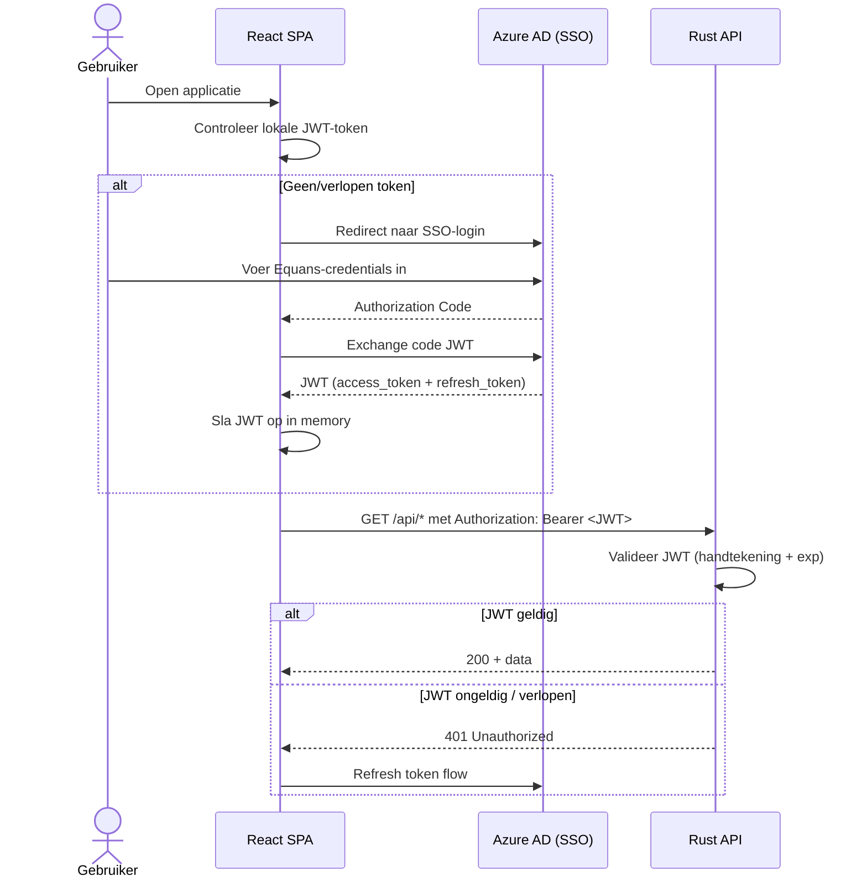

### 7.3 Activiteitendiagram: importproces

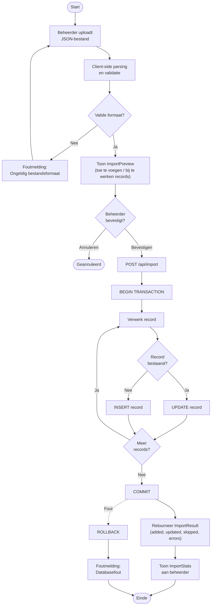

---

## 8. Beveiligingsontwerp

### 8.1 Authenticatie- en autorisatiestroom

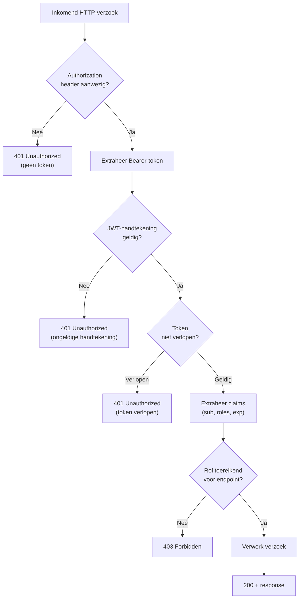

### 8.2 Beveiligingslagen

| Laag                | Maatregel                                  | Implementatie                           |
| ------------------- | ------------------------------------------ | --------------------------------------- |
| **Transport**       | HTTPS / TLS 1.2+ verplicht                 | Nginx reverse proxy of Docker-niveau    |
| **Authenticatie**   | JWT (HS256/RS256) via Azure AD SSO         | Axum middleware: `tower_http::auth`     |
| **Autorisatie**     | Rolgebaseerde toegangscontrole (RBAC)      | Rollen: `admin`, `viewer` in JWT-claims |
| **Input-validatie** | Alle invoer gevalideerd vóór verwerking    | Rust: `serde` + custom validators       |
| **Geheimbeheer**    | API-tokens en DB-wachtwoorden in env-vars  | Docker Compose `.env`; nooit in VCS     |
| **GDPR**            | E-mailadressen gemaskeerd in logberichten  | Custom `tracing` formatter              |
| **SQL-injectie**    | Uitsluitend parameterized queries via SQLx | Compile-time type-checking              |
| **CORS**            | Strikte origin-whitelist configureert      | `tower_http::cors::CorsLayer`           |

---

## 9. Deploymentontwerp

### 9.1 Containerarchitectuur

Het systeem wordt volledig gecontaineriseerd via Docker Compose. Elke service draait in een geïsoleerde container met expliciete netwerk- en volumeconfiguraties.

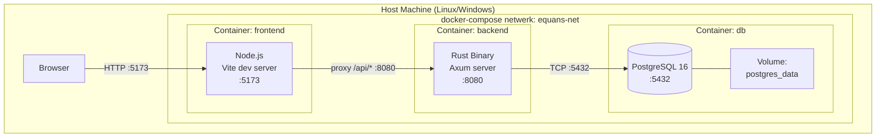

### 9.2 Deploymentdiagram

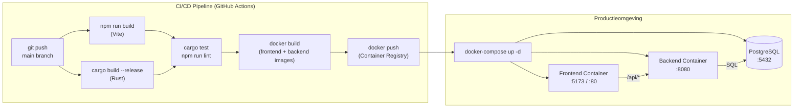

---

## 10. Testontwerp

### 10.1 Teststrategie

Het testplan volgt de **testpyramide** (Cohn, 2009), waarbij de nadruk ligt op een brede basis van geautomatiseerde unit- en integratietests, aangevuld met manuele acceptatietests voor end-to-end validatie.

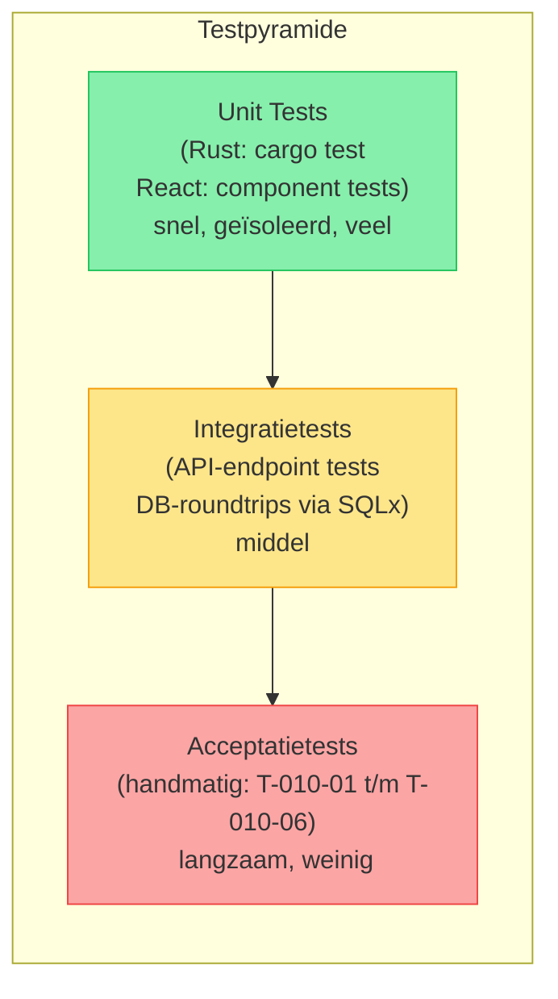

### 10.2 Acceptatiescenario's (FR-010)

| Test-ID  | Scenario                 | Teststap                              | Verwacht resultaat                                   |
| -------- | ------------------------ | ------------------------------------- | ---------------------------------------------------- |
| T-010-01 | Dashboard zonder backend | Open dashboard; backend offline       | BackendStatus: rood; "Backend niet beschikbaar"      |
| T-010-02 | Dashboard met backend    | Open dashboard; backend online        | Drie ProductCards geladen (Jira, Confluence, Trello) |
| T-010-03 | Organisatieselectie      | Wijzig organisatie in dropdown        | Gebruikersaantallen herladen per product             |
| T-010-04 | Prijswijziging           | Pas `productPricing.ts` aan + rebuild | Dashboard toont bijgewerkte berekeningen             |
| T-010-05 | Totaalrij validatie      | Controleer totaalrij                  | Som van drie producten overeenkomstig ProductCards   |
| T-010-06 | Valutaformaat            | Inspecteer bedragen op scherm         | Bedragen getoond als `€ 8,50` (nl-NL locale)         |

### 10.3 Stateovergangen bij fouten

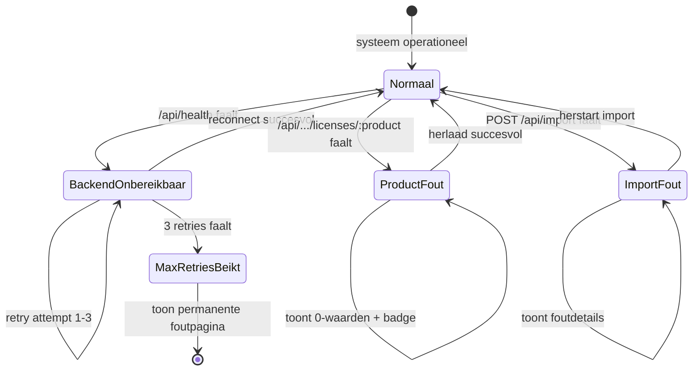

---

## 11. Conclusie en aanbevelingen

### 11.1 Conclusie

Dit Software Design Document beschrijft een coherent en volledig technisch ontwerp voor het Equans Operational Insights Dashboard. De gekozen drielagenarchitectuur met een React/TypeScript-frontend, een Rust/Axum-backend en een PostgreSQL-database biedt een robuuste scheiding van verantwoordelijkheden die zowel onderhoudbaarheid als schaalbaarheid bevordert.

De implementatie van het licentiekostendashboard (FR-010) beantwoordt direct aan de geïdentificeerde probleemstelling: het systeem biedt een gecentraliseerd, geautomatiseerd en visueel inzichtelijk kostenoverzicht voor Atlassian-licenties, inclusief inkoopkosten, factureerbare bedragen en consultancymarges per product en per organisatie.

De keuze voor een _client-side_ kostenberekening op basis van een gecentraliseerd configuratiebestand (`productPricing.ts`) biedt de beheerder directe controle over tariefwijzigingen zonder codewijzigingen elders in het systeem, hetgeen de operationele wendbaarheid vergroot.

### 11.2 Aanbevelingen

Op basis van de opgedane inzichten tijdens ontwerp en implementatie worden de volgende vervolgstappen aanbevolen:

1. **Beheerinterface voor productprijzen**: Tarieven worden momenteel beheerd via een statisch configuratiebestand. Een admin-UI (FR-010/US-2) die tarieven opslaat in de database vergroot de toegankelijkheid voor niet-technische beheerders.

2. **WebSocket-integratie voor real-time updates**: De huidige polling-architectuur (elke 30 seconden) kan worden vervangen door een WebSocket-verbinding voor live licentie-updates, waarmee de latentie en serverbelasting worden gereduceerd.

3. **GitHub- en JFrog-integratie**: De architectuur is ontworpen om eenvoudig te worden uitgebreid met additionele vendor-modules. GitHub Enterprise (FR-001) en JFrog Artifactory kunnen in volgende sprints worden toegevoegd zonder architecturele herziening.

4. **Geautomatiseerde end-to-end tests**: De acceptatiescenario's zijn momenteel handmatig. Integratie met Playwright of Cypress zou de regressietestdekking significant verbeteren.

5. **Monitoring en observability**: Implementatie van een structurele logging-pipeline (bijv. via OpenTelemetry + Grafana) en uptime-monitoring vergroot de operationele betrouwbaarheid in productie.

---

## 12. Referenties

| Referentie                     | Beschrijving                                                                                                                           |
| ------------------------------ | -------------------------------------------------------------------------------------------------------------------------------------- |
| IEEE Std 1016-2009             | _IEEE Standard for Information Technology Systems Design Software Design Descriptions._ IEEE, 2009.                                    |
| Fowler, M. (2002)              | _Patterns of Enterprise Application Architecture._ Addison-Wesley.                                                                     |
| Martin, R.C. (2018)            | _Clean Architecture: A Craftsman's Guide to Software Structure and Design._ Prentice Hall.                                             |
| Cohn, M. (2009)                | _Succeeding with Agile: Software Development Using Scrum._ Addison-Wesley.                                                             |
| Abramov, D. & Clark, A. (2015) | React Documentation: _Thinking in React._ Meta Open Source.                                                                            |
| Axum (2024)                    | _Axum Ergonomic and modular web framework built with Tokio, Tower, and Hyper._ tokio-rs/axum. GitHub.                                  |
| Atlassian (2025)               | _Atlassian Admin REST API Reference._ developer.atlassian.com.                                                                         |
| SRS-001 (2026)                 | Alhaj Asaad, A. _Software Requirements Specification Equans Operational Insights Dashboard._ Versie 1.0. Equans SLS Digital Platforms. |
| TR-010 (2026)                  | Alhaj Asaad, A. _TR-010: Frontend Vernieuwing Technische Specificaties._ Equans SLS Digital Platforms.                                 |
| FR-010 (2026)                  | Alhaj Asaad, A. _FR-010: Frontend Vernieuwing Operational Insights Dashboard._ Equans SLS Digital Platforms.                           |

---

_Dit document is opgesteld als onderdeel van een afstudeeronderzoek bij Equans SLS Digital Platforms (DevOps Forge). Alle genoemde architecturele beslissingen en technische specificaties zijn gebaseerd op de implementatierealiteit per 8 maart 2026._
