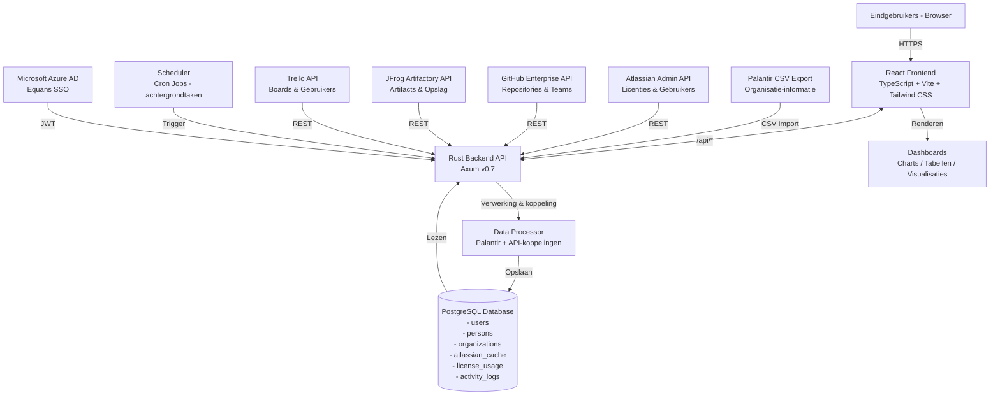

# Software Requirements Specification (SRS)

## Equans Operational Insights Dashboard

---

| Metadata           | Details                                       |
| ------------------ | --------------------------------------------- |
| **Documentnummer** | SRS-001                                       |
| **Versie**         | 1.0                                           |
| **Status**         | Concept                                       |
| **Datum**          | 5 maart 2026                                  |
| **Auteur**         | Ahmad Alhaj Asaad                             |
| **Instelling**     | Equans — SLS Digital Platforms / DevOps Forge |
| **Begeleider**     | Brian Veltman                                 |
| **Opdrachtgever**  | Viktor Klein                                  |

---

## Inhoudsopgave

1. [Inleiding](#1-inleiding)
   - 1.1 Doel
   - 1.2 Achtergrond
   - 1.3 Doelgroep
2. [Systeembeschrijving](#2-systeembeschrijving)
   - 2.1 Overzicht
3. [Functionele Eisen (MoSCoW)](#3-functionele-eisen-moscow)
   - 3.1 Must Have
   - 3.2 Should Have
   - 3.3 Could Have
   - 3.4 Won't Have
4. [Technische Requirements (MoSCoW)](#4-technische-requirements-moscow)
   - 4.1 Must Have
   - 4.2 Should Have
   - 4.3 Could Have
   - 4.4 Won't Have
5. [Use Cases](#5-use-cases)
6. [User Stories](#6-user-stories)
7. [Architectuur](#7-architectuur)
   - 7.1 Overzichtsdiagram
   - 7.2 Technologieën
8. [Dataontwerp](#8-dataontwerp)
   - 8.1 Datavelden Atlassian API
   - 8.2 Datavelden GitHub API
9. [Ontwerp (UI/UX)](#9-ontwerp-uiux)
10. [Teststrategie](#10-teststrategie)
11. [Risico's en Beperkingen](#11-risicos-en-beperkingen)
12. [Bronnen](#12-bronnen)

---

## 1. Inleiding

### 1.1 Doel

Dit document omschrijft de Software Requirements Specification (SRS) voor het systeem **Equans Operational Insights Dashboard**. Het doel van dit document is het vastleggen van alle functionele en technische vereisten op een gestructureerde en ondubbelzinnige wijze, ten behoeve van ontwerp, ontwikkeling en validatie van het systeem.

Het SRS vormt de contractuele basis tussen de opdrachtgever (Equans SLS Digital Platforms) en het ontwikkelteam, en dient tevens als referentiedocument voor de afstudeerscriptie. De specificaties zijn gebaseerd op het MoSCoW-prioriteringsmodel (Must Have, Should Have, Could Have, Won't Have) en zijn afgeleid van eerder opgestelde Business Requirements en Functionele Requirements.

### 1.2 Achtergrond

Equans is een internationale technische dienstverlener die gebruikmaakt van meerdere softwareplatformen voor de dagelijkse bedrijfsvoering, waaronder Atlassian (Jira, Confluence, Trello), GitHub Enterprise en JFrog Artifactory. Elk van deze platforms beheert licenties en gebruikersaccounts in zijn eigen omgeving, wat resulteert in een gefragmenteerd overzicht van licentieverbruik en bijbehorende kosten.

Het ontbreken van een gecentraliseerde beheeromgeving leidt tot de volgende knelpunten:

- **Gebrek aan transparantie**: Er is geen actueel, geconsolideerd overzicht van licentieverbruik over alle platforms heen.
- **Inefficiënte kostentoewijzing**: Het doorberekenen van licentiekosten aan interne teams en kostenplaatsen vereist tijdrovend handmatig werk.
- **Moeilijke identificatie van inactieve gebruikers**: Ongebruikte licenties worden niet systematisch geidentificeerd, wat leidt tot onnodige uitgaven.
- **Ontbrekende persoon-organisatiekoppelingen**: Medewerkers zijn niet structureel gekoppeld aan hun organisatorische eenheid, waardoor rapportage en chargeback bemoeilijkt worden.

Het **Equans Operational Insights Dashboard** is ontwikkeld om deze knelpunten te adresseren door een gecentraliseerde, geautomatiseerde en visueel inzichtelijke oplossing te bieden. Het systeem verzamelt gegevens via de API's van de betrokken platforms en presenteert deze in een interactief dashboard dat toegankelijk is voor licentiebeheerders, teammanagers, financieel medewerkers en IT-beheerders.

Dit project is uitgevoerd in het kader van een afstudeeronderzoek bij Equans SLS Digital Platforms, onderdeel van de DevOps Forge-afdeling.

### 1.3 Doelgroep

Dit document is bedoeld voor de volgende stakeholders:

| Doelgroep              | Rol                                                                    |
| ---------------------- | ---------------------------------------------------------------------- |
| **Viktor Klein**       | Business Owner — eindverantwoordelijke voor de inhoudelijke vereisten  |
| **Brian Veltman**      | Technical Lead — beoordeling van technische haalbaarheid               |
| **Henk**               | Executive Sponsor — executief overzicht en strategische besluitvorming |
| **Licentiebeheerders** | Primaire gebruikers van het dashboard                                  |
| **Finance Team**       | Gebruikers van de kostentoewijzings- en chargebackfuncties             |
| **IT/HR Beheerders**   | Gebruikers van de persoons- en organisatiebeheermodules                |
| **Ontwikkelteam**      | Technische uitvoering op basis van dit document                        |
| **Examencommissie**    | Beoordeling van het afstudeerwerk                                      |

---

## 2. Systeembeschrijving

### 2.1 Overzicht

Het Equans Operational Insights Dashboard is een full-stack webapplicatie die licentieverbruik, gebruikersgegevens en bijbehorende kosten centraliseert vanuit de volgende externe platformen:

- **Atlassian** (Jira Software, Confluence, Trello, Jira Service Management)
- **GitHub Enterprise** (seats, Copilot, GHAS)
- **JFrog Artifactory** (opslagcapaciteit en downloadstatistieken)

Het systeem bestaat uit drie lagen:

1. **Frontend**: Een React-gebaseerde Single Page Application (SPA) die dashboards, overzichtstabellen en configuratiemogelijkheden biedt aan eindgebruikers.
2. **Backend**: Een REST API gebouwd in Rust (Actix Web / Axum), verantwoordelijk voor datacollectie, -verwerking, authenticatie en blootstelling van gegevens aan de frontend.
3. **Database**: Een PostgreSQL-database voor persistente opslag van verzamelde gegevens, persoons- en organisatiegegevens, en historische licentiedata.

Toegang tot het systeem verloopt uitsluitend via Equans SSO (Microsoft Azure Active Directory), waarbij rolgebaseerde toegangscontrole van toepassing is. Gegevensverzameling vindt automatisch plaats via geplande achtergrondtaken (dagelijkse synchronisatie), met de mogelijkheid tot handmatige verversing door beheerders.

Het systeem is ontwikkeld conform de Equans corporate-huisstijlrichtlijnen en uitgerust met een exportfunctie (CSV) voor externe rapportage.

---

## 3. Functionele Eisen (MoSCoW)

De functionele eisen zijn geordend volgens het MoSCoW-prioriteringsmodel. Elke eis is voorzien van een uniek identificatienummer, een beschrijving en de bronverwijzing naar het onderliggende functionele requirementsdocument.

### 3.1 Must Have (M)

De onderstaande eisen zijn essentieel voor de werking van het minimaal levensvatbare product (MVP). Zonder deze eisen kan het systeem niet worden opgeleverd.

| ID   | Omschrijving                                                                                                                             | Bron           |
| ---- | ---------------------------------------------------------------------------------------------------------------------------------------- | -------------- |
| M-01 | Het systeem toont een geconsolideerd overzichtsdashboard met geaggregeerde licentie- en gebruikersstatistieken over alle leveranciers.   | FR-001         |
| M-02 | Het systeem toont gedetailleerde Atlassian-gebruiks- en licentiegegevens (actieve gebruikers, inactieve gebruikers, licentietoewijzing). | FR-001         |
| M-03 | Het systeem toont GitHub-gebruiksgegevens, waaronder seat-toewijzing en Copilot-gebruik.                                                 | FR-001         |
| M-04 | Het systeem verzamelt automatisch gebruikers- en licentiegegevens via de Atlassian Admin API.                                            | FR-002         |
| M-05 | Het systeem verzamelt automatisch seat- en gebruiksgegevens via de GitHub Enterprise API.                                                | FR-002         |
| M-06 | Alle verzamelde gegevens worden opgeslagen in een PostgreSQL-database.                                                                   | FR-002         |
| M-07 | Het systeem biedt een overzicht van alle Atlassian-gebruikers inclusief filteren op status en producttoegang.                            | FR-003, FR-008 |
| M-08 | Gebruikers authenticeren uitsluitend via Equans SSO (Microsoft Azure Active Directory).                                                  | FR-004         |
| M-09 | Alle API-endpoints vereisen JWT-authenticatie.                                                                                           | FR-004         |
| M-10 | Het systeem toont een overzicht van alle personen in het systeem inclusief hun vendor-identifiers.                                       | FR-005         |
| M-11 | Het systeem toont een overzicht van alle organisaties inclusief gekoppelde personen.                                                     | FR-006         |
| M-12 | Het systeem ondersteunt het importeren van persoons- en organisatiegegevens via CSV.                                                     | FR-007         |
| M-13 | Personen kunnen worden gekoppeld aan Atlassian-accounts op basis van e-mailadres.                                                        | FR-009         |
| M-14 | Het dashboard toont licentiekosten per Atlassian-product (Jira Software, Confluence, Trello).                                            | FR-010         |

### 3.2 Should Have (S)

De onderstaande eisen vertegenwoordigen significante toegevoegde waarde en dienen bij voorkeur aanwezig te zijn in het eindproduct, maar zijn niet strikt noodzakelijk voor de basiswerking.

| ID   | Omschrijving                                                                                                    | Bron           |
| ---- | --------------------------------------------------------------------------------------------------------------- | -------------- |
| S-01 | Gegevensverzameling wordt automatisch uitgevoerd volgens een dagelijks schema.                                  | FR-002         |
| S-02 | Beheerders kunnen handmatig een verversing van de Atlassian-gegevens triggeren.                                 | FR-003         |
| S-03 | Het systeem toont de datum en het tijdstip van de laatste synchronisatie.                                       | FR-003         |
| S-04 | Gebruikerssessies worden automatisch verlengd gedurende actieve gebruik.                                        | FR-004         |
| S-05 | Personen zijn doorzoekbaar op naam, e-mailadres of persoon-ID.                                                  | FR-005         |
| S-06 | Personen zijn filterbaar op organisatie, land en billing location.                                              | FR-005         |
| S-07 | Organisatiestatistieken tonen het aantal personen, licenties en kosten per organisatie.                         | FR-006         |
| S-08 | Het systeem toont een preview van wijzigingen voordat een CSV-import wordt uitgevoerd.                          | FR-007         |
| S-09 | Gebruikersgegevens worden automatisch gesynchroniseerd tussen Atlassian en de lokale database.                  | FR-008         |
| S-10 | Het dashboard ondersteunt filtering op team, business unit en datumbereik.                                      | FR-001         |
| S-11 | Dashboardgegevens zijn exporteerbaar als CSV.                                                                   | FR-001         |
| S-12 | Productprijzen (inkoopprijs en factureerbaar tarief) zijn configureerbaar via een centraal configuratiebestand. | FR-010         |
| S-13 | Paginering is beschikbaar voor alle lijstweergaven (standaard 25 items per pagina).                             | FR-008, FR-010 |

### 3.3 Could Have (C)

De onderstaande eisen zijn wenselijk maar hebben een lage prioriteit. Zij worden alleen geïmplementeerd indien tijd en middelen het toelaten.

| ID   | Omschrijving                                                                                                   | Bron           |
| ---- | -------------------------------------------------------------------------------------------------------------- | -------------- |
| C-01 | Het systeem genereert waarschuwingen bij ongebruikelijke licentiekosten.                                       | FR-001         |
| C-02 | Predictieve analyses voor licentieprognoses worden aangeboden.                                                 | FR-001         |
| C-03 | Integratie met Power BI voor geavanceerde rapportage.                                                          | FR-001         |
| C-04 | JFrog-gebruiksgegevens worden verzameld en weergegeven.                                                        | FR-001, FR-002 |
| C-05 | Trello-gebruiksgegevens worden verzameld en weergegeven.                                                       | FR-002         |
| C-06 | Gecombineerde rapportage van persoons-, organisatie- en Atlassian-licentiegegevens is exporteerbaar als Excel. | FR-009         |
| C-07 | Atlassian-groepen kunnen worden gekoppeld aan organisatorische eenheden voor kostendoorbelasting.              | FR-009         |
| C-08 | De import-wizard in de UI ondersteunt het uploaden van JSON-bestanden met voortgangsindicator.                 | FR-010         |

### 3.4 Won't Have (W)

De onderstaande eisen vallen buiten de scope van het huidige project (MVP) en worden in deze versie niet geïmplementeerd.

| ID   | Omschrijving                                                                     |
| ---- | -------------------------------------------------------------------------------- |
| W-01 | Terugschrijfoperaties naar externe vendor API's (read-only architectuur).        |
| W-02 | Real-time streaming datacollectie (uitsluitend batch-verversing).                |
| W-03 | Geavanceerde rolgebaseerde toegangscontrole buiten de rollen admin en gebruiker. |
| W-04 | Twee-factor authenticatiebeheer voor Atlassian-gebruikers.                       |
| W-05 | Directory-synchronisatie via SCIM.                                               |
| W-06 | API token management voor individuele gebruikers.                                |
| W-07 | Auditlogbeheer voor Atlassian.                                                   |

---

## 4. Technische Requirements (MoSCoW)

### 4.1 Must Have (TM)

| ID    | Omschrijving                                                                                                                                       | Bron           |
| ----- | -------------------------------------------------------------------------------------------------------------------------------------------------- | -------------- |
| TM-01 | Alle communicatie verloopt via HTTPS (TLS 1.2 of hoger); HTTP-verzoeken worden omgeleid naar HTTPS.                                                | TR-001         |
| TM-02 | API-tokens en geheimen worden opgeslagen via GitHub Secrets of Docker-omgevingsvariabelen; nooit in versiebeheer.                                  | TR-001         |
| TM-03 | Alle gebruikersgerichte endpoints vereisen authenticatie via JWT.                                                                                  | TR-001, TR-004 |
| TM-04 | E-mailadressen worden gemaskeerd in logberichten (GDPR-conformiteit).                                                                              | TR-001         |
| TM-05 | De backend is gebouwd in Rust met gebruik van `Result<T, E>` voor foutafhandeling; het gebruik van `unwrap()` is niet toegestaan in productiecode. | TR-001         |
| TM-06 | De frontend is gebouwd in React + TypeScript met `strict mode` ingeschakeld (geen gebruik van `any`).                                              | TR-001         |
| TM-07 | De database is PostgreSQL; migraties worden beheerd via versiegecontroleerde migratiebestanden.                                                    | TR-001         |
| TM-08 | De API-responstijd bedraagt voor minimaal 95% van de verzoeken minder dan 200 milliseconden.                                                       | TR-001         |
| TM-09 | Het dashboard laadt binnen 3 seconden bij een initieel bezoek.                                                                                     | TR-001         |
| TM-10 | Alle fouten worden gelogd met een correlatie-ID voor traceerbaarheid.                                                                              | TR-001         |
| TM-11 | Het systeem verwerkt partiële uitval van externe vendor API's zonder de beschikbaarheid van het dashboard te beïnvloeden.                          | TR-001         |

### 4.2 Should Have (TS)

| ID    | Omschrijving                                                                                                                        | Bron           |
| ----- | ----------------------------------------------------------------------------------------------------------------------------------- | -------------- |
| TS-01 | Rate-limitering van externe API's wordt gedetecteerd en afgehandeld via exponentieel uitstel (exponential backoff).                 | TR-001         |
| TS-02 | Databasevelden die veelvuldig worden bevraagd zijn voorzien van indexering.                                                         | TR-001         |
| TS-03 | Alle modules beschikken over unit tests; integratietests zijn vereist voor API-endpoints.                                           | TR-001, TR-002 |
| TS-04 | Gecachede gegevens worden aangeboden wanneer live-data niet beschikbaar is, inclusief vermelding van de laatste synchronisatietijd. | TR-003         |
| TS-05 | JWT-tokens beschikken over passende verloopdatum en -tijd.                                                                          | TR-004         |
| TS-06 | Persoonsgegevens zijn identificeerbaar ten behoeve van verwijderingsverzoeken (GDPR, recht op vergetelheid).                        | TR-001         |
| TS-07 | De Docker Compose-configuratie ondersteunt lokale ontwikkeling inclusief PostgreSQL.                                                | ADR-001        |

### 4.3 Could Have (TC)

| ID    | Omschrijving                                                                                                   | Bron   |
| ----- | -------------------------------------------------------------------------------------------------------------- | ------ |
| TC-01 | Observability-tooling (metrics en tracing) wordt geïmplementeerd voor productie-monitoring.                    | TR-001 |
| TC-02 | Belastingstests worden uitgevoerd met behulp van k6 om prestaties onder verhoogd verkeer te valideren.         | TR-002 |
| TC-03 | Continue integratie (CI) pipeline controleert automatisch op compileerfouten, codekwaliteit en testresultaten. | TR-001 |
| TC-04 | Dataretentiebeleid wordt gedefinieerd en geautomatiseerd uitgevoerd.                                           | TR-001 |

### 4.4 Won't Have (TW)

| ID    | Omschrijving                                                                                                |
| ----- | ----------------------------------------------------------------------------------------------------------- |
| TW-01 | Volledige SIEM-integratie (Security Information and Event Management) valt buiten de scope van dit project. |
| TW-02 | Geautomatiseerde herstelprocessen (self-healing) bij infrastructuurfouten zijn niet voorzien in MVP.        |
| TW-03 | Multi-regio deployment of geografische redundantie.                                                         |

---

## 5. Use Cases

### UC-01: Bekijk Geconsolideerd Licentieoverzicht

| Element                 | Beschrijving                                                                                                                                                                                                                                                                                                                                       |
| ----------------------- | -------------------------------------------------------------------------------------------------------------------------------------------------------------------------------------------------------------------------------------------------------------------------------------------------------------------------------------------------- |
| **Actoren**             | Teammanager, Licentiebeheerder                                                                                                                                                                                                                                                                                                                     |
| **Preconditie**         | Gebruiker is geauthenticeerd via Equans SSO                                                                                                                                                                                                                                                                                                        |
| **Trigger**             | Gebruiker navigeert naar het overzichtsdashboard                                                                                                                                                                                                                                                                                                   |
| **Normaal verloop**     | 1. Gebruiker logt in via SSO. 2. Systeem laadt geaggregeerde licentiegegevens uit de database. 3. Dashboard toont actieve vs. inactieve gebruikers per platform, licentiebezettingspercentage en kostenopgave. 4. Gebruiker past filters toe (team, BU, datumbereik). 5. Dashboard actualiseert de weergave op basis van de geselecteerde filters. |
| **Alternatief verloop** | Indien API-data niet beschikbaar is: systeem toont gecachede data met vermelding van de laatste synchronisatietijd.                                                                                                                                                                                                                                |
| **Postconditie**        | Gebruiker heeft actueel inzicht in het licentie- en kostenlandschap.                                                                                                                                                                                                                                                                               |

---

### UC-02: Synchroniseer Atlassian Gebruikersgegevens

| Element                 | Beschrijving                                                                                                                                                                                                                                                                                                                                                                 |
| ----------------------- | ---------------------------------------------------------------------------------------------------------------------------------------------------------------------------------------------------------------------------------------------------------------------------------------------------------------------------------------------------------------------------- |
| **Actoren**             | Systeem (geautomatiseerd), Systeembeheerder (handmatig)                                                                                                                                                                                                                                                                                                                      |
| **Preconditie**         | Geldige Atlassian API-credentials zijn geconfigureerd                                                                                                                                                                                                                                                                                                                        |
| **Trigger**             | Dagelijkse cron-job of handmatige trigger door beheerder                                                                                                                                                                                                                                                                                                                     |
| **Normaal verloop**     | 1. Systeem roept de Atlassian Admin API aan voor gebruikers- en licentiegegevens. 2. Ontvangen data wordt getransformeerd en gevalideerd. 3. Data wordt opgeslagen in de PostgreSQL-database. 4. Synchronisatietijdstip wordt bijgewerkt. 5. Nieuw ontvangen Atlassian-gebruikers worden automatisch geprobeerd te koppelen aan bestaande personen op basis van e-mailadres. |
| **Alternatief verloop** | Bij API-fout: systeem logt de fout met correlatie-ID en past exponentieel uitstel toe. Synchronisatie van andere vendors blijft ongestoord doorgaan.                                                                                                                                                                                                                         |
| **Postconditie**        | Database bevat actuele Atlassian-gebruikers- en licentiedata.                                                                                                                                                                                                                                                                                                                |

---

### UC-03: Importeer Persoons- en Organisatiegegevens

| Element                 | Beschrijving                                                                                                                                                                                                                                                                                                                                                                                                              |
| ----------------------- | ------------------------------------------------------------------------------------------------------------------------------------------------------------------------------------------------------------------------------------------------------------------------------------------------------------------------------------------------------------------------------------------------------------------------- |
| **Actoren**             | IT-beheerder                                                                                                                                                                                                                                                                                                                                                                                                              |
| **Preconditie**         | Gebruiker is ingelogd met beheerdersrechten; CSV- of Excel-bestand is beschikbaar                                                                                                                                                                                                                                                                                                                                         |
| **Trigger**             | Beheerder initieert een nieuwe import via de importmodule                                                                                                                                                                                                                                                                                                                                                                 |
| **Normaal verloop**     | 1. Beheerder uploadt het importbestand. 2. Systeem valideert het bestand en toont een preview van toe te voegen, te wijzigen en te verwijderen records. 3. Beheerder bevestigt de import. 4. Systeem voert de import uit en herberekent `person_count` per organisatie. 5. Eerder inactief gemarkeerde personen die opnieuw in het bestand voorkomen, worden automatisch gereactiveerd. 6. Importresultaat wordt getoond. |
| **Alternatief verloop** | Bij validatiefouten: beheerder kan kiezen om uitsluitend geldige records te importeren.                                                                                                                                                                                                                                                                                                                                   |
| **Postconditie**        | Database bevat actuele persoons- en organisatiegegevens.                                                                                                                                                                                                                                                                                                                                                                  |

---

### UC-04: Kostendoorbelasting per Organisatie Raadplegen

| Element             | Beschrijving                                                                                                                                                                                                                                                                                                                                 |
| ------------------- | -------------------------------------------------------------------------------------------------------------------------------------------------------------------------------------------------------------------------------------------------------------------------------------------------------------------------------------------- |
| **Actoren**         | Finance Medewerker                                                                                                                                                                                                                                                                                                                           |
| **Preconditie**     | Gebruiker is geauthenticeerd; personen zijn gekoppeld aan organisaties                                                                                                                                                                                                                                                                       |
| **Trigger**         | Finance medewerker navigeert naar de chargeback-weergave                                                                                                                                                                                                                                                                                     |
| **Normaal verloop** | 1. Gebruiker selecteert de gewenste organisatie, kostenplaats of datumbereik. 2. Systeem berekent licentiekosten op basis van actieve gebruikersaantallen en geconfigureerde tarieven. 3. Overzicht toont inkoopprijs, factureerbaar tarief, consultancymarge per product en per organisatie. 4. Gebruiker exporteert het overzicht als CSV. |
| **Postconditie**    | Finance medewerker beschikt over een geëxporteerd kostenoverzicht ten behoeve van intern doorberekening.                                                                                                                                                                                                                                     |

---

### UC-05: Beheer Toegangsrechten

| Element                 | Beschrijving                                                                                                                                                                                                          |
| ----------------------- | --------------------------------------------------------------------------------------------------------------------------------------------------------------------------------------------------------------------- |
| **Actoren**             | Systeembeheerder                                                                                                                                                                                                      |
| **Preconditie**         | Beheerder is ingelogd via Equans SSO                                                                                                                                                                                  |
| **Trigger**             | Nieuwe medewerker dient toegang te krijgen tot het systeem                                                                                                                                                            |
| **Normaal verloop**     | 1. Beheerder wijst de juiste rol toe aan de gebruiker (admin of gebruiker). 2. Systeem kent de bijbehorende toegangsniveaus toe. 3. Gebruiker kan na volgende aanmelding de geautoriseerde functionaliteit benaderen. |
| **Alternatief verloop** | Gebruiker zonder juiste rechten ontvangt een duidelijke foutmelding en instructie om contact op te nemen met een beheerder.                                                                                           |
| **Postconditie**        | Gebruiker heeft de juiste toegangsrechten binnen het systeem.                                                                                                                                                         |

---

## 6. User Stories

### FR-001: License Dashboard

| ID     | User Story                                                                                                                                                                   |
| ------ | ---------------------------------------------------------------------------------------------------------------------------------------------------------------------------- |
| US-1.1 | **Als** teammanager **wil ik** een geconsolideerd overzicht zien van licentieverbruik over alle leveranciers **zodat** ik snel de algehele softwarebenutting kan beoordelen. |
| US-1.2 | **Als** licentiebeheerder **wil ik** gedetailleerd Atlassian licentieverbruik bekijken **zodat** ik ongebruikte Jira/Confluence licenties kan identificeren.                 |
| US-1.3 | **Als** engineering manager **wil ik** GitHub seat-toewijzing en Copilot-gebruik zien **zodat** ik de uitgaven aan ontwikkelaarstools kan optimaliseren.                     |
| US-1.4 | **Als** DevOps lead **wil ik** JFrog Artifactory gebruiksstatistieken monitoren **zodat** ik capaciteit en kosten kan plannen.                                               |
| US-1.5 | **Als** finance medewerker **wil ik** kosten zien die zijn toegewezen aan teams en kostenplaatsen **zodat** ik nauwkeurige doorberekening kan uitvoeren.                     |

### FR-002: Vendor Data Collection

| ID     | User Story                                                                                                                                                                   |
| ------ | ---------------------------------------------------------------------------------------------------------------------------------------------------------------------------- |
| US-2.1 | **Als** systeem **wil ik** automatisch gebruikers- en licentiedata verzamelen via de Atlassian Admin API **zodat** het dashboard het actuele Atlassian gebruik weerspiegelt. |
| US-2.2 | **Als** systeem **wil ik** automatisch seat- en gebruiksdata verzamelen via de GitHub Enterprise API **zodat** het dashboard het actuele GitHub gebruik weerspiegelt.        |
| US-2.3 | **Als** systeem **wil ik** automatisch gebruiksstatistieken verzamelen via de JFrog Artifactory API **zodat** het dashboard het actuele JFrog gebruik weerspiegelt.          |
| US-2.4 | **Als** systeem **wil ik** automatisch bord- en gebruikersdata verzamelen via de Trello API **zodat** het dashboard het actuele Trello gebruik weerspiegelt.                 |
| US-2.5 | **Als** systeem **wil ik** alle verzamelde data opslaan in PostgreSQL **zodat** historische data beschikbaar is voor trendanalyse.                                           |

### FR-003: Atlassian Cache

| ID     | User Story                                                                                                                                                   |
| ------ | ------------------------------------------------------------------------------------------------------------------------------------------------------------ |
| US-3.1 | **Als** licentiebeheerder **wil ik** een lijst van alle Atlassian gebruikers zien **zodat** ik kan analyseren wie toegang heeft tot Atlassian producten.     |
| US-3.2 | **Als** teammanager **wil ik** alle Atlassian groepen en hun leden zien **zodat** ik kan verifiëren of de juiste personen in de juiste groepen zitten.       |
| US-3.3 | **Als** systeembeheerder **wil ik** geforceerd verse data ophalen van Atlassian **zodat** ik direct de meest actuele informatie kan bekijken na wijzigingen. |
| US-3.4 | **Als** operations engineer **wil ik** zien wanneer de data voor het laatst is gesynchroniseerd **zodat** ik weet hoe actueel de getoonde informatie is.     |

### FR-004: API Authenticatie

| ID     | User Story                                                                                                                                                                     |
| ------ | ------------------------------------------------------------------------------------------------------------------------------------------------------------------------------ |
| US-4.1 | **Als** Equans medewerker **wil ik** inloggen met mijn bestaande Equans account (Microsoft/Azure AD) **zodat** ik geen apart account hoef aan te maken voor dit systeem.       |
| US-4.2 | **Als** ingelogde gebruiker **wil ik** mijn sessie automatisch verlengd zien worden **zodat** ik niet steeds opnieuw hoef in te loggen tijdens mijn werkdag.                   |
| US-4.3 | **Als** gebruiker **wil ik** kunnen uitloggen **zodat** anderen op mijn computer geen toegang hebben tot mijn sessie.                                                          |
| US-4.4 | **Als** gebruiker zonder juiste rechten **wil ik** een duidelijke melding zien wanneer ik geen toegang heb **zodat** ik weet dat ik contact moet opnemen met een beheerder.    |
| US-4.5 | **Als** systeembeheerder **wil ik** verschillende toegangsniveaus kunnen toekennen aan gebruikers **zodat** gevoelige data alleen beschikbaar is voor geautoriseerde personen. |

### FR-005: Persoonsmanagement

| ID     | User Story                                                                                                                                                                                          |
| ------ | --------------------------------------------------------------------------------------------------------------------------------------------------------------------------------------------------- |
| US-5.1 | **Als** licentiebeheerder **wil ik** een overzicht van alle personen in het systeem bekijken **zodat** ik snel kan zien wie er licenties toegewezen heeft.                                          |
| US-5.2 | **Als** teammanager **wil ik** personen kunnen zoeken op naam, e-mail of persoon-ID **zodat** ik snel specifieke teamleden kan vinden.                                                              |
| US-5.3 | **Als** licentiebeheerder **wil ik** de volledige details van een persoon bekijken inclusief vendor identifiers **zodat** ik kan zien welke licenties aan deze persoon zijn gekoppeld per platform. |
| US-5.4 | **Als** finance medewerker **wil ik** personen kunnen filteren op organisatie, land en billing location **zodat** ik nauwkeurige doorbelastingsrapportages kan maken per locatie.                   |
| US-5.5 | **Als** licentiebeheerder **wil ik** een overzicht van inactieve personen zien **zodat** ik ongebruikte licenties kan identificeren en vrijgeven.                                                   |
| US-5.6 | **Als** IT-beheerder **wil ik** de Global ID (GID) matching status van personen bekijken **zodat** ik kan verifiëren dat identiteiten correct zijn gekoppeld.                                       |

### FR-006: Organisatiebeheer

| ID     | User Story                                                                                                                                                         |
| ------ | ------------------------------------------------------------------------------------------------------------------------------------------------------------------ |
| US-6.1 | **Als** licentiebeheerder **wil ik** een overzicht van alle organisaties in het systeem bekijken **zodat** ik de structuur van Equans entiteiten begrijp.          |
| US-6.2 | **Als** finance medewerker **wil ik** de details van een organisatie bekijken inclusief gekoppelde personen **zodat** ik kosten per organisatie kan analyseren.    |
| US-6.3 | **Als** IT-beheerder **wil ik** de hiërarchische structuur van organisaties beheren **zodat** de rapportagestructuur correct is voor doorbelasting.                |
| US-6.4 | **Als** teammanager **wil ik** zien welke personen aan een organisatie gekoppeld zijn **zodat** ik mijn teamoverzicht heb.                                         |
| US-6.5 | **Als** licentiebeheerder **wil ik** statistieken per organisatie zien (aantal personen, licenties, kosten) **zodat** ik de impact per organisatie kan beoordelen. |

### FR-007: Data Synchronisatie

| ID     | User Story                                                                                                                                                                                                             |
| ------ | ---------------------------------------------------------------------------------------------------------------------------------------------------------------------------------------------------------------------- |
| US-7.1 | **Als** beheerder **wil ik** organisatie- en persoonsgegevens kunnen importeren via een CSV- of Excel-bestand **zodat** de database actueel blijft met de laatste organisatie- en personeelsinformatie.                |
| US-7.2 | **Als** beheerder **wil ik** een preview kunnen zien van alle wijzigingen voordat de import wordt uitgevoerd **zodat** ik kan controleren welke data wordt toegevoegd, gewijzigd of verwijderd.                        |
| US-7.3 | **Als** beheerder **wil ik** dat personen die eerder als inactief zijn gemarkeerd automatisch worden gereactiveerd bij nieuwe import **zodat** terugkerende medewerkers automatisch weer actief worden in het systeem. |
| US-7.4 | **Als** beheerder **wil ik** kunnen kiezen om alleen geldige records te importeren wanneer er validatiefouten zijn **zodat** ik niet de hele import hoef te annuleren bij enkele fouten.                               |
| US-7.5 | **Als** beheerder **wil ik** kunnen importeren met onvolledige data (ontbrekende persoon-ID, e-mail, namen) **zodat** ik kan werken met datasets waar niet alle informatie beschikbaar is.                             |

### FR-008: Atlassian Gebruikersbeheer

| ID     | User Story                                                                                                                                                            |
| ------ | --------------------------------------------------------------------------------------------------------------------------------------------------------------------- |
| US-8.1 | **Als** beheerder **wil ik** een overzicht kunnen zien van alle gebruikers in onze Atlassian organisatie **zodat** ik weet wie toegang heeft tot Atlassian producten. |
| US-8.2 | **Als** beheerder **wil ik** gedetailleerde informatie kunnen bekijken van een specifieke gebruiker **zodat** ik hun toegang en status kan controleren.               |
| US-8.3 | **Als** beheerder **wil ik** kunnen filteren welke gebruikers toegang hebben tot specifieke producten **zodat** ik licentieverbruik per product kan analyseren.       |
| US-8.4 | **Als** systeem **wil ik** automatisch gebruikersdata synchroniseren tussen Atlassian en onze database **zodat** onze applicatie actuele data heeft.                  |
| US-8.5 | **Als** beheerder **wil ik** geavanceerd kunnen zoeken en filteren in gebruikersdata **zodat** ik snel specifieke gebruikers kan vinden.                              |
| US-8.6 | **Als** beheerder **wil ik** gebruikersdata kunnen exporteren naar CSV **zodat** ik externe analyses kan uitvoeren.                                                   |

### FR-009: Atlassian–Database Synchronisatie

| ID     | User Story                                                                                                                                                                                              |
| ------ | ------------------------------------------------------------------------------------------------------------------------------------------------------------------------------------------------------- |
| US-9.1 | **Als** systeem **wil ik** na elke Atlassian-synchronisatie automatisch personen koppelen aan hun Atlassian-account **zodat** de koppelstatus altijd up-to-date is zonder handmatige actie.             |
| US-9.2 | **Als** licentiebeheerder **wil ik** per persoon kunnen zien of zij gekoppeld zijn aan een Atlassian-account **zodat** ik kan controleren welke personen een Atlassian-licentie hebben.                 |
| US-9.3 | **Als** licentiebeheerder **wil ik** de gekoppelde Atlassian-gegevens kunnen zien op de persoon detailpagina **zodat** ik weet welke Atlassian-producten een persoon gebruikt.                          |
| US-9.4 | **Als** licentiebeheerder **wil ik** Atlassian-groepen kunnen koppelen aan operationele organisaties **zodat** ik licentiekosten per organisatorische eenheid kan doorbelasten.                         |
| US-9.5 | **Als** finance medewerker **wil ik** een rapport kunnen genereren dat persoons- en organisatiedata combineert met Atlassian-licentiedata **zodat** ik nauwkeurige doorbelastingsrapportages kan maken. |

### FR-010: Frontend Licentiedashboard

| ID      | User Story                                                                                                                                                                                                               |
| ------- | ------------------------------------------------------------------------------------------------------------------------------------------------------------------------------------------------------------------------ |
| US-10.1 | **Als** finance medewerker/licentiebeheerder **wil ik** een overzichtelijk dashboard zien met kosten per Atlassian-product **zodat** ik de inkoop- en factureerbare kosten per product in één oogopslag kan vergelijken. |
| US-10.2 | **Als** beheerder **wil ik** de inkoopprijzen en factureerbare tarieven per product kunnen aanpassen **zodat** de dashboardberekeningen altijd de actuele contractprijzen weerspiegelen.                                 |
| US-10.3 | **Als** licentiebeheerder **wil ik** een tabeloverzicht van alle personen zien **zodat** ik snel kan controleren welke medewerkers actief zijn en aan welke organisatie ze zijn gekoppeld.                               |
| US-10.4 | **Als** teammanager **wil ik** een overzicht van alle organisaties zien met hun licentieverbruik **zodat** ik doorbelastingsrapportages per afdeling kan opstellen.                                                      |
| US-10.5 | **Als** IT-beheerder **wil ik** via de UI Atlassian- en GitHub-gebruikersdata kunnen importeren **zodat** het dashboard altijd actuele gebruikersaantallen toont.                                                        |

---

## 7. Architectuur

### 7.1 Overzichtsdiagram

Het systeem is opgebouwd conform een gelaagde REST API-architectuur, waarbij de frontend en backend strikt gescheiden zijn. De backend fungeert als een headless REST API; de frontend is een standalone Single Page Application die uitsluitend via de `/api/*`-interface communiceert met de backend.

### 7.2 Technologieën

| Laag                   | Technologie                                 | Motivatie                                                                       |
| ---------------------- | ------------------------------------------- | ------------------------------------------------------------------------------- |
| **Frontend**           | React 18 + TypeScript + Tailwind CSS + Vite | Modulaire componentenarchitectuur, sterke typering, snelle ontwikkelomgeving    |
| **Backend**            | Rust + Actix Web / Axum                     | Hoge prestaties, geheugenveiligheid, betrouwbare foutafhandeling                |
| **Database**           | PostgreSQL                                  | Robuuste relationele database met ondersteuning voor complexe queries           |
| **Authenticatie**      | Microsoft Azure Active Directory (Entra ID) | Integratie met bestaande Equans-infrastructuur; SSO via OAuth 2.0/OIDC          |
| **Containerisatie**    | Docker + Docker Compose                     | Reproduceerbare ontwikkel- en testomgevingen                                    |
| **Testautomatisering** | PowerShell-testscripts                      | Geautomatiseerde validatie van API-endpoints in Windows/cross-platform omgeving |
| **Design**             | Figma                                       | Wireframes en UI-mockups afgestemd op de Equans corporate-huisstijl             |
| **Versiebeheer**       | Git + GitHub                                | Versiebeheer, branch-strategie en code reviews via pull requests                |

---

## 8. Dataontwerp

### 8.1 Voorbeeld van Datavelden (Atlassian API)

De Atlassian Admin API levert gebruikers- en licentiegegevens op het niveau van de organisatie. Onderstaande tabel geeft een overzicht van de relevante datavelden die worden verzameld en opgeslagen.

| Veldnaam          | Type       | Beschrijving                                               | Opgeslagen in      |
| ----------------- | ---------- | ---------------------------------------------------------- | ------------------ |
| `account_id`      | `string`   | Unieke Atlassian account-identificatie                     | `atlassian_users`  |
| `email`           | `string`   | E-mailadres van de gebruiker (gemaskeerd in logs)          | `atlassian_users`  |
| `display_name`    | `string`   | Volledige weergavenaam                                     | `atlassian_users`  |
| `account_status`  | `enum`     | `active` \| `inactive` \| `closed`                         | `atlassian_users`  |
| `account_type`    | `enum`     | `atlassian` \| `customer` \| `app`                         | `atlassian_users`  |
| `product_access`  | `array`    | Lijst van toegankelijke producten (Jira, Confluence, etc.) | `atlassian_users`  |
| `last_active`     | `datetime` | Datum en tijdstip van laatste activiteit                   | `atlassian_users`  |
| `access_billable` | `boolean`  | Of het account factureerbaar is                            | `atlassian_users`  |
| `group_id`        | `string`   | Identifier van de Atlassian-groep                          | `atlassian_groups` |
| `group_name`      | `string`   | Naam van de Atlassian-groep                                | `atlassian_groups` |

### 8.2 Voorbeeld van Datavelden (GitHub API)

De GitHub Enterprise API levert gegevens over seats, Copilot-gebruik en GitHub Advanced Security (GHAS). Onderstaande tabel toont de relevante datavelden.

| Veldnaam                 | Type      | Beschrijving                            | Opgeslagen in    |
| ------------------------ | --------- | --------------------------------------- | ---------------- |
| `login`                  | `string`  | GitHub gebruikersnaam                   | `github_members` |
| `id`                     | `integer` | Unieke GitHub user-ID                   | `github_members` |
| `role`                   | `enum`    | `member` \| `admin`                     | `github_members` |
| `total_seats`            | `integer` | Totaal aantal beschikbare licentieseats | `github_seats`   |
| `seats_used`             | `integer` | Aantal gebruikte seats                  | `github_seats`   |
| `seats_available`        | `integer` | Aantal beschikbare (vrije) seats        | `github_seats`   |
| `copilot_seat_breakdown` | `object`  | Uitsplitsing van Copilot-seats per type | `github_copilot` |
| `copilot_seats_active`   | `integer` | Aantal actieve Copilot-gebruikers       | `github_copilot` |
| `ghas_active_committers` | `integer` | Aantal actieve GHAS-commiters           | `github_ghas`    |

---

## 9. Ontwerp (UI/UX)

Het dashboard is ontworpen conform de Equans Corporate Style Guide. Onderstaande ontwerpprincipes zijn vastgesteld in overleg met stakeholders (Viktor Klein en Brian Veltman) en zijn formeel vastgelegd in de architectuurbeslissing (ADR-UI).

### Kleurpallet

| Kleur         | HEX-waarde | Toepassing                                               |
| ------------- | ---------- | -------------------------------------------------------- |
| Donkerblauw   | `#002439`  | Primaire achtergrond, navigatiebalk, koppen              |
| Donkergroen   | `#008163`  | Primaire accentkleur, knoppen, actieve statusindicatoren |
| Turkooisgroen | `#70BD95`  | Secundaire accenten, grafieken, voortgangsbalken         |
| Wit           | `#FFFFFF`  | Achtergrond van kaarten en inhoudsgebieden               |

### Typografie

De Equans huisstijl schrijft de gebruik van **Equans-fonts** voor, met een duidelijke hiërarchie in koppen (H1–H4) en bodytekst. Data in tabellen en grafieken is voorzien van voldoende contrast voor toegankelijkheid (WCAG AA).

### Ontwerpprincipes

- **Duidelijkheid boven volledigheid**: Kritische KPI's worden prominent getoond als metrische kaarten bovenaan het dashboard.
- **Consistentie**: Alle dashboardpagina's delen dezelfde navigatiestructuur en componentenstijl.
- **Toegankelijkheid**: Kleurgebruik voldoet aan WCAG AA-contrastrichtlijnen.
- **Responsiviteit**: Het dashboard is ontworpen voor gebruik op desktopschermen (minimaal 1280px breed).

### Dashboardstructuur (overzicht)

| Pagina           | Beschrijving                                     |
| ---------------- | ------------------------------------------------ |
| `/dashboard`     | Geaggregeerd overzicht van alle vendors          |
| `/atlassian`     | Atlassian-gebruikers, licenties en kosten        |
| `/github`        | GitHub-seats, Copilot-gebruik, GHAS              |
| `/persons`       | Persoonslijst met zoek- en filterfunctionaliteit |
| `/organizations` | Organisatieoverzicht met statistieken            |
| `/import`        | Importmodule voor CSV/Excel                      |
| `/settings`      | Configuratie van productprijzen                  |

---

## 10. Teststrategie

De teststrategie is gebaseerd op het testpiramidemodel en omvat meerdere niveaus van geautomatiseerde en handmatige validatie.

### Unit Tests

Unit tests valideren de correcte werking van individuele functies en modules, in het bijzonder:

- API-endpoint handlers (Atlassian, GitHub)
- Data-transformatielogica
- Authenticatie- en autorisatiemechanismen

**Tooling**: Rust's ingebouwde testframework (`#[cfg(test)]`)

### Integratietests

Integratietests valideren de samenwerking tussen de backend-API en de PostgreSQL-database:

- CRUD-operaties op personen en organisaties
- Import- en synchronisatieprocessen
- JWT-validatie in API-requests

**Tooling**: Rust integratietests met testdatabase-instantie via Docker

### Handmatige Validatie

Handmatige validatie wordt uitgevoerd via PowerShell-testscripts die zowel op Windows als op cross-platform omgevingen draaien:

- `test_atlassian_endpoints.ps1` — Valideert alle Atlassian API-endpoints
- `test_github_endpoints.ps1` — Valideert alle GitHub API-endpoints
- `run_all_tests.ps1` — Orkestreert alle tests inclusief health check

Testresultaten worden geregistreerd met een `PASS`/`FAIL`-status in logbestanden.

### Prestatietests

Prestatietests meten of aan de vastgestelde prestatienormen wordt voldaan:

- API-responstijd: P95 < 200ms
- Dashboard laadtijd: < 3 seconden

**Tooling**: k6 (belastingstests)

### Beveiligingstests

- Validatie van HTTPS-afdwinging
- Controle op geheimen in versiebeheer (secret scanning)
- GDPR-nalevingscontrole: maskering van e-mailadressen in logbestanden

---

## 11. Risico's en Beperkingen

| ID   | Risico / Beperking                                                             | Kans   | Impact | Maatregel                                                                      |
| ---- | ------------------------------------------------------------------------------ | ------ | ------ | ------------------------------------------------------------------------------ |
| R-01 | Atlassian API-wijzigingen breken bestaande integraties                         | Middel | Hoog   | Versiebeheer van API-endpoints; monitoring van Atlassian changelogs            |
| R-02 | GitHub rate limiting hindert datacollectie                                     | Hoog   | Middel | Exponentieel uitstel; verzoekenwachtrij; caching van resultaten                |
| R-03 | GDPR-incidenten bij onjuiste verwerking persoonsgegevens                       | Laag   | Hoog   | Maskering in logs; data-retentiebeleid; toegangscontrole                       |
| R-04 | Onvolledige Palantir CSV-exports leiden tot ontbrekende organisatiekoppelingen | Middel | Middel | Flexibel importmechanisme; ondersteuning voor onvolledige data (FR-007 US-7.5) |
| R-05 | Afstudeerdeadline beperkt de implementatie van Could Have-eisen                | Hoog   | Laag   | Strikt prioriteren via MoSCoW; Must Have-eisen als harde grens                 |
| R-06 | Azure AD SSO-integratie vereist toegang tot Equans tenant                      | Middel | Hoog   | Vroeg verkrijgen van benodigde toegangsrechten; escalatie naar beheerder       |
| R-07 | JFrog API niet beschikbaar in testomgeving                                     | Middel | Laag   | JFrog-integratie geplaatst in Could Have; mock-data voor development           |

---

## 12. Bronnen

1. Atlassian Cloud REST API Documentation — https://developer.atlassian.com/cloud/
2. GitHub REST API v3 — https://docs.github.com/en/rest
3. Microsoft Azure Active Directory SSO Docs (Microsoft Entra ID) — https://learn.microsoft.com/en-us/azure/active-directory/
4. Rust Actix Web Framework — https://actix.rs/docs/
5. SLS Digital Platforms UI/UX Guidelines (Equans Internal) — Equans Corporate Style Guide
6. Equans Brand Guidelines (Short Version, 2021) — Richtlijnen voor kleuren, patronen en lettertypen gebruikt bij het ontwerp van het dashboard — https://equans.sharepoint.com/sites/nl-afd-comm/Gedeelde%20documenten/Forms/AllItems.aspx?id=%2Fsites%2Fnl%2Dafd%2Dcomm%2FGedeelde%20documenten%2FEQUANS%5FGUIDELINES%5FSHORT%5FVERSION%5F06082021%2Epdf&parent=%2Fsites%2Fnl%2Dafd%2Dcomm%2FGedeelde%20documenten
7. Figma Design Tool — https://www.figma.com/
8. Robertson, S. & Robertson, J. (2012). _Mastering the Requirements Process: Getting Requirements Right_ (3rd ed.). Addison-Wesley.
9. IEEE Std 830-1998. _IEEE Recommended Practice for Software Requirements Specifications_. IEEE.
10. Wiegers, K. & Beatty, J. (2013). _Software Requirements_ (3rd ed.). Microsoft Press.
11. Gesprekken met stakeholders — Viktor Klein (Business Owner), Brian Veltman (Technical Lead), Henk (Executive Sponsor)

---
