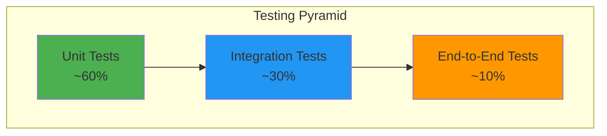

# TR-002: Software Testing Plan

**Status:** Draft  
**Date:** 2026-02-11  
**Author(s):** DP-DevEx-Platform Team  
**Applies To:** All system components (Backend, Frontend, APIs, Data Collection Services)  
**Version:** 1.0

---

## 1. Introduction

### 1.1 Purpose

This document defines the comprehensive testing strategy for the Equans Operational Insights platform—a multi-vendor license management and billing dashboard. It establishes testing standards, methodologies, and responsibilities to ensure software quality, security, and compliance.

### 1.2 Scope

This testing plan covers:

- Backend services (Rust API)
- Frontend application (React + TypeScript)
- External API integrations (Atlassian, GitHub, JFrog, Trello)
- Database operations (PostgreSQL)
- Authentication and authorization
- Data protection and GDPR compliance
- Performance and load testing

### 1.3 References

| Document                                                                                                 | Description                        |
| -------------------------------------------------------------------------------------------------------- | ---------------------------------- |
| [BR-001-Multi-Vendor-License-Insights](../Business-Requirements/BR-001-Multi-Vendor-License-Insights.md) | Business requirements              |
| [FR-001-License-Dashboard](../Functional-Requirements/FR-001-License-Dashboard.md)                       | Dashboard functional requirements  |
| [FR-002-Vendor-Data-Collection](../Functional-Requirements/FR-002-Vendor-Data-Collection.md)             | Data collection requirements       |
| [TR-001-Performance-Security-Standards](TR-001-Performance-Security-Standards.md)                        | Performance and security standards |

---

## 2. Testing Documentation Structure

Detailed testing documentation is organized in `docs/testing/`:

```
docs/testing/
├── README.md                          # Index and overview
├── strategy/
│   └── test-strategy.md               # Test approach, levels, coverage targets
├── api/
│   └── api-testing.md                 # API testing strategy, Postman setup
├── security/
│   ├── auth-testing.md                # Authentication & authorization testing
│   └── gdpr-testing.md                # GDPR & data protection testing
├── performance/
│   └── performance-testing.md         # Load, stress, endurance testing
├── environment/
│   └── environment-setup.md           # Test environments, Docker, data management
├── management/
│   └── test-management.md             # RACI, defect workflow, reporting
└── troubleshooting/
    └── troubleshooting-guide.md       # Common errors and solutions
```

---

## 3. Quick Links

| Document                                                               | Description                                              |
| ---------------------------------------------------------------------- | -------------------------------------------------------- |
| [Test Strategy](../testing/strategy/test-strategy.md)                  | Testing approach, pyramid, coverage targets, test levels |
| [API Testing](../testing/api/api-testing.md)                           | Postman collections, API test cases, endpoint validation |
| [Auth Testing](../testing/security/auth-testing.md)                    | SSO, JWT, role-based access testing                      |
| [GDPR Testing](../testing/security/gdpr-testing.md)                    | Data protection, privacy compliance                      |
| [Performance Testing](../testing/performance/performance-testing.md)   | Load testing, benchmarks, k6 scripts                     |
| [Environment Setup](../testing/environment/environment-setup.md)       | Test environments, Docker setup, data management         |
| [Test Management](../testing/management/test-management.md)            | RACI matrix, defect workflow, reporting                  |
| [Troubleshooting](../testing/troubleshooting/troubleshooting-guide.md) | Common errors and solutions                              |

---

## 4. Test Strategy Summary

### 4.1 Testing Approach

The project follows a **risk-based testing approach** with emphasis on:

1. **Shift-Left Testing** — Early testing in the development lifecycle
2. **Continuous Integration** — Automated tests run on every pull request
3. **Defense in Depth** — Multiple test levels for comprehensive coverage
4. **API-First Testing** — Priority on backend API validation

### 4.2 Testing Pyramid



### 4.3 Test Coverage Targets

| Component        | Minimum Coverage | Target Coverage |
| ---------------- | ---------------- | --------------- |
| Backend (Rust)   | 70%              | 85%             |
| Frontend (React) | 60%              | 75%             |
| API Endpoints    | 90%              | 100%            |
| Critical Paths   | 100%             | 100%            |

### 4.4 Entry and Exit Criteria

#### Entry Criteria

- [ ] Code compiles without errors
- [ ] Unit tests pass locally
- [ ] Code review completed
- [ ] Test environment available

#### Exit Criteria

- [ ] All planned tests executed
- [ ] No critical or high-severity defects open
- [ ] Test coverage targets met
- [ ] Performance benchmarks achieved

**→ See [Test Strategy](../testing/strategy/test-strategy.md) for complete details including test levels and examples.**

---

## 5. Test Levels Overview

| Level           | Objective                      | Framework                 | Coverage       |
| --------------- | ------------------------------ | ------------------------- | -------------- |
| **Unit**        | Verify individual components   | cargo test, Jest          | 60% of tests   |
| **Integration** | Verify component interactions  | actix-web, Testcontainers | 30% of tests   |
| **System**      | Validate complete application  | Staging environment       | Pre-release    |
| **UAT**         | Validate business requirements | Stakeholder testing       | Before release |

**→ See [Test Strategy](../testing/strategy/test-strategy.md) for detailed test level documentation.**

---

## 6. Security Testing Overview

### Authentication & Authorization

- SSO login validation
- JWT token security
- Role-based access control

**→ See [Auth Testing](../testing/security/auth-testing.md) for complete test cases.**

### GDPR & Data Protection

- Data masking validation
- Right to erasure testing
- Encryption verification

**→ See [GDPR Testing](../testing/security/gdpr-testing.md) for compliance test cases.**

---

## 7. Performance Requirements

| Metric            | Requirement      |
| ----------------- | ---------------- |
| API Response Time | P95 < 200ms      |
| Dashboard Load    | < 3 seconds      |
| Concurrent Users  | 100 simultaneous |

**→ See [Performance Testing](../testing/performance/performance-testing.md) for load test scripts and benchmarks.**

---

## 8. Test Management Overview

### RACI Summary

| Activity          | Responsible | Accountable |
| ----------------- | ----------- | ----------- |
| Unit Tests        | Developer   | Developer   |
| Integration Tests | QA Engineer | QA Engineer |
| Performance Tests | QA Engineer | Tech Lead   |
| UAT               | Stakeholder | Stakeholder |

### Defect Severity

| Severity     | Response Time | Resolution Time |
| ------------ | ------------- | --------------- |
| **Critical** | Immediate     | 4 hours         |
| **High**     | 4 hours       | 24 hours        |
| **Medium**   | 24 hours      | 1 week          |
| **Low**      | 1 week        | Next release    |

**→ See [Test Management](../testing/management/test-management.md) for complete RACI matrix and defect workflow.**

---

## 9. Getting Started

1. Review the [Test Strategy](../testing/strategy/test-strategy.md) for overall approach
2. Set up your [Test Environment](../testing/environment/environment-setup.md)
3. Run tests following the relevant testing guide
4. Report issues using the [Test Management](../testing/management/test-management.md) process
5. Consult [Troubleshooting](../testing/troubleshooting/troubleshooting-guide.md) for common issues

---

## Related Documents

- Business Requirement: [BR-001-Multi-Vendor-License-Insights](../Business-Requirements/BR-001-Multi-Vendor-License-Insights.md)
- Technical Requirement: [TR-001-Performance-Security-Standards](TR-001-Performance-Security-Standards.md)
- ADR: [ADR-003-Backend](../ADRs/ADR-003-backend.md)
