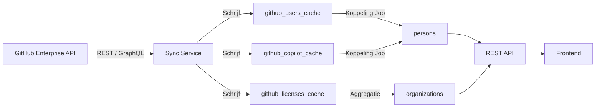

# TR-012: GitHub Gegevens Synchroniseren en Opslaan in Persons en Organizations

**Status:** Draft
**Datum:** 2026-03-16
**Auteur(s):** Ahmad Alhaj Asaad
**Gerelateerde BR:** [BR-002-Person-Organization-Management](../Business-Requirements/BR-002-Person-Organization-Management.md)
**Gerelateerde FR:** [FR-012-GitHub-DB-Sync](../Functional-Requirements/FR-012-GitHub-DB-Sync.md)
**Gerelateerde TR:** [TR-009-Atlassian-DB-Sync](TR-009-Atlassian-DB-Sync.md)

---

## Samenvatting

Dit document definieert de technische requirements voor het synchroniseren van GitHub Enterprise-gegevens naar de lokale cache-tabellen (`github_users_cache`, `github_licenses_cache`, `github_copilot_cache`) en het koppelen van deze cached data aan de operationele tabellen `persons` en `organizations`.

---

## Architectuur Overzicht



---

## GitHub API Endpoints

| Doel                         | API Type | Endpoint                                                           |
| ---------------------------- | -------- | ------------------------------------------------------------------ |
| Enterprise leden ophalen     | REST     | `GET /enterprises/{enterprise}/members`                            |
| Enterprise licenties ophalen | REST     | `GET /enterprises/{enterprise}/consumed-licenses`                  |
| Copilot seat toewijzingen    | REST     | `GET /enterprises/{enterprise}/copilot/seats`                      |
| GHAS actieve committers      | REST     | `GET /enterprises/{enterprise}/settings/billing/advanced-security` |
| Organization members         | REST     | `GET /orgs/{org}/members`                                          |
| Team members                 | REST     | `GET /orgs/{org}/teams/{team_slug}/members`                        |

> **Authenticatie:** Alle API-aanroepen gebruiken een GitHub Personal Access Token (PAT) met de scopes `admin:enterprise`, `read:org`, `manage_billing:copilot`. Het token wordt opgeslagen als omgevingsvariabele `GITHUB_PAT_TOKEN` en **nooit** in codebestanden of logs.

> **Rate limiting:** GitHub REST API heeft een limiet van 5.000 verzoeken per uur per token. De sync-service implementeert exponential backoff bij rate limit fouten (HTTP 429).

---

## Database Schema

### Cache Tabellen

#### `github_users_cache`

```sql
CREATE TABLE github_users_cache (
    id                TEXT PRIMARY KEY,
    login             TEXT NOT NULL UNIQUE,
    email             TEXT,
    name              TEXT,
    enterprise_role   TEXT,
    organization_name TEXT,
    team_names        TEXT[],
    is_active         BOOLEAN NOT NULL DEFAULT TRUE,
    synced_at         TIMESTAMPTZ NOT NULL DEFAULT NOW()
);

CREATE INDEX idx_github_users_cache_email ON github_users_cache (LOWER(email));
CREATE INDEX idx_github_users_cache_login ON github_users_cache (login);
```

#### `github_licenses_cache`

```sql
CREATE TABLE github_licenses_cache (
    enterprise_slug        TEXT NOT NULL,
    synced_at              TIMESTAMPTZ NOT NULL DEFAULT NOW(),
    total_seats_purchased  INTEGER,
    total_seats_consumed   INTEGER,
    ghas_seats_consumed    INTEGER,
    PRIMARY KEY (enterprise_slug, synced_at)
);
```

#### `github_copilot_cache`

```sql
CREATE TABLE github_copilot_cache (
    github_login          TEXT PRIMARY KEY REFERENCES github_users_cache(login) ON DELETE CASCADE,
    seat_type             TEXT,
    is_active             BOOLEAN NOT NULL DEFAULT TRUE,
    last_activity_at      TIMESTAMPTZ,
    last_activity_editor  TEXT,
    assigning_team        TEXT,
    created_at            TIMESTAMPTZ,
    updated_at            TIMESTAMPTZ,
    synced_at             TIMESTAMPTZ NOT NULL DEFAULT NOW()
);
```

### Uitbreidingen op `persons` Tabel

```sql
ALTER TABLE persons
    ADD COLUMN IF NOT EXISTS github_login         TEXT UNIQUE,
    ADD COLUMN IF NOT EXISTS github_account_id    TEXT UNIQUE,
    ADD COLUMN IF NOT EXISTS github_username      TEXT,
    ADD COLUMN IF NOT EXISTS github_link_status   TEXT NOT NULL DEFAULT 'unlinked',
    ADD COLUMN IF NOT EXISTS github_linked_at     TIMESTAMPTZ,
    ADD COLUMN IF NOT EXISTS github_linked_by     TEXT;

CREATE INDEX idx_persons_github_login       ON persons (github_login);
CREATE INDEX idx_persons_github_link_status ON persons (github_link_status);

ALTER TABLE persons ADD CONSTRAINT chk_github_link_status
    CHECK (github_link_status IN (
        'linked_auto_local_id',
        'linked_auto_email',
        'linked_manual_username',
        'linked_manual',
        'unlinked',
        'no_github_account'
    ));
```

### Uitbreidingen op `organizations` Tabel

```sql
ALTER TABLE organizations
    ADD COLUMN IF NOT EXISTS github_org_names   TEXT[],
    ADD COLUMN IF NOT EXISTS github_team_names  TEXT[];

CREATE INDEX idx_organizations_github_org ON organizations USING GIN (github_org_names);
```

---

## Koppelingslogica

### Matching Algoritme (prioriteitsvolgorde)

```
FUNCTION match_person_to_github(person):
    -- Stap 1: local_id  github_users_cache.email (case-insensitive)
    result = SELECT * FROM github_users_cache
             WHERE LOWER(email) = LOWER(person.local_id)
             LIMIT 1

    IF result:
        RETURN (result, 'linked_auto_local_id')

    -- Stap 2: persons.email  github_users_cache.email (case-insensitive)
    result = SELECT * FROM github_users_cache
             WHERE LOWER(email) = LOWER(person.email)
             LIMIT 1

    IF result:
        RETURN (result, 'linked_auto_email')

    -- Stap 3: handmatig ingestelde github_username  github_users_cache.login
    IF person.github_username IS NOT NULL:
        result = SELECT * FROM github_users_cache
                 WHERE LOWER(login) = LOWER(person.github_username)
                 LIMIT 1
        IF result:
            RETURN (result, 'linked_manual_username')

    -- Controleer of persoon überhaupt in cache staat
    any_match = SELECT 1 FROM github_users_cache
                WHERE LOWER(email) = LOWER(person.local_id)
                   OR LOWER(email) = LOWER(person.email)
                LIMIT 1

    IF NOT any_match:
        RETURN (NULL, 'no_github_account')

    RETURN (NULL, 'unlinked')
```

### Conflict Detectie

- **Meerdere GitHub-accounts bij één e-mail:** Loggen als conflict; persoon krijgt status `unlinked`; beheerder-notificatie
- **GitHub-account al gekoppeld:** Nieuwe koppeling geblokkeerd; fout geretourneerd aan aanroeper
- **Persoon al gekoppeld:** Koppeling wordt alleen bijgewerkt als nieuwe koppelstatus hoger in prioriteit staat én de bestaande koppeling niet `linked_manual` of `linked_manual_username` is

---

## Sync Service

### Sync Taken (achtergrond)

```
TASK: github_sync_users
    Frequentie: Dagelijks (configureerbaar via CRON)
    Stappen:
        1. Haal alle Enterprise leden op via paginated API
        2. Haal team-lidmaatschappen op per organisatie
        3. Upsert records in github_users_cache (op basis van id)
        4. Markeer ontbrekende gebruikers als is_active = FALSE
        5. Trigger koppelingsrun voor gewijzigde / nieuwe records

TASK: github_sync_licenses
    Frequentie: Dagelijks
    Stappen:
        1. Haal Enterprise consumed-licenses op
        2. Insert nieuw record in github_licenses_cache (tijdserie)

TASK: github_sync_copilot
    Frequentie: Dagelijks
    Stappen:
        1. Haal alle Copilot seat-toewijzingen op via paginated API
        2. Upsert records in github_copilot_cache (op basis van github_login)
        3. Markeer seats die niet meer in respons staan als is_active = FALSE

TASK: github_link_persons
    Frequentie: Na elke sync + na elke CSV-import
    Stappen:
        1. Selecteer alle persons met github_link_status IN ('unlinked', 'no_github_account')
        2. Voer matching algoritme uit per persoon
        3. Update persons tabel bij match
        4. Log resultaten in github_link_audit
```

### Configuratie

| Variabele                      | Beschrijving                             | Standaard                     |
| ------------------------------ | ---------------------------------------- | ----------------------------- |
| `GITHUB_PAT_TOKEN`             | GitHub PAT met enterprise/copilot scopes | (verplicht)                   |
| `GITHUB_ENTERPRISE_SLUG`       | Enterprise identifier                    | `equans`                      |
| `GITHUB_SYNC_CRON`             | Cron-expressie voor sync-frequentie      | `0 2 * * *` (02:00 dagelijks) |
| `GITHUB_API_BASE_URL`          | GitHub API base URL                      | `https://api.github.com`      |
| `GITHUB_RATE_LIMIT_BACKOFF_MS` | Wachttijd bij rate limit (ms)            | `60000`                       |

---

## REST API Endpoints

### Persons GitHub Koppeling

| Methode  | Path                            | Beschrijving                                                             |
| -------- | ------------------------------- | ------------------------------------------------------------------------ |
| `GET`    | `/persons/{id}/github`          | Haal GitHub-koppelstatus en cache-data op voor persoon                   |
| `POST`   | `/persons/{id}/github/link`     | Handmatig GitHub-account koppelen (`{ github_login: "..." }`)            |
| `DELETE` | `/persons/{id}/github/link`     | GitHub-koppeling verwijderen                                             |
| `POST`   | `/persons/{id}/github/username` | `github_username` instellen voor stap-3 matching (`{ username: "..." }`) |

### Organizations GitHub Koppeling

| Methode | Path                         | Beschrijving                                                                    |
| ------- | ---------------------------- | ------------------------------------------------------------------------------- |
| `GET`   | `/organizations/{id}/github` | GitHub-licentieoverzicht voor de organisatie                                    |
| `PUT`   | `/organizations/{id}/github` | GitHub Organizations/Teams koppelen (`{ org_names: [...], team_names: [...] }`) |

### Sync Beheer

| Methode | Path                        | Beschrijving                           |
| ------- | --------------------------- | -------------------------------------- |
| `POST`  | `/admin/sync/github`        | Handmatig GitHub-sync starten          |
| `GET`   | `/admin/sync/github/status` | Status en tijdstip van laatste sync    |
| `GET`   | `/admin/github/unlinked`    | Lijst van ongekoppelde GitHub-accounts |

---

## Logging & Audit

```sql
CREATE TABLE github_link_audit (
    id            SERIAL PRIMARY KEY,
    person_id     TEXT REFERENCES persons(person_id),
    github_login  TEXT,
    action        TEXT NOT NULL,
    method        TEXT,
    performed_by  TEXT NOT NULL,
    details       JSONB,
    created_at    TIMESTAMPTZ NOT NULL DEFAULT NOW()
);
```

| Kolom          | Beschrijving                                          |
| -------------- | ----------------------------------------------------- |
| `action`       | `linked` / `unlinked` / `conflict`                    |
| `method`       | Koppelstatus waarde (bijv. `linked_auto_local_id`)    |
| `performed_by` | `system` of gebruikers-id van de beheerder            |
| `details`      | Extra context in JSON (bijv. conflicterende accounts) |

---

## Beveiligingseisen

- GitHub PAT wordt **uitsluitend** opgeslagen als omgevingsvariabele; nooit in code, logs of database
- Alle API-aanroepen verlopen via HTTPS
- `github_link_audit` tabel is read-only voor reguliere gebruikers; schrijftoegang alleen voor de sync-service
- Handmatige koppelingsacties vereisen een geauthenticeerde beheerder-sessie
- Rate limit-informatie uit GitHub API-headers (`X-RateLimit-Remaining`, `X-RateLimit-Reset`) wordt gerespecteerd en gelogd
- Geen GitHub-gebruikersdata wordt doorgestuurd naar externe systemen buiten de eigen database

---

## Gerelateerde Documenten

- Functional Requirement: [FR-012-GitHub-DB-Sync](../Functional-Requirements/FR-012-GitHub-DB-Sync.md)
- Business Requirement: [BR-002-Person-Organization-Management](../Business-Requirements/BR-002-Person-Organization-Management.md)
- Vergelijkbaar document: [TR-009-Atlassian-DB-Sync](TR-009-Atlassian-DB-Sync.md)
