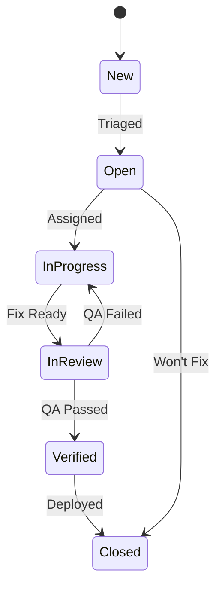

# Test Management

**Status:** Draft  
**Date:** 2026-02-11  
**Author(s):** DP-DevEx-Platform Team

---

## 1. Test Responsibilities

### 1.1 RACI Matrix

| Activity          | Developer | QA Engineer | Tech Lead | Stakeholder |
| ----------------- | --------- | ----------- | --------- | ----------- |
| Unit Tests        | **R/A**   | C           | I         | -           |
| Integration Tests | R         | **R/A**     | C         | I           |
| API Tests         | R         | **R/A**     | C         | I           |
| Performance Tests | C         | **R/A**     | R         | I           |
| Security Tests    | C         | R           | **R/A**   | I           |
| UAT               | I         | C           | C         | **R/A**     |

**Legend:** R = Responsible, A = Accountable, C = Consulted, I = Informed

### 1.2 Responsibilities by Role

#### Developer

- Write and maintain unit tests for own code
- Ensure tests pass before creating pull request
- Fix failing tests promptly
- Participate in test review

#### QA Engineer

- Design and execute integration tests
- Maintain test automation framework
- Report and track defects
- Monitor test coverage metrics

#### Tech Lead

- Define testing standards and guidelines
- Review test coverage and quality
- Approve release readiness
- Coordinate security testing

#### Stakeholder

- Participate in UAT
- Provide acceptance criteria
- Sign off on release

---

## 2. Defect Management

### 2.1 Defect Severity Levels

| Severity     | Description                         | Response Time | Resolution Time |
| ------------ | ----------------------------------- | ------------- | --------------- |
| **Critical** | System unusable, data loss          | Immediate     | 4 hours         |
| **High**     | Major feature broken                | 4 hours       | 24 hours        |
| **Medium**   | Feature impaired, workaround exists | 24 hours      | 1 week          |
| **Low**      | Minor issue, cosmetic               | 1 week        | Next release    |

### 2.2 Defect Priority vs Severity

| Priority | Description                            |
| -------- | -------------------------------------- |
| P1       | Must fix immediately (release blocker) |
| P2       | Must fix before release                |
| P3       | Should fix if time permits             |
| P4       | Nice to have, can defer                |

### 2.3 Defect Workflow



### 2.4 Defect Report Template

```markdown
## Defect Title

**ID:** DEF-XXX
**Severity:** Critical | High | Medium | Low
**Priority:** P1 | P2 | P3 | P4
**Reporter:** [Name]
**Date:** YYYY-MM-DD

### Description

Brief description of the issue.

### Steps to Reproduce

1. Step one
2. Step two
3. Step three

### Expected Result

What should happen.

### Actual Result

What actually happened.

### Environment

- Browser:
- OS:
- Version:

### Attachments

Screenshots, logs, etc.
```

---

## 3. Test Reporting

### 3.1 Test Metrics

| Metric              | Target            | Frequency   |
| ------------------- | ----------------- | ----------- |
| Test Pass Rate      | > 98%             | Per build   |
| Code Coverage       | > 70%             | Per build   |
| Defect Density      | < 5 per KLOC      | Per release |
| Mean Time to Fix    | < 24 hours (High) | Weekly      |
| Test Execution Time | < 15 minutes (CI) | Per build   |

### 3.2 Reporting Schedule

| Report              | Audience         | Frequency   |
| ------------------- | ---------------- | ----------- |
| CI/CD Dashboard     | Development Team | Real-time   |
| Weekly Test Summary | Tech Lead, PM    | Weekly      |
| Release Test Report | All Stakeholders | Per release |
| Quality Metrics     | Management       | Monthly     |

### 3.3 Weekly Test Summary Template

```markdown
# Weekly Test Summary - Week XX

**Period:** YYYY-MM-DD to YYYY-MM-DD
**Author:** [QA Engineer]

## Summary

Brief overview of testing activities.

## Metrics

| Metric         | This Week | Last Week | Trend |
| -------------- | --------- | --------- | ----- |
| Tests Executed | XXX       | XXX       | ↑/↓   |
| Pass Rate      | XX%       | XX%       | ↑/↓   |
| Defects Found  | XX        | XX        | ↑/↓   |
| Defects Fixed  | XX        | XX        | ↑/↓   |

## Defects Summary

- Critical: X open, X fixed
- High: X open, X fixed
- Medium: X open, X fixed
- Low: X open, X fixed

## Blockers

List any blockers or issues.

## Next Week Plan

Planned testing activities.
```

### 3.4 Release Test Report Template

```markdown
# Release Test Report - vX.X.X

**Release Date:** YYYY-MM-DD
**QA Sign-off:** [Name]

## Scope

Features and areas tested.

## Test Summary

| Test Type   | Planned | Executed | Passed | Failed |
| ----------- | ------- | -------- | ------ | ------ |
| Unit        | XXX     | XXX      | XXX    | X      |
| Integration | XXX     | XXX      | XXX    | X      |
| System      | XX      | XX       | XX     | X      |
| UAT         | XX      | XX       | XX     | X      |

## Defect Summary

| Severity | Open | Fixed | Deferred |
| -------- | ---- | ----- | -------- |
| Critical | 0    | X     | 0        |
| High     | 0    | X     | 0        |
| Medium   | X    | X     | X        |
| Low      | X    | X     | X        |

## Risk Assessment

Known issues and risks going to production.

## Recommendation

☑ Approved for Release
☐ Not Approved (reason: )
```

---

## 4. Test Tools & Infrastructure

### 4.1 Tool Stack

| Category        | Tool                     | Purpose                  |
| --------------- | ------------------------ | ------------------------ |
| Unit Testing    | cargo test, Jest         | Rust/React unit tests    |
| API Testing     | Postman, Newman          | REST API validation      |
| Load Testing    | k6                       | Performance testing      |
| UI Testing      | Playwright               | End-to-end browser tests |
| Coverage        | tarpaulin, jest-coverage | Code coverage reporting  |
| CI/CD           | GitHub Actions           | Automated test execution |
| Defect Tracking | GitHub Issues            | Bug tracking             |

### 4.2 Access Management

| Tool              | Access Level | Approver  |
| ----------------- | ------------ | --------- |
| GitHub Repo       | Developer+   | Tech Lead |
| Postman Workspace | QA Team      | QA Lead   |
| Staging Env       | QA + Dev     | Tech Lead |
| CI/CD Logs        | All team     | Automatic |

---

## Related Documents

- [Test Strategy](../strategy/test-strategy.md)
- [Troubleshooting](../troubleshooting/troubleshooting-guide.md)
- [Environment Setup](../environment/environment-setup.md)
