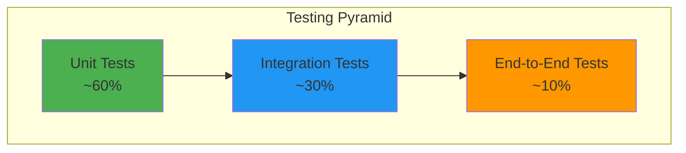

# Test Strategy

**Status:** Draft  
**Date:** 2026-02-11  
**Author(s):** DP-DevEx-Platform Team

---

## 1. Testing Approach

The project follows a **risk-based testing approach** with emphasis on:

1. **Shift-Left Testing** — Early testing in the development lifecycle
2. **Continuous Integration** — Automated tests run on every pull request
3. **Defense in Depth** — Multiple test levels for comprehensive coverage
4. **API-First Testing** — Priority on backend API validation

---

## 2. Testing Pyramid



---

## 3. Test Coverage Targets

| Component        | Minimum Coverage | Target Coverage |
| ---------------- | ---------------- | --------------- |
| Backend (Rust)   | 70%              | 85%             |
| Frontend (React) | 60%              | 75%             |
| API Endpoints    | 90%              | 100%            |
| Critical Paths   | 100%             | 100%            |

---

## 4. Entry and Exit Criteria

### Entry Criteria

- [ ] Code compiles without errors
- [ ] Unit tests pass locally
- [ ] Code review completed
- [ ] Test environment available

### Exit Criteria

- [ ] All planned tests executed
- [ ] No critical or high-severity defects open
- [ ] Test coverage targets met
- [ ] Performance benchmarks achieved

---

## 5. Test Levels

### 5.1 Unit Testing

**Objective:** Verify individual components and functions in isolation.

| Aspect                | Specification                                       |
| --------------------- | --------------------------------------------------- |
| **Framework (Rust)**  | Built-in `#[test]`, `cargo test`                    |
| **Framework (React)** | Jest, React Testing Library                         |
| **Execution**         | On every commit, pre-push hooks                     |
| **Coverage Tool**     | `cargo tarpaulin` (Rust), `jest --coverage` (React) |

#### Rust Unit Test Example

```rust
#[cfg(test)]
mod tests {
    use super::*;

    #[test]
    fn test_calculate_license_utilization() {
        let used = 75;
        let total = 100;
        let result = calculate_utilization(used, total);
        assert_eq!(result, 75.0);
    }

    #[test]
    fn test_calculate_utilization_zero_total() {
        let result = calculate_utilization(0, 0);
        assert_eq!(result, 0.0); // Should handle division by zero
    }
}
```

#### React Unit Test Example

```typescript
describe('LicenseCard', () => {
  it('displays correct utilization percentage', () => {
    render(<LicenseCard used={75} total={100} />);
    expect(screen.getByText('75%')).toBeInTheDocument();
  });

  it('shows warning when utilization exceeds threshold', () => {
    render(<LicenseCard used={95} total={100} />);
    expect(screen.getByRole('alert')).toBeInTheDocument();
  });
});
```

### 5.2 Integration Testing

**Objective:** Verify interactions between components and external systems.

| Aspect        | Specification                                            |
| ------------- | -------------------------------------------------------- |
| **Scope**     | API endpoints, database operations, service interactions |
| **Framework** | `actix-web` test utilities, Testcontainers               |
| **Database**  | PostgreSQL test container                                |
| **Execution** | On pull request, nightly builds                          |

#### Integration Test Categories

| Category             | Description                              | Priority |
| -------------------- | ---------------------------------------- | -------- |
| API-Database         | Verify CRUD operations persist correctly | High     |
| Service-to-Service   | Test internal service communication      | High     |
| External API Mocking | Mock vendor APIs for predictable testing | Medium   |
| Authentication Flow  | End-to-end auth token validation         | High     |

### 5.3 System Testing

**Objective:** Validate the complete integrated system against requirements.

| Aspect          | Specification                            |
| --------------- | ---------------------------------------- |
| **Scope**       | Full application stack                   |
| **Environment** | Staging environment mirroring production |
| **Execution**   | Pre-release, weekly regression           |

#### System Test Scenarios

- [ ] Complete user journey: Login → View Dashboard → Export Report
- [ ] Data collection pipeline: Trigger → Fetch → Store → Display
- [ ] Error recovery: API failure → Graceful degradation → Recovery
- [ ] Cross-browser compatibility testing

### 5.4 User Acceptance Testing (UAT)

**Objective:** Validate the system meets business requirements and user expectations.

| Aspect           | Specification                                    |
| ---------------- | ------------------------------------------------ |
| **Participants** | Viktor Klein, Brian Veltman, Henk (stakeholders) |
| **Scope**        | Business-critical workflows                      |
| **Duration**     | 1-2 weeks before release                         |
| **Sign-off**     | Written approval from stakeholders               |

#### UAT Checklist

- [ ] Dashboard displays accurate license data
- [ ] Cost attribution matches finance expectations
- [ ] Export functionality produces usable reports
- [ ] Performance acceptable for daily use
- [ ] UI/UX meets accessibility standards

---

## Related Documents

- [API Testing](../api/api-testing.md)
- [Performance Testing](../performance/performance-testing.md)
- [Test Management](../management/test-management.md)
